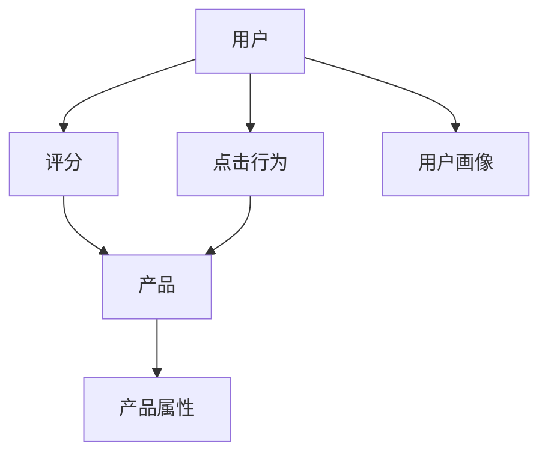
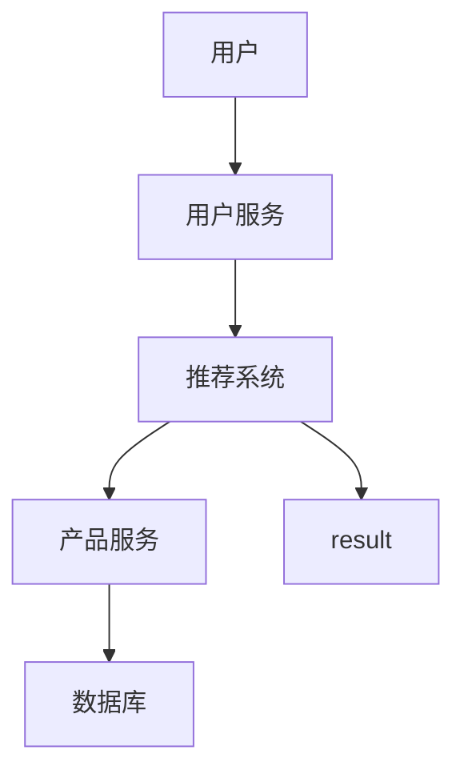
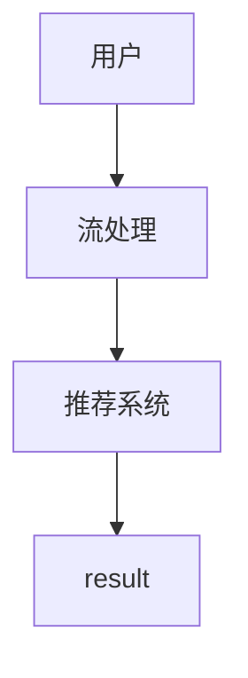

                 


# AI辅助产品推荐与个性化服务的算法与实现

## 关键词：AI推荐、个性化服务、协同过滤、深度学习、系统架构、项目实战

## 摘要：  
随着人工智能技术的快速发展，AI辅助产品推荐和个性化服务已成为现代互联网应用的重要组成部分。本文从推荐系统的背景出发，详细探讨了协同过滤、基于深度学习的推荐算法及其数学模型，并结合系统架构设计和项目实战，展示了如何实现高效的个性化推荐服务。文章最后总结了系统优化与部署的关键点，为读者提供了全面的技术指导。

---

# 第1章: AI辅助产品推荐与个性化服务的背景与概念

## 1.1 问题背景与需求分析

### 1.1.1 问题背景  
在当今互联网时代，用户每天面对海量信息，如何快速找到符合需求的产品或服务成为一个关键问题。传统的方法依赖人工筛选，效率低下且难以满足个性化需求。因此，利用AI技术实现自动化推荐成为必然趋势。

### 1.1.2 问题描述  
推荐系统的目标是根据用户的偏好，预测用户对未见过产品的兴趣，从而提供个性化的产品推荐。这不仅提高了用户体验，还帮助企业提升了转化率和用户满意度。

### 1.1.3 问题解决  
通过分析用户行为数据、产品特征和交互数据，AI推荐系统能够实时生成个性化推荐，满足用户需求。

### 1.1.4 边界与外延  
推荐系统通常基于用户点击、评分、收藏等行为数据，其外延包括个性化搜索、动态广告展示等。

## 1.2 核心概念与联系

### 1.2.1 核心概念  
- **用户**: 接收推荐的对象，具有特定的偏好和行为。
- **产品**: 被推荐的物品，具有属性特征。
- **交互数据**: 用户与产品之间的行为记录。
- **推荐结果**: 根据算法生成的推荐列表。

### 1.2.2 实体关系图  


## 1.3 技术基础与应用领域

### 1.3.1 技术基础  
推荐系统的核心技术包括协同过滤、基于内容的推荐、基于深度学习的推荐等。

### 1.3.2 应用场景  
- 电子商务：推荐商品。
- 社交媒体：推荐好友或内容。
- 视频平台：推荐视频。

### 1.3.3 应用价值  
提升用户体验，增加用户粘性和转化率。

---

# 第2章: 协同过滤算法与实现

## 2.1 协同过滤的原理与分类

### 2.1.1 基本原理  
协同过滤通过寻找具有相似偏好的用户或产品，推荐用户可能感兴趣的产品。

### 2.1.2 分类  
- **基于用户的协同过滤**: 找出与当前用户相似的用户，推荐他们喜欢的产品。
- **基于物品的协同过滤**: 找出与当前用户已感兴趣的产品相似的其他产品。
- **混合推荐模型**: 结合用户和物品的特征进行推荐。

## 2.2 协同过滤的优缺点分析

### 2.2.1 优点  
- 捕捉用户群体的偏好。
- 适用于数据稀疏性问题。

### 2.2.2 缺点  
- 计算复杂度高。
- 对冷启动问题敏感。

## 2.3 协同过滤的实现流程

### 2.3.1 数据预处理  
- 去除无效数据。
- 处理缺失值。

### 2.3.2 相似度计算  
- 使用余弦相似度、皮尔逊相关系数等。

### 2.3.3 推荐生成  
- 根据相似度排序，生成推荐列表。

## 2.4 协同过滤的代码实现

### 2.4.1 数据加载与预处理  
```python
import pandas as pd

# 加载数据
data = pd.read_csv('ratings.csv')

# 数据预处理
data.dropna()
```

### 2.4.2 相似度矩阵计算  
```python
from sklearn.metrics.pairwise import cosine_similarity

# 计算用户相似度矩阵
user_similarity = cosine_similarity(data)
```

### 2.4.3 推荐结果输出  
```python
def get_recommendations(user_id, similarity_matrix, ratings, n=5):
    # 找出与当前用户相似的用户
    similar_users = [i for i in range(len(similarity_matrix[user_id])) if i != user_id]
    # 计算相似度并排序
    similar_users.sort(key=lambda x: similarity_matrix[user_id][x], reverse=True)
    # 生成推荐列表
    recommendations = []
    for user in similar_users[:n]:
        recommendations.extend(ratings[ratings['user_id'] == user]['item_id'].tolist())
    return recommendations

print(get_recommendations(0, user_similarity, data))
```

## 2.5 协同过滤的数学模型

### 2.5.1 相似度计算公式  
$$sim(i,j) = \frac{\sum_{k} r_{ik} r_{jk}}{\sqrt{\sum_{k} r_{ik}^2} \sqrt{\sum_{k} r_{jk}^2}}$$

### 2.5.2 推荐评分公式  
$$\hat{r}_{i,j} = \frac{\sum_{k} w_{jk} (r_{i,k} - \bar{r}_i)}{\sum_{k} w_{jk}}$$

## 2.6 本章小结  
协同过滤是一种简单有效的推荐算法，适用于数据稀疏场景，但在大规模数据下计算效率较低。

---

# 第3章: 基于深度学习的推荐算法

## 3.1 深度学习推荐的原理与分类

### 3.1.1 基本原理  
深度学习通过神经网络模型，自动提取数据特征，生成个性化推荐。

### 3.1.2 分类  
- **基于神经网络的推荐**: 如DNN、CNN、RNN。
- **基于注意力机制的推荐**: 如Transformer模型。

## 3.2 基于神经网络的推荐模型

### 3.2.1 网络结构  
- 输入层、隐藏层、输出层。

### 3.2.2 损失函数  
- 使用交叉熵损失函数。

## 3.3 基于注意力机制的推荐

### 3.3.1 注意力机制原理  
- 通过自注意力机制，捕捉用户行为序列中的重要特征。

### 3.3.2 注意力模型公式  
$$\alpha_i = \frac{e_i}{\sum_{j} e_j}$$  
其中，$e_i$ 是第i个注意力得分。

## 3.4 深度学习推荐的实现流程

### 3.4.1 数据预处理  
- 特征提取、归一化。

### 3.4.2 模型训练  
- 使用梯度下降优化模型。

### 3.4.3 推荐生成  
- 预测用户对产品的兴趣评分。

## 3.5 深度学习推荐的代码实现

### 3.5.1 数据加载与预处理  
```python
import numpy as np

# 加载数据
data = np.load('recommend_data.npy')

# 数据分割
train_data = data[:int(0.8 * len(data))]
test_data = data[int(0.8 * len(data)):]
```

### 3.5.2 模型定义  
```python
import tensorflow as tf

# 定义神经网络模型
model = tf.keras.Sequential([
    tf.keras.layers.Dense(64, activation='relu'),
    tf.keras.layers.Dense(1, activation='sigmoid')
])

# 编译模型
model.compile(optimizer='adam', loss='binary_crossentropy')
```

### 3.5.3 模型训练  
```python
# 训练模型
model.fit(train_data, epochs=10, batch_size=32, validation_data=test_data)
```

## 3.6 本章小结  
深度学习通过自动特征提取，提升了推荐系统的性能，但需要大量数据和计算资源。

---

# 第4章: 个性化服务的系统架构设计

## 4.1 系统功能设计

### 4.1.1 用户画像  
- 基于用户行为数据，构建用户画像。

### 4.1.2 产品特征提取  
- 提取产品的属性特征。

## 4.2 系统架构设计

### 4.2.1 分层架构  
- 数据层、业务逻辑层、表现层。

### 4.2.2 微服务架构  
- 用户服务、推荐服务、产品服务。

## 4.3 系统接口设计

### 4.3.1 用户画像接口  
- 获取用户画像信息。

### 4.3.2 推荐接口  
- 根据用户ID获取推荐列表。

## 4.4 系统交互流程

### 4.4.1 用户请求推荐  
- 发起推荐请求。

### 4.4.2 系统处理  
- 分析用户画像，生成推荐结果。

### 4.4.3 返回结果  
- 返回推荐列表。

## 4.5 系统架构图  


## 4.6 本章小结  
个性化服务的系统架构设计需要考虑数据存储、服务调用和接口设计，确保系统的高效运行。

---

# 第5章: 项目实战

## 5.1 项目概述

### 5.1.1 项目背景  
构建一个基于协同过滤和深度学习的推荐系统。

## 5.2 项目核心实现

### 5.2.1 环境搭建  
- 安装Python、TensorFlow、Pandas。

### 5.2.2 数据加载  
```python
import pandas as pd

# 加载数据
ratings = pd.read_csv('ratings.csv')
```

### 5.2.3 协同过滤实现  
```python
from sklearn.metrics.pairwise import cosine_similarity

# 计算相似度矩阵
user_similarity = cosine_similarity(ratings)
```

### 5.2.4 深度学习模型训练  
```python
import tensorflow as tf

# 定义模型
model = tf.keras.Sequential([
    tf.keras.layers.Dense(64, activation='relu'),
    tf.keras.layers.Dense(1, activation='sigmoid')
])

# 编译模型
model.compile(optimizer='adam', loss='binary_crossentropy')

# 训练模型
model.fit(ratings, epochs=10, batch_size=32)
```

## 5.3 项目案例分析

### 5.3.1 数据分析  
- 用户行为分析、产品点击率分析。

### 5.3.2 实验结果  
- 协同过滤和深度学习模型的推荐准确率对比。

## 5.4 本章小结  
通过项目实战，验证了协同过滤和深度学习推荐算法的可行性。

---

# 第6章: 系统优化与部署

## 6.1 系统优化策略

### 6.1.1 性能优化  
- 使用分布式计算、缓存机制。

### 6.1.2 模型压缩  
- 使用模型剪枝、量化技术。

## 6.2 模型压缩与优化

### 6.2.1 模型剪枝  
- 删除冗余神经元。

### 6.2.2 模型量化  
- 将模型参数从浮点数转换为整数。

## 6.3 实时推荐系统

### 6.3.1 实时计算  
- 使用流处理技术处理实时数据。

### 6.3.2 系统架构  


## 6.4 系统部署方案

### 6.4.1 服务器部署  
- 使用云服务器部署推荐系统。

### 6.4.2 容器化部署  
- 使用Docker容器化推荐系统。

## 6.5 本章小结  
系统优化与部署是实现高效推荐服务的关键，需要综合考虑性能和可扩展性。

---

# 第7章: 总结与展望

## 7.1 核心内容回顾

### 7.1.1 推荐算法  
协同过滤、深度学习。

### 7.1.2 系统架构  
分层架构、微服务架构。

## 7.2 未来展望

### 7.2.1 技术发展  
- 更先进的深度学习模型。
- 结合强化学习的推荐系统。

### 7.2.2 应用场景  
- 更多领域应用，如教育、医疗。

## 7.3 最佳实践Tips  
- 数据预处理是关键。
- 选择合适的算法模型。
- 系统优化与维护不可忽视。

## 7.4 本章小结  
本文全面介绍了AI辅助产品推荐与个性化服务的算法与实现，为读者提供了理论和实践指导。

---

# 结语

通过本文的学习，读者可以深入了解AI辅助产品推荐和个性化服务的核心算法与实现方法，并通过项目实战掌握实际应用技巧。未来，随着AI技术的不断发展，推荐系统将更加智能化和个性化，为用户带来更优质的服务体验。

