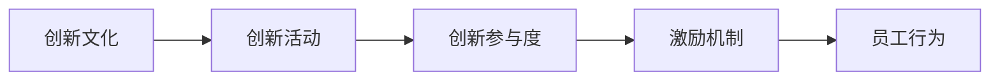
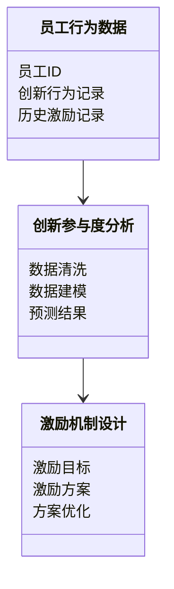
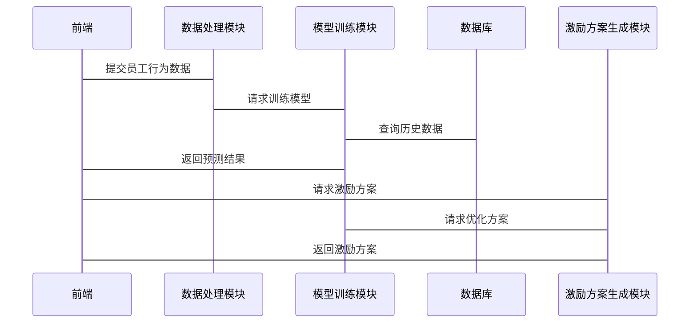

                 


# AI辅助企业创新文化培养：创新活动参与度分析与激励

## 关键词：
AI, 创新文化, 创新活动参与度, 激励机制, 企业创新, 数据分析, 机器学习

## 摘要：
本文探讨如何利用人工智能技术分析企业员工的创新活动参与度，并设计有效的激励机制以培养企业创新文化。通过背景分析、核心概念阐述、算法原理讲解、系统架构设计、项目实战案例及最佳实践总结，本文为企业的创新文化建设提供了理论支持和实践指导。

---

# 第1章: 背景介绍

## 1.1 问题背景

### 1.1.1 企业创新文化的重要性
企业创新文化是企业持续发展的核心动力，它直接影响企业的市场竞争力和员工的工作积极性。在快速变化的商业环境中，创新文化能够帮助企业在技术革新和市场竞争中保持优势。

### 1.1.2 当前企业创新文化的挑战
- 员工参与创新活动的积极性不足。
- 创新激励机制缺乏针对性和动态调整能力。
- 传统激励机制难以捕捉和分析创新行为的复杂性。

### 1.1.3 AI在企业创新文化中的作用
人工智能技术可以通过数据分析和行为预测，帮助企业更精准地识别和激励创新行为，从而优化创新文化培养的效率。

## 1.2 问题描述

### 1.2.1 创新活动参与度的定义
创新活动参与度是指员工参与创新相关活动的频率和深度，包括提出新想法、参与项目讨论、提交创新方案等。

### 1.2.2 现有创新激励机制的不足
传统激励机制往往基于绩效结果，难以捕捉创新过程中的行为特征，且缺乏动态调整能力。

### 1.2.3 创新文化培养的难点
创新文化培养需要长期积累，且受多种因素影响，包括组织结构、员工心态和外部环境等。

## 1.3 问题解决

### 1.3.1 AI技术在创新文化中的应用潜力
- 利用机器学习模型分析员工的创新行为特征。
- 通过自然语言处理技术识别创新想法的质量和潜力。
- 基于AI的动态预测模型优化激励机制。

### 1.3.2 创新活动参与度分析的解决方案
- 数据采集与清洗：收集员工的行为数据，包括参与创新活动的频率、深度和质量。
- 数据分析与建模：使用机器学习算法预测员工的创新行为。
- 结果可视化：将分析结果以直观的方式呈现，为管理者提供决策支持。

### 1.3.3 基于AI的创新激励机制设计
- 动态调整激励方案：根据员工的创新行为特征实时调整激励措施。
- 个性化激励策略：基于员工的偏好和行为模式设计个性化的激励方案。

## 1.4 边界与外延

### 1.4.1 创新文化培养的边界
- 创新文化的培养仅关注与创新相关的活动和行为。
- 不涉及员工的其他工作行为或态度。

### 1.4.2 创新活动参与度的分析范围
- 员工参与创新活动的频率和深度。
- 创新活动的质量和潜力。

### 1.4.3 激励机制的适用场景
- 适用于需要鼓励员工创新的企业。
- 适用于有潜力通过激励机制提升创新文化的组织。

## 1.5 概念结构与核心要素

### 1.5.1 创新文化的核心要素
- 创新氛围：企业内部支持创新的氛围和文化。
- 创新机制：鼓励和管理创新活动的制度和流程。
- 创新资源：支持创新活动的资源和工具。

### 1.5.2 创新活动参与度的构成
- 参与频率：员工参与创新活动的次数。
- 参与深度：员工在创新活动中的投入程度。
- 参与质量：员工创新行为的创新性和可行性。

### 1.5.3 激励机制的关键因素
- 激励目标：明确激励的目标和范围。
- 激励方式：选择合适的激励方式，如奖金、晋升等。
- 激励效果：评估激励机制的有效性和可持续性。

---

# 第2章: 核心概念与联系

## 2.1 核心概念原理

### 2.1.1 创新活动参与度的定义与测量
创新活动参与度是通过分析员工的行为数据，如参与创新项目的次数、提交的想法数量等，来衡量员工的创新参与程度。

### 2.1.2 基于AI的创新行为预测模型
- 利用机器学习算法预测员工未来的创新行为。
- 通过历史数据训练模型，预测员工的创新行为。

### 2.1.3 激励机制的动态调整原理
- 根据员工的创新行为特征，动态调整激励措施。
- 通过反馈机制不断优化激励策略。

## 2.2 概念属性特征对比

### 表2-1: 创新活动参与度与传统激励机制的对比

| 属性 | 创新活动参与度 | 传统激励机制 |
|------|----------------|--------------|
| 定义 | 员工参与创新活动的频率和深度 | 基于绩效的奖励机制 |
| 测量方式 | 基于AI的行为数据分析 | 基于绩效指标的统计 |
| 调整方式 | 动态调整 | 静态调整 |

---

## 2.3 实体关系图架构



---

# 第3章: 算法原理讲解

## 3.1 算法概述

### 3.1.1 算法核心思想
通过机器学习算法分析员工的创新行为数据，预测员工的创新参与度，并据此设计激励机制。

## 3.2 算法流程

### 3.2.1 数据预处理
- 数据清洗：去除无效数据，处理缺失值。
- 数据标准化：将数据标准化，以便模型处理。

### 3.2.2 模型训练
- 使用监督学习算法（如随机森林、神经网络）训练模型，预测员工的创新参与度。

### 3.2.3 模型评估
- 使用交叉验证评估模型的性能，调整模型参数以优化预测效果。

## 3.3 算法实现代码

```python
import pandas as pd
from sklearn.ensemble import RandomForestClassifier
from sklearn.metrics import accuracy_score

# 加载数据
data = pd.read_csv('创新行为数据.csv')

# 数据预处理
X = data.drop('创新参与度', axis=1)
y = data['创新参与度']

# 训练模型
model = RandomForestClassifier()
model.fit(X, y)

# 预测
y_pred = model.predict(X)

# 评估
print("准确率:", accuracy_score(y, y_pred))
```

## 3.4 数学模型

### 3.4.1 机器学习模型的数学表达
随机森林模型的数学表达式如下：
$$
f(x) = \sum_{i=1}^{n} \text{树}(x)
$$

### 3.4.2 其他相关模型
神经网络模型的数学表达式如下：
$$
y = \sigma(Wx + b)
$$

---

# 第4章: 系统分析与架构设计

## 4.1 问题场景介绍

### 4.1.1 问题场景描述
企业在创新文化培养中面临创新活动参与度难以测量和激励机制缺乏动态调整的问题。

### 4.1.2 问题分析
- 创新行为数据分散，难以整合。
- 创新激励机制缺乏个性化和动态调整能力。

## 4.2 系统功能设计

### 4.2.1 领域模型设计



### 4.2.2 系统架构设计


### 4.2.3 接口设计
- 前端接口：员工行为数据输入接口，创新参与度查询接口。
- 后端接口：数据处理模块接口，模型训练模块接口，激励方案生成模块接口。

### 4.2.4 交互流程



---

# 第5章: 项目实战

## 5.1 环境安装

### 5.1.1 安装Python
```bash
python --version
pip install --upgrade pip
```

### 5.1.2 安装依赖库
```bash
pip install pandas scikit-learn mermaid4jupyter
```

## 5.2 系统核心实现

### 5.2.1 数据预处理
```python
import pandas as pd

data = pd.read_csv('创新行为数据.csv')
data = data.dropna()
data = (data - data.min()) / (data.max() - data.min())
```

### 5.2.2 模型训练与预测
```python
from sklearn.ensemble import RandomForestClassifier

model = RandomForestClassifier()
model.fit(X_train, y_train)
y_pred = model.predict(X_test)
```

### 5.2.3 激励方案生成
```python
def generate_incentive方案(y_pred):
    incentive_plan = []
    for pred in y_pred:
        if pred > 0.7:
            incentive_plan.append('高激励')
        else:
            incentive_plan.append('低激励')
    return incentive_plan
```

## 5.3 代码应用解读

### 5.3.1 数据预处理代码解读
- 数据清洗：去除缺失值。
- 数据标准化：将数据标准化到0-1范围。

### 5.3.2 模型训练代码解读
- 使用随机森林模型训练分类器。
- 输入训练数据，输出预测结果。

### 5.3.3 激励方案生成代码解读
- 根据预测结果生成激励方案，高预测值对应高激励，低预测值对应低激励。

## 5.4 实际案例分析
假设企业有100名员工，经过模型预测，其中20名员工的创新参与度较高，系统会为这20名员工制定高激励方案，如奖金、晋升等。

---

# 第6章: 最佳实践、小结、注意事项和拓展阅读

## 6.1 最佳实践
- 定期更新模型，确保预测结果的准确性。
- 根据员工反馈不断优化激励方案。
- 结合企业实际情况，灵活调整系统参数。

## 6.2 小结
本文详细介绍了AI辅助企业创新文化培养的方法和步骤，从背景分析到系统实现，为企业的创新文化建设提供了全面的解决方案。

## 6.3 注意事项
- 数据隐私保护：确保员工数据的安全和隐私。
- 模型解释性：确保模型的预测结果可解释，避免黑箱操作。

## 6.4 拓展阅读
- 《机器学习实战》：学习更多机器学习算法和模型。
- 《企业创新管理》：深入了解企业创新管理的理论和实践。

---

# 附录

## 附录A: 代码示例
```python
import pandas as pd
from sklearn.ensemble import RandomForestClassifier
from sklearn.metrics import accuracy_score

# 加载数据
data = pd.read_csv('创新行为数据.csv')

# 数据预处理
X = data.drop('创新参与度', axis=1)
y = data['创新参与度']

# 训练模型
model = RandomForestClassifier()
model.fit(X, y)

# 预测
y_pred = model.predict(X)

# 评估
print("准确率:", accuracy_score(y, y_pred))
```

---

以上是《AI辅助企业创新文化培养：创新活动参与度分析与激励》的技术博客文章的完整目录和内容概要，涵盖了从背景介绍到实际应用的各个方面，详细阐述了AI在企业创新文化培养中的作用和具体实施方法。

