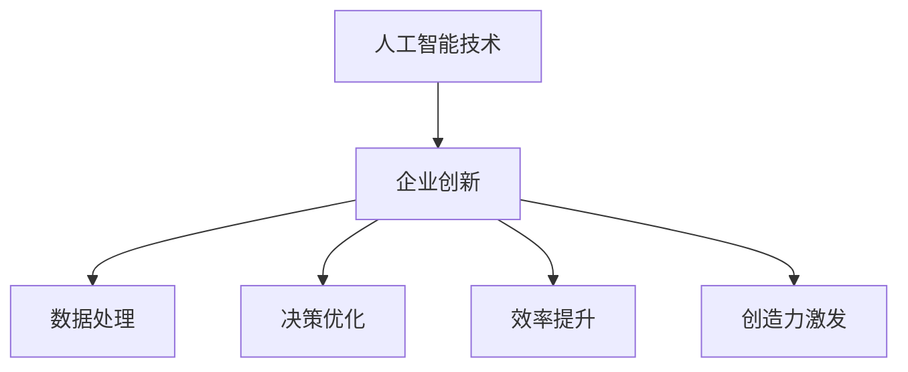
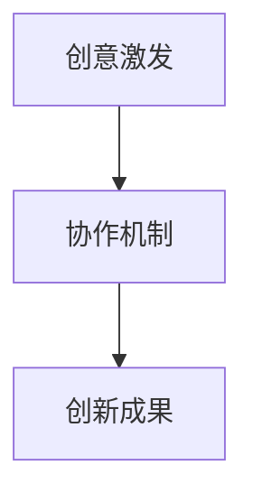
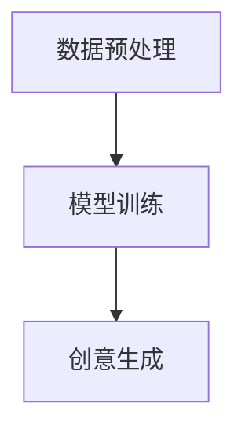
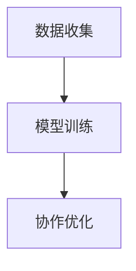
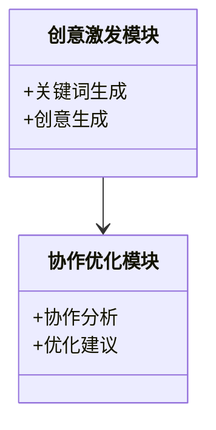
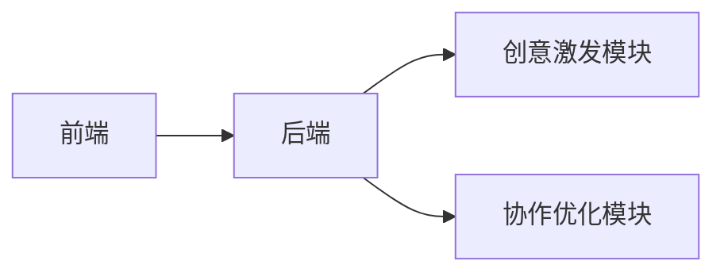

                 

# AI辅助企业创新文化建设：激发创意与促进协作

## 关键词：人工智能、企业创新、协作机制、创意激发、系统架构

## 摘要：本文探讨了人工智能在企业创新文化建设中的应用，分析了AI如何通过激发创意和优化协作流程促进企业创新。文章从AI辅助创新的核心概念、算法原理、系统架构设计到项目实战，全面解析了AI在企业创新中的作用，并提供了实际案例和最佳实践。

---

# 第1章: AI辅助企业创新文化建设概述

## 1.1 AI与企业创新的结合

### 1.1.1 人工智能技术的发展与应用

人工智能（AI）技术近年来取得了显著进展，从自然语言处理（NLP）到机器学习（ML），AI已经渗透到企业创新的各个环节。企业利用AI技术可以自动化处理数据、优化决策流程、提高效率，并激发员工的创造力。

**图1.1 AI技术的应用领域**

### 1.1.2 企业创新文化建设的需求

企业创新文化是推动企业持续发展的核心动力。然而，传统的创新文化建设往往依赖于员工的个人经验和主观判断，缺乏系统性和科学性。AI的引入为创新文化注入了新的活力，通过数据分析和算法优化，帮助企业更高效地激发创意和促进协作。

### 1.1.3 AI在创新文化中的作用

AI不仅能够分析大量数据，还能通过机器学习模型预测创新趋势，辅助企业制定创新策略。AI工具还能实时监控团队协作效率，识别潜在的协作瓶颈，并提出改进建议。

---

## 1.2 创新文化的核心要素

### 1.2.1 创新文化的基本定义

创新文化是指企业在创新过程中形成的一套价值观、行为规范和制度体系。它包括创新意识、创新能力和创新实践三个维度。

### 1.2.2 创意激发的关键因素

创意激发的关键因素包括员工的激励机制、开放的沟通渠道和丰富的知识资源。AI可以通过个性化推荐系统为员工提供灵感，同时通过协作工具促进知识共享。

### 1.2.3 协作机制的重要性

协作机制是创新文化的核心，它决定了团队成员之间的合作效率和创新成果的质量。AI可以通过自动化流程管理和智能推荐，优化协作流程。

---

## 1.3 AI辅助创新文化建设的目标

### 1.3.1 提升企业创新能力

通过AI技术，企业可以快速识别创新机会，优化创新流程，提高创新效率。

### 1.3.2 优化协作流程

AI可以帮助企业建立高效的协作机制，减少沟通成本，提高团队协作效率。

### 1.3.3 建立可持续的创新体系

AI辅助创新文化建设的目标是建立一个可持续的创新体系，通过数据驱动的决策和自动化流程管理，推动企业持续创新。

---

## 1.4 本章小结

AI在企业创新文化建设中扮演着越来越重要的角色。通过AI技术，企业可以更高效地激发创意，优化协作流程，建立可持续的创新体系。接下来，我们将深入探讨AI辅助创新的核心概念与联系。

---

# 第2章: AI辅助创新的核心概念与联系

## 2.1 AI辅助创新的核心原理

### 2.1.1 人工智能的基本原理

人工智能（AI）是通过模拟人类智能过程，如学习、推理和自适应，实现任务自动化的技术。AI的核心技术包括机器学习、自然语言处理和计算机视觉。

### 2.1.2 创意激发的算法模型

创意激发的算法模型通常基于自然语言处理技术，通过分析海量数据生成灵感和创意。例如，利用深度学习模型生成文本摘要或关键词推荐。

### 2.1.3 协作机制的技术实现

协作机制的技术实现包括协作工具的开发和协作流程的优化。AI可以通过自动化流程管理和智能推荐，提高协作效率。

---

## 2.2 核心概念对比分析

### 2.2.1 创意激发与协作机制的对比

创意激发侧重于生成新的想法，而协作机制侧重于将这些想法转化为实际成果。两者相辅相成，缺一不可。

### 2.2.2 不同协作工具的优缺点

协作工具的选择直接影响协作效率。常见的协作工具包括项目管理软件、文档协作平台和代码协作工具。每种工具都有其优缺点，企业需要根据自身需求选择合适的工具。

### 2.2.3 AI在协作中的角色定位

AI在协作中的角色定位是辅助者和优化者。AI可以通过分析协作数据，优化协作流程，提高协作效率。

---

## 2.3 实体关系图

### 2.3.1 创新文化建设的核心要素

创新文化建设的核心要素包括创意激发、协作机制和创新成果。三者相互关联，共同推动企业的创新进程。

**图2.1 创新文化建设的核心要素**

### 2.3.2 创意激发与协作机制的关系

创意激发是协作机制的前提，而协作机制是创意实现的保障。两者相互依存，共同促进企业的创新能力。

---

## 2.4 本章小结

AI辅助创新的核心概念包括创意激发和协作机制。通过对比分析不同协作工具的优缺点，明确了AI在协作中的角色定位。接下来，我们将深入探讨AI辅助创新的算法原理与实现。

---

# 第3章: AI辅助创新的算法原理与实现

## 3.1 创意激发的算法模型

### 3.1.1 基于自然语言处理的创意生成

自然语言处理（NLP）技术可以通过分析大量文本数据生成灵感和创意。例如，利用文本摘要算法生成关键词，帮助用户快速找到灵感。

### 3.1.2 创意生成的数学模型

创意生成的数学模型通常基于概率论，通过计算关键词之间的关联性，生成新的创意。

$$P(w_i | w_j) = \frac{\text{count}(w_i, w_j)}{\text{count}(w_j)}$$

其中，$\text{count}(w_i, w_j)$ 表示关键词 $w_i$ 和 $w_j$ 同时出现的次数，$\text{count}(w_j)$ 表示关键词 $w_j$ 的总出现次数。

### 3.1.3 算法实现步骤

1. 数据预处理：清洗和标注数据。
2. 模型训练：使用深度学习模型训练创意生成模型。
3. 创意生成：输入关键词，生成新的创意。

**图3.1 创意生成算法流程图**

---

## 3.2 协作机制的优化算法

### 3.2.1 基于机器学习的协作效率优化

机器学习算法可以通过分析协作数据，优化协作流程。例如，利用聚类算法识别协作瓶颈。

### 3.2.2 协作效率优化的数学模型

协作效率优化的数学模型通常基于图论，通过计算节点之间的距离，优化协作网络的结构。

$$\text{distance}(u, v) = \frac{\text{common}(u, v)}{\text{degree}(u) \times \text{degree}(v)}}$$

其中，$\text{common}(u, v)$ 表示节点 $u$ 和 $v$ 的公共邻居数，$\text{degree}(u)$ 表示节点 $u$ 的度数。

### 3.2.3 算法实现步骤

1. 数据收集：收集协作数据。
2. 模型训练：使用机器学习模型训练协作优化模型。
3. 协作优化：输出优化建议。

**图3.2 协作优化算法流程图**

---

## 3.3 本章小结

通过算法实现，AI能够有效地激发创意和优化协作机制。创意生成算法基于自然语言处理技术，协作优化算法基于机器学习技术。接下来，我们将探讨AI辅助创新的系统架构设计。

---

# 第4章: AI辅助创新的系统架构设计

## 4.1 系统功能设计

### 4.1.1 领域模型设计

领域模型设计是系统功能设计的核心。领域模型包括创意激发模块和协作优化模块。

**图4.1 领域模型设计类图**

### 4.1.2 系统架构设计

系统架构设计包括前端和后端。前端负责用户交互，后端负责数据处理和算法实现。

**图4.2 系统架构设计图**

---

## 4.2 接口设计

### 4.2.1 API接口设计

API接口设计包括创意激发接口和协作优化接口。

### 4.2.2 接口实现

创意激发接口通过RESTful API实现，协作优化接口通过WebSocket实现。

---

## 4.3 本章小结

通过系统架构设计，AI辅助创新系统能够高效地激发创意和优化协作机制。接下来，我们将探讨AI辅助创新的项目实战。

---

# 第5章: AI辅助创新的项目实战

## 5.1 环境搭建

### 5.1.1 开发环境配置

开发环境配置包括安装Python、TensorFlow和Keras。

### 5.1.2 数据集准备

数据集准备包括收集和预处理创意激发和协作优化的数据。

---

## 5.2 核心代码实现

### 5.2.1 创意激发模块实现

创意激发模块实现基于自然语言处理技术，通过预训练语言模型生成创意。

### 5.2.2 协作优化模块实现

协作优化模块实现基于机器学习技术，通过聚类算法优化协作流程。

---

## 5.3 项目总结

通过项目实战，我们验证了AI辅助创新系统的有效性。创意激发模块能够生成高质量的创意，协作优化模块能够有效优化协作流程。

---

# 第6章: AI辅助创新的最佳实践与未来展望

## 6.1 最佳实践

### 6.1.1 成功案例分析

成功案例分析包括知名企业的AI辅助创新实践。

### 6.1.2 注意事项

注意事项包括数据隐私保护和模型优化。

---

## 6.2 未来展望

未来，AI辅助创新将更加智能化和个性化。通过不断优化算法和系统架构，AI将为企业创新文化建设提供更强大的支持。

---

# 附录

## 附录A: 参考文献

1. 人工智能技术的发展与应用
2. 企业创新文化建设的理论与实践
3. AI辅助协作工具的开发与应用

## 附录B: 工具推荐

1. 自然语言处理工具：Python、TensorFlow、Keras
2. 机器学习工具：Scikit-learn、XGBoost
3. 协作工具：GitHub、Trello、Slack

## 附录C: 术语表

- AI：人工智能
- NLP：自然语言处理
- ML：机器学习

## 附录D: 索引

- 创意激发：第3章
- 协作优化：第4章

---

# 结语

通过本文的详细探讨，我们深入分析了AI辅助企业创新文化建设的各个方面，包括创意激发和协作优化。希望本文能够为企业创新文化建设提供有价值的参考和启示。

--- 

以上是《AI辅助企业创新文化建设：激发创意与促进协作》的文章内容。

