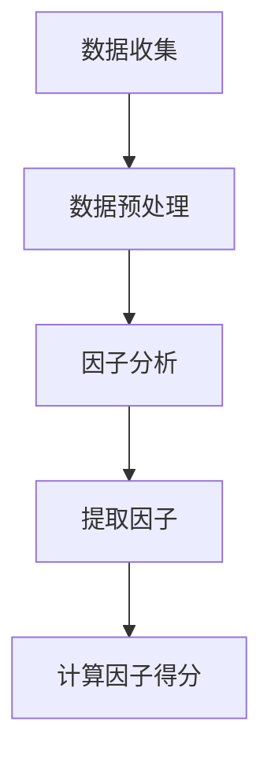
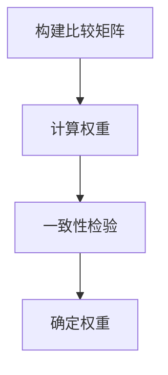
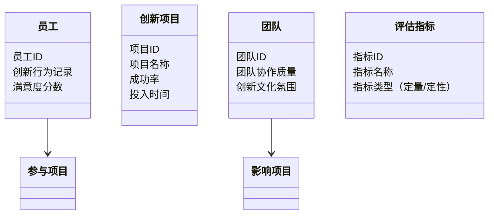
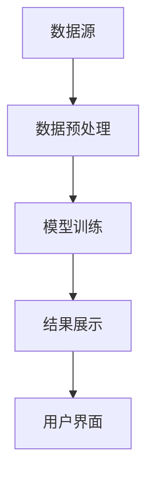
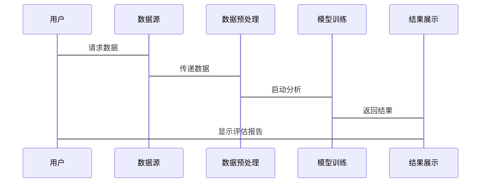

                 


# AI辅助企业创新文化评估：定量与定性指标分析

> 关键词：AI，企业创新文化，定量指标，定性指标，评估体系

> 摘要：本文探讨了如何利用人工智能技术，通过定量和定性指标的结合，对企业创新文化进行评估。文章从背景、核心概念、算法原理、系统设计、项目实战等方面展开分析，为企业创新文化的数字化评估提供了理论支持和实践指导。

---

## 第1章：AI辅助企业创新文化评估概述

### 1.1 问题背景与描述

#### 1.1.1 企业创新文化的重要性
企业创新文化是推动企业持续发展的重要动力。它影响着员工的创造力、团队协作能力和企业的整体竞争力。一个积极的创新文化能够激发员工的潜能，促进新产品、新服务和新商业模式的诞生。

#### 1.1.2 当前评估方法的局限性
传统的企业创新文化评估方法通常依赖于主观判断，例如通过问卷调查或管理层的直观感受。这种方法存在以下问题：
- 数据收集成本高，耗时长。
- 评估结果缺乏客观性，容易受到主观因素的影响。
- 难以量化，难以进行横向比较。

#### 1.1.3 引入AI技术的必要性
人工智能技术可以通过对大量数据的分析，提取出隐含的规律和模式，从而为企业创新文化的评估提供更客观、更精准的依据。AI能够处理结构化和非结构化的数据，结合定量和定性分析，帮助企业更好地理解创新文化的构成和影响因素。

---

## 第2章：AI辅助评估的核心概念

### 2.1 定量与定性指标对比

#### 2.1.1 定量指标特征
定量指标是可以用数字量化的指标，例如：
- 员工创新行为的频率（如提交的新想法数量）。
- 创新项目的成功率（如产品上市时间、市场反馈）。
- 研发投入占总收入的比例。

| 特征 | 定量指标 | 定性指标 |
|------|----------|----------|
| 数据类型 | 数值型 | 文本型、描述型 |
| 分析方式 | 统计分析、回归分析 | 主题分析、情感分析 |
| 示例 | 员工满意度分数 | 创新团队的协作氛围描述 |

#### 2.1.2 定性指标特征
定性指标是通过描述性信息反映创新文化的特征，例如：
- 员工对创新文化的感知（如自由表达意见的程度）。
- 团队协作的质量（如团队成员之间的信任程度）。
- 创新文化在企业内部的传播程度。

#### 2.1.3 对比表格
以下是定量和定性指标的对比表格：

| 属性          | 定量指标                          | 定性指标                          |
|---------------|----------------------------------|----------------------------------|
| 数据类型       | 数值型（如分数、比例）             | 文本型或描述型（如“积极”、“消极”） |
| 分析方法       | 统计分析、回归分析                | 主题分析、情感分析                |
| 示例           | 员工满意度分数（85%）            | 员工对创新文化的感知（高度自由）  |
| 优势           | 客观性强，便于横向比较            | 能够捕捉到情感和态度的变化          |
| 局限性         | 难以反映深层文化特征              | 主观性较强，分析复杂              |

### 2.2 ER实体关系图

以下是创新文化评估的核心实体关系图：

```mermaid
er
    entity(员工) {
        员工ID
        创新行为记录
        满意度分数
    }
    entity(创新项目) {
        项目ID
        项目名称
        成功率
        投入时间
    }
    entity(团队) {
        团队ID
        团队协作质量
        创新文化氛围
    }
    entity(评估指标) {
        指标ID
        指标名称
        指标类型（定量/定性）
    }
    relation(员工参与项目) {
        员工 -> 项目
    }
    relation(团队文化影响项目) {
        团队 -> 项目
    }
```

---

## 第3章：AI评估算法原理

### 3.1 算法选择与原理

#### 3.1.1 因子分析法
因子分析是一种统计方法，用于识别潜在的变量（因子）对观测变量的贡献。在创新文化评估中，可以用来降维，提取出影响创新文化的最关键因素。

- **公式**：
  $$
  \text{因子得分} = \sum_{i=1}^{n} w_i x_i
  $$
  其中，\( w_i \) 是因子的权重，\( x_i \) 是观测变量。

- **步骤**：
  1. 收集相关数据。
  2. 进行主成分分析（PCA）或因子分析，提取关键因子。
  3. 计算每个因子的得分。



#### 3.1.2 层次分析法
层次分析法（AHP）是一种用于决策分析的方法，适用于评估指标的权重分配。在创新文化评估中，可以用来确定不同指标的重要性。

- **公式**：
  $$
  w_i = \frac{a_{ij}}{\sum_{j=1}^{n} a_{ij}}
  $$
  其中，\( a_{ij} \) 是比较矩阵中的元素，\( w_i \) 是指标 \( i \) 的权重。

- **步骤**：
  1. 构建比较矩阵。
  2. 计算权重向量。
  3. 进行一致性检验。



### 3.2 数学模型与公式

#### 3.2.1 因子分析公式
因子分析模型可以表示为：
$$
X = A F + \epsilon
$$
其中，\( X \) 是观测变量矩阵，\( A \) 是因子载荷矩阵，\( F \) 是因子得分矩阵，\( \epsilon \) 是误差矩阵。

#### 3.2.2 层次分析法公式
层次分析法中，比较矩阵的特征值计算公式为：
$$
\lambda_i = \sum_{j=1}^{n} a_{ij}
$$
其中，\( \lambda_i \) 是第 \( i \) 个特征值，\( a_{ij} \) 是比较矩阵中的元素。

### 3.3 代码实现

#### 3.3.1 因子分析代码示例

```python
import pandas as pd
from sklearn.decomposition import FactorAnalysis

# 假设df是数据框，包含创新文化相关的指标
df = pd.read_csv('创新文化数据.csv')

# 应用因子分析，提取2个因子
fa = FactorAnalysis(n_components=2)
fa.fit(df)

# 提取因子得分
factor_scores = fa.transform(df)
print(factor_scores)
```

#### 3.3.2 层次分析法代码示例

```python
import numpy as np

# 构建比较矩阵（示例）
matrix = np.array([
    [1, 3, 2],
    [1/3, 1, 2/3],
    [1/2, 3/2, 1]
])

# 计算特征值
eigenvalues = np.linalg.eigvals(matrix)
print(eigenvalues)
```

---

## 第4章：系统架构设计方案

### 4.1 问题场景介绍

#### 4.1.1 系统需求
- 实时处理企业的创新文化数据。
- 支持定量和定性指标的混合分析。
- 提供直观的可视化结果。

#### 4.1.2 系统目标
- 提供准确的创新文化评估结果。
- 自动生成改进建议。
- 支持多维度的数据分析。

### 4.2 系统功能设计

#### 4.2.1 领域模型类图



### 4.3 系统架构设计

#### 4.3.1 系统架构图



### 4.4 系统接口与交互

#### 4.4.1 接口设计

- 数据输入接口：接收员工、项目和团队的相关数据。
- 模型调用接口：调用因子分析和层次分析模型。
- 结果输出接口：输出评估结果和改进建议。

#### 4.4.2 交互序列图



---

## 第5章：AI评估系统开发

### 5.1 环境安装与配置

#### 5.1.1 Python环境搭建
安装Python 3.8或更高版本。

#### 5.1.2 库安装
安装必要的库：
```bash
pip install pandas numpy scikit-learn
```

### 5.2 核心代码实现

#### 5.2.1 数据预处理代码

```python
import pandas as pd

# 读取数据
df = pd.read_csv('创新文化数据.csv')

# 删除缺失值
df.dropna(inplace=True)

# 标准化数据
from sklearn.preprocessing import StandardScaler
scaler = StandardScaler()
df_scaled = pd.DataFrame(scaler.fit_transform(df), columns=df.columns)
```

#### 5.2.2 模型训练代码

```python
from sklearn.decomposition import FactorAnalysis

# 应用因子分析
fa = FactorAnalysis(n_components=2)
fa.fit(df_scaled)

# 提取因子得分
factor_scores = fa.transform(df_scaled)
print(factor_scores)
```

#### 5.2.3 结果展示代码

```python
import matplotlib.pyplot as plt

# 绘制因子得分分布图
plt.scatter(factor_scores[:, 0], factor_scores[:, 1])
plt.xlabel('Factor 1')
plt.ylabel('Factor 2')
plt.title('Factor Scores Distribution')
plt.show()
```

### 5.3 案例分析与解读

#### 5.3.1 案例背景
假设某公司希望评估其团队的创新文化，收集了员工满意度、项目成功率等数据。

#### 5.3.2 数据分析
通过因子分析，提取出两个关键因子：创新氛围和团队协作。

#### 5.3.3 结果解读
- 创新氛围得分较高，但团队协作得分较低，建议加强团队内部的协作机制。

---

## 第6章：总结与展望

### 6.1 最佳实践 tips
- 确保数据质量，尽可能收集多维度的数据。
- 根据企业的实际情况选择合适的算法。
- 定期更新模型，以适应企业创新文化的变化。

### 6.2 小结
本文通过结合定量和定性指标，利用AI技术对企业创新文化进行了全面的评估。通过因子分析和层次分析法，提取出关键的创新文化因子，并通过系统设计和项目实战展示了如何将理论应用于实际。

### 6.3 注意事项
- 数据隐私保护是需要重点关注的问题。
- 模型的可解释性需要进一步提升，以便更好地指导企业实践。

### 6.4 拓展阅读
- 《数据挖掘导论》
- 《机器学习实战》
- 《企业创新管理》

---

以上是《AI辅助企业创新文化评估：定量与定性指标分析》的技术博客文章，希望对您有所帮助！

