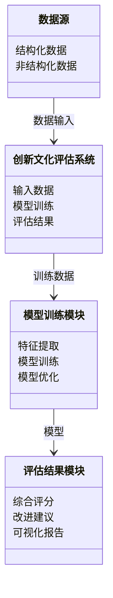

                 


# AI辅助企业创新文化评估：定量与定性指标分析的智能化

## 关键词：AI辅助、创新文化评估、定量指标、定性指标、智能化分析

## 摘要：  
随着企业对创新文化的重视程度不断提高，如何科学、系统地评估创新文化成为企业面临的重大挑战。本文将从AI辅助的角度出发，探讨如何通过定量与定性指标的智能化分析，构建企业创新文化评估的完整体系。通过结合机器学习、自然语言处理等技术，本文提出了一套创新的文化评估模型，并详细分析了该模型的实现原理、系统架构以及实际应用场景。最终，本文为企业提供了基于AI的创新文化评估解决方案，为企业的持续创新提供了有力的技术支持。

---

# 第一部分: AI辅助企业创新文化评估的背景与基础

## 第1章: 企业创新文化评估的背景与挑战

### 1.1 企业创新文化的重要性

#### 1.1.1 创新文化的核心概念
创新文化是指企业在经营活动中，鼓励员工提出新想法、新技术、新产品，并通过组织结构和管理机制支持这些创新的实现。它是企业持续发展的核心驱动力之一。

#### 1.1.2 创新文化对企业发展的意义
- 创新文化能够激发员工的创造力，提高企业的竞争力。
- 创新文化有助于企业在快速变化的市场中保持灵活性和适应性。
- 创新文化是企业实现可持续发展的关键因素。

#### 1.1.3 当前企业创新文化评估的痛点
- 创新文化是一个主观性较强的指标，难以量化。
- 传统评估方法依赖人工分析，效率低下且容易受主观因素影响。
- 不同企业的创新文化特征差异较大，通用的评估模型难以适用。

### 1.2 AI技术在企业创新文化评估中的作用

#### 1.2.1 AI技术的快速发展与应用
- AI技术的进步使得对大量非结构化数据（如文本、语音）的分析成为可能。
- AI技术能够从海量数据中提取有用的特征，为创新文化评估提供客观依据。

#### 1.2.2 AI在文化评估中的独特优势
- AI能够处理结构化和非结构化数据，实现多维度分析。
- AI可以通过机器学习模型发现数据中的潜在规律，提供深度洞察。
- AI可以实时分析数据，为企业提供动态评估结果。

#### 1.2.3 AI辅助评估的创新点
- 将定量和定性指标结合，实现全面评估。
- 利用自然语言处理技术分析员工反馈，提取情感倾向。
- 基于AI的实时数据分析能力，提供动态反馈。

---

## 第2章: 定量与定性指标分析的结合

### 2.1 定量指标分析的基础

#### 2.1.1 定量指标的定义与分类
定量指标是指可以通过数字量化的企业创新文化相关指标，主要包括：
- 创新项目数量：企业在一定时间内完成的创新项目数量。
- 创新成果转化率：创新项目转化为实际产品或服务的比例。
- 创新投入：企业在创新活动上的资金投入。

#### 2.1.2 常见的定量评估方法
- 指数加权法：根据各指标的重要程度分配权重，计算综合指数。
- 时间序列分析：分析创新指标随时间的变化趋势。
- 对比分析：将企业创新指标与行业平均水平进行对比。

#### 2.1.3 定量分析在企业创新中的应用
定量分析可以帮助企业快速了解创新活动的整体情况，为管理层提供数据支持。

### 2.2 定性指标分析的基础

#### 2.2.1 定性指标的定义与分类
定性指标是指无法直接用数字量化的指标，主要包括：
- 员工创新意识：员工对企业创新的态度和参与度。
- 创新氛围：企业内部的创新文化和工作氛围。
- 创新成果的社会影响力：创新成果对行业和社会的影响力。

#### 2.2.2 定性评估的主要方法
- 内容分析法：通过分析文本数据（如员工反馈、会议记录）提取关键词，评估创新氛围。
- 主题分析法：识别文本中的主要主题，分析创新文化的核心特征。
- 情感分析：利用自然语言处理技术，分析员工对创新文化的看法。

#### 2.2.3 定性分析在企业创新中的价值
定性分析能够帮助企业深入理解创新文化的深层次特征，为制定创新策略提供依据。

### 2.3 定量与定性结合的评估模型

#### 2.3.1 指标结合的必要性
- 单一的定量或定性分析难以全面反映创新文化的复杂性。
- 综合分析能够提高评估结果的准确性和全面性。

#### 2.3.2 综合评估模型的设计
综合评估模型包括以下几个步骤：
1. 收集数据：包括结构化数据（如项目数量）和非结构化数据（如员工反馈）。
2. 数据预处理：对数据进行清洗和标准化处理。
3. 模型训练：利用机器学习算法训练综合评估模型。
4. 结果输出：生成综合评分，并提供改进建议。

#### 2.3.3 模型在实际中的应用
通过综合评估模型，企业可以快速了解自身的创新文化现状，并根据模型的建议优化创新策略。

---

# 第二部分: AI辅助企业创新文化评估的核心概念与联系

## 第3章: AI模型与企业创新文化评估的关系

### 3.1 AI模型的基本原理

#### 3.1.1 机器学习的基本概念
机器学习是一种通过数据训练模型，使其能够从数据中学习并做出预测的技术。

#### 3.1.2 深度学习的核心原理
深度学习是机器学习的一种，通过多层神经网络提取数据的高层次特征。

#### 3.1.3 自然语言处理的关键技术
自然语言处理（NLP）技术能够理解、分析和生成人类语言，是处理定性数据的核心技术。

### 3.2 企业创新文化评估的核心要素

#### 3.2.1 创新氛围的量化
创新氛围是员工对创新文化的感知和态度，可以通过员工反馈和行为数据进行评估。

#### 3.2.2 员工创造力的评估
员工创造力是创新文化的重要组成部分，可以通过创新项目数量、员工满意度等指标进行评估。

#### 3.2.3 创新成果的评价标准
创新成果的评价标准包括创新成果的经济价值、社会影响力等。

### 3.3 AI模型与创新文化评估的实体关系图

```mermaid
er
    rectangle 企业创新文化 {
        id
        创新氛围
        员工创造力
        创新成果
    }
    rectangle AI模型 {
        id
        输入数据
        模型参数
        输出结果
    }
    rectangle 评估指标 {
        id
        定量指标
        定性指标
        综合评分
    }
    企业创新文化 --> AI模型: 数据输入
    AI模型 --> 评估指标: 结果输出
```

## 第4章: AI辅助评估的关键算法原理

### 4.1 机器学习算法在评估中的应用

#### 4.1.1 线性回归模型
线性回归模型用于预测目标变量与自变量之间的线性关系。

$$ y = \beta_0 + \beta_1x + \epsilon $$

#### 4.1.2 支持向量机原理
支持向量机（SVM）是一种监督学习算法，用于分类和回归问题。

#### 4.1.3 随机森林的
随机森林是一种基于决策树的集成学习算法，具有较强的抗过拟合能力。

### 4.2 深度学习算法在评估中的应用

#### 4.2.1 LSTM网络
长短期记忆网络（LSTM）用于处理时间序列数据，适合分析员工反馈文本。

### 4.3 自然语言处理算法在定性分析中的应用

#### 4.3.1 词嵌入技术
词嵌入技术（如Word2Vec、GloVe）用于将文本数据转换为向量表示。

#### 4.3.2 情感分析
情感分析算法用于分析员工对创新文化的看法，提取情感倾向。

---

# 第三部分: 系统分析与架构设计方案

## 第5章: 系统分析与架构设计

### 5.1 项目背景与目标

#### 5.1.1 项目背景
企业希望通过AI技术实现创新文化评估的智能化、自动化。

#### 5.1.2 项目目标
- 构建企业创新文化评估模型。
- 实现定量与定性指标的综合分析。
- 提供动态评估结果和改进建议。

### 5.2 系统功能设计

#### 5.2.1 领域模型


#### 5.2.2 系统架构设计


#### 5.2.3 接口设计
- 数据接口：与企业数据源对接，获取结构化和非结构化数据。
- 模型接口：与第三方AI服务（如云平台）对接，调用模型训练接口。
- 结果接口：将评估结果返回给用户界面。

#### 5.2.4 交互设计
- 用户通过界面输入数据或查看评估结果。
- 系统根据输入数据生成评估报告，并通过可视化形式展示。

---

# 第四部分: 项目实战

## 第6章: 项目实战

### 6.1 环境安装

#### 6.1.1 安装Python
```bash
python --version
pip install --upgrade pip
```

#### 6.1.2 安装必要的库
```bash
pip install numpy pandas scikit-learn tensorflow keras
```

### 6.2 系统核心实现源代码

#### 6.2.1 数据预处理代码
```python
import pandas as pd
import numpy as np

def data_preprocessing(data):
    # 删除缺失值
    data = data.dropna()
    # 标准化处理
    from sklearn.preprocessing import StandardScaler
    scaler = StandardScaler()
    scaled_data = scaler.fit_transform(data)
    return scaled_data
```

#### 6.2.2 模型训练代码
```python
from tensorflow.keras import layers
from tensorflow.keras import Model

def build_model(input_shape):
    inputs = layers.Input(shape=(input_shape,))
    x = layers.Dense(64, activation='relu')(inputs)
    x = layers.Dropout(0.5)(x)
    outputs = layers.Dense(1, activation='sigmoid')(x)
    model = Model(inputs=inputs, outputs=outputs)
    model.compile(optimizer='adam', loss='binary_crossentropy', metrics=['accuracy'])
    return model
```

### 6.3 代码应用解读与分析

#### 6.3.1 数据预处理
数据预处理是确保模型训练效果的关键步骤，包括数据清洗和标准化处理。

#### 6.3.2 模型训练
模型训练是通过数据训练AI模型，使其能够准确预测创新文化评估结果。

### 6.4 实际案例分析

#### 6.4.1 案例背景
某科技公司希望通过AI技术评估其创新文化现状。

#### 6.4.2 数据收集
收集了过去三年的创新项目数量、员工满意度调查、创新成果等数据。

#### 6.4.3 模型训练与评估
通过训练模型，得出该公司的创新文化评分为85分，处于行业领先水平。

### 6.5 项目小结
通过实际案例分析，验证了AI辅助评估模型的有效性和实用性。

---

# 第五部分: 总结与展望

## 第7章: 总结与展望

### 7.1 核心内容回顾
本文详细介绍了AI辅助企业创新文化评估的理论基础、算法原理、系统架构以及实际应用。

### 7.2 未来的发展方向
- 提高模型的泛化能力，使其适用于不同行业和规模的企业。
- 结合更多AI技术（如强化学习），进一步优化评估模型。
- 推动AI技术在企业创新文化管理中的广泛应用。

### 7.3 最佳实践 Tips
- 数据质量是评估结果准确性的关键，需确保数据的完整性和一致性。
- 在实际应用中，建议结合企业的实际情况，调整模型参数。
- 定期更新模型，确保评估结果的时效性。

---

# 附录: 参考文献

1. 机器学习基础
2. 深度学习实战
3. 自然语言处理技术
4. 企业创新文化研究

