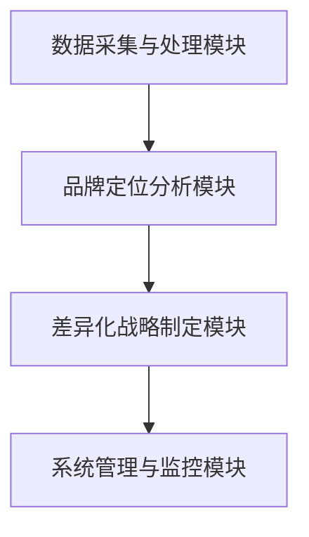

                 


# AI辅助企业品牌定位与差异化战略制定

## 关键词
AI技术、品牌定位、差异化战略、机器学习、自然语言处理

## 摘要
在当今竞争激烈的市场环境中，企业品牌定位与差异化战略的制定至关重要。本文将深入探讨如何利用AI技术辅助企业进行品牌定位和差异化战略的制定。通过分析AI技术的核心原理、主流模型以及其在品牌定位中的具体应用，本文将为企业提供一种高效、精准的品牌定位与战略制定方法。同时，结合实际案例和系统架构设计，本文将详细阐述AI辅助品牌定位与差异化战略的实现过程，为企业在数字化转型中提供有力支持。

# 第一部分: AI辅助企业品牌定位与差异化战略制定的背景与基础

## 第1章: 企业品牌定位与差异化战略概述

### 1.1 问题背景与重要性
#### 1.1.1 传统企业品牌定位的挑战
在传统的企业品牌定位过程中，企业往往面临以下挑战：
- **市场竞争加剧**：随着市场竞争的加剧，企业需要更加精准地定位目标客户，以在市场中脱颖而出。
- **数据量爆炸式增长**：企业每天产生的数据量巨大，如何高效地处理和分析这些数据，成为品牌定位的关键。
- **客户需求多样化**：客户的需求日益多样化，企业需要更加灵活和精准地调整品牌定位策略。

#### 1.1.2 差异化战略对企业竞争力的影响
差异化战略是企业在市场中获得竞争优势的重要手段。通过差异化战略，企业可以：
- **提升品牌忠诚度**：通过提供独特的价值主张，增强客户对品牌的忠诚度。
- **提高市场占有率**：差异化战略可以帮助企业在目标市场中占据更大的份额。
- **增强品牌辨识度**：通过差异化，企业可以在众多竞争对手中脱颖而出，提高品牌辨识度。

#### 1.1.3 AI技术如何赋能品牌定位与战略制定
AI技术的引入，为企业品牌定位和差异化战略的制定提供了新的可能性。通过AI技术，企业可以：
- **高效处理大量数据**：利用机器学习和大数据分析技术，快速处理和分析大量市场数据，提高品牌定位的效率。
- **精准预测市场趋势**：通过自然语言处理和时间序列分析，预测市场趋势，帮助制定更加科学的品牌战略。
- **实时监控与调整**：AI技术可以帮助企业实时监控市场变化，及时调整品牌定位策略，确保战略的有效性。

### 1.2 核心概念与定义
#### 1.2.1 品牌定位的定义与关键要素
品牌定位是指企业在目标市场中确定自己的位置和形象的过程。其关键要素包括：
- **目标客户群体**：企业需要明确自己的目标客户是谁，包括客户的基本特征、需求和行为习惯。
- **品牌核心价值**：品牌的核心价值是品牌在客户心中的核心利益点，是品牌存在的根本理由。
- **品牌差异化优势**：品牌差异化优势是指品牌相对于竞争对手的独特优势，是品牌在市场中脱颖而出的关键。

#### 1.2.2 差异化战略的内涵与外延
差异化战略是指企业通过提供独特的产品或服务，以在市场中获得竞争优势的战略。其内涵包括：
- **产品差异化**：通过提供独特的产品功能或设计，区别于竞争对手。
- **服务差异化**：通过提供优质的客户服务，增强客户忠诚度。
- **形象差异化**：通过塑造独特的品牌形象，提升品牌认知度。

#### 1.2.3 AI辅助品牌定位与战略制定的实现路径
AI辅助品牌定位与战略制定的实现路径包括：
- **数据驱动的市场分析**：利用AI技术对市场数据进行分析，识别市场趋势和客户需求。
- **精准的品牌画像构建**：通过机器学习模型，构建精准的品牌画像，明确品牌定位。
- **动态调整与优化**：根据市场反馈和数据分析结果，动态调整品牌定位和差异化战略。

## 第2章: AI技术基础与应用前景

### 2.1 AI技术的核心原理
#### 2.1.1 机器学习与深度学习简介
机器学习是一种通过数据训练模型，使其能够从数据中学习并做出预测或决策的技术。深度学习是机器学习的一种，通过多层神经网络模拟人脑的处理方式，能够处理更加复杂的任务。

#### 2.1.2 自然语言处理（NLP）的基本原理
自然语言处理是指让计算机能够理解、分析和生成人类语言的技术。其核心任务包括文本分类、情感分析、实体识别等。

#### 2.1.3 数据挖掘与分析技术
数据挖掘是指从大量数据中提取有价值的信息或模式的技术。通过数据挖掘，企业可以发现潜在的市场机会和客户需求。

### 2.2 主流AI模型与工具
#### 2.2.1 GPT系列模型在品牌定位中的应用
GPT系列模型是一种基于Transformer架构的大语言模型，具有强大的文本生成和理解能力。在品牌定位中，GPT模型可以用于生成品牌描述、分析客户反馈等。

#### 2.2.2 BERT模型在市场分析中的作用
BERT模型是一种基于Transformer的预训练语言模型，擅长于处理文本匹配、问答等任务。在市场分析中，BERT模型可以用于分析客户评论、识别市场趋势等。

#### 2.2.3 其他AI工具与平台简介
除了GPT和BERT，还有许多其他AI工具和平台，如TensorFlow、PyTorch、AWS AI等，这些工具可以帮助企业更高效地进行品牌定位和市场分析。

## 第3章: 企业品牌定位的核心要素与分析方法

### 3.1 品牌定位的关键要素
#### 3.1.1 目标客户群体的识别
目标客户群体的识别是品牌定位的核心。企业需要通过市场调研和数据分析，明确目标客户的特征、需求和行为习惯。

#### 3.1.2 品牌核心价值的提炼
品牌核心价值是品牌在客户心中的核心利益点。企业需要通过分析市场需求和竞争环境，提炼出品牌的核心价值。

#### 3.1.3 品牌差异化竞争优势的构建
品牌差异化竞争优势是品牌相对于竞争对手的独特优势。企业需要通过分析竞争对手的优劣势，找到自身的核心竞争优势。

### 3.2 AI辅助品牌定位的分析方法
#### 3.2.1 数据驱动的品牌画像构建
通过AI技术，企业可以利用大数据分析客户的行为数据，构建精准的品牌画像。例如，通过分析客户的购买记录、浏览行为等数据，识别客户的兴趣和需求。

#### 3.2.2 市场趋势与竞争对手分析
利用AI技术，企业可以实时监控市场趋势和竞争对手的动态。例如，通过自然语言处理技术分析竞争对手的产品描述和客户评价，识别竞争对手的优势和劣势。

#### 3.2.3 品牌定位的多维度评估模型
通过构建多维度评估模型，企业可以全面评估品牌定位的科学性和可行性。例如，通过分析市场定位、客户定位、产品定位等多个维度，评估品牌定位的合理性。

# 第二部分: AI辅助品牌定位与差异化战略的实现原理

## 第4章: AI驱动的品牌定位分析模型

### 4.1 品牌定位分析模型的构建
#### 4.1.1 数据收集与预处理
数据收集与预处理是品牌定位分析模型构建的基础。企业需要收集客户数据、市场数据、竞争对手数据等，并对数据进行清洗和转换，确保数据的准确性和一致性。

#### 4.1.2 模型训练与优化
通过机器学习算法，企业可以训练出一个能够预测品牌定位的模型。例如，利用随机森林、支持向量机等算法，训练出一个能够预测客户对品牌定位的模型。

#### 4.1.3 模型评估与验证
模型评估与验证是确保模型性能的重要步骤。企业可以通过交叉验证、混淆矩阵等方法，评估模型的准确性和鲁棒性。

### 4.2 基于机器学习的市场分析
#### 4.2.1 数据特征提取与选择
数据特征提取与选择是提高模型性能的重要步骤。企业需要从大量数据中提取出最具代表性的特征，例如，客户的年龄、性别、收入水平等。

#### 4.2.2 分类与聚类算法的应用
通过分类算法，企业可以将客户分为不同的群体，例如，根据客户的消费习惯将其分为高消费群体和低消费群体。通过聚类算法，企业可以发现客户群体的内在结构，例如，识别出具有相似需求的客户群体。

#### 4.2.3 模型在品牌定位中的具体应用
例如，企业可以通过训练一个分类模型，预测客户对品牌定位的偏好。然后，根据模型的预测结果，调整品牌定位策略，以满足客户的偏好。

## 第5章: 差异化战略的AI辅助制定

### 5.1 差异化战略的制定流程
#### 5.1.1 市场细分与目标选择
市场细分是指将整体市场划分为多个子市场，每个子市场具有相似的需求和特征。通过市场细分，企业可以选择最具有潜力的子市场作为目标市场。

#### 5.1.2 竞争对手分析与差异化机会识别
通过分析竞争对手的产品、价格、渠道、促销等策略，识别出差异化的机会。例如，竞争对手的产品功能较为单一，企业可以开发功能更为丰富的产品。

#### 5.1.3 差异化策略的具体实施路径
根据差异化机会，制定具体的差异化策略。例如，通过产品创新、服务优化、品牌塑造等方式，实现品牌差异化。

### 5.2 AI在差异化战略中的应用
#### 5.2.1 基于NLP的市场趋势分析
通过自然语言处理技术，企业可以分析市场趋势和客户反馈，识别出市场机会和差异化机会。例如，通过分析客户评论，识别出客户对产品功能的需求，从而制定相应的产品策略。

#### 5.2.2 数据驱动的差异化策略优化
通过大数据分析和机器学习算法，企业可以优化差异化策略。例如，通过分析客户数据，识别出最具潜力的目标客户群体，制定针对性的差异化策略。

#### 5.2.3 AI辅助的战略执行监控与调整
通过AI技术，企业可以实时监控战略执行的效果，并根据反馈结果进行调整。例如，通过分析客户反馈，评估品牌定位的实施效果，及时调整策略。

# 第三部分: AI辅助品牌定位与差异化战略的系统架构与实现

## 第6章: 系统架构设计

### 6.1 系统功能模块划分
#### 6.1.1 数据采集与处理模块
数据采集与处理模块负责收集和预处理数据，包括客户数据、市场数据、竞争对手数据等。

#### 6.1.2 品牌定位分析模块
品牌定位分析模块利用机器学习算法，对数据进行分析，生成品牌定位建议。

#### 6.1.3 差异化战略制定模块
差异化战略制定模块根据品牌定位分析结果，制定差异化战略。

#### 6.1.4 系统管理与监控模块
系统管理与监控模块负责系统的运行和维护，包括数据更新、模型优化等。

### 6.2 系统架构设计图


## 第7章: 系统实现与接口设计

### 7.1 系统核心算法实现
#### 7.1.1 基于机器学习的市场分析算法
例如，利用随机森林算法对市场数据进行分类，预测客户对品牌定位的偏好。

#### 7.1.2 基于NLP的情感分析与关键词提取算法
例如，利用情感分析算法分析客户评论，提取客户对品牌的关键词评价。

#### 7.1.3 差异化策略优化算法
例如，利用遗传算法优化差异化策略，找到最优的策略组合。

### 7.2 系统接口设计
#### 7.2.1 数据接口规范
例如，API接口定义了数据的输入格式和输出格式，确保不同模块之间的数据交互顺畅。

#### 7.2.2 用户接口设计
用户界面设计直观，方便用户输入数据和查看分析结果。例如，提供可视化界面，展示品牌定位分析结果和差异化战略建议。

#### 7.2.3 系统交互流程
例如，用户输入数据，系统处理数据并生成品牌定位建议，用户根据建议调整策略，系统实时监控策略执行效果。

## 第8章: 项目实战

### 8.1 项目背景与目标
通过一个具体案例，展示AI技术在品牌定位和差异化战略中的应用。例如，假设一家科技公司希望利用AI技术优化品牌定位，提升市场竞争力。

### 8.2 系统实现与代码示例
#### 8.2.1 环境安装
安装必要的工具和库，例如Python、TensorFlow、Numpy等。

#### 8.2.2 核心实现代码
例如，利用Python代码实现品牌定位分析模型的训练和预测。

```python
import numpy as np
from sklearn.ensemble import RandomForestClassifier

# 数据预处理
X = np.array([...])  # 特征数据
y = np.array([...])  # 标签数据

# 训练模型
model = RandomForestClassifier()
model.fit(X, y)

# 预测
new_X = np.array([...])
predicted_y = model.predict(new_X)
```

#### 8.2.3 代码应用解读与分析
解读上述代码，说明其在品牌定位中的具体应用。例如，训练好的随机森林模型可以用于预测客户对品牌定位的偏好。

### 8.3 实际案例分析与详细讲解
通过具体案例分析，展示AI技术在品牌定位和差异化战略中的实际应用效果。例如，分析某科技公司利用AI技术优化品牌定位后的市场表现。

### 8.4 项目小结
总结项目实施过程中的经验和教训，提出改进建议。例如，强调数据质量的重要性，建议企业在项目实施前进行充分的数据清洗和预处理。

## 第9章: 最佳实践与小结

### 9.1 最佳实践
- **数据质量**：确保数据的准确性和完整性，数据质量直接影响模型的性能。
- **模型选择**：根据具体任务选择合适的算法和模型，避免盲目使用复杂模型。
- **持续优化**：定期监控模型的性能，根据市场变化和客户需求，持续优化模型和策略。

### 9.2 小结
通过本文的探讨，我们可以看到AI技术在品牌定位与差异化战略制定中的巨大潜力。企业可以利用AI技术高效处理数据，精准分析市场趋势，制定科学的品牌定位和差异化策略。然而，AI技术的应用也需要企业在数据质量、模型选择和持续优化等方面投入更多努力，才能真正实现其价值。

### 9.3 注意事项
- **数据隐私**：在数据处理和分析过程中，企业需要遵守数据隐私保护的相关法律法规，确保数据的安全和合规。
- **模型解释性**：选择具有较高解释性的模型，便于企业理解和调整策略。
- **团队协作**：AI技术的应用需要跨团队协作，包括数据科学家、市场人员、技术研发人员等，确保各环节的顺利配合。

### 9.4 拓展阅读
- **推荐书籍**：《人工智能：一种现代方法》、《机器学习实战》
- **推荐博客**：TechTalks、Towards Data Science
- **推荐课程**：Coursera上的《机器学习专项课程》、edX上的《人工智能基础》

# 结语
通过本文的详细探讨，我们了解了AI技术在企业品牌定位与差异化战略制定中的重要作用和具体应用。希望本文能够为企业提供有价值的参考和启发，帮助企业利用AI技术提升品牌竞争力，实现可持续发展。

