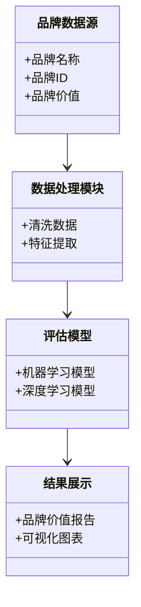

                 


# AI辅助企业品牌资产评估：多维度品牌价值量化与追踪

> 关键词：AI技术、品牌价值评估、多维度量化、品牌资产评估系统、机器学习算法、自然语言处理

> 摘要：本文探讨如何利用AI技术进行企业品牌价值的多维度量化与追踪。通过介绍品牌价值评估的核心概念、AI算法的应用、系统架构设计以及项目实战，本文旨在为企业提供一种高效、精准的品牌价值评估方法，帮助企业在数字化时代中更好地管理和提升品牌价值。

---

## 第一部分：AI辅助企业品牌资产评估概述

### 第1章：问题背景与核心概念

#### 1.1 问题背景
- **品牌价值的重要性**：品牌价值是企业核心资产之一，直接影响企业市场地位和盈利能力。
- **传统评估方法的局限性**：传统方法依赖主观判断，难以量化多维度因素。
- **AI技术的引入**：通过AI技术，可以实现对品牌价值的多维度、实时量化评估。

#### 1.2 核心概念
- **品牌价值**：品牌在市场中的综合价值，包括知名度、忠诚度、影响力等。
- **多维度评估**：从品牌情感、市场表现、用户反馈等多个维度进行评估。
- **AI辅助评估**：利用机器学习和自然语言处理等技术，提升评估的准确性和效率。

### 第2章：多维度品牌价值量化模型

#### 2.1 多维度品牌价值的构成
- **品牌知名度**：品牌在市场中的普及程度。
- **品牌忠诚度**：消费者对品牌的偏好程度。
- **品牌情感**：消费者对品牌的正面或负面情感。
- **品牌影响力**：品牌在行业中的影响力和话语权。
- **品牌经济价值**：品牌对企业的实际经济贡献。

#### 2.2 多维度量化模型的设计
- **数据来源**：社交媒体数据、市场调研数据、销售数据等。
- **数据预处理**：清洗、归一化、特征提取。
- **模型构建**：基于机器学习的回归模型或分类模型。

---

## 第二部分：品牌价值量化与追踪的算法原理

### 第3章：品牌价值量化模型的算法实现

#### 3.1 基于机器学习的量化模型
- **线性回归模型**：用于预测品牌价值的线性关系。
  - 公式：$$ y = \beta_0 + \beta_1x_1 + \beta_2x_2 + \dots + \beta_nx_n $$
  - 示例：预测品牌价值与广告投入的关系。
- **随机森林模型**：通过树投票机制提高预测准确性。
  - 代码示例：
  ```python
  from sklearn.ensemble import RandomForestRegressor
  model = RandomForestRegressor(n_estimators=100)
  model.fit(X_train, y_train)
  ```

#### 3.2 深度学习模型的应用
- **神经网络模型**：用于复杂非线性关系的建模。
  - 示例：图像识别技术用于品牌视觉识别。
- **Transformer模型**：用于自然语言处理任务，分析品牌情感。

### 第4章：品牌价值追踪的算法实现

#### 4.1 基于时间序列的追踪
- **ARIMA模型**：用于品牌价值的时间序列预测。
  - 公式：$$ y_t = c + \phi_1y_{t-1} + \theta_1e_{t-1} + e_t $$
  - 示例：预测品牌价值的变化趋势。

#### 4.2 图神经网络的应用
- **图神经网络（GNN）**：用于分析品牌之间的关联关系。
  - 示例：构建品牌网络图，分析品牌之间的竞争关系。

---

## 第三部分：系统分析与架构设计

### 第5章：系统功能设计

#### 5.1 领域模型类图


### 第6章：系统架构设计

#### 6.1 系统架构图
```mermaid
server {
    service BrandValueAssessment {
        component DataCollector
        component DataProcessor
        component Model
        component UI
    }
}
```

#### 6.2 系统接口设计
- API接口：数据接口、模型接口、结果接口。
- 示例接口：```curl -X POST http://localhost:8000/api/assess```

---

## 第四部分：项目实战

### 第7章：环境安装与核心实现

#### 7.1 环境安装
- Python 3.8+
- Scikit-learn、Keras、TensorFlow、Flask框架。

#### 7.2 核心代码实现
- 数据处理模块：
  ```python
  import pandas as pd
  def preprocess(data):
      # 数据清洗
      data = data.dropna()
      # 特征提取
      features = data[['feature1', 'feature2']]
      return features
  ```

- 评估模型实现：
  ```python
  from sklearn.ensemble import RandomForestRegressor
  def train_model(X_train, y_train):
      model = RandomForestRegressor(n_estimators=100)
      model.fit(X_train, y_train)
      return model
  ```

### 第8章：案例分析与项目小结

#### 8.1 案例分析
- 数据来源：某品牌在社交媒体上的评论数据。
- 模型训练：使用随机森林模型进行品牌情感分析。
- 结果展示：生成品牌价值报告和可视化图表。

#### 8.2 项目小结
- AI技术在品牌价值评估中的优势。
- 未来发展方向：结合实时数据和动态调整模型。

---

## 第五部分：总结与展望

### 第9章：最佳实践与注意事项

#### 9.1 最佳实践
- 数据质量：确保数据的多样性和准确性。
- 模型选择：根据具体需求选择合适的算法。
- 实时更新：定期更新模型以保持准确性。

#### 9.2 小结
- AI技术为品牌价值评估提供了新的可能性。
- 企业应结合自身特点，选择合适的评估方法。

### 第10章：注意事项与拓展阅读

#### 10.1 注意事项
- 数据隐私保护：确保数据处理符合隐私法规。
- 模型调优：通过交叉验证优化模型性能。

#### 10.2 拓展阅读
- 推荐阅读：《机器学习实战》、《深度学习入门》。
- 关注领域动态：关注AI在品牌营销中的最新应用。

---

通过以上内容，我们可以看到，利用AI技术进行企业品牌价值的多维度量化与追踪，不仅能够提升评估的效率和准确性，还能够为企业提供更精准的决策支持。未来，随着AI技术的不断发展，品牌价值评估将变得更加智能化和个性化。

