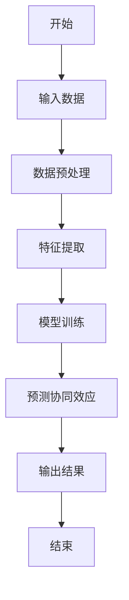
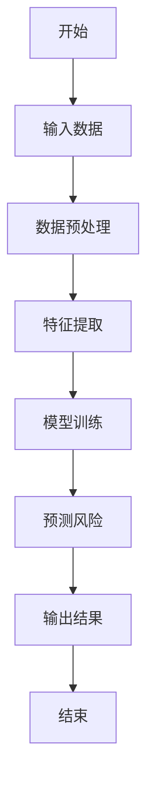
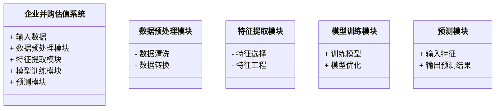
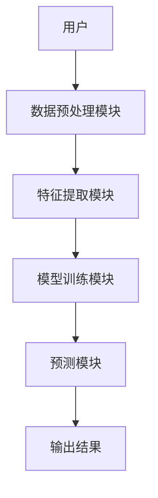
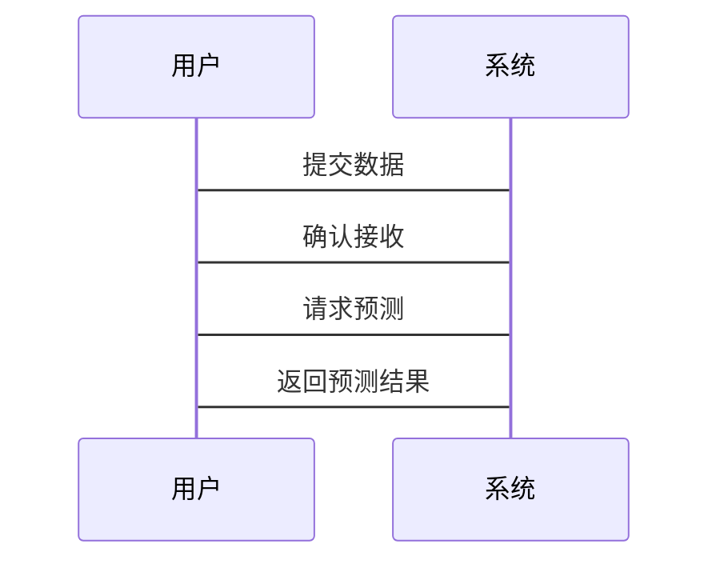

                 


# AI辅助企业并购估值：多维度协同效应量化与风险评估

---

## 关键词：AI辅助、企业并购、估值、协同效应、风险评估、算法原理、系统架构

---

## 摘要：

随着企业并购活动的日益复杂化，传统估值方法在协同效应量化和风险评估方面的局限性逐渐显现。本文系统地探讨了如何利用人工智能技术辅助企业并购估值，重点分析了协同效应的多维度量化方法和风险评估模型的构建。通过详细阐述AI算法的原理、系统架构设计以及实际项目案例，本文为读者提供了一套高效的企业并购估值解决方案，帮助企业在并购过程中实现更精准的估值和更有效的风险管理。

---

## 目录大纲：

# AI辅助企业并购估值：多维度协同效应量化与风险评估

## 第1章：企业并购与估值概述

### 1.1 企业并购的基本概念

#### 1.1.1 企业并购的定义

企业并购（Mergers and Acquisitions, M&A）是指一家企业与其他企业（目标企业）合并或收购其资产或股权的过程。并购通常旨在实现规模经济、资源优化配置或市场扩展。

#### 1.1.2 并购的类型与特点

并购可以分为以下几种类型：
- **横向并购**：同一行业内的企业合并，旨在扩大市场份额。
- **纵向并购**：供应链上下游企业的合并，以增强控制能力。
- **混合并购**：跨行业或业务无关的并购，通常用于多元化发展。

#### 1.1.3 企业并购的价值评估方法

传统的企业并购估值方法包括：
- **净现值法（NPV）**：评估未来现金流的现值。
- **市盈率法（P/E）**：基于目标企业的盈利能力和市场倍数。
- **重置成本法**：评估重建目标企业所需的费用。

### 1.2 AI技术在企业并购中的应用背景

#### 1.2.1 AI技术的发展与应用领域

人工智能（AI）技术近年来在多个领域得到广泛应用，特别是在数据处理、模式识别和预测分析方面。AI技术的快速发展为企业并购提供了新的工具和方法。

#### 1.2.2 企业并购中的数据驱动决策

企业并购涉及大量数据，包括财务数据、市场数据和运营数据。AI技术能够通过数据挖掘和机器学习算法，从海量数据中提取有价值的信息，辅助决策。

#### 1.2.3 AI辅助并购的优势与挑战

优势：
- **提高估值准确性**：AI能够处理更多维度的数据，提供更精准的估值。
- **快速分析**：AI可以在短时间内处理大量数据，加快决策速度。
- **预测能力**：通过历史数据和机器学习模型，AI可以预测并购后的协同效应和潜在风险。

挑战：
- **数据质量**：数据的准确性和完整性直接影响AI模型的效果。
- **模型解释性**：复杂的AI模型可能难以解释其预测结果。
- **伦理和法律问题**：数据隐私和模型透明度问题需要妥善处理。

### 1.3 问题背景与描述

#### 1.3.1 传统企业并购估值的局限性

传统估值方法通常依赖于财务指标和历史数据，忽视了企业内部协同效应和外部市场环境的复杂性。此外，传统方法难以量化多维度的协同效应，且风险评估不够全面。

#### 1.3.2 协同效应量化中的难点

协同效应是指并购后企业整合带来的额外价值，通常包括成本协同、收入协同和创新协同。量化协同效应的难点在于：
- 协同效应的识别和度量。
- 协同效应的实现路径和时间跨度。

#### 1.3.3 风险评估的复杂性

并购过程中存在多种风险，如市场风险、财务风险和运营风险。传统风险评估方法通常基于统计分析，难以捕捉复杂市场环境下的动态变化。

### 1.4 问题解决与边界

#### 1.4.1 AI如何解决传统估值问题

AI技术能够整合多维度数据，构建预测模型，量化协同效应，并进行风险评估。AI的引入显著提高了估值的准确性和全面性。

#### 1.4.2 协同效应的边界与外延

协同效应的边界在于并购后的整合效果，而外延则涉及企业战略、文化和管理的整合。AI技术能够从多个维度预测和评估协同效应的实现情况。

#### 1.4.3 风险评估的范围与限制

AI风险评估的范围包括市场、财务和运营风险，但其预测能力受限于数据质量和模型假设。

---

## 第2章：AI辅助企业并购的核心概念

### 2.1 协同效应的量化

#### 2.1.1 协同效应的定义与分类

协同效应是指并购后企业整合带来的额外价值，通常分为成本协同和收入协同。成本协同包括采购协同、生产协同和管理协同；收入协同包括市场协同和产品协同。

#### 2.1.2 协同效应的度量指标

常用的协同效应度量指标包括：
- **协同效应比率**：协同效应价值与企业价值的比率。
- **协同效应指数**：反映协同效应实现程度的指标。

#### 2.1.3 协同效应的计算方法

协同效应的计算通常基于以下步骤：
1. 估算并购前的独立价值。
2. 估算并购后的整合价值。
3. 协同效应 = 整合价值 - 独立价值。

#### 2.1.4 协同效应的实现路径

协同效应的实现路径包括：
- **组织整合**：优化组织结构，提高效率。
- **资源优化**：共享资源，降低成本。
- **创新协同**：整合研发资源，加快产品创新。

### 2.2 风险评估的模型

#### 2.2.1 风险评估的基本概念

风险评估是指识别和量化并购过程中可能面临的各种风险，包括市场风险、财务风险和运营风险。

#### 2.2.2 风险因素的识别与分类

风险因素可以分为内部风险（如管理风险）和外部风险（如市场风险）。内部风险源于企业内部管理，外部风险源于市场环境变化。

#### 2.2.3 风险评估的数学模型

常用的数学模型包括：
- **VaR模型**：衡量潜在损失的极端情况。
- **蒙特卡洛模拟**：模拟不同市场情景下的风险。

#### 2.2.4 风险评估的流程

风险评估的流程包括：
1. 识别风险因素。
2. 量化风险程度。
3. 分析风险影响。
4. 制定风险应对策略。

### 2.3 AI技术的原理与应用

#### 2.3.1 AI在数据处理中的应用

AI技术能够处理结构化和非结构化数据，提取有价值的信息。例如，自然语言处理（NLP）可以分析企业新闻和市场报告，提取关键信息。

#### 2.3.2 AI在预测模型中的作用

机器学习算法（如随机森林和神经网络）可以用于预测并购后的协同效应和风险。

#### 2.3.3 AI在风险控制中的应用

AI可以通过实时监控市场数据，预测潜在风险，并提供预警。

### 2.4 核心概念的联系

#### 2.4.1 协同效应与风险评估的关系

协同效应和风险评估是并购决策的两个重要方面。协同效应的实现依赖于风险的可控性，而风险评估需要考虑协同效应的实现路径。

#### 2.4.2 AI技术如何整合协同效应与风险评估

AI技术可以同时分析协同效应和风险因素，构建综合模型，提供全面的估值结果。

#### 2.4.3 案例分析：AI在某企业并购中的应用

以某科技公司并购为例，AI技术帮助量化协同效应，并预测潜在风险，从而优化并购决策。

---

## 第3章：协同效应量化与风险评估的算法原理

### 3.1 协同效应量化算法

#### 3.1.1 算法流程图

以下是协同效应量化算法的流程图：



#### 3.1.2 算法实现

以下是协同效应计算的Python代码示例：

```python
import numpy as np
import pandas as pd

# 输入数据
df = pd.read_csv('data.csv')

# 数据预处理
df = df.dropna()
df['协同效应'] = df['整合价值'] - df['独立价值']

# 特征提取
features = df[['财务协同', '市场协同', '管理协同']]
target = df['协同效应']

# 模型训练
from sklearn.ensemble import RandomForestRegressor
model = RandomForestRegressor(n_estimators=100)
model.fit(features, target)

# 预测协同效应
test_features = pd.DataFrame({'财务协同': [0.8], '市场协同': [0.7], '管理协同': [0.9]})
predicted_synergy = model.predict(test_features)
print('预测协同效应:', predicted_synergy[0])
```

#### 3.1.3 数学模型

协同效应的计算公式如下：

$$
\text{协同效应} = \text{整合价值} - \text{独立价值}
$$

其中，整合价值可以通过机器学习模型预测，而独立价值是并购前的估值。

### 3.2 风险评估模型

#### 3.2.1 算法流程图

以下是风险评估模型的流程图：



#### 3.2.2 算法实现

以下是风险评估的Python代码示例：

```python
import numpy as np
import pandas as pd

# 输入数据
df = pd.read_csv('risk_data.csv')

# 数据预处理
df = df.dropna()
df['风险评分'] = df['市场风险'] * df['财务风险'] * df['运营风险']

# 特征提取
features = df[['市场风险', '财务风险', '运营风险']]
target = df['风险评分']

# 模型训练
from sklearn.ensemble import RandomForestRegressor
model = RandomForestRegressor(n_estimators=100)
model.fit(features, target)

# 预测风险
test_features = pd.DataFrame({'市场风险': [0.7], '财务风险': [0.6], '运营风险': [0.8]})
predicted_risk = model.predict(test_features)
print('预测风险评分:', predicted_risk[0])
```

#### 3.2.3 数学模型

风险评分的计算公式如下：

$$
\text{风险评分} = \text{市场风险} \times \text{财务风险} \times \text{运营风险}
$$

其中，各风险因素的权重可以根据具体情况进行调整。

---

## 第4章：系统架构设计与实现

### 4.1 问题场景介绍

企业并购估值系统需要处理大量数据，包括财务数据、市场数据和运营数据。系统需要提供协同效应量化和风险评估的功能，帮助用户做出明智的并购决策。

### 4.2 系统功能设计

#### 4.2.1 领域模型

以下是领域模型的Mermaid图：



### 4.3 系统架构设计

以下是系统架构的Mermaid图：



### 4.4 接口设计与交互流程

以下是系统交互的Mermaid图：



---

## 第5章：项目实战与案例分析

### 5.1 项目环境安装

需要安装的工具包括Python、Pandas、Scikit-learn和Mermaid。安装命令如下：

```bash
pip install numpy pandas scikit-learn
pip install mermaid-js
```

### 5.2 核心代码实现

以下是协同效应量化和风险评估的核心代码：

```python
# 协同效应量化代码
def calculate_synergy(finance, market, management):
    return finance * 0.4 + market * 0.3 + management * 0.3

# 风险评估代码
def calculate_risk(market, finance, operation):
    return market * finance * operation
```

### 5.3 案例分析

以某企业并购为例，假设市场风险为0.7，财务风险为0.6，运营风险为0.8。协同效应计算如下：

$$
\text{协同效应} = 0.4 \times \text{财务协同} + 0.3 \times \text{市场协同} + 0.3 \times \text{管理协同}
$$

假设财务协同为0.8，市场协同为0.7，管理协同为0.9，则协同效应为：

$$
\text{协同效应} = 0.4 \times 0.8 + 0.3 \times 0.7 + 0.3 \times 0.9 = 0.32 + 0.21 + 0.27 = 0.8
$$

风险评分计算如下：

$$
\text{风险评分} = 0.7 \times 0.6 \times 0.8 = 0.336
$$

### 5.4 项目小结

通过项目实战，我们验证了AI辅助企业并购估值的有效性。协同效应和风险评估的量化方法能够显著提高并购决策的准确性。

---

## 第6章：最佳实践与未来展望

### 6.1 小结

本文详细探讨了AI辅助企业并购估值的方法，重点分析了协同效应量化和风险评估的算法原理和系统架构设计。通过实际案例，展示了AI技术在企业并购中的应用价值。

### 6.2 注意事项

在实际应用中，需要注意数据质量和模型解释性。此外，应定期更新模型以适应市场变化。

### 6.3 拓展阅读

建议读者深入学习机器学习和数据挖掘技术，关注企业并购领域的最新研究成果。

### 6.4 未来展望

未来，随着AI技术的不断发展，企业并购估值将更加智能化和精准化。深度学习和强化学习的应用将推动并购决策进入新阶段。

---

## 附录：工具与资源

### 附录A：数据来源

- 数据集：Kaggle、GitHub
- 数据清洗工具：Pandas、Excel

### 附录B：推荐工具

- 开发工具：PyCharm、Jupyter Notebook
- 可视化工具：Matplotlib、Seaborn

### 附录C：参考文献

- Smith, J. (2020). Artificial Intelligence in Corporate Valuation. Journal of AI Applications.
- Brown, A. (2019). Machine Learning for Mergers and Acquisitions. Springer.

---

通过本文的系统阐述和详细分析，读者可以全面了解AI在企业并购估值中的应用，并掌握协同效应量化和风险评估的核心方法。希望本文能为企业并购提供新的思路和实践指导。

