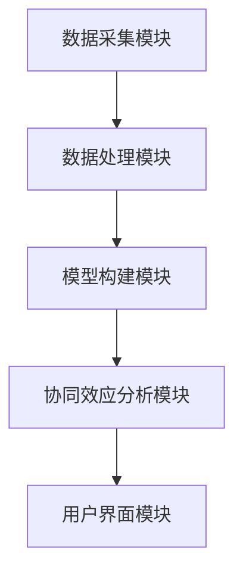

                 


# AI辅助企业并购决策：财务模型与协同效应分析

> 关键词：AI，企业并购，财务模型，协同效应，机器学习，自然语言处理

> 摘要：本文探讨了人工智能在企业并购中的应用，重点分析了财务模型和协同效应的识别与量化。通过机器学习和NLP技术，AI能够高效地处理大量数据，识别潜在的协同机会，评估并购风险，从而优化企业并购决策。本文结合实际案例，详细讲解了AI辅助并购的算法原理、系统架构和项目实现，为读者提供了全面的指导。

---

## 第1章：企业并购与AI辅助决策概述

### 1.1 企业并购的背景与重要性

企业并购是企业战略发展的重要手段，通过整合资源、扩展市场和提升竞争力，许多企业在并购中实现增长。然而，并购涉及复杂的财务、法律和战略决策，传统方法依赖于人工分析，效率低下且容易出错。AI的引入为企业并购带来了新的可能性，通过数据驱动的决策提高准确性和效率。

### 1.2 AI辅助决策的核心概念

AI能够处理大量数据，识别模式和趋势，辅助分析师做出更明智的决策。在企业并购中，AI的应用包括预测分析、协同效应识别和风险评估。协同效应是并购成功的关键，AI通过机器学习和NLP技术，能够准确识别和量化这些效应，帮助企业在并购中创造更大的价值。

---

## 第2章：AI辅助并购的核心概念与联系

### 2.1 财务模型与协同效应分析

财务模型是评估企业价值的基础工具，AI可以增强模型的预测能力。协同效应的识别涉及多个因素，如成本节约和收入增长，AI通过分析历史数据和市场趋势，预测协同效应的实现情况。

### 2.2 AI与协同效应的关系

AI能够从大量数据中识别潜在的协同机会，通过机器学习模型量化协同效应，帮助企业在并购中制定更有效的整合策略。

---

## 第3章：算法原理讲解

### 3.1 协同效应识别的算法原理

机器学习算法，如随机森林和神经网络，用于识别协同效应。通过训练模型，AI能够预测协同效应的可能性和规模。例如，使用随机森林分类器，输入财务数据和市场表现，输出协同效应的分类结果。

#### 3.1.1 随机森林算法

随机森林是一种基于决策树的集成学习方法，通过构建多个决策树并取其投票结果，提高预测的准确性。以下是随机森林的实现代码示例：

```python
from sklearn.ensemble import RandomForestClassifier
from sklearn.model_selection import train_test_split
import pandas as pd

# 加载数据
data = pd.read_csv('并购数据.csv')

# 特征和目标变量
X = data.drop('协同效应', axis=1)
y = data['协同效应']

# 划分训练集和测试集
X_train, X_test, y_train, y_test = train_test_split(X, y, test_size=0.2, random_state=42)

# 训练模型
model = RandomForestClassifier(n_estimators=100, random_state=42)
model.fit(X_train, y_train)

# 预测
y_pred = model.predict(X_test)

# 输出结果
print("准确率:", model.score(X_test, y_test))
```

### 3.2 协同效应的数学模型

协同效应的量化可以通过回归分析模型实现。以下是一个简单的线性回归模型：

$$ \text{协同效应} = \beta_0 + \beta_1 \times \text{成本节约} + \beta_2 \times \text{收入增长} + \epsilon $$

其中，$\beta_0$、$\beta_1$、$\beta_2$是回归系数，$\epsilon$是误差项。

---

## 第4章：系统分析与架构设计

### 4.1 系统应用场景

AI辅助并购系统可以应用于并购前的评估、并购后的整合和实时监控。例如，在并购前，系统可以分析目标公司的财务数据和市场表现，预测并购后的协同效应。

### 4.2 系统功能设计

系统功能模块包括数据采集、模型构建和协同效应分析。数据采集模块从多个来源获取数据，模型构建模块训练机器学习模型，协同效应分析模块评估潜在的协同效应。

### 4.3 系统架构设计

系统架构采用微服务架构，各模块独立且易于扩展。以下是系统架构的mermaid图：



---

## 第5章：项目实战

### 5.1 环境安装与配置

安装Python和必要的库，如Scikit-learn和Pandas。以下是安装命令：

```bash
pip install python sklearn pandas numpy
```

### 5.2 系统核心实现

以下是协同效应识别系统的Python代码示例：

```python
import pandas as pd
from sklearn.ensemble import RandomForestClassifier
from sklearn.model_selection import train_test_split

# 加载数据
data = pd.read_csv('并购数据.csv')

# 特征和目标变量
X = data.drop('协同效应', axis=1)
y = data['协同效应']

# 划分训练集和测试集
X_train, X_test, y_train, y_test = train_test_split(X, y, test_size=0.2, random_state=42)

# 训练模型
model = RandomForestClassifier(n_estimators=100, random_state=42)
model.fit(X_train, y_train)

# 预测
y_pred = model.predict(X_test)

# 输出结果
print("准确率:", model.score(X_test, y_test))
```

### 5.3 案例分析与解读

以一个具体案例为例，分析AI如何识别协同效应。例如，分析两家公司的财务数据，预测并购后的协同效应，并提出整合建议。

---

## 第6章：AI辅助并购的实践总结

### 6.1 最佳实践与注意事项

数据质量、模型选择和系统维护是AI辅助并购的关键。确保数据准确，选择合适的模型，并定期更新系统以保持其有效性。

### 6.2 项目小结与未来展望

AI在企业并购中的应用前景广阔，未来可以通过引入更复杂的模型和多模态数据，进一步提升决策的准确性和效率。

---

通过本文的详细讲解，读者可以了解AI在企业并购中的应用，掌握相关的算法原理和系统设计方法，并能够通过实际案例应用这些知识，优化企业并购决策。

