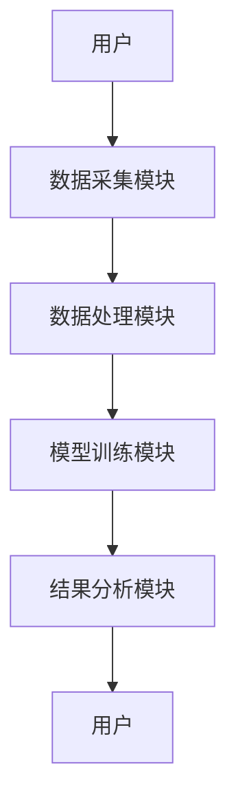

                 


```markdown
# AI辅助企业并购协同效应分析与实现

> 关键词：企业并购、协同效应、人工智能、数据挖掘、机器学习、算法实现、系统设计

> 摘要：企业并购是企业战略发展中的重要决策，而协同效应是决定并购成功与否的关键因素。本文系统地介绍了如何利用人工智能技术辅助企业并购中的协同效应分析与实现，从数据采集与预处理、算法选择与模型构建，到系统架构设计与项目实战，详细阐述了AI在企业并购中的应用，为读者提供了一套完整的解决方案。

---

# 第一部分：企业并购与协同效应概述

## 第1章：企业并购的基本概念

### 1.1 企业并购的定义与类型
#### 1.1.1 企业并购的定义
企业并购（Mergers and Acquisitions, M&A）是指两个或多个企业之间合并或收购资产或业务的行为，通常旨在实现资源优化配置、扩大市场份额或提升竞争力。

#### 1.1.2 企业并购的类型
- **横向并购**：同一行业内的企业并购。
- **纵向并购**：产业链上下游的企业并购。
- **混合并购**：与企业主营业务无直接关联的并购。

### 1.2 协同效应的定义与重要性
#### 1.2.1 协同效应的定义
协同效应是指企业并购后，通过整合资源、优化流程、共享技术和市场等方式，实现成本降低、收入增加或效率提升的效果。

#### 1.2.2 协同效应的重要性
- 提高企业整体价值。
- 降低并购后的整合风险。
- 增强企业核心竞争力。

#### 1.2.3 协同效应的分类
- **财务协同效应**：通过规模效应降低成本、提高收益。
- **战略协同效应**：通过并购实现战略目标的优化。
- **运营协同效应**：通过资源共享提高运营效率。

### 1.3 AI技术在企业并购中的应用背景
#### 1.3.1 AI技术的发展对企业并购的影响
- 数据挖掘技术帮助企业发现潜在协同机会。
- 机器学习算法用于预测并购后的协同效应。

#### 1.3.2 AI辅助企业并购的优势
- 提高并购决策的科学性和准确性。
- 优化并购后的整合过程，降低风险。

#### 1.3.3 当前AI在企业并购中的应用现状
- 数据分析工具广泛应用于并购前的尽职调查。
- 机器学习模型用于预测并购后的协同效应。

---

## 第2章：协同效应分析的核心概念

### 2.1 协同效应的分析维度
#### 2.1.1 财务协同效应
- 成本协同效应：通过整合供应链、共享资源降低成本。
- 收益协同效应：通过扩大市场份额、提高产品线多样性增加收入。

#### 2.1.2 战略协同效应
- 战略一致性：并购后企业战略目标的一致性。
- 资源互补性：双方资源的互补性。

#### 2.1.3 运营协同效应
- 生产协同：整合生产流程，提高效率。
- 供应链协同：优化供应链管理，降低采购成本。

### 2.2 协同效应分析的关键要素
#### 2.2.1 数据来源与特征
- 数据来源：企业财务数据、市场数据、行业数据。
- 数据特征：相关性、完整性、实时性。

#### 2.2.2 分析模型与方法
- 数据挖掘：用于发现数据中的潜在模式。
- 机器学习：用于预测协同效应。

#### 2.2.3 结果评估与优化
- 评估指标：协同效应的量化指标。
- 优化方法：通过反馈机制优化模型。

---

## 第3章：AI辅助协同效应分析的实现框架

### 3.1 数据采集与预处理
#### 3.1.1 数据来源渠道
- 企业内部数据：财务报表、销售数据、生产数据。
- 外部数据：行业数据、市场数据、竞争对手数据。

#### 3.1.2 数据清洗与标准化
- 数据清洗：处理缺失值、重复值、异常值。
- 数据标准化：统一数据格式，便于模型输入。

#### 3.1.3 数据特征提取
- 关键特征识别：提取与协同效应相关的特征。
- 特征工程：通过特征组合、降维等方式优化特征。

### 3.2 AI算法选择与模型构建
#### 3.2.1 常用算法概述
- 线性回归：用于预测协同效应的线性关系。
- 支持向量机（SVM）：用于分类问题。
- 神经网络：用于复杂非线性关系的预测。

#### 3.2.2 神经网络模型构建
- 模型结构设计：输入层、隐藏层、输出层。
- 模型训练：使用训练数据调整权重。
- 模型优化：使用交叉验证、正则化等方法优化模型。

#### 3.2.3 模型训练与优化
- 训练数据集划分：训练集、验证集、测试集。
- 模型调优：调整学习率、批次大小、网络层数等参数。

### 3.3 结果分析与可视化
#### 3.3.1 分析结果的解读
- 预测结果与实际结果的对比。
- 协同效应的量化评估。

#### 3.3.2 可视化工具与方法
- 数据可视化：使用图表展示协同效应分析结果。
- 可视化工具：Matplotlib、Seaborn、Tableau。

#### 3.3.3 结果的业务价值实现
- 通过协同效应分析优化企业并购决策。
- 提高并购后的整合效率。

---

## 第4章：协同效应预测模型的实现

### 4.1 数据预处理与特征工程
#### 4.1.1 数据清洗流程
- 去除缺失值：使用填充、删除等方式处理缺失数据。
- 处理异常值：通过统计方法识别异常值并进行处理。

#### 4.1.2 特征选择方法
- 基于相关性分析：计算特征与目标变量的相关性。
- 基于模型的特征选择：使用Lasso回归等方法选择特征。

#### 4.1.3 特征工程案例
- 使用PCA进行降维：减少特征数量，降低计算复杂度。
- 使用特征组合：将多个特征组合成新的特征。

### 4.2 神经网络模型构建
#### 4.2.1 模型结构设计
- 输入层：输入特征数量。
- 隐藏层：神经网络的层数和每层神经元数量。
- 输出层：输出协同效应的预测值。

#### 4.2.2 模型训练过程
- 定义损失函数：使用均方误差（MSE）。
- 定义优化器：使用Adam优化器。
- 训练过程：反向传播计算梯度，更新权重。

#### 4.2.3 模型调优与优化
- 学习率调整：通过网格搜索找到最佳学习率。
- 正则化：使用L2正则化防止过拟合。
- 模型结构优化：尝试不同的网络结构，找到最佳模型。

### 4.3 模型评估与验证
#### 4.3.1 评估指标
- �均方误差（MSE）：衡量预测值与真实值的差距。
- R²系数：衡量模型解释变量的能力。
- 准确率：分类模型的准确率。

#### 4.3.2 模型验证
- 使用验证集评估模型性能。
- 检查过拟合：通过验证集的性能判断模型是否过拟合。

#### 4.3.3 模型优化
- 超参数调优：使用网格搜索或随机搜索优化模型。
- 模型集成：使用集成学习方法提高模型性能。

---

## 第5章：协同效应分析的系统设计

### 5.1 系统功能设计
#### 5.1.1 功能模块划分
- 数据采集模块：采集企业并购相关数据。
- 数据处理模块：清洗、转换和预处理数据。
- 模型训练模块：构建和训练协同效应预测模型。
- 结果分析模块：展示和解读分析结果。

#### 5.1.2 功能模块的交互流程
- 用户输入企业并购数据。
- 系统进行数据处理。
- 系统训练模型并预测协同效应。
- 用户查看预测结果并进行分析。

### 5.2 系统架构设计
#### 5.2.1 系统架构图


#### 5.2.2 系统接口设计
- 数据接口：提供数据输入和输出接口。
- 模型接口：提供模型训练和预测接口。
- 结果接口：提供结果展示和查询接口。

### 5.3 系统交互流程
#### 5.3.1 用户操作流程
- 用户输入企业并购数据。
- 系统进行数据处理。
- 系统训练模型并预测协同效应。
- 用户查看预测结果并进行分析。

#### 5.3.2 系统内部交互流程
- 数据采集模块采集数据并传递给数据处理模块。
- 数据处理模块处理数据并传递给模型训练模块。
- 模型训练模块训练模型并传递结果给结果分析模块。
- 结果分析模块展示结果并反馈给用户。

---

## 第6章：项目实战与优化

### 6.1 项目环境搭建
#### 6.1.1 环境需求
- Python 3.6+
- PyTorch 1.9+
- NumPy 1.20+
- Matplotlib 3.5+
- Pandas 1.4+

#### 6.1.2 安装依赖
```bash
pip install torch numpy matplotlib pandas scikit-learn
```

### 6.2 系统核心实现
#### 6.2.1 数据处理代码
```python
import pandas as pd
import numpy as np

# 数据加载
data = pd.read_csv('并购数据.csv')

# 数据清洗
data = data.dropna()  # 删除缺失值
data = data.drop_duplicates()  # 删除重复值

# 特征提取
X = data[['收入', '成本', '利润', '市场份额']]
y = data['协同效应']

# 数据标准化
from sklearn.preprocessing import StandardScaler
scaler = StandardScaler()
X_scaled = scaler.fit_transform(X)
```

#### 6.2.2 模型训练代码
```python
import torch
import torch.nn as nn
import torch.optim as optim

# 模型定义
class CoopEffectPredictor(nn.Module):
    def __init__(self, input_dim, hidden_dim, output_dim):
        super(CoopEffectPredictor, self).__init__()
        self.fc1 = nn.Linear(input_dim, hidden_dim)
        self.fc2 = nn.Linear(hidden_dim, output_dim)
    
    def forward(self, x):
        x = torch.relu(self.fc1(x))
        x = self.fc2(x)
        return x

# 模型训练
model = CoopEffectPredictor(input_dim=4, hidden_dim=10, output_dim=1)
criterion = nn.MSELoss()
optimizer = optim.Adam(model.parameters(), lr=0.01)

# 训练过程
for epoch in range(100):
    outputs = model(X_scaled)
    loss = criterion(outputs, y)
    optimizer.zero_grad()
    loss.backward()
    optimizer.step()
```

#### 6.2.3 模型评估代码
```python
# 预测结果
with torch.no_grad():
    outputs = model(X_scaled)
    predicted = outputs.data.numpy()

# 评估指标
from sklearn.metrics import r2_score
print('R²系数:', r2_score(y, predicted))
```

### 6.3 实际案例分析
#### 6.3.1 案例背景
- 企业A和企业B计划进行并购。
- 数据包括收入、成本、利润、市场份额等。

#### 6.3.2 案例分析
- 使用上述模型预测并购后的协同效应。
- 分析预测结果，制定并购策略。

### 6.4 项目小结
- 通过项目实战，验证了AI技术在企业并购中的应用价值。
- 模型预测结果为企业并购决策提供了科学依据。

---

## 第7章：总结与展望

### 7.1 总结
- 本文系统地介绍了AI技术在企业并购协同效应分析中的应用。
- 通过数据处理、模型训练和结果分析，验证了AI技术的有效性。

### 7.2 展望
- 未来可以进一步优化模型，提高预测精度。
- 探索更多AI技术在企业并购中的应用，如风险评估、整合优化等。

---

通过本文的系统介绍，读者可以全面了解AI辅助企业并购协同效应分析与实现的理论和实践，为企业并购提供科学依据和实践指导。
```

