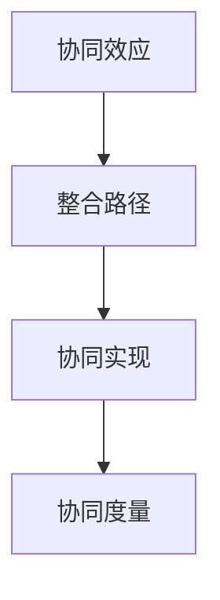
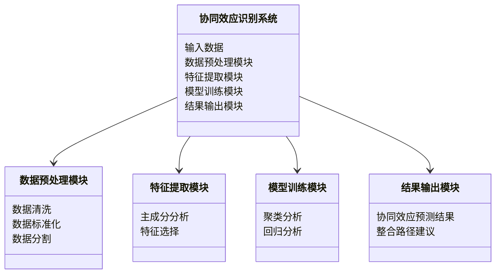
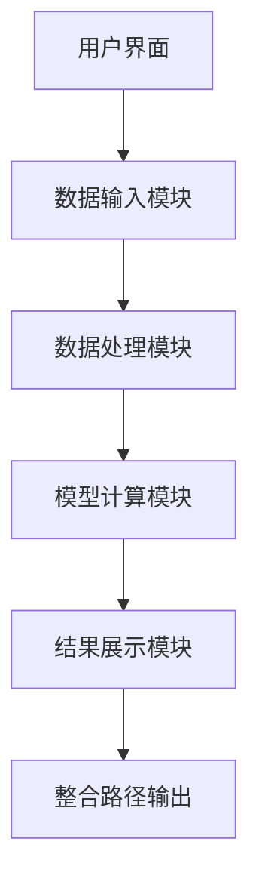
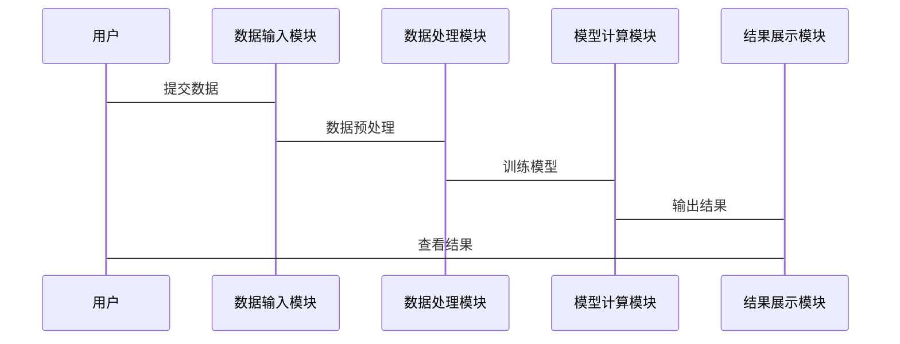

                 


# AI辅助企业并购协同效应实现：整合路径规划与执行

---

## 关键词：  
企业并购，协同效应，AI辅助，整合路径，数学建模

---

## 摘要：  
企业并购是企业战略发展的重要手段之一，而协同效应的实现是并购成功的关键。然而，协同效应的识别、评估与实现路径规划是一个复杂且具有挑战性的过程。本文将探讨如何通过人工智能技术辅助企业并购中的协同效应实现，提出基于AI的整合路径规划与执行方案。文章首先介绍企业并购与协同效应的基本概念，分析AI技术在协同效应实现中的作用；然后从算法原理、系统架构、项目实战等多维度展开，详细阐述协同效应的识别、评估与实现路径规划的实现过程；最后总结AI在企业并购中的应用价值及未来研究方向。

---

## 目录大纲

### 第一章：企业并购与协同效应概述

1.1 企业并购的基本概念  
1.1.1 企业并购的定义与类型  
1.1.2 协同效应的定义与分类  
1.1.3 协同效应在企业并购中的重要性  

1.2 AI技术在企业并购中的应用现状  
1.2.1 AI技术在企业价值评估中的作用  
1.2.2 AI技术在并购整合中的应用  
1.2.3 协同效应实现的AI辅助路径  

1.3 本书研究的核心问题  
1.3.1 问题背景与问题描述  
1.3.2 问题解决的思路与方法  
1.3.3 问题的边界与外延  

1.4 本章小结  

---

### 第二章：协同效应的核心概念与联系

2.1 协同效应的核心要素  
2.1.1 协同效应的构成要素  
2.1.2 协同效应的实现路径  
2.1.3 协同效应的度量指标  

2.2 协同效应与整合路径的关系  
2.2.1 协同效应的驱动因素  
2.2.2 整合路径对协同效应的影响  
2.2.3 协同效应的实现边界  

2.3 协同效应的ER实体关系图  


2.4 本章小结  

---

### 第三章：协同效应的算法原理与数学模型

3.1 协同效应评估的算法选择  
3.1.1 聚类分析在协同效应识别中的应用  
3.1.2 回归分析在协同效应预测中的应用  
3.1.3 算法选择的依据与优缺点  

3.2 协同效应评估的算法流程  
3.2.1 数据预处理与特征提取  
3.2.2 算法模型的训练与优化  
3.2.3 模型的验证与评估  

3.3 协同效应评估的数学模型  
3.3.1 聚类分析的数学公式  
$$
\text{距离度量} = \sqrt{\sum_{i=1}^{n}(x_i - y_i)^2}
$$  
3.3.2 协同效应预测的线性回归模型  
$$
y = \beta_0 + \beta_1x_1 + \beta_2x_2 + \ldots + \beta_kx_k + \epsilon
$$  

3.4 本章小结  

---

### 第四章：协同效应实现的系统架构与设计

4.1 系统功能设计  
4.1.1 领域模型设计（类图）  


4.2 系统架构设计  
4.2.1 系统整体架构图  


4.3 系统接口设计  
4.3.1 数据接口设计  
4.3.2 模型接口设计  

4.4 系统交互流程设计  
4.4.1 交互序列图  


4.5 本章小结  

---

### 第五章：协同效应实现的项目实战

5.1 环境安装与配置  
5.1.1 Python环境安装  
5.1.2 依赖库安装（如scikit-learn、pandas等）  

5.2 系统核心实现源代码  
5.2.1 数据预处理代码  
```python
import pandas as pd
from sklearn.preprocessing import StandardScaler

# 数据加载
data = pd.read_csv('merger_data.csv')

# 数据清洗
data.dropna(inplace=True)

# 数据标准化
scaler = StandardScaler()
scaled_data = scaler.fit_transform(data)
```

5.2.2 聚类分析代码  
```python
from sklearn.cluster import KMeans

# 模型训练
kmeans = KMeans(n_clusters=3, random_state=42)
kmeans.fit(scaled_data)

# 获取聚类结果
clusters = kmeans.predict(scaled_data)
print(clusters)
```

5.2.3 回归分析代码  
```python
from sklearn.linear_model import LinearRegression

# 模型训练
lr = LinearRegression()
lr.fit(X_train, y_train)

# 预测协同效应
y_pred = lr.predict(X_test)
print(y_pred)
```

5.3 实际案例分析与解读  
5.3.1 案例背景介绍  
5.3.2 数据分析与处理  
5.3.3 模型训练与结果解读  

5.4 项目总结与优化建议  
5.4.1 项目成果总结  
5.4.2 系统优化方向  

5.5 本章小结  

---

### 第六章：协同效应实现的最佳实践与小结

6.1 最佳实践 tips  
6.1.1 数据质量管理建议  
6.1.2 模型调优技巧  
6.1.3 系统部署与维护建议  

6.2 本书内容总结  
6.2.1 核心知识点回顾  
6.2.2 实践中的关键点总结  

6.3 注意事项与未来研究方向  
6.3.1 数据隐私与安全问题  
6.3.2 AI技术在协同效应实现中的未来研究方向  

6.4 拓展阅读推荐  
6.4.1 推荐书籍  
6.4.2 推荐技术博客与资源  

6.5 本章小结  

---

## 附录：完整的Python代码实现

---

## 参考文献  

---

通过以上目录结构，我们可以系统地探讨AI技术在企业并购协同效应实现中的应用，从理论到实践，从算法到系统设计，为读者提供一个全面且深入的技术视角。

