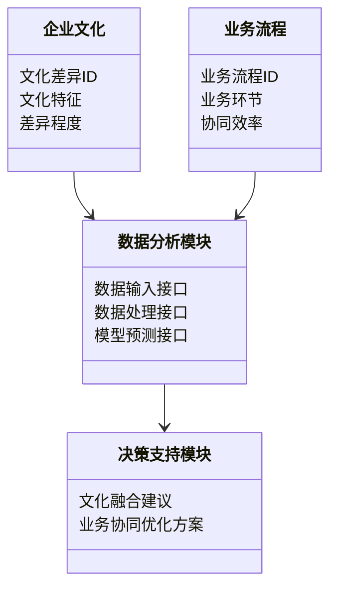
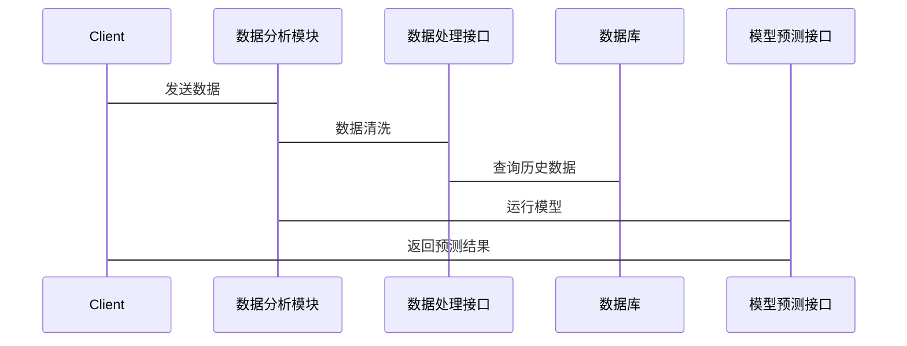

                 


# AI辅助企业并购后整合：文化融合与业务协同的量化评估

## 关键词：
- 企业并购
- AI辅助整合
- 文化融合
- 业务协同
- 量化评估
- 数据驱动决策
- 系统架构设计

## 摘要：
随着企业并购活动的日益频繁，文化融合与业务协同成为整合过程中的关键挑战。本文探讨如何利用人工智能技术，通过量化评估模型和系统架构设计，优化企业并购后的整合过程。文章从背景介绍、核心概念、算法原理、系统设计、项目实战到最佳实践，全面分析AI在企业并购整合中的应用，为企业提供数据驱动的决策支持，提升整合效率和成功率。

---

## 第1章: 企业并购与整合的背景

### 1.1 企业并购的背景与趋势

#### 1.1.1 企业并购的定义与特点
企业并购（Mergers and Acquisitions, M&A）是指一家企业与其他企业合并或收购其资产或股份的行为。并购整合的关键在于如何将两家企业的战略、文化、业务和资源有效地结合，以实现协同效应和价值最大化。

#### 1.1.2 并购整合的必要性与挑战
企业并购的目的是通过整合资源、优化流程和提升效率来增强竞争力。然而，整合过程中常常面临文化冲突、业务协同困难、数据孤岛等问题，这些问题可能导致整合失败或效率低下。

#### 1.1.3 数字化时代并购整合的新特点
在数字化时代，数据成为企业的重要资产。企业并购后的整合需要充分利用数据驱动的方法，通过AI技术分析和预测，优化文化融合和业务协同的过程。

### 1.2 AI技术在企业整合中的作用

#### 1.2.1 AI技术的快速发展与应用领域
人工智能技术的快速发展为企业整合提供了新的工具和方法。AI在自然语言处理、机器学习、数据分析等领域的发展，使得企业能够更高效地处理复杂的数据和信息。

#### 1.2.2 AI在企业并购整合中的潜在价值
AI可以帮助企业在整合过程中识别文化差异、优化业务流程、预测协同效应，并提供实时数据分析支持。通过AI技术，企业可以实现数据驱动的决策，提高整合效率和成功率。

#### 1.2.3 企业并购整合中的数据驱动决策
数据驱动的决策是AI辅助整合的核心。通过分析企业的历史数据、市场趋势和竞争对手信息，AI可以帮助企业在整合过程中制定更科学的决策。

---

## 第2章: 文化融合与业务协同的挑战

### 2.1 企业并购中的文化冲突

#### 2.1.1 文化差异的定义与表现
文化差异是指企业在价值观、管理风格、员工习惯等方面存在的差异。这些差异可能导致整合过程中的冲突和不协调。

#### 2.1.2 并购后文化冲突的典型案例
许多企业在并购后因文化冲突导致整合失败。例如，一家技术驱动的初创公司被收购后，与一家传统制造业企业的文化差异导致管理混乱和员工士气低落。

#### 2.1.3 文化融合对企业绩效的影响
文化融合的成功与否直接影响企业的绩效。良好的文化融合可以提升员工满意度、增强团队合作能力，进而提高企业的整体竞争力。

### 2.2 业务协同的复杂性

#### 2.2.1 业务协同的定义与关键要素
业务协同是指企业在整合过程中，通过协调资源、流程和系统，实现业务目标的统一。关键要素包括战略一致性、资源优化配置和流程协同。

#### 2.2.2 并购后业务协同的常见问题
企业在并购后常见的业务协同问题包括：战略目标不一致、资源分配不均、流程冲突等。这些问题可能导致业务效率低下，影响企业的整体表现。

#### 2.2.3 业务协同对企业竞争力的影响
有效的业务协同可以提升企业的市场竞争力，降低运营成本，提高客户满意度。然而，协同失败可能导致资源浪费和市场份额流失。

---

## 第3章: AI辅助整合的核心概念

### 3.1 文化融合的量化评估

#### 3.1.1 文化融合的定义与量化指标
文化融合的量化评估需要考虑员工满意度、团队协作效率、企业价值观一致性等多个指标。这些指标可以通过问卷调查、数据分析等方式进行评估。

#### 3.1.2 文化融合的评估模型
文化融合的评估模型可以通过构建数学模型，分析文化差异对整合的影响。例如，可以使用协同过滤算法对员工的文化偏好进行分析，预测文化融合的可能性。

#### 3.1.3 文化融合与企业绩效的关系
通过数据分析可以发现，文化融合的成功与否直接影响企业的绩效。良好的文化融合可以提升员工满意度和团队协作效率，进而提高企业的整体绩效。

### 3.2 业务协同的量化评估

#### 3.2.1 业务协同的定义与量化指标
业务协同的量化评估需要考虑业务流程效率、资源利用率、客户满意度等多个指标。这些指标可以通过数据分析和模型预测进行评估。

#### 3.2.2 业务协同的评估模型
业务协同的评估模型可以通过构建回归模型，分析业务协同对企业绩效的影响。例如，可以使用多元回归分析方法，预测业务协同对企业利润的影响。

#### 3.2.3 业务协同与企业绩效的关系
通过数据分析可以发现，有效的业务协同可以显著提高企业的绩效。业务协同的成功与否直接影响企业的市场份额、利润率和客户满意度。

---

## 第4章: 核心概念的联系与对比

### 4.1 核心概念的属性特征对比

#### 4.1.1 文化融合与业务协同的对比分析
| 特性       | 文化融合                     | 业务协同                     |
|------------|------------------------------|------------------------------|
| 定义       | 文化差异的融合               | 业务流程的协调               |
| 关键要素   | 企业价值观、员工习惯         | 业务流程、资源分配           |
| 影响因素   | 员工满意度、团队协作         | 业务效率、客户满意度         |

#### 4.1.2 量化评估指标的对比分析
| 指标       | 文化融合指标                 | 业务协同指标                 |
|------------|------------------------------|------------------------------|
| 员工满意度 | 员工满意度                   | 业务流程效率                 |
| 团队协作效率 | 团队协作效率                 | 资源利用率                   |

#### 4.1.3 评估模型的对比分析
| 模型       | 文化融合评估模型             | 业务协同评估模型             |
|------------|------------------------------|------------------------------|
| 方法       | 协同过滤算法                 | 回归分析                     |
| 应用场景   | 企业文化整合                 | 业务流程优化                 |

### 4.2 实体关系图

#### 4.2.1 文化融合与业务协同的实体关系图
```mermaid
er
  entity 文化差异 {
    key 文化差异ID
    attribute 文化特征
    attribute 差异程度
  }
  entity 业务协同 {
    key 业务协同ID
    attribute 业务流程
    attribute 协同效率
  }
  relation 文化差异 -[影响]-> 业务协同
```

#### 4.2.2 量化评估指标的实体关系图
```mermaid
er
  entity 文化融合指标 {
    key 指标ID
    attribute 员工满意度
    attribute 团队协作效率
  }
  entity 业务协同指标 {
    key 指标ID
    attribute 业务流程效率
    attribute 资源利用率
  }
  relation 文化融合指标 -[影响]-> 业务协同指标
```

---

## 第5章: 算法原理

### 5.1 协同过滤算法

#### 5.1.1 协同过滤算法的定义与原理
协同过滤算法是一种基于用户行为数据的推荐算法。通过分析用户的历史行为数据，预测用户的偏好，从而实现个性化推荐。

#### 5.1.2 协同过滤算法的数学模型
协同过滤算法的核心是计算用户之间的相似性。常用的方法是基于余弦相似度的协同过滤。

数学公式：
$$
\text{相似度} = \frac{\sum_{i=1}^{n} x_{ui} x_{vi}}{\sqrt{\sum_{i=1}^{n} x_{ui}^2} \cdot \sqrt{\sum_{i=1}^{n} x_{vi}^2}}
$$

#### 5.1.3 协同过滤算法的实现代码
```python
def cosine_similarity(user_ratings):
    # 计算用户之间的相似性
    user_count = len(user_ratings)
    similarity_matrix = np.zeros((user_count, user_count))
    for i in range(user_count):
        for j in range(i+1, user_count):
            # 计算余弦相似度
            similarity = np.dot(user_ratings[i], user_ratings[j]) / (np.linalg.norm(user_ratings[i]) * np.linalg.norm(user_ratings[j]))
            similarity_matrix[i][j] = similarity
            similarity_matrix[j][i] = similarity
    return similarity_matrix
```

### 5.2 聚类分析

#### 5.2.1 聚类分析的定义与原理
聚类分析是一种无监督学习算法，通过将数据分成若干个簇，使得簇内的数据点具有较高的相似性。

#### 5.2.2 聚类分析的数学模型
聚类分析常用K-means算法，其数学模型如下：

数学公式：
$$
\text{目标函数} = \sum_{i=1}^{k} \sum_{j=1}^{n_i} \|x_j - c_i\|^2
$$

其中，$k$ 是簇的数量，$n_i$ 是第 $i$ 个簇中的数据点数量，$c_i$ 是第 $i$ 个簇的中心。

#### 5.2.3 聚类分析的实现代码
```python
from sklearn.cluster import KMeans

def kmeans_clustering(data, num_clusters):
    kmeans = KMeans(n_clusters=num_clusters, random_state=42)
    labels = kmeans.fit_predict(data)
    return labels
```

### 5.3 回归分析

#### 5.3.1 回归分析的定义与原理
回归分析是一种统计学方法，用于建立自变量和因变量之间的关系模型。

#### 5.3.2 回归分析的数学模型
线性回归模型如下：

数学公式：
$$
y = \beta_0 + \beta_1 x_1 + \beta_2 x_2 + \dots + \beta_k x_k + \epsilon
$$

其中，$y$ 是因变量，$x_i$ 是自变量，$\beta_i$ 是回归系数，$\epsilon$ 是误差项。

#### 5.3.3 回归分析的实现代码
```python
from sklearn.linear_model import LinearRegression

def linear_regression(x, y):
    model = LinearRegression()
    model.fit(x, y)
    return model
```

---

## 第6章: 系统分析与架构设计

### 6.1 系统分析

#### 6.1.1 问题场景介绍
在企业并购整合过程中，文化融合与业务协同的量化评估需要一个高效的数据分析系统。系统需要能够处理大量的数据，提供实时的分析结果，并支持决策者制定整合策略。

#### 6.1.2 项目介绍
本项目旨在开发一个基于AI的企业并购整合系统，通过数据分析和模型预测，优化文化融合和业务协同的过程。

### 6.2 系统功能设计

#### 6.2.1 领域模型


#### 6.2.2 系统架构设计


#### 6.2.3 系统接口设计
系统接口包括数据输入接口、数据处理接口和模型预测接口。数据输入接口用于接收企业并购的相关数据，数据处理接口用于清洗和预处理数据，模型预测接口用于运行AI模型并返回预测结果。

#### 6.2.4 系统交互


---

## 第7章: 项目实战

### 7.1 环境安装

#### 7.1.1 安装Python
安装Python 3.8以上版本，确保环境满足后续依赖。

#### 7.1.2 安装依赖
安装所需的Python库，例如numpy、pandas、scikit-learn等。

```bash
pip install numpy pandas scikit-learn
```

### 7.2 系统核心实现

#### 7.2.1 数据预处理
```python
import pandas as pd

def preprocess_data(data):
    # 处理缺失值
    data = data.dropna()
    # 标准化数据
    from sklearn.preprocessing import StandardScaler
    scaler = StandardScaler()
    data_scaled = scaler.fit_transform(data)
    return data_scaled
```

#### 7.2.2 模型实现
```python
from sklearn.cluster import KMeans

def train_model(data, num_clusters=3):
    model = KMeans(n_clusters=num_clusters, random_state=42)
    model.fit(data)
    return model
```

### 7.3 案例分析

#### 7.3.1 数据分析与解读
通过对并购后的企业数据进行分析，识别文化差异和业务协同问题。例如，分析员工满意度和团队协作效率，预测文化融合的可能性。

#### 7.3.2 案例小结
通过案例分析，验证模型的有效性和实用性。例如，分析某企业并购后的数据，评估文化融合和业务协同的效果，并提出优化建议。

---

## 第8章: 最佳实践与注意事项

### 8.1 最佳实践

#### 8.1.1 数据质量的重要性
数据质量是模型预测结果的关键。确保数据的完整性和准确性，避免因数据问题导致预测偏差。

#### 8.1.2 模型选择与调优
根据具体问题选择合适的算法，并通过参数调优和模型评估，提高预测的准确性。

#### 8.1.3 实时监控与反馈
在整合过程中，实时监控文化融合和业务协同的动态，及时调整策略，确保整合的顺利进行。

### 8.2 小结

通过本文的分析，我们可以看到AI技术在企业并购整合中的巨大潜力。通过量化评估和系统设计，企业可以更高效地实现文化融合和业务协同，提升整合效率和成功率。

### 8.3 注意事项

在实际应用中，需要注意数据隐私和安全问题，避免因数据泄露导致的企业风险。同时，模型的解释性和可扩展性也需要充分考虑，确保系统的稳定性和可持续性。

### 8.4 拓展阅读

对于感兴趣的研究者，可以进一步研究以下内容：
- 多模态学习在企业整合中的应用
- 强化学习在业务协同优化中的应用
- 联邦学习在数据隐私保护中的应用

---

通过以上内容，我们系统地探讨了AI辅助企业并购整合的核心概念、算法原理和系统设计，并通过实际案例展示了其应用价值。希望本文能够为企业在并购整合过程中提供有价值的参考和指导。

