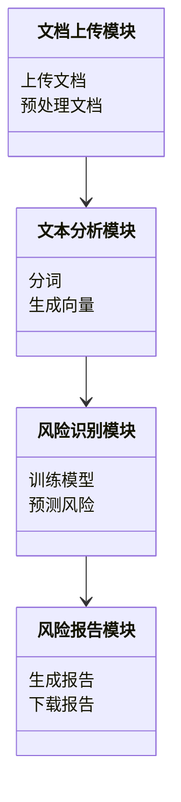

                 


# AI辅助企业并购尽职调查：自动化文档分析与风险识别

> 关键词：企业并购，AI辅助，尽职调查，文档分析，风险识别

> 摘要：随着企业并购活动的日益频繁，传统的尽职调查方法逐渐暴露出效率低下、成本高昂且容易遗漏风险的缺陷。基于人工智能（AI）的自动化文档分析和风险识别技术，为企业并购提供了更高效、更精准的解决方案。本文将详细探讨AI技术在企业并购尽职调查中的应用，涵盖自然语言处理（NLP）、机器学习和知识图谱等核心技术，并通过实际案例分析，展示AI如何提升尽职调查的效率和准确性。

---

## 第一部分：AI辅助企业并购尽职调查的背景与核心概念

### 第1章：企业并购尽职调查的背景与挑战

#### 1.1 企业并购的背景与重要性
- **1.1.1 企业并购的定义与分类**
  - 并购的定义：企业并购（Mergers and Acquisitions，简称M&A）是指一家企业合并或收购另一家企业，以实现业务扩展或战略重组。
  - 分类：横向并购、纵向并购、混合并购。
- **1.1.2 并购过程中的核心问题**
  - 财务风险：被并购企业的财务状况是否健康。
  - 法律风险：是否存在未决诉讼或合规问题。
  - 经营风险：目标企业是否存在潜在的经营问题。
- **1.1.3 尽职调查在并购中的作用**
  - 确保并购决策的准确性。
  - 降低并购后的整合风险。
  - 优化并购交易的估值。

#### 1.2 传统尽职调查的局限性
- **1.2.1 人工审查的效率问题**
  - 传统方法依赖大量手动审查，耗时且效率低下。
  - 人工审查容易受到主观因素的影响，存在遗漏风险。
- **1.2.2 信息遗漏与风险误判**
  - 传统方法难以处理大量非结构化数据。
  - 容易忽视隐性风险，导致并购后的价值损失。
- **1.2.3 成本与时间的双重压力**
  - 高昂的人力成本和时间成本使得中小型企业难以负担。

#### 1.3 AI技术在尽职调查中的应用前景
- **1.3.1 AI技术的核心优势**
  - 高效处理大量数据，提高审查效率。
  - 准确识别潜在风险，降低误判率。
  - 支持实时数据分析，提升决策速度。
- **1.3.2 自动化文档分析的潜力**
  - 快速处理财务报表、合同文档等结构化和非结构化数据。
  - 通过NLP技术提取关键信息，实现自动化分类和总结。
- **1.3.3 风险识别的智能化突破**
  - 利用机器学习模型预测潜在风险。
  - 基于知识图谱构建风险关联网络，实现风险的可视化和预警。

### 第2章：AI辅助尽职调查的核心概念

#### 2.1 自然语言处理（NLP）在文档分析中的应用
- **2.1.1 NLP的基本原理**
  - NLP的目标是让计算机理解和处理人类语言。
  - 常见的NLP任务包括文本分类、实体识别、关系抽取等。
- **2.1.2 文档分类与实体识别**
  - 文本分类：将文档划分为不同的类别（如财务、法律、经营）。
  - 实体识别：从文本中提取关键实体（如公司名称、金额、时间）。
- **2.1.3 基于NLP的风险识别流程**
  - 通过NLP技术提取文档中的风险相关关键词。
  - 对提取的信息进行语义分析，识别潜在风险。

#### 2.2 机器学习在风险评估中的应用
- **2.2.1 机器学习的核心原理**
  - 机器学习通过训练数据学习特征，预测新数据的标签。
  - 常见的机器学习算法包括决策树、随机森林、支持向量机（SVM）等。
- **2.2.2 基于特征的分类模型**
  - 构建特征向量，将文档转化为数值表示。
  - 使用分类算法对风险进行预测。
- **2.2.3 深度学习在风险预测中的应用**
  - 使用深度学习模型（如BERT）进行文本表示和分类。
  - 深度学习能够捕捉到复杂的语义信息，提高预测准确性。

#### 2.3 知识图谱与风险关联分析
- **2.3.1 知识图谱的构建原理**
  - 知识图谱是一种结构化数据表示方式，由实体和关系组成。
  - 通过NLP技术从文档中提取实体和关系，构建知识图谱。
- **2.3.2 风险关联的可视化分析**
  - 通过知识图谱可视化潜在风险之间的关联。
  - 帮助用户快速识别和理解风险。
- **2.3.3 知识图谱在尽职调查中的应用**
  - 基于知识图谱进行风险传播分析，预测潜在风险。
  - 通过知识图谱实现跨文档信息的关联分析。

### 第3章：AI辅助尽职调查的核心算法与数学模型

#### 3.1 文本分类算法
- **3.1.1 基于朴素贝叶斯的文本分类**
  - 朴素贝叶斯是一种基于概率的分类算法。
  - 常用于文本分类任务，如垃圾邮件识别。
- **3.1.2 支持向量机（SVM）在文本分类中的应用**
  - SVM是一种强大的分类算法，适用于高维数据。
  - 在文本分类中，SVM能够处理非线性可分的问题。
- **3.1.3 深度学习模型（如BERT）的应用**
  - BERT是一种预训练的深度学习模型，能够捕捉文本的语义信息。
  - 在企业并购的文档分析中，BERT可以用于文本表示和分类。

#### 3.2 实体识别与关系抽取
- **3.2.1 基于CRF的命名实体识别**
  - CRF（条件随机场）是一种统计学习模型，常用于序列标注任务。
  - 在实体识别中，CRF能够准确识别文本中的公司名称、金额等实体。
- **3.2.2 基于注意力机制的关系抽取**
  - 注意力机制是一种基于深度学习的机制，能够关注文本中的重要部分。
  - 在关系抽取中，注意力机制能够帮助模型准确识别实体之间的关系。
- **3.2.3 实体识别的数学模型**
  - 实体识别的数学模型通常基于概率论，如HMM（隐马尔可夫模型）或CRF。
  - 通过训练数据学习特征，实现对文本的准确分类。

#### 3.3 风险评估模型
- **3.3.1 基于逻辑回归的风险评分**
  - 逻辑回归是一种常用的分类算法，适用于二分类问题。
  - 在风险评估中，逻辑回归可以对企业的风险进行评分。
- **3.3.2 基于随机森林的风险分类**
  - 随机森林是一种基于决策树的集成学习算法。
  - 在风险分类中，随机森林能够处理高维数据，提高分类准确性。
- **3.3.3 基于图神经网络的风险传播模型**
  - 图神经网络是一种基于图结构的深度学习模型。
  - 在风险传播中，图神经网络能够捕捉实体之间的关联，预测风险的传播路径。

### 第4章：系统架构与设计

#### 4.1 系统功能模块设计
- **4.1.1 文档上传与预处理模块**
  - 用户上传文档，系统进行格式转换和分词处理。
  - 支持多种格式的文档，如PDF、Word、Excel等。
- **4.1.2 文本分析与风险识别模块**
  - 对文档进行NLP处理，提取实体和关系。
  - 通过机器学习模型进行风险预测。
- **4.1.3 风险报告生成模块**
  - 根据分析结果生成风险报告。
  - 报告包含风险列表、风险评分和风险建议。

#### 4.2 系统架构设计
- **4.2.1 基于微服务的架构设计**
  - 系统采用微服务架构，模块化设计。
  - 每个功能模块独立运行，互不干扰。
- **4.2.2 数据流与模块交互设计**
  - 文档上传 -> 预处理 -> 文本分析 -> 风险识别 -> 报告生成。
  - 每个步骤的数据流清晰，便于调试和优化。
- **4.2.3 系统扩展性与可维护性设计**
  - 系统采用模块化设计，便于功能扩展。
  - 支持多种算法的集成，提高系统的灵活性。

#### 4.3 接口设计与交互流程
- **4.3.1 API接口设计**
  - 提供RESTful API接口，方便与其他系统的集成。
  - 支持文件上传、任务查询、结果下载等功能。
- **4.3.2 系统交互流程**
  - 用户登录 -> 上传文档 -> 提交任务 -> 下载报告。
  - 系统实时反馈任务进度，提高用户体验。

---

## 第二部分：项目实战与案例分析

### 第5章：项目实战

#### 5.1 环境安装与配置
- **5.1.1 安装Python环境**
  - 使用Anaconda安装Python 3.8及以上版本。
  - 安装必要的Python包，如TensorFlow、Keras、NLTK等。
- **5.1.2 安装NLP工具**
  - 使用spaCy安装中文分词工具。
  - 安装jieba，中文分词工具。
- **5.1.3 安装机器学习库**
  - 安装scikit-learn、xgboost等机器学习库。

#### 5.2 系统核心实现源代码
- **5.2.1 文本预处理代码**
  ```python
  import jieba
  from sklearn.feature_extraction.text import TfidfVectorizer

  def preprocess(text):
      # 分词
      words = jieba.lcut(text)
      # 转换为TF-IDF向量
      vectorizer = TfidfVectorizer()
      tfidf = vectorizer.fit_transform([" ".join(words)])
      return tfidf
  ```

- **5.2.2 风险分类代码**
  ```python
  from sklearn.ensemble import RandomForestClassifier

  def risk_classification(X, y):
      # 训练随机森林模型
      model = RandomForestClassifier()
      model.fit(X, y)
      return model
  ```

#### 5.3 实际案例分析与解读
- **5.3.1 案例背景**
  - 某企业并购案例，目标企业存在财务风险。
  - 通过AI系统分析文档，识别出潜在的财务问题。
- **5.3.2 分析过程**
  - 文档预处理：将财务报表转换为结构化数据。
  - 文本分析：提取关键信息，如收入、支出、利润等。
  - 风险识别：通过机器学习模型预测财务风险。
- **5.3.3 结果解读**
  - 系统识别出目标企业的财务风险较高。
  - 提供风险评分和风险建议，帮助并购决策。

### 第6章：总结与展望

#### 6.1 最佳实践与小结
- **6.1.1 系统的优势**
  - 高效处理大量文档，节省时间。
  - 准确识别潜在风险，降低并购风险。
- **6.1.2 使用中的注意事项**
  - 数据隐私和安全问题。
  - 系统的可解释性问题。
  - 算法的可扩展性问题。

#### 6.2 展望与未来方向
- **6.2.1 技术进步**
  - 深度学习技术的进一步发展。
  - 多模态数据的融合分析。
- **6.2.2 应用扩展**
  - 在更多领域的应用，如金融、医疗等。
  - � 支持更多语言的文档分析。
- **6.2.3 未来挑战**
  - 数据隐私和安全的保护。
  - 算法的可解释性和透明度。

---

## 第三部分：附录

### 附录A：数学公式与模型解析

#### A.1 文本分类的数学模型
- **A.1.1 朴素贝叶斯分类公式**
  $$ P(y|x) = \frac{P(x|y)P(y)}{P(x)} $$
- **A.1.2 SVM的优化目标**
  $$ \min_{w,b} \frac{1}{2}||w||^2 + C \sum_{i=1}^n \xi_i $$
  $$ \text{subject to } y_i(w \cdot x_i + b) \geq 1 - \xi_i, \xi_i \geq 0 $$

#### A.2 风险评估的数学模型
- **A.2.1 逻辑回归模型**
  $$ P(y=1|x) = \frac{1}{1 + e^{-w x - b}} $$
- **A.2.2 随机森林的集成模型**
  $$ y = \text{sign}(\sum_{i=1}^n h_i(x)) $$

---

### 附录B：系统架构图

#### B.1 系统功能模块类图


#### B.2 系统架构图


---

通过以上目录结构和内容安排，文章将系统地介绍AI辅助企业并购尽职调查的核心技术与应用，帮助读者全面理解如何利用AI技术提升企业并购的效率与准确性。

