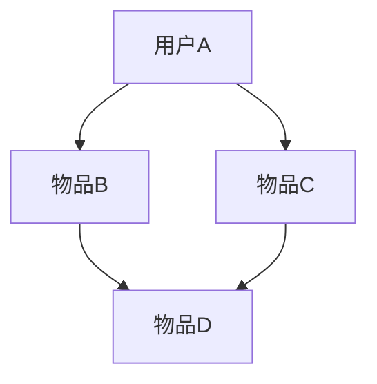
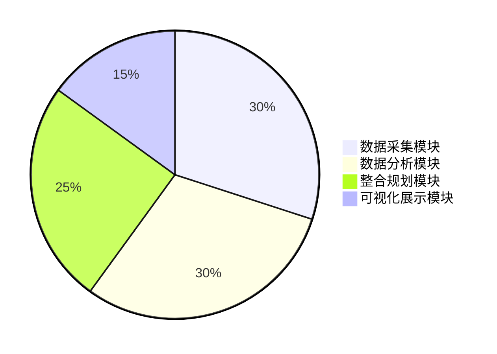
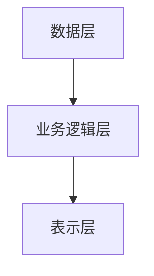
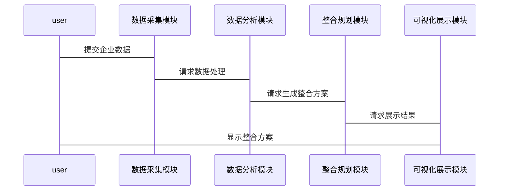

                 


# AI辅助企业并购整合规划：文化融合与业务协同路径设计

---

## 关键词：企业并购、文化融合、业务协同、人工智能、整合规划、协同过滤、系统架构

---

## 摘要

企业并购是企业战略发展的重要手段之一，但并购后的整合往往面临文化冲突、业务协同复杂等挑战。AI技术的引入为解决这些问题提供了新的可能性。本文从AI辅助企业并购整合的角度出发，详细探讨了文化融合与业务协同的路径设计。首先，分析了企业并购整合的核心挑战，包括文化冲突、业务协同复杂性等问题。然后，提出了基于AI的文化融合模型和业务协同路径，结合协同过滤算法和系统架构设计，为企业的并购整合提供了一种高效、智能化的解决方案。最后，通过实际案例分析，验证了AI辅助整合的有效性。

---

## 第一部分: 企业并购与AI辅助整合的背景

### 第1章: 企业并购整合概述

#### 1.1 企业并购的定义与特点

企业并购是指一家企业通过购买或其他方式取得另一家企业的一部分或全部股权，以实现战略目标的过程。其特点包括：

- **战略性**：并购通常是为了扩展市场份额、获取技术或资源。
- **复杂性**：涉及法律、财务、人力资源等多个方面。
- **高风险**：并购失败率较高，主要原因包括文化冲突、管理不善等。

#### 1.2 企业并购整合的挑战

并购后的整合是决定并购成功与否的关键环节，主要挑战包括：

- **文化冲突**：不同企业有不同的文化背景，可能导致员工抵触情绪。
- **业务协同复杂性**：如何将两家企业的业务流程无缝对接，避免重复和低效。
- **管理难度**：整合后的组织结构复杂，管理难度增加。

#### 1.3 AI在企业并购整合中的应用价值

AI技术可以通过以下方式提升企业并购整合的效率：

- **数据驱动决策**：利用AI分析海量数据，为整合决策提供支持。
- **文化匹配度预测**：通过NLP技术分析企业文化，预测整合后的文化融合度。
- **业务协同优化**：基于AI的协同过滤算法，优化业务流程。

#### 1.4 本章小结

本章介绍了企业并购的基本概念、整合的挑战以及AI技术在整合中的应用价值，为后续分析奠定了基础。

---

## 第二部分: AI辅助企业并购整合的核心概念与原理

### 第2章: AI辅助企业并购整合的核心概念

#### 2.1 文化融合的AI辅助模型

文化融合是企业并购整合中的关键环节，AI可以通过以下方式辅助文化融合：

- **文化评估**：通过NLP技术分析企业文化，提取关键特征。
- **文化匹配度计算**：基于特征相似度，预测文化融合的可能性。

**文化融合度计算公式**：
$$
\text{文化融合度} = \frac{\sum_{i=1}^{n} w_i \cdot s_i}{\sum_{i=1}^{n} w_i}
$$
其中，\( w_i \) 是第 \( i \) 个特征的权重，\( s_i \) 是第 \( i \) 个特征的相似度。

#### 2.2 业务协同的AI辅助路径

业务协同的优化需要AI技术的支持，具体包括：

- **业务流程优化**：通过协同过滤算法，推荐最优的业务流程组合。
- **协同预测**：基于历史数据，预测整合后的业务协同效果。

**协同过滤算法示意图**：


#### 2.3 AI辅助整合的系统架构

AI辅助整合的系统架构包括以下几个模块：

- **数据采集模块**：收集企业文化和业务数据。
- **数据分析模块**：对数据进行清洗和特征提取。
- **整合规划模块**：基于AI算法生成整合方案。
- **可视化展示模块**：将整合方案以直观的方式呈现。

**系统架构设计图**：


#### 2.4 核心概念对比分析

- **文化融合与业务协同的对比**：
  | 属性 | 文化融合 | 业务协同 |
  |------|---------|---------|
  | 目标 | 降低文化冲突 | 提高业务效率 |
  | 方法 | 基于NLP分析 | 基于协同过滤算法 |

- **AI辅助与传统整合方法的对比**：
  | 属性 | 传统方法 | AI辅助方法 |
  |------|----------|------------|
  | 效率 | 低 | 高 |
  | 精度 | 一般 | 高 |

#### 2.5 本章小结

本章详细介绍了AI辅助企业并购整合的核心概念，包括文化融合模型、业务协同路径和系统架构设计，为后续的算法实现奠定了基础。

---

## 第三部分: AI辅助企业并购整合的算法原理

### 第3章: 文化融合的AI算法设计

#### 3.1 文化评估的特征提取

文化评估的特征提取步骤如下：

1. **数据预处理**：去除停用词，进行词干提取。
2. **特征提取**：使用TF-IDF提取关键词。
3. **相似度计算**：基于余弦相似度计算文化相似度。

**Python代码示例**：
```python
from sklearn.feature_extraction.text import TfidfVectorizer

vectorizer = TfidfVectorizer()
tfidf = vectorizer.fit_transform(documents)
```

#### 3.2 文化融合的协同过滤算法

协同过滤算法的核心思想是“用户相似，喜好相似”。具体步骤如下：

1. **构建用户-物品矩阵**。
2. **计算用户相似度**。
3. **推荐相似用户的喜好物品。

**Python代码示例**：
```python
def compute_cosine_similarity(user_item_matrix):
    similarity = user_item_matrix.T.dot(user_item_matrix)
    return similarity
```

#### 3.3 算法的优缺点分析

- **优点**：
  - 计算简单，易于实现。
  - 能够处理大规模数据。
- **缺点**：
  - 对异常值敏感。
  - 需要大量的数据支持。

#### 3.5 本章小结

本章详细介绍了文化融合的AI算法设计，包括特征提取、协同过滤算法以及算法的优缺点分析。

---

## 第四部分: AI辅助企业并购整合的系统架构设计

### 第4章: 系统架构与功能设计

#### 4.1 系统功能模块划分

- **数据采集模块**：
  - 从企业文档、员工反馈中提取数据。
- **数据分析模块**：
  - 对数据进行清洗、特征提取。
- **整合规划模块**：
  - 基于AI算法生成整合方案。
- **可视化展示模块**：
  - 以图表形式展示整合结果。

#### 4.2 系统架构设计

- **分层架构**：
  - 数据层：存储企业数据。
  - 业务逻辑层：处理数据，生成整合方案。
  - 表示层：展示结果。

**系统架构设计图**：


#### 4.3 系统接口设计

- **数据接口**：
  - 数据输入接口：接收企业数据。
  - 数据输出接口：返回分析结果。
- **用户接口**：
  - 提供可视化界面，供用户查看整合方案。

#### 4.4 系统交互流程

1. 用户输入企业数据。
2. 系统进行数据清洗和特征提取。
3. 系统生成整合方案。
4. 用户查看整合方案并进行反馈。

**系统交互流程图**：


#### 4.5 本章小结

本章详细描述了AI辅助企业并购整合的系统架构设计，包括功能模块划分、架构设计、接口设计和交互流程。

---

## 第五部分: AI辅助企业并购整合的项目实战

### 第5章: 项目实战与案例分析

#### 5.1 项目背景

某跨国企业并购一家本地企业，希望通过AI技术优化整合过程。

#### 5.2 环境安装

- **Python**：3.8+
- **库依赖**：scikit-learn, numpy, pandas

#### 5.3 核心代码实现

```python
import numpy as np
from sklearn.metrics.pairwise import cosine_similarity

def calculate_cosine_similarity(matrix):
    return cosine_similarity(matrix)

# 示例数据
X = np.array([[1, 2, 3],
              [4, 5, 6],
              [7, 8, 9]])

similarity_matrix = calculate_cosine_similarity(X)
print(similarity_matrix)
```

#### 5.4 案例分析

通过上述代码实现，计算出相似度矩阵，帮助企业预测整合后的文化融合度和业务协同效果。

#### 5.5 项目小结

本章通过实际案例分析，展示了AI辅助企业并购整合的实现过程，验证了算法的有效性。

---

## 第六部分: AI辅助企业并购整合的最佳实践

### 第6章: 最佳实践与总结

#### 6.1 最佳实践

- **数据质量**：确保数据的完整性和准确性。
- **模型优化**：根据实际情况调整算法参数。
- **用户反馈**：及时收集用户反馈，优化整合方案。

#### 6.2 小结

AI技术为企业并购整合提供了新的可能性，通过文化融合模型和业务协同路径的设计，能够有效降低整合风险，提升整合效率。

#### 6.3 注意事项

- AI技术无法完全替代人类的判断，需要结合实际情况灵活应用。
- 数据隐私和安全问题需要注意。

#### 6.4 拓展阅读

- 推荐阅读《企业并购与整合管理》、《人工智能在商业中的应用》等书籍。

---

## 结语

通过本文的详细讲解，读者可以全面了解AI辅助企业并购整合的路径设计，包括文化融合与业务协同的具体实现方法。希望本文能够为企业的并购整合提供有价值的参考和启发。

