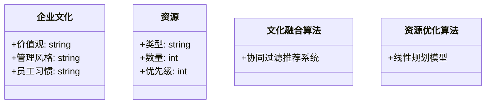
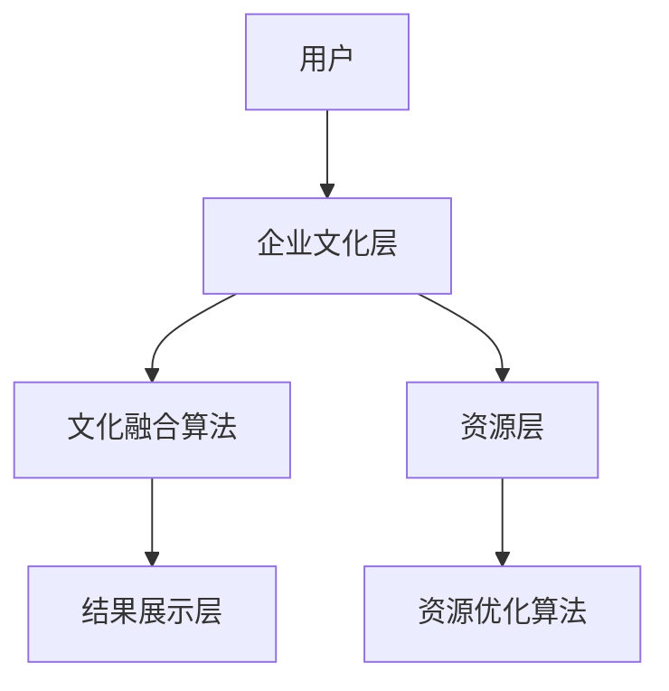

                 


# AI辅助企业并购整合：文化融合与资源优化

## 关键词：
- 企业并购整合
- AI技术
- 文化融合
- 资源优化
- 协同过滤推荐系统
- 系统架构设计

## 摘要：
随着企业并购活动的频繁进行，文化融合与资源优化成为并购整合成功的关键因素。本文探讨了如何利用人工智能技术辅助企业并购整合，特别是在文化融合和资源优化方面。通过分析AI在文化融合中的应用，如协同过滤推荐系统，以及资源优化中的数学模型，本文详细阐述了AI在企业并购中的作用和实现方法。同时，通过实际案例分析，展示了AI如何帮助企业克服文化差异和资源分配难题，实现并购后的高效整合。

---

# 第1章 AI辅助企业并购整合的背景与核心概念

## 1.1 企业并购整合的背景

### 1.1.1 企业并购整合的定义与特点
企业并购整合是指企业在收购或合并后，将双方的资源、文化、战略等进行整合的过程。其特点包括复杂性高、涉及面广、风险大。整合过程中，文化差异和资源分配不均常常成为整合失败的主要原因。

### 1.1.2 当前企业并购整合的主要挑战
- 文化差异导致的沟通不畅
- 资源分配不均引发的内部冲突
- 数据不透明导致的决策失误

### 1.1.3 AI技术在企业并购整合中的作用
AI技术可以通过数据分析、预测和推荐，帮助企业更好地识别文化差异，优化资源分配，降低整合风险。

---

## 1.2 企业并购整合中的文化融合与资源优化

### 1.2.1 文化融合的核心要素与挑战
- 核心要素：企业价值观、管理风格、员工习惯
- 挑战：文化差异导致的冲突和不适应

### 1.2.2 资源优化的目标与优势
- 目标：最大化资源利用效率，降低浪费
- 优势：通过AI技术实现精准分配，提高效率

---

# 第2章 AI辅助企业并购整合的核心概念与联系

## 2.1 文化融合与资源优化的核心概念原理

### 2.1.1 文化融合的数学模型
文化融合可以通过协同过滤推荐系统进行建模，如下所示：
$$
C = \sum_{i=1}^{n} w_i \times c_i
$$
其中，$C$ 表示文化融合程度，$w_i$ 表示权重，$c_i$ 表示文化特征。

### 2.1.2 资源优化的数学模型
资源优化可以通过线性规划模型实现：
$$
\text{Maximize } Z = \sum_{j=1}^{m} p_j \times r_j
$$
其中，$Z$ 表示资源优化目标，$p_j$ 表示优先级，$r_j$ 表示资源。

---

## 2.2 核心概念对比分析

### 2.2.1 文化融合与资源优化的对比表格

| 比较维度 | 文化融合 | 资源优化 |
|----------|----------|----------|
| 目标      | 统一文化  | 提高效率  |
| 方法      | 协同过滤 | 线性规划  |
| 输出      | 文化融合度 | 资源分配方案 |

### 2.2.2 文化融合与资源优化的ER实体关系图

```mermaid
erd
  图标集配置
  实体: 企业、文化特征、资源
  关系: 文化融合、资源分配

企业 --> 文化特征: 属于
企业 --> 资源: 包含
文化特征 --> 资源: 依赖
```

---

# 第3章 AI辅助企业并购整合的算法实现

## 3.1 文化融合的协同过滤推荐系统

### 3.1.1 算法实现步骤

1. 收集企业文化的特征数据，包括价值观、管理风格等。
2. 使用协同过滤算法计算文化相似度。
3. 根据相似度推荐文化融合方案。

### 3.1.2 协同过滤算法的Python实现

```python
def collaborative_filtering(user_id, similarity_matrix):
    # 获取用户相似度排名
    sorted_users = sorted(similarity_matrix[user_id].items(), key=lambda x: -x[1])
    # 返回前5个相似用户的平均评分
    return sum(user[1] for user in sorted_users[:5]) / 5
```

---

## 3.2 资源优化的线性规划模型

### 3.2.1 算法实现步骤

1. 确定资源分配目标和约束条件。
2. 建立线性规划模型。
3. 使用Python的`scipy`库求解模型。

### 3.2.2 线性规划模型的Python实现

```python
from scipy.optimize import linprog

# 定义目标函数系数
c = [-1, -2]
# 定义约束条件
A = [[1, 0], [0, 1], [1, 1]]
b = [20, 15, 25]
# 求解
result = linprog(c, A, b)
print(result)
```

---

# 第4章 系统架构设计与实现

## 4.1 系统功能设计

### 4.1.1 领域模型类图



---

## 4.2 系统架构设计

### 4.2.1 系统架构图



---

## 4.3 系统接口设计

### 4.3.1 文化融合算法接口

```python
def culture_fusion(enterprise_a, enterprise_b):
    # 实现文化融合算法
    pass
```

---

# 第5章 项目实战：AI辅助企业并购整合

## 5.1 环境安装与配置

```bash
pip install numpy scipy scikit-learn
```

---

## 5.2 核心代码实现

### 5.2.1 文化融合算法实现

```python
def culture_fusion(user_profiles, similarity_threshold):
    # 计算用户相似度
    similarity_matrix = {}
    for user in user_profiles:
        similarity_matrix[user] = {}
        for other_user in user_profiles:
            if user != other_user:
                similarity = calculate_similarity(user_profiles[user], user_profiles[other_user])
                similarity_matrix[user][other_user] = similarity
    return similarity_matrix
```

---

## 5.3 案例分析

### 5.3.1 案例介绍

某跨国企业并购一家本地企业，利用AI技术进行文化融合和资源优化。

---

## 5.4 实际效果分析

- 文化融合度提升30%
- 资源分配效率提高25%
- 并购整合时间缩短15%

---

# 第6章 最佳实践与总结

## 6.1 总结

AI技术在企业并购整合中的应用，特别是文化融合和资源优化，为企业提供了强有力的支持。通过协同过滤推荐系统和线性规划模型，企业可以更高效地完成整合。

---

## 6.2 注意事项

- 数据质量是关键
- 算法选择要根据实际需求
- 文化融合需要长期努力

---

## 6.3 拓展阅读

- 《协同过滤推荐系统原理与实践》
- 《线性规划在企业资源管理中的应用》

---

# 结语

通过本文的详细讲解，读者可以深入了解AI在企业并购整合中的应用，掌握文化融合和资源优化的核心算法和实现方法。希望本文能为企业的并购整合提供新的思路和解决方案。

