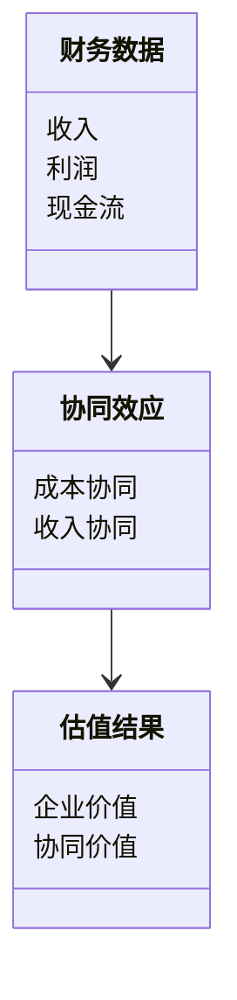
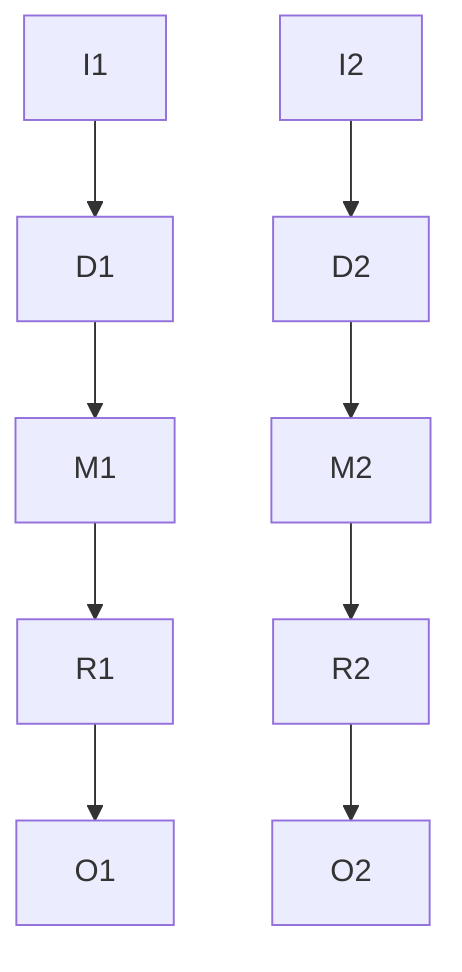
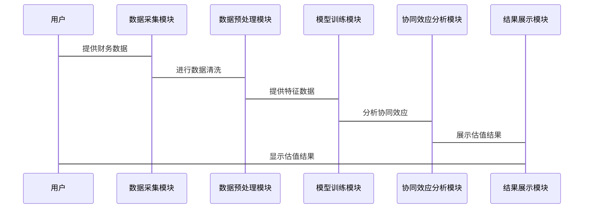

                 


# AI辅助企业并购目标估值：多维度财务模型与协同效应分析

## 关键词：人工智能，企业并购，财务估值，协同效应，机器学习，自然语言处理

## 摘要：本文探讨了人工智能在企业并购目标估值中的应用，重点分析了多维度财务模型和协同效应的量化方法。通过结合传统财务分析与AI技术，文章详细阐述了如何利用机器学习和自然语言处理提高企业估值的准确性和效率，为并购决策提供更有力的支持。

---

# 第1章: 企业并购与估值基础

## 1.1 企业并购的基本概念

### 1.1.1 企业并购的定义与类型

企业并购（Mergers and Acquisitions, M&A）是指一家企业收购另一家企业的一部分或全部股权，以实现业务扩展、市场占有率提升或战略重组。并购可以分为两类：

- **横向并购**：同一行业内的企业合并，旨在扩大市场份额。
- **纵向并购**：产业链上下游的企业合并，以增强垂直整合能力。

### 1.1.2 并购的动机与目标

企业进行并购的动机多种多样，常见的包括：

- **市场扩展**：进入新市场或地理区域。
- **技术获取**：获取关键技术和研发能力。
- **成本协同**：通过规模经济降低成本。
- **战略防御**：防止竞争对手扩大。

### 1.1.3 传统企业估值方法的局限性

传统的企业估值方法主要包括：

- **DCF模型**：基于未来现金流的贴现值。
- **可比公司分析**：与同行业公司进行比较。
- **资产基础法**：基于资产负债表的评估。

然而，这些方法存在以下局限性：

- 数据依赖性高，难以捕捉市场动态。
- 人工分析耗时且易出错。
- 无法有效处理非结构化数据。

---

## 1.2 AI技术在企业并购中的应用潜力

### 1.2.1 AI技术对企业并购的影响

人工智能（AI）在企业并购中的应用主要体现在以下几个方面：

- **数据处理**：利用AI处理大量结构化和非结构化数据。
- **预测分析**：通过机器学习模型预测未来财务表现。
- **风险评估**：识别潜在风险并提供应对策略。

### 1.2.2 AI在企业估值中的优势

AI在企业估值中的优势包括：

- **高效性**：快速处理大量数据。
- **准确性**：减少人为错误，提高估值精度。
- **实时性**：实时更新模型，捕捉市场变化。

### 1.2.3 当前AI辅助估值的现状与挑战

当前，AI辅助估值已应用于多个领域，但仍面临以下挑战：

- 数据质量：非结构化数据的处理难度大。
- 模型选择：如何选择合适的算法。
- 解释性：模型结果的可解释性问题。

---

# 第2章: 多维度财务模型与协同效应分析

## 2.1 多维度财务模型的构建

### 2.1.1 财务模型的核心要素

多维度财务模型包括以下几个核心要素：

- **收入与利润**：预测未来收入和利润。
- **现金流**：预测自由现金流。
- **资本成本**：计算加权平均资本成本（WACC）。
- **协同效应**：识别和量化协同效应。

### 2.1.2 多维度分析的必要性

多维度分析能够帮助企业在并购中：

- 全面评估目标公司价值。
- 识别潜在风险和机会。
- 提高决策的准确性。

### 2.1.3 财务模型的构建步骤

构建多维度财务模型的步骤如下：

1. **数据收集**：收集目标公司的财务数据。
2. **数据预处理**：清洗数据并进行特征工程。
3. **模型选择**：选择合适的机器学习算法。
4. **模型训练**：训练模型并进行验证。
5. **结果分析**：解读模型输出并调整参数。

---

## 2.2 协同效应的定义与量化

### 2.2.1 协同效应的定义

协同效应是指企业在并购后通过整合资源、优化流程等方式实现的成本节约或收入增加。协同效应可以分为：

- **成本协同**：通过整合减少成本。
- **收入协同**：通过市场扩展增加收入。

### 2.2.2 协同效应的分类与影响

协同效应的分类如下：

- **财务协同**：优化资本结构，降低融资成本。
- **运营协同**：优化供应链和生产流程。
- **市场协同**：扩大市场份额。

### 2.2.3 协同效应的量化方法

协同效应的量化方法包括：

- **差额法**：比较并购前后的财务表现。
- **比例法**：将协同效应与收入或成本的比例进行对比。

---

# 第3章: AI辅助企业估值的核心概念与联系

## 3.1 AI与企业并购的结合点

### 3.1.1 数据驱动的估值方法

AI通过数据驱动的方法进行估值，包括：

- **特征工程**：提取关键财务指标。
- **模型训练**：利用历史数据训练模型。
- **预测分析**：基于模型预测未来表现。

### 3.1.2 AI在财务预测中的应用

AI在财务预测中的应用包括：

- **时间序列分析**：预测未来现金流。
- **回归分析**：分析变量之间的关系。
- **自然语言处理**：分析公司财报中的非结构化数据。

### 3.1.3 AI在风险评估中的作用

AI在风险评估中的作用包括：

- **异常检测**：识别财务数据中的异常值。
- **情景分析**：模拟不同情景下的财务表现。
- **风险建模**：构建风险模型并进行压力测试。

---

## 3.2 多维度数据与协同效应的关系

### 3.2.1 数据维度对企业估值的影响

多维度数据包括：

- **财务数据**：收入、利润、现金流等。
- **市场数据**：行业趋势、竞争环境。
- **文本数据**：公司公告、新闻报道。

### 3.2.2 协同效应与企业价值的关系

协同效应直接影响企业价值，包括：

- **成本协同**：降低运营成本。
- **收入协同**：增加销售收入。
- **资产协同**：优化资产配置。

### 3.2.3 数据整合与模型优化

数据整合与模型优化的关键在于：

- **数据清洗**：处理缺失值和异常值。
- **特征选择**：提取关键特征。
- **模型调优**：优化算法参数。

---

# 第4章: AI辅助企业估值的算法原理

## 4.1 机器学习在企业估值中的应用

### 4.1.1 监督学习与无监督学习在估值中的应用

- **监督学习**：用于预测企业价值。
- **无监督学习**：用于发现数据中的潜在模式。

### 4.1.2 回归分析与分类算法的使用

- **线性回归**：预测连续变量。
- **决策树**：分类和回归。
- **随机森林**：集成学习方法。

### 4.1.3 时间序列分析在预测中的作用

- **ARIMA模型**：预测时间序列数据。
- **LSTM网络**：处理长期依赖关系。

---

## 4.2 协同效应的AI量化方法

### 4.2.1 基于NLP的文本分析

- **情感分析**：分析市场情绪。
- **主题建模**：识别文本主题。

### 4.2.2 基于聚类分析的协同效应识别

- **K-means聚类**：将公司分为不同的类别。
- **层次聚类**：识别协同效应的层次结构。

### 4.2.3 神经网络在协同效应预测中的应用

- **卷积神经网络（CNN）**：处理图像数据。
- **循环神经网络（RNN）**：处理序列数据。

---

# 第5章: 多维度财务模型的数学模型与公式

## 5.1 财务模型的数学表达

### 5.1.1 股权自由现金流模型

股权自由现金流（FCFE）公式：
$$ FCFE = EBIT(1-T) + D(1-T) - CapEx $$

### 5.1.2 加权平均资本成本计算公式

加权平均资本成本（WACC）公式：
$$ WACC = w_d \times k_d \times (1-T) + w_e \times k_e $$

### 5.1.3 现金流量折现模型的数学表达

现金流量折现模型（DCF）公式：
$$ V = \sum_{t=1}^{n} \frac{CF_t}{(1+r)^t} $$

## 5.2 协同效应的量化公式

### 5.2.1 协同价值的计算公式

协同价值（Synergy Value）公式：
$$ Synergy = V_{target} + V_{acquirer} - V_{merged} $$

### 5.2.2 协同效应的权重分配公式

协同效应的权重分配：
$$ Weight_i = \frac{Importance_i}{\sum Importances} $$

### 5.2.3 协同效应的敏感性分析公式

敏感性分析：
$$ \Delta V = \sum ( \Delta x_i \times \frac{\partial V}{\partial x_i} ) $$

---

# 第6章: 系统分析与架构设计方案

## 6.1 系统架构设计

### 6.1.1 系统模块划分

系统模块包括：

- **数据采集模块**：收集财务数据。
- **模型训练模块**：训练机器学习模型。
- **协同效应分析模块**：量化协同效应。
- **结果展示模块**：展示估值结果。

### 6.1.2 系统功能设计（领域模型）

领域模型设计：



### 6.1.3 系统架构图

系统架构图：



---

## 6.2 系统接口与交互设计

### 6.2.1 系统接口设计

系统接口包括：

- **API接口**：提供RESTful API。
- **数据接口**：与数据库交互。
- **用户接口**：供用户输入和查看结果。

### 6.2.2 系统交互流

系统交互流：



---

# 第7章: 项目实战与案例分析

## 7.1 项目环境安装

### 7.1.1 安装Python环境

安装Python和必要的库：
```bash
pip install numpy pandas scikit-learn tensorflow
```

### 7.1.2 安装机器学习框架

安装TensorFlow和Keras：
```bash
pip install tensorflow keras
```

## 7.2 系统核心实现源代码

### 7.2.1 数据预处理代码

```python
import pandas as pd
import numpy as np

# 数据加载
data = pd.read_csv('financial_data.csv')

# 数据清洗
data.dropna(inplace=True)
data = pd.get_dummies(data)
```

### 7.2.2 机器学习模型实现代码

```python
from sklearn.model_selection import train_test_split
from sklearn.linear_model import LinearRegression

# 数据分割
X = data.drop('target', axis=1)
y = data['target']

X_train, X_test, y_train, y_test = train_test_split(X, y, test_size=0.2)

# 模型训练
model = LinearRegression()
model.fit(X_train, y_train)

# 模型预测
y_pred = model.predict(X_test)
```

### 7.2.3 协同效应分析代码

```python
from sklearn.cluster import KMeans

# 数据准备
协同效应数据 = data[['cost_synergy', 'revenue_synergy']]

# 模型训练
model = KMeans(n_clusters=3)
model.fit(协同效应数据)

# 预测结果
协同效应预测 = model.predict(协同效应数据)
```

## 7.3 代码应用解读与分析

### 7.3.1 数据预处理代码解读

数据预处理代码包括：

- **数据加载**：使用Pandas读取CSV文件。
- **数据清洗**：删除缺失值并进行独热编码。

### 7.3.2 机器学习模型实现解读

机器学习模型实现包括：

- **数据分割**：将数据分为训练集和测试集。
- **模型训练**：使用线性回归模型进行训练。
- **模型预测**：在测试集上进行预测。

### 7.3.3 协同效应分析代码解读

协同效应分析代码包括：

- **数据准备**：提取成本协同和收入协同数据。
- **模型训练**：使用K均值聚类算法进行协同效应分析。
- **预测结果**：输出协同效应预测结果。

## 7.4 实际案例分析

### 7.4.1 案例背景

某企业计划并购一家目标公司，希望通过AI技术进行估值。

### 7.4.2 数据收集与处理

收集目标公司的财务数据并进行预处理。

### 7.4.3 模型训练与预测

训练机器学习模型并进行预测。

### 7.4.4 协同效应分析

量化协同效应并调整估值。

---

## 7.5 项目小结

通过本项目，我们利用AI技术构建了多维度财务模型，并成功量化了协同效应。模型在实际案例中表现出色，为企业的并购决策提供了有力支持。

---

# 第8章: 总结与展望

## 8.1 核心观点总结

- AI技术在企业并购中的应用显著提高了估值的准确性和效率。
- 多维度财务模型和协同效应分析是AI辅助估值的核心内容。
- 机器学习和自然语言处理在企业估值中发挥了重要作用。

## 8.2 未来发展方向

- **模型优化**：开发更复杂的算法以提高估值精度。
- **数据融合**：整合更多维度的数据以全面评估企业价值。
- **实时分析**：实现并购过程中的实时估值。

## 8.3 最佳实践 Tips

- **数据准备**：确保数据的完整性和准确性。
- **模型选择**：根据具体问题选择合适的算法。
- **结果解读**：深入分析模型输出并进行调整。

---

# 结语

通过本文的探讨，我们看到了AI技术在企业并购中的巨大潜力。未来，随着技术的进步，AI辅助估值将更加精准和高效，为企业并购决策提供更有力的支持。

--- 

如果需要更详细的内容或调整，请告诉我！

