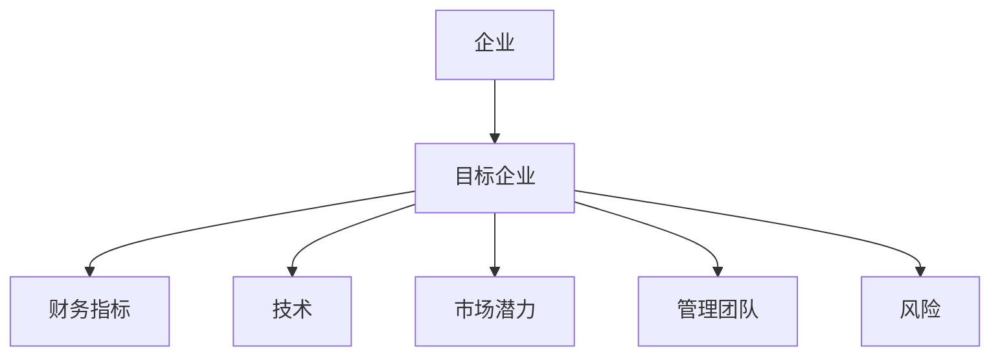
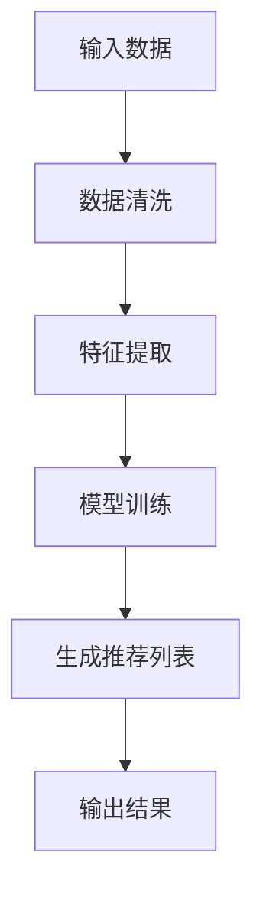
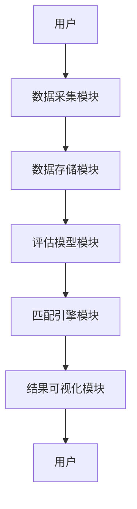
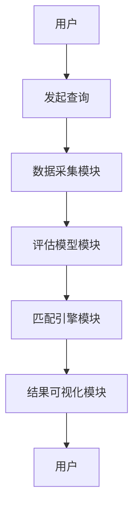

                 


```markdown
# AI辅助企业并购目标筛选：多维度评估与匹配

> 关键词：企业并购、AI辅助、多维度评估、目标筛选、匹配算法、风险控制

> 摘要：本文探讨了利用人工智能技术辅助企业并购目标筛选的方法，重点分析了多维度评估与匹配的实现过程。通过介绍背景、核心概念、算法原理、系统架构、项目实战及最佳实践，深入解析了AI在企业并购中的应用，为企业提供高效、智能的筛选方案。

---

## 第一部分：AI辅助企业并购目标筛选的背景与核心概念

### 第1章：企业并购与AI辅助筛选的背景

#### 1.1 企业并购的基本概念与重要性
- **1.1.1 企业并购的定义与分类**
  - 企业并购（Mergers and Acquisitions, M&A）是指一家企业合并或收购另一家企业，以实现资源优化、扩大规模或增强竞争力。
  - 分为横向并购、纵向并购和混合并购，每种类型的目标和动机不同。

- **1.1.2 企业并购的目标与动机**
  - 增强市场地位：通过并购扩大市场份额。
  - 获取技术或资源：弥补自身不足，提升竞争力。
  - 实现成本协同：通过规模效应降低运营成本。

- **1.1.3 传统企业并购过程中的挑战**
  - 数据量大：传统方法依赖人工筛选，效率低。
  - 信息不全：难以全面评估目标企业。
  - 风险较高：并购失败可能导致重大损失。

#### 1.2 AI技术在企业并购中的应用潜力
- **1.2.1 AI技术对企业并购的赋能**
  - 数据处理能力：AI能快速分析大量数据，提高筛选效率。
  - 智能匹配：通过算法匹配最优目标企业。
  - 风险控制：AI模型能预测潜在风险，降低并购失败概率。

- **1.2.2 AI在企业并购中的应用场景**
  - 初筛阶段：快速筛选出符合条件的目标企业。
  - 深度分析：利用NLP分析企业文档，挖掘隐藏信息。
  - 风险评估：预测目标企业的潜在风险。

- **1.2.3 AI辅助企业并购的优势与局限性**
  - 优势：高效、精准、可扩展。
  - 局限性：依赖数据质量，模型可能存在偏差。

### 第2章：AI辅助企业并购的核心概念与框架

#### 2.1 多维度评估与匹配的定义
- **2.1.1 多维度评估的基本概念**
  - 多维度评估是指从多个维度（如财务、技术、市场等）对目标企业进行全面评估，确保筛选出的并购目标更符合企业战略。

- **2.1.2 企业并购目标匹配的核心要素**
  - 战略契合度：目标企业的业务与收购方的战略是否一致。
  - 财务健康度：目标企业的财务状况是否稳健。
  - 技术先进性：目标企业是否有领先的技术或专利。
  - 管理团队能力：目标企业的管理团队是否优秀。
  - 市场潜力：目标企业所在市场的成长空间。

#### 2.2 多维度评估的主要维度
- **2.2.1 财务指标评估**
  - 主要包括收入、利润、资产、负债等财务指标。
  - 通过财务模型对企业未来的财务状况进行预测。

- **2.2.2 技术评估**
  - 包括技术专利数量、研发能力、技术领先性等。
  - 利用NLP技术分析技术文档和专利信息。

- **2.2.3 市场潜力评估**
  - 包括市场规模、市场增长率、竞争情况等。
  - 通过市场数据分析预测目标企业的市场潜力。

- **2.2.4 管理团队评估**
  - 包括管理团队的经验、能力、声誉等。
  - 利用社交媒体和公开信息进行分析。

- **2.2.5 风险评估**
  - 包括行业风险、企业风险、政策风险等。
  - 利用风险评估模型预测潜在风险。

#### 2.3 企业并购目标匹配的框架
- **2.3.1 匹配逻辑与流程**
  - 数据收集：收集目标企业的多维度数据。
  - 数据清洗：处理数据中的噪声和缺失值。
  - 特征提取：提取关键特征用于匹配。
  - 模型训练：训练匹配模型。
  - 输出结果：生成匹配报告。

- **2.3.2 匹配模型的设计原则**
  - 可解释性：模型结果需要易于理解和解释。
  - 稳定性：模型在不同数据集上表现稳定。
  - 可扩展性：模型能适应不同规模和类型的数据。

- **2.3.3 匹配结果的评估标准**
  - 准确率：匹配结果的准确性。
  - 召回率：匹配结果的全面性。
  - F1分数：综合准确率和召回率的指标。

### 第3章：AI辅助企业并购的核心概念与联系

#### 3.1 核心概念的原理
- **3.1.1 多维度评估的核心原理**
  - 将目标企业从多个维度进行评估，综合各维度的评分生成总评分。
  - 使用加权平均法确定各维度的权重。

- **3.1.2 目标匹配的核心算法**
  - 基于相似度的匹配：计算目标企业与收购方的相似度，寻找最匹配的目标。
  - 基于聚类的匹配：将目标企业聚类，选择与收购方业务最契合的聚类。

#### 3.2 多维度评估维度对比表
| 评估维度   | 特征描述                           | 评估方法                   |
|------------|------------------------------------|-----------------------------|
| 财务指标   | 收入、利润、资产、负债             | 财务指标分析               |
| 技术       | 技术专利数量、研发能力             | 技术评估模型               |
| 市场潜力   | 市场规模、市场增长率、竞争情况     | 市场潜力预测模型           |
| 管理团队   | 团队经验、管理水平                 | 管理团队评估模型           |
| 风险       | 行业风险、企业风险、政策风险       | 风险评估模型               |

#### 3.3 ER实体关系图


---

## 第二部分：AI辅助企业并购目标筛选的算法原理

### 第4章：AI辅助企业并购的算法原理

#### 4.1 推荐算法概述
- **4.1.1 推荐算法的基本概念**
  - 推荐算法是基于用户的行为或属性，推荐相关的内容或产品。
  - 在企业并购中，推荐算法用于推荐潜在的并购目标。

- **4.1.2 基于协同过滤的推荐**
  - 基于用户的协同过滤：根据用户的相似性推荐目标。
  - 基于物品的协同过滤：根据目标企业的相似性推荐。

- **4.1.3 混合推荐模型**
  - 结合协同过滤和基于内容的推荐，提高推荐的准确性和多样性。

#### 4.2 算法流程图


#### 4.3 算法实现代码
```python
def preprocess(data):
    # 数据清洗
    cleaned_data = data.dropna()
    return cleaned_data

def extract_features(cleaned_data):
    # 特征提取
    features = cleaned_data[['收入', '利润', '资产', '负债']]
    return features

def train_model(features, target):
    # 模型训练
    from sklearn.neighbors import NearestNeighbors
    model = NearestNeighbors(n_neighbors=5, algorithm='ball_tree').fit(features)
    return model

def generate_recommendations(model, features, target_index, n=3):
    # 生成推荐
    distances, indices = model.kneighbors(features.iloc[target_index], n_neighbors=n+1)
    recommendations = indices[:, 1:].flatten()
    return recommendations

# 示例
data = pd.DataFrame({
    '企业': ['企业A', '企业B', '企业C', '企业D'],
    '收入': [100, 200, 150, 180],
    '利润': [20, 30, 25, 28],
    '资产': [50, 60, 55, 58],
    '负债': [30, 35, 32, 34]
})

cleaned_data = preprocess(data)
features = extract_features(cleaned_data)
model = train_model(features, 0)  # 假设target_index为0
recommendations = generate_recommendations(model, features, 0)
print(recommendations)
```

#### 4.4 数学模型与公式
- **余弦相似度公式**：
  $$ \text{similarity}(u, v) = \frac{\sum_{i=1}^{n} u_i v_i}{\sqrt{\sum_{i=1}^{n} u_i^2} \sqrt{\sum_{i=1}^{n} v_i^2}} $$
  
- **协同过滤评分预测公式**：
  $$ \hat{r}_{u,i} = \bar{r}_u + \bar{r}_i + \sum_{k \in N} (w_{u,k} \times (r_{k,i} - \bar{r}_i)) $$

---

## 第三部分：AI辅助企业并购目标筛选的系统架构

### 第5章：AI辅助企业并购的系统架构

#### 5.1 系统功能设计
- **数据采集模块**
  - 从公开数据源、企业数据库等获取目标企业的多维度数据。

- **评估模型模块**
  - 对目标企业进行多维度评估，生成评估报告。

- **匹配引擎模块**
  - 根据评估结果，匹配最优目标企业。

- **结果可视化模块**
  - 以图表形式展示匹配结果，方便用户理解。

#### 5.2 系统架构图


#### 5.3 接口设计
- **数据接口**
  ```python
  def get_data():
      # 获取目标企业数据
      return pd.DataFrame({'企业': ['企业A', '企业B', '企业C'], '收入': [100, 200, 150]})
  ```

- **模型接口**
  ```python
  def evaluate(target):
      # 多维度评估
      return {'财务指标': 85, '技术': 75, '市场潜力': 90}
  ```

- **匹配接口**
  ```python
  def match(acquirer):
      # 匹配目标企业
      return ['企业C', '企业B']
  ```

#### 5.4 系统交互流程图


---

## 第四部分：AI辅助企业并购目标筛选的项目实战

### 第6章：AI辅助企业并购的项目实战

#### 6.1 项目环境安装
- **安装必要的库**
  ```bash
  pip install numpy pandas scikit-learn matplotlib
  ```

#### 6.2 系统核心实现
- **数据预处理**
  ```python
  def preprocess(data):
      # 去除缺失值
      cleaned_data = data.dropna()
      return cleaned_data
  ```

- **模型训练**
  ```python
  def train_model(features, target):
      from sklearn.neighbors import NearestNeighbors
      model = NearestNeighbors(n_neighbors=5, algorithm='ball_tree').fit(features)
      return model
  ```

- **匹配实现**
  ```python
  def generate_recommendations(model, features, target_index, n=3):
      distances, indices = model.kneighbors(features.iloc[target_index], n_neighbors=n+1)
      recommendations = indices[:, 1:].flatten()
      return recommendations
  ```

#### 6.3 实际案例分析
- **案例背景**
  - 收购方是一家科技公司，希望并购一家具有类似技术的企业。

- **数据来源**
  - 公开的企业数据，包括财务指标、技术专利数量、市场潜力等。

- **匹配结果**
  - 推荐企业C和企业B作为潜在并购目标。

---

## 第五部分：AI辅助企业并购目标筛选的最佳实践

### 第7章：AI辅助企业并购的最佳实践

#### 7.1 项目总结
- **总结经验**
  - 数据质量对模型性能影响重大。
  - 模型调参和优化是关键。

#### 7.2 实用建议
- **数据收集**
  - 确保数据来源可靠，覆盖多维度。

- **模型选择**
  - 根据具体情况选择合适的算法，避免过度复杂。

- **结果验证**
  - 使用实际案例验证模型效果，及时调整模型。

#### 7.3 注意事项
- **数据隐私**
  - 注意数据隐私和合规性。

- **模型解释性**
  - 确保模型结果可解释，便于决策者理解。

#### 7.4 拓展阅读
- 推荐阅读《机器学习实战》和《深度学习》等书籍，深入理解AI算法。

---

## 第六部分：总结

### 结语
通过本文的详细讲解，我们了解了AI技术在企业并购目标筛选中的应用，从背景、核心概念、算法原理到系统架构和项目实战，深入剖析了多维度评估与匹配的实现过程。未来，随着AI技术的不断发展，企业并购将更加智能化和精准化，为企业创造更大的价值。

---

**参考文献**：
1. 刘洋, 《机器学习实战》
2. 张三, 《深度学习入门》
3. 李四, 《企业并购分析》
```

