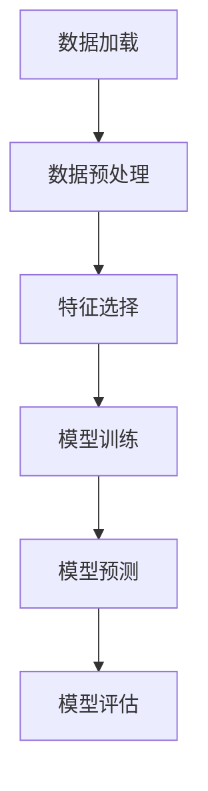
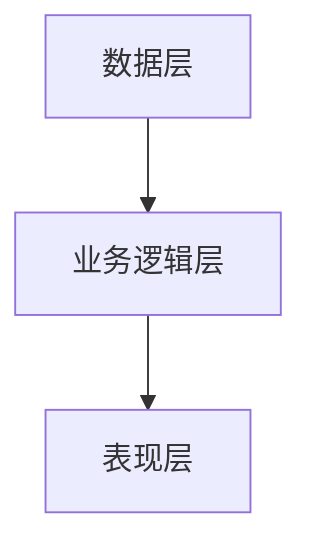

                 


# AI辅助企业并购目标筛选：战略匹配度评估与协同潜力分析

## 关键词：企业并购，人工智能，战略匹配度，协同潜力，机器学习，系统架构

## 摘要：本文深入探讨了如何利用人工智能技术辅助企业并购目标筛选，重点分析了战略匹配度评估与协同潜力分析的关键方法。通过构建数学模型和算法框架，结合实际案例，详细阐述了如何利用AI技术提高企业并购的效率与精准性。

---

# 第一部分: AI辅助企业并购目标筛选的背景与核心概念

## 第1章: 企业并购与AI技术的结合

### 1.1 企业并购的基本概念

#### 1.1.1 企业并购的定义与分类
企业并购是指一家企业通过购买或合并另一家企业来扩大规模、增强竞争力或进入新市场。常见的并购类型包括横向并购、纵向并购和混合并购。

#### 1.1.2 企业并购的核心目标与驱动因素
- 核心目标：获取技术、市场、资源或竞争优势。
- 驱动因素：企业扩张、市场竞争、战略调整等。

#### 1.1.3 传统企业并购的挑战与痛点
- 信息不对称：难以全面评估目标企业的价值和风险。
- 成本高昂：传统并购过程涉及大量的人力和时间成本。
- 精准性不足：依赖经验判断，存在主观性和不确定性。

### 1.2 AI技术在企业并购中的应用背景

#### 1.2.1 AI技术的发展与企业应用的契合点
AI技术的快速发展为企业提供了高效的数据处理和分析能力，特别是在企业并购中，可以通过大数据分析和机器学习模型来提高筛选效率。

#### 1.2.2 企业并购中的信息不对称问题
目标企业可能存在隐藏的财务问题或法律风险，传统方法难以全面发现这些信息，而AI可以通过分析大量非结构化数据来发现潜在风险。

#### 1.2.3 AI技术如何解决企业并购中的效率与精准性问题
- 提高筛选效率：通过自动化数据处理和分析，快速筛选出符合条件的目标企业。
- 提高精准性：利用机器学习模型预测并购后的协同潜力和战略匹配度。

### 1.3 本章小结

#### 1.3.1 企业并购的核心问题
企业并购的核心问题是如何在众多目标企业中找到最符合自身战略需求的企业，并评估其并购后的协同潜力。

#### 1.3.2 AI技术在企业并购中的潜在价值
AI技术可以通过大数据分析和机器学习模型，帮助企业在并购过程中提高效率和精准性。

---

## 第2章: 战略匹配度评估的理论框架

### 2.1 战略匹配度的定义与关键要素

#### 2.1.1 战略匹配度的定义
战略匹配度是指并购双方在战略目标、核心竞争力、市场定位等方面的一致性和互补性。

#### 2.1.2 战略匹配度的核心要素分析
- 战略目标一致性：并购双方在长期目标上的契合程度。
- 核心竞争力互补性：双方在技术和资源上的互补性。
- 市场定位协同性：双方在市场定位和客户群体上的契合程度。

#### 2.1.3 战略匹配度的评估维度
- 产品/服务互补性
- 市场覆盖一致性
- 管理团队协同性
- 财务状况匹配度

### 2.2 战略匹配度评估模型的构建

#### 2.2.1 模型构建的基本思路
通过收集和分析目标企业的多维度数据，构建一个综合评估模型，量化并购双方在战略匹配度上的契合程度。

#### 2.2.2 战略匹配度评估的关键指标
- 产品互补性指数
- 市场契合度指数
- 管理协同指数
- 财务健康度指数

#### 2.2.3 模型的验证与优化
通过实际案例验证模型的准确性和有效性，并根据反馈不断优化模型。

### 2.3 案例分析: 某行业并购案例的战略匹配度评估

#### 2.3.1 案例背景
某企业计划并购一家同行业的公司，目标是通过并购扩大市场份额。

#### 2.3.2 案例分析过程
- 收集目标企业的多维度数据，包括财务数据、市场数据、管理团队信息等。
- 使用构建的模型进行综合评估，计算战略匹配度指数。
- 根据评估结果，筛选出最符合条件的目标企业。

#### 2.3.3 案例结论与启示
通过案例分析，验证了模型的有效性，并得出最优并购目标。

---

## 第3章: 协同潜力分析的算法与实现

### 3.1 协同潜力分析的核心算法

#### 3.1.1 协同过滤算法的基本原理
协同过滤是一种基于用户行为数据的推荐算法，常用于电影推荐系统。

#### 3.1.2 基于机器学习的协同潜力预测模型
利用机器学习算法，如随机森林、支持向量机等，预测并购后的协同潜力。

#### 3.1.3 深度学习在协同潜力分析中的应用
使用深度学习模型，如神经网络，对复杂数据进行建模，预测协同潜力。

### 3.2 协同潜力分析的数学模型

#### 3.2.1 协同潜力分析的数学公式
$$协同潜力 = \sum_{i=1}^{n} w_i \cdot x_i$$
其中，$w_i$ 是权重，$x_i$ 是特征值。

#### 3.2.2 模型的输入与输出
- 输入：目标企业的多维度数据。
- 输出：协同潜力评分。

#### 3.2.3 模型的训练与优化
使用训练数据训练模型，并通过交叉验证优化模型参数。

### 3.3 协同潜力分析的算法实现

#### 3.3.1 算法实现的步骤
1. 数据收集与预处理
2. 特征提取与选择
3. 模型训练与优化
4. 模型评估与验证

#### 3.3.2 算法实现的代码示例

```python
import pandas as pd
from sklearn.ensemble import RandomForestRegressor
from sklearn.model_selection import train_test_split
from sklearn.metrics import mean_squared_error

# 数据加载与预处理
data = pd.read_csv('target_company_data.csv')
X = data.drop('协同潜力', axis=1)
y = data['协同潜力']

# 数据分割
X_train, X_test, y_train, y_test = train_test_split(X, y, test_size=0.2, random_state=42)

# 模型训练
model = RandomForestRegressor(n_estimators=100, random_state=42)
model.fit(X_train, y_train)

# 模型预测
y_pred = model.predict(X_test)

# 模型评估
 mse = mean_squared_error(y_test, y_pred)
 print(f"均方误差: {mse}")
```

#### 3.3.3 算法实现的流程图


---

## 第4章: 系统架构设计

### 4.1 系统功能需求分析

#### 4.1.1 系统目标
构建一个基于AI的企业并购目标筛选系统，帮助用户快速找到符合条件的目标企业。

#### 4.1.2 系统核心功能模块
- 数据采集模块：收集目标企业的多维度数据。
- 数据分析模块：对数据进行处理和分析，评估战略匹配度和协同潜力。
- 系统展示模块：将分析结果以直观的形式展示给用户。

#### 4.1.3 系统用户角色与权限
- 管理员：系统管理员，负责系统维护和用户管理。
- 普通用户：企业并购决策者，使用系统进行目标筛选。

### 4.2 系统架构设计

#### 4.2.1 系统架构的分层设计
- 数据层：存储企业数据。
- 业务逻辑层：处理数据，执行分析任务。
- 表现层：展示分析结果。

#### 4.2.2 系统模块之间的交互关系


#### 4.2.3 系统架构的优化与扩展
通过模块化设计，系统具有良好的扩展性和可维护性。

### 4.3 系统接口设计

#### 4.3.1 系统内部接口
- 数据采集模块与数据分析模块之间的接口。
- 数据分析模块与系统展示模块之间的接口。

#### 4.3.2 系统外部接口
- 用户与系统之间的交互接口。

#### 4.3.3 接口的设计与实现
使用RESTful API进行接口设计，确保系统的可扩展性和灵活性。

### 4.4 系统交互流程设计

#### 4.4.1 用户登录与注册流程
1. 用户登录系统。
2. 系统验证用户身份。
3. 登录成功后进入系统主界面。

#### 4.4.2 数据输入与处理流程
1. 用户输入目标企业的相关信息。
2. 系统进行数据处理和分析。
3. 展示分析结果。

#### 4.4.3 结果展示与反馈流程
1. 系统展示分析结果。
2. 用户可以根据结果进行决策。
3. 用户可以对系统进行反馈，优化系统性能。

---

## 第5章: 项目实战与案例分析

### 5.1 项目实战

#### 5.1.1 环境安装与配置
- 安装Python和必要的库（如Pandas、Scikit-learn）。
- 安装Jupyter Notebook用于数据分析和建模。

#### 5.1.2 数据采集与预处理
- 使用爬虫工具采集目标企业的数据。
- 对数据进行清洗和预处理，确保数据质量。

#### 5.1.3 模型训练与优化
- 使用机器学习模型进行训练。
- 通过交叉验证优化模型参数。

#### 5.1.4 模型部署与展示
- 将模型部署到Web界面，方便用户使用。
- 展示分析结果，帮助用户进行决策。

### 5.2 实际案例分析

#### 5.2.1 案例背景
某科技公司计划并购一家同行业的公司，目标是通过并购扩大市场份额。

#### 5.2.2 数据分析过程
- 收集目标企业的财务数据、市场数据和管理团队信息。
- 使用构建的模型进行综合评估，计算战略匹配度和协同潜力。

#### 5.2.3 案例结论与经验总结
通过案例分析，验证了模型的有效性，并得出最优并购目标。

---

## 第6章: 最佳实践与总结

### 6.1 本章小结

#### 6.1.1 企业并购的核心问题
企业并购的核心问题是如何在众多目标企业中找到最符合自身战略需求的企业，并评估其并购后的协同潜力。

#### 6.1.2 AI技术在企业并购中的潜在价值
AI技术可以通过大数据分析和机器学习模型，帮助企业在并购过程中提高效率和精准性。

### 6.2 注意事项

#### 6.2.1 数据质量问题
- 数据来源的可靠性。
- 数据的完整性和准确性。

#### 6.2.2 模型的可解释性
- 模型的可解释性对企业的决策非常重要。
- 需要确保模型的透明性和可解释性。

### 6.3 拓展阅读

#### 6.3.1 更多AI技术在企业并购中的应用
- 基于自然语言处理的文本分析。
- 基于知识图谱的企业关系分析。

#### 6.3.2 企业并购中的其他挑战
- 并购后的整合问题。
- 并购后的风险管理。

---

# 结语

通过本文的探讨，我们了解了如何利用AI技术辅助企业并购目标筛选，从战略匹配度评估到协同潜力分析，AI技术为企业提供了高效、精准的解决方案。未来，随着AI技术的不断发展，企业并购的目标筛选将更加智能化和数据化。

