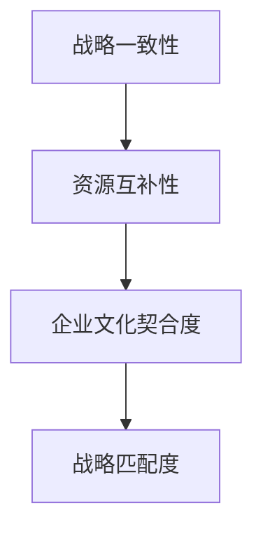
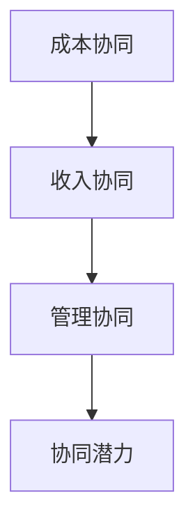
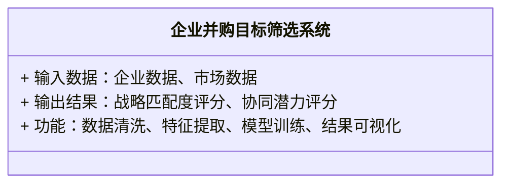
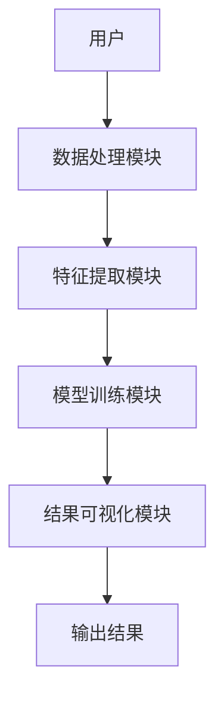
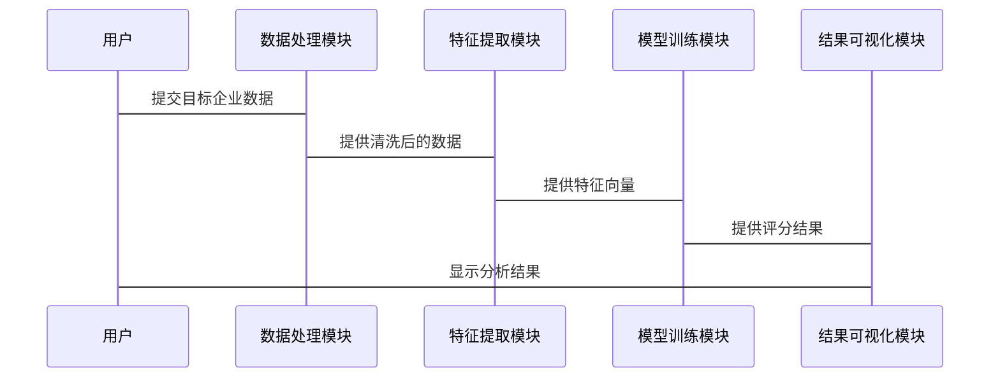

                 


# AI辅助企业并购目标筛选：战略匹配度评估与协同潜力分析

> 关键词：企业并购、人工智能、战略匹配度、协同潜力、AI算法

> 摘要：本文深入探讨了AI技术在企业并购目标筛选中的应用，重点分析了战略匹配度评估与协同潜力分析的核心方法。通过结合机器学习和深度学习算法，本文提出了一个基于AI的企业并购目标筛选框架，详细讲解了从数据准备到模型构建的整个过程，并通过实际案例展示了该框架的应用效果。

---

## 第1章: 企业并购与AI技术的结合

### 1.1 企业并购的基本概念
#### 1.1.1 企业并购的定义与类型
企业并购是指一家企业收购另一家企业，以实现资源优化配置和业务扩展。常见的并购类型包括横向并购、纵向并购和混合并购。  
- **横向并购**：在同一行业内收购竞争对手，以扩大市场份额。  
- **纵向并购**：在供应链上下游收购企业，以增强垂直整合能力。  
- **混合并购**：跨行业收购，以实现业务多元化。

#### 1.1.2 企业并购的动机与目标
企业并购的动机主要包括：  
1. **扩大市场份额**：通过并购快速进入新市场或巩固现有市场地位。  
2. **获取技术或资源**：通过并购获得关键技术、专利或原材料供应渠道。  
3. **降低竞争压力**：通过并购减少市场竞争，提升行业集中度。  
4. **优化成本结构**：通过并购实现规模效应，降低单位成本。  

#### 1.1.3 企业并购的挑战与风险
企业并购面临的主要挑战包括：  
1. **信息不对称**：并购双方的信息不透明可能导致估值偏差。  
2. **整合风险**：并购后的组织文化、管理风格差异可能导致整合失败。  
3. **法律与监管风险**：并购可能面临反垄断法等法规的限制。  
4. **财务风险**：并购可能带来债务负担和资产减值风险。  

---

### 1.2 AI技术在企业并购中的应用背景
#### 1.2.1 AI技术的发展与企业应用的契合
近年来，人工智能技术在企业中的应用日益广泛。AI技术可以帮助企业更高效地处理海量数据，发现隐藏的模式和趋势，为决策提供支持。  

#### 1.2.2 企业并购中的信息不对称问题
企业并购中的信息不对称是导致并购失败的重要原因。AI技术可以通过大数据分析，帮助买方更全面地了解目标企业的财务状况、市场表现和潜在风险。  

#### 1.2.3 数据驱动决策的兴起
传统的企业决策更多依赖于经验判断，而数据驱动决策通过分析海量数据，能够更准确地预测并购后的协同效应和整合风险。  

---

### 1.3 AI辅助企业并购的必要性与优势
#### 1.3.1 传统企业并购筛选的局限性
传统的企业并购筛选过程通常依赖于手动分析，效率低且容易出错。此外，传统方法难以量化并购后的协同效应和整合风险。  

#### 1.3.2 AI在并购目标筛选中的独特价值
AI技术可以帮助企业快速筛选出符合条件的并购目标，并通过数据分析量化战略匹配度和协同潜力，从而提高并购成功的概率。  

#### 1.3.3 数据分析与AI算法的结合优势
通过结合数据分析和AI算法，企业可以更精准地评估并购目标的价值，发现潜在的协同效应，并优化并购后的整合策略。  

---

## 第2章: 战略匹配度与协同潜力的核心概念

### 2.1 战略匹配度的定义与评估维度
#### 2.1.1 战略匹配度的内涵
战略匹配度是指并购双方在战略目标、核心能力和资源上的互补性。  

#### 2.1.2 战略匹配度的评估维度
| 维度 | 描述 |
|------|------|
| 战略一致性 | 并购双方的长期战略目标是否一致。 |
| 资源互补性 | 并购双方是否在资金、技术、市场等方面具有互补性。 |
| 企业文化契合度 | 并购双方的企业文化是否能够融合。 |

#### 2.1.3 战略匹配度的评估模型


---

### 2.2 协同潜力的定义与分析维度
#### 2.2.1 协同潜力的内涵
协同潜力是指并购后双方在业务、技术和管理上的协同效应，通常包括成本协同、收入协同和管理协同。  

#### 2.2.2 协同潜力的分析维度
| 维度 | 描述 |
|------|------|
| 成本协同 | 并购后双方是否能够通过整合降低成本。 |
| 收入协同 | 并购后双方是否能够通过市场协同增加收入。 |
| 管理协同 | 并购后双方是否能够通过管理经验共享提升效率。 |

#### 2.2.3 协同潜力的评估模型


---

### 2.3 战略匹配度与协同潜力的关系
#### 2.3.1 两者之间的相互影响
战略匹配度是协同潜力的基础，而协同潜力则是战略匹配度的体现。只有在战略匹配度较高的情况下，才能实现较高的协同潜力。  

#### 2.3.2 如何通过AI技术量化两者的关系
AI技术可以通过机器学习模型量化战略匹配度和协同潜力之间的关系，例如通过回归分析确定两者之间的相关性。  

---

## 第3章: 战略匹配度与协同潜力的模型构建

### 3.1 模型构建的基本框架
#### 3.1.1 数据来源与处理
- **数据来源**：包括目标企业的财务数据、市场数据、管理数据等。  
- **数据处理**：包括数据清洗、特征提取和数据归一化。  

#### 3.1.2 模型的输入与输出
- **输入**：目标企业的各项指标（如收入、利润、市场份额等）。  
- **输出**：战略匹配度和协同潜力的评分。  

---

### 3.2 战略匹配度评估模型
#### 3.2.1 模型的输入特征
| 特征 | 描述 |
|------|------|
| 企业规模 | 目标企业的收入、员工数量等。 |
| 行业匹配度 | 并购双方所处行业的相似性。 |
| 技术水平 | 目标企业的技术专利数量和质量。 |

#### 3.2.2 模型的评估指标
| 指标 | 描述 |
|------|------|
| 准确率 | 模型预测的准确程度。 |
| 召回率 | 模型预测的召回程度。 |
| F1分数 | 准确率和召回率的调和平均数。 |

---

### 3.3 协同潜力分析模型
#### 3.3.1 模型的输入特征
| 特征 | 描述 |
|------|------|
| 成本协同潜力 | 并购后双方的成本协同效应。 |
| 收入协同潜力 | 并购后双方的收入协同效应。 |
| 管理协同潜力 | 并购后双方的管理协同效应。 |

#### 3.3.2 模型的评估指标
| 指标 | 描述 |
|------|------|
| 协同效应评分 | 并购后双方的协同效应评分。 |
| 整合难度 | 并购后整合的难易程度。 |
| 协同潜力指数 | 协同潜力的综合评分。 |

---

### 3.4 模型的综合评估与优化
#### 3.4.1 模型的综合评估方法
- **交叉验证**：通过多次训练和测试，评估模型的稳定性和泛化能力。  
- **ROC曲线**：评估模型的分类性能。  

#### 3.4.2 模型的优化与调优策略
- **参数调整**：通过网格搜索优化模型参数。  
- **特征选择**：通过特征重要性分析选择关键特征。  

---

## 第4章: AI算法在战略匹配度与协同潜力分析中的应用

### 4.1 常见AI算法简介
#### 4.1.1 机器学习算法
- **决策树**：适用于分类问题。  
- **随机森林**：适用于分类和回归问题。  
- **支持向量机（SVM）**：适用于分类和回归问题。  

#### 4.1.2 深度学习算法
- **神经网络**：适用于复杂非线性关系的建模。  
- **LSTM**：适用于时间序列数据的建模。  

#### 4.1.3 自然语言处理（NLP）算法
- **词嵌入（Word2Vec）**：将词语转换为向量表示。  
- **文本分类**：用于分析企业新闻和财报中的文本信息。  

---

### 4.2 算法在战略匹配度评估中的应用
#### 4.2.1 基于机器学习的战略匹配度评估
```python
from sklearn.ensemble import RandomForestClassifier
from sklearn.metrics import accuracy_score

# 数据准备
X_train, X_test, y_train, y_test = train_test_split(X, y, test_size=0.2)

# 模型训练
model = RandomForestClassifier()
model.fit(X_train, y_train)

# 模型预测
y_pred = model.predict(X_test)

# 模型评估
print("准确率:", accuracy_score(y_test, y_pred))
```

#### 4.2.2 基于深度学习的战略匹配度预测
```python
import tensorflow as tf
from tensorflow.keras import layers

# 数据准备
X_train, X_test, y_train, y_test = train_test_split(X, y, test_size=0.2)

# 模型构建
model = tf.keras.Sequential()
model.add(layers.Dense(64, activation='relu', input_shape=(n_features,)))
model.add(layers.Dense(1, activation='sigmoid'))

# 模型训练
model.compile(optimizer='adam', loss='binary_crossentropy', metrics=['accuracy'])
model.fit(X_train, y_train, epochs=10, batch_size=32)

# 模型预测
y_pred = model.predict(X_test)
```

---

### 4.3 算法在协同潜力分析中的应用
#### 4.3.1 基于机器学习的协同潜力分析
```python
from sklearn.linear_model import LinearRegression
from sklearn.metrics import r2_score

# 数据准备
X_train, X_test, y_train, y_test = train_test_split(X, y, test_size=0.2)

# 模型训练
model = LinearRegression()
model.fit(X_train, y_train)

# 模型预测
y_pred = model.predict(X_test)

# 模型评估
print("R²分数:", r2_score(y_test, y_pred))
```

#### 4.3.2 基于深度学习的协同潜力预测
```python
import tensorflow as tf
from tensorflow.keras import layers

# 数据准备
X_train, X_test, y_train, y_test = train_test_split(X, y, test_size=0.2)

# 模型构建
model = tf.keras.Sequential()
model.add(layers.Dense(64, activation='relu', input_shape=(n_features,)))
model.add(layers.Dense(1, activation='sigmoid'))

# 模型训练
model.compile(optimizer='adam', loss='mean_squared_error', metrics=['mae'])
model.fit(X_train, y_train, epochs=10, batch_size=32)

# 模型预测
y_pred = model.predict(X_test)
```

---

## 第5章: 系统架构设计与实现

### 5.1 问题场景介绍
企业并购目标筛选系统需要满足以下需求：  
- 快速筛选出符合条件的并购目标。  
- 量化并购目标的战略匹配度和协同潜力。  
- 提供可视化的分析结果。  

---

### 5.2 系统功能设计
#### 5.2.1 领域模型


#### 5.2.2 系统架构


---

### 5.3 接口设计
#### 5.3.1 数据接口
- **输入接口**：接收目标企业的数据。  
- **输出接口**：返回战略匹配度和协同潜力的评分。  

#### 5.3.2 用户接口
- **可视化界面**：展示分析结果。  
- **交互界面**：允许用户调整参数和查看详细信息。  

---

### 5.4 交互流程


---

## 第6章: 项目实战与总结

### 6.1 环境安装
- **Python**：安装Python 3.8及以上版本。  
- **依赖库**：安装`scikit-learn`、`tensorflow`、`pandas`、`numpy`等库。  

---

### 6.2 核心代码实现
#### 6.2.1 数据清洗
```python
import pandas as pd
import numpy as np

# 读取数据
df = pd.read_csv('企业数据.csv')

# 删除缺失值
df = df.dropna()

# 标准化处理
from sklearn.preprocessing import StandardScaler
scaler = StandardScaler()
df_scaled = pd.DataFrame(scaler.fit_transform(df), columns=df.columns)
```

#### 6.2.2 模型训练
```python
from sklearn.ensemble import RandomForestClassifier

# 划分训练集和测试集
X_train, X_test, y_train, y_test = train_test_split(df_scaled, df['目标变量'], test_size=0.2)

# 模型训练
model = RandomForestClassifier()
model.fit(X_train, y_train)

# 模型预测
y_pred = model.predict(X_test)
```

---

### 6.3 案例分析
假设我们有两家目标企业A和B，分别属于同一行业，但A的技术实力更强，而B的市场份额更大。通过AI模型评估，我们发现A的战略匹配度更高，但B的协同潜力更大。因此，企业可以选择B作为并购目标，以实现更高的协同效应。

---

### 6.4 项目小结
通过本项目，我们成功构建了一个基于AI的企业并购目标筛选系统，能够量化战略匹配度和协同潜力，为企业的并购决策提供了有力支持。未来，我们可以进一步优化模型，引入更多数据源，提升模型的准确性和实用性。

---

## 第7章: 最佳实践与总结

### 7.1 最佳实践
1. **数据质量**：确保数据的准确性和完整性。  
2. **模型调优**：通过交叉验证和网格搜索优化模型性能。  
3. **结果解释**：对模型的输出结果进行深入分析，确保结果的可解释性。  

### 7.2 小结
本文详细介绍了AI技术在企业并购目标筛选中的应用，从战略匹配度评估到协同潜力分析，构建了一个完整的解决方案。通过实际案例的分析，我们验证了该方法的有效性和实用性。

### 7.3 注意事项
- **数据隐私**：在处理企业数据时，需要注意数据隐私和合规性。  
- **模型解释性**：在实际应用中，需要确保模型的可解释性，以便更好地向业务部门解释结果。  
- **持续优化**：定期更新模型和数据，以适应市场变化和技术进步。  

### 7.4 拓展阅读
- **相关书籍**：《企业并购：理论与实践》  
- **技术资料**：《机器学习实战》、《深度学习入门》  

--- 

通过以上内容，我们详细讲解了AI辅助企业并购目标筛选的核心方法，从理论到实践，帮助读者全面理解如何利用AI技术提升企业并购的效率和成功率。

