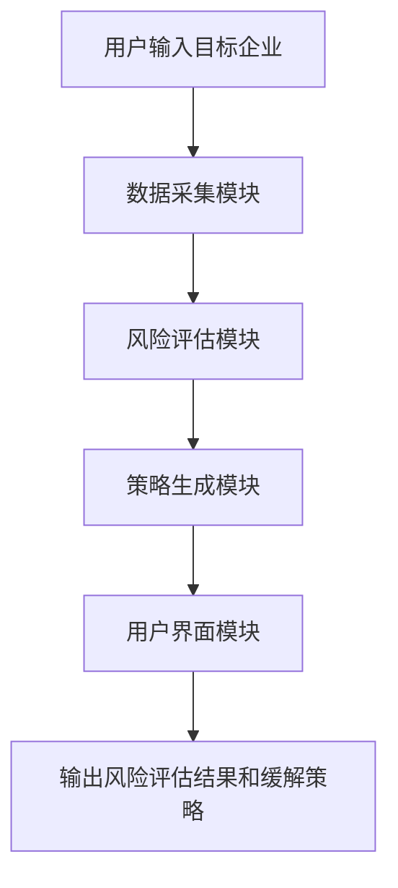
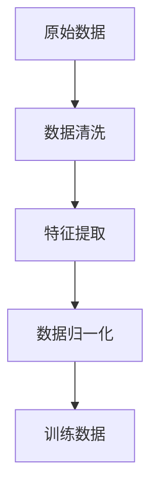
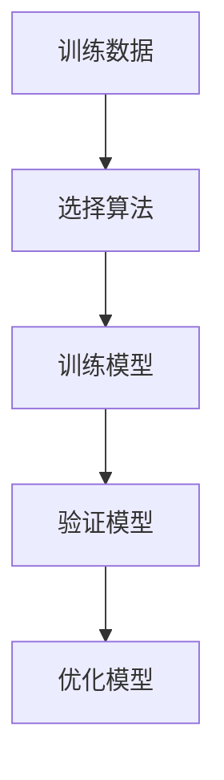
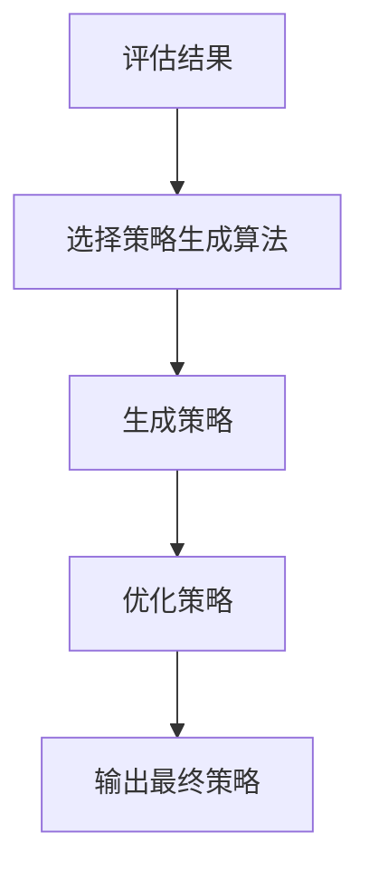
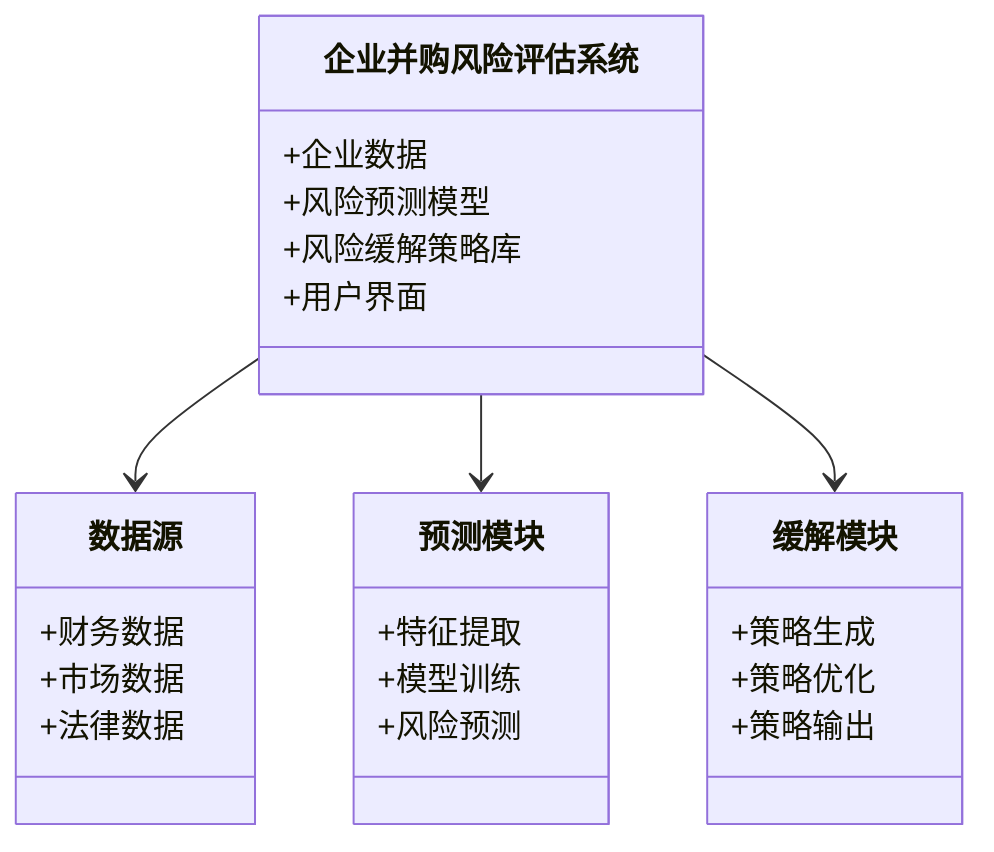

                 


# AI辅助企业并购风险评估与缓解策略

> 关键词：AI, 企业并购, 风险评估, 风险缓解, 机器学习, 数据分析

> 摘要：随着企业并购活动的日益频繁，风险评估与缓解成为并购成功的关键因素。本文将从AI技术的角度，详细探讨企业并购风险评估的核心概念、算法原理、系统架构，并结合实际案例，分析AI在企业并购风险评估中的应用优势与实践策略。

---

# 第一部分：企业并购与AI辅助风险评估概述

## 第1章：企业并购风险评估的背景与挑战

### 1.1 企业并购的基本概念

#### 1.1.1 企业并购的定义与类型

企业并购（Mergers and Acquisitions，M&A）是指两个或多个企业之间通过合并、收购或其他方式，将两个或多个独立的法律实体合并为一个实体，或取得一个企业的控制权。并购可以分为以下几种类型：

- **横向并购**：同一行业内的企业并购，目的是扩大市场份额或消除竞争。
- **纵向并购**：产业链上下游的企业并购，目的是整合供应链或销售渠道。
- **混合并购**：与企业主营业务无直接关联的并购，通常是为了 diversification 或获取新技术/资源。

#### 1.1.2 并购的动机与目标

企业进行并购的主要动机包括：

1. **扩大市场份额**：通过并购快速进入新市场或增强市场地位。
2. **获取技术或资源**：通过并购获取关键技术和资源，提升竞争力。
3. **降低成本**：通过并购实现规模效应，降低生产或运营成本。
4. ** diversification**：通过并购进入新的业务领域，分散风险。

#### 1.1.3 并购中的主要风险类型

企业并购过程中面临的主要风险包括：

1. **财务风险**：包括高负债、商誉减值等。
2. **经营风险**：被并购企业可能隐藏经营问题或无法实现预期业绩。
3. **法律风险**：包括反垄断审查、知识产权纠纷等。
4. **整合风险**：文化差异、管理冲突可能导致整合失败。

---

### 1.2 AI技术在企业并购中的应用潜力

#### 1.2.1 AI技术的核心优势

人工智能（AI）技术在企业并购中的应用优势主要体现在以下几个方面：

1. **数据处理能力**：AI能够快速处理海量数据，提取关键信息。
2. **预测能力**：通过机器学习算法，AI可以预测并购后的经营表现和潜在风险。
3. **自动化决策支持**：AI可以帮助企业在并购决策中提供实时、动态的决策支持。

#### 1.2.2 AI在风险评估中的应用场景

AI技术在企业并购风险评估中的应用场景包括：

1. **目标企业筛选**：通过AI分析潜在目标企业的财务、市场和法律数据，筛选出符合条件的企业。
2. **风险预测**：利用机器学习模型预测并购后的财务风险、经营风险等。
3. **整合规划**：AI可以帮助制定并购后的整合计划，降低整合风险。

#### 1.2.3 AI辅助并购的未来趋势

随着AI技术的不断发展，未来企业并购将更加依赖AI技术来提高效率和准确性。AI在以下方面具有广阔的应用前景：

1. **实时风险监控**：通过实时数据分析，动态监控并购后的风险。
2. **智能谈判支持**：AI可以辅助谈判团队制定最优策略，降低谈判风险。
3. **个性化并购建议**：基于企业的具体情况，提供定制化的并购建议。

---

### 1.3 本章小结

本章从企业并购的基本概念出发，分析了并购的动机、目标和主要风险类型。随后，探讨了AI技术在企业并购中的应用潜力，重点介绍了AI的核心优势、应用场景和未来发展趋势。通过本章的分析，我们可以看到，AI技术正在逐步成为企业并购风险管理的重要工具。

---

## 第2章：企业并购风险评估的核心概念

### 2.1 并购风险的定义与分类

#### 2.1.1 并购风险的定义

并购风险是指企业在并购过程中及并购后可能面临的各种风险，包括财务风险、经营风险、法律风险和整合风险等。

#### 2.1.2 并购风险的主要类型

并购风险可以分为以下几类：

1. **财务风险**：包括高负债、商誉减值等财务问题。
2. **经营风险**：被并购企业可能存在的经营不善、市场竞争力不足等问题。
3. **法律风险**：包括反垄断审查、知识产权纠纷等法律问题。
4. **整合风险**：文化差异、管理冲突可能导致整合失败。

#### 2.1.3 各类风险的特征对比

以下是各类风险的特征对比：

| 风险类型   | 主要特征                          |
|------------|----------------------------------|
| 财务风险    | 高负债、商誉减值、现金流问题    |
| 经营风险    | 业绩不达预期、市场竞争激烈      |
| 法律风险    | 反垄断审查、知识产权纠纷        |
| 整合风险    | 文化冲突、管理不善、协同效应不足|

---

### 2.2 AI辅助风险评估的核心要素

#### 2.2.1 数据来源与处理

AI辅助风险评估的数据来源包括：

1. **财务数据**：包括收入、利润、负债等财务指标。
2. **市场数据**：包括行业趋势、竞争分析、市场规模等。
3. **法律数据**：包括企业合规性、诉讼记录等。

#### 2.2.2 风险预测模型

AI辅助风险评估的核心是构建一个有效的风险预测模型。常用的模型包括：

1. **逻辑回归**：用于分类问题，预测并购成功的概率。
2. **支持向量机（SVM）**：用于分类和回归问题，适用于高维数据。
3. **随机森林**：用于分类和回归问题，具有较强的抗过拟合能力。

#### 2.2.3 风险缓解策略

基于AI的风险评估结果，可以制定以下风险缓解策略：

1. **分散投资**：通过投资多个项目分散风险。
2. **加强监控**：并购后加强对企业运营的监控。
3. **优化整合**：制定详细的整合计划，降低整合风险。

---

### 2.3 企业并购风险评估的系统架构

#### 2.3.1 系统功能模块

企业并购风险评估系统主要包括以下功能模块：

1. **数据采集模块**：负责采集目标企业的各项数据。
2. **风险评估模块**：基于机器学习算法，评估并购风险。
3. **策略生成模块**：根据评估结果生成风险缓解策略。
4. **用户界面模块**：提供友好的用户界面，方便用户操作。

#### 2.3.2 数据流与信息交互

以下是系统数据流与信息交互的流程图：



#### 2.3.3 系统边界与外延

系统边界包括数据采集模块、风险评估模块、策略生成模块和用户界面模块。系统的外延包括外部数据源（如财务数据、市场数据）和用户（如企业高管、并购顾问）。

---

### 2.4 本章小结

本章详细介绍了企业并购风险评估的核心概念，包括并购风险的定义与分类、AI辅助风险评估的核心要素以及系统架构设计。通过本章的分析，我们可以清晰地了解AI技术在企业并购风险评估中的重要作用。

---

## 第3章：AI辅助企业并购风险评估的算法原理

### 3.1 机器学习在风险评估中的应用

#### 3.1.1 机器学习的基本原理

机器学习是一种通过数据训练模型，使其能够从数据中学习并做出预测的技术。常用算法包括监督学习、无监督学习和强化学习。

#### 3.1.2 常见的机器学习算法

在企业并购风险评估中，常用的机器学习算法包括：

1. **逻辑回归**：用于分类问题，预测并购成功的概率。
2. **支持向量机（SVM）**：用于分类和回归问题，适用于高维数据。
3. **随机森林**：用于分类和回归问题，具有较强的抗过拟合能力。

---

### 3.2 风险预测模型的构建

#### 3.2.1 数据预处理与特征提取

数据预处理包括数据清洗、特征提取和数据归一化。以下是数据预处理的流程图：



#### 3.2.2 模型训练与验证

模型训练包括选择算法、训练模型和验证模型。以下是模型训练的流程图：



---

### 3.3 基于AI的风险缓解策略生成

#### 3.3.1 策略生成的算法选择

基于AI的风险缓解策略生成算法包括：

1. **遗传算法**：用于优化策略组合。
2. **强化学习**：用于动态调整策略。

#### 3.3.2 策略生成的逻辑流程

以下是策略生成的逻辑流程图：



---

### 3.4 本章小结

本章详细介绍了机器学习在企业并购风险评估中的应用，包括数据预处理、模型训练和策略生成的算法选择与逻辑流程。通过本章的分析，我们可以深入了解AI技术在企业并购风险评估中的具体实现。

---

## 第4章：系统分析与架构设计方案

### 4.1 问题场景介绍

#### 4.1.1 并购风险评估的典型场景

企业并购风险评估的典型场景包括：

1. **目标企业筛选**：通过AI技术筛选出符合条件的目标企业。
2. **风险预测**：预测并购后的财务风险和经营风险。
3. **整合规划**：制定并购后的整合计划，降低整合风险。

---

### 4.2 系统功能设计

#### 4.2.1 领域模型设计（Mermaid类图）

以下是系统功能模块的类图：



---

### 4.3 本章小结

本章详细介绍了系统分析与架构设计方案，包括问题场景介绍和系统功能设计。通过本章的分析，我们可以清晰地了解AI技术在企业并购风险评估中的系统实现。

---

## 第5章：项目实战

### 5.1 环境安装与配置

#### 5.1.1 安装Python

安装Python环境，推荐使用Anaconda。

#### 5.1.2 安装机器学习库

安装以下机器学习库：

```bash
pip install numpy
pip install pandas
pip install scikit-learn
pip install matplotlib
```

---

### 5.2 系统核心实现源代码

#### 5.2.1 数据预处理代码

```python
import pandas as pd
import numpy as np

# 加载数据
data = pd.read_csv('merger_data.csv')

# 数据清洗
data.dropna(inplace=True)

# 特征提取
X = data[['revenue', 'profit', 'market_share']]
y = data['success']  # 成功标志

# 数据归一化
from sklearn.preprocessing import StandardScaler
scaler = StandardScaler()
X_scaled = scaler.fit_transform(X)
```

#### 5.2.2 模型训练代码

```python
from sklearn.model import LogisticRegression

# 训练模型
model = LogisticRegression()
model.fit(X_scaled, y)

# 预测结果
predicted = model.predict(X_scaled)
```

---

### 5.3 实际案例分析

#### 5.3.1 案例背景

假设我们有一家科技公司A计划并购另一家科技公司B。我们希望通过AI技术评估并购风险。

#### 5.3.2 数据分析

分析公司B的财务数据、市场数据和法律数据，构建风险评估模型。

#### 5.3.3 风险预测与策略生成

基于模型预测结果，生成风险缓解策略，例如加强整合管理、优化财务管理等。

---

### 5.4 本章小结

本章通过实际案例分析，展示了AI技术在企业并购风险评估中的具体应用。通过本章的分析，我们可以更好地理解AI技术在企业并购中的实际价值。

---

## 第6章：最佳实践与总结

### 6.1 最佳实践 tips

1. **数据质量**：确保数据的准确性和完整性。
2. **模型选择**：根据具体情况选择合适的算法。
3. **实时监控**：并购后持续监控风险。

---

### 6.2 总结

通过本文的详细分析，我们可以看到AI技术在企业并购风险评估中的巨大潜力。AI技术可以帮助企业在并购过程中降低风险，提高并购成功率。未来，随着AI技术的不断发展，企业并购将更加依赖AI技术来提高效率和准确性。

---

### 6.3 注意事项

1. **数据隐私**：注意保护企业数据隐私。
2. **模型解释性**：确保模型的可解释性。
3. **持续优化**：定期优化模型和策略。

---

### 6.4 拓展阅读

1. **《机器学习实战》**：学习机器学习的基本原理和算法。
2. **《企业并购风险管理》**：深入了解企业并购的风险管理策略。

---

# 结语

通过本文的详细分析，我们可以看到AI技术在企业并购风险评估中的巨大潜力。AI技术可以帮助企业在并购过程中降低风险，提高并购成功率。未来，随着AI技术的不断发展，企业并购将更加依赖AI技术来提高效率和准确性。

