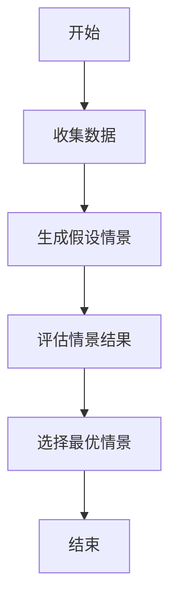
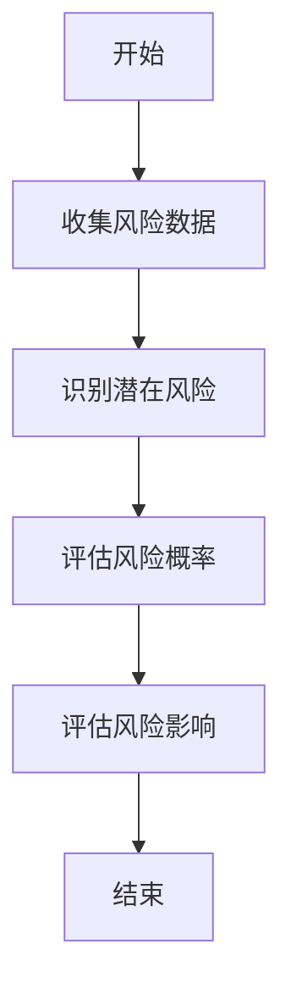
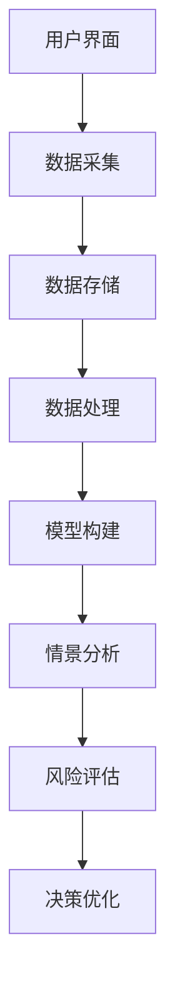
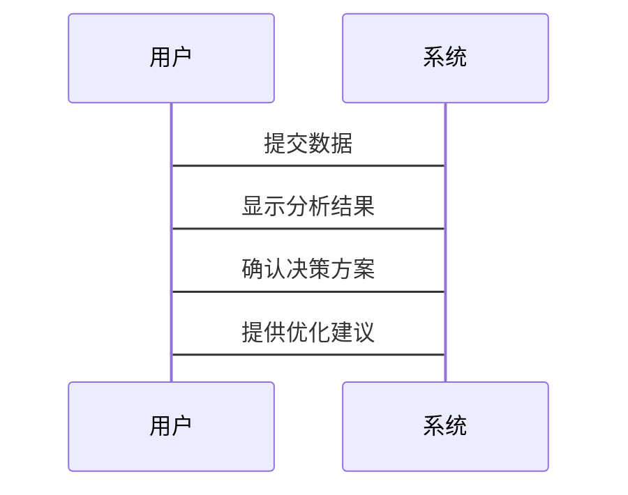

                 


好的，我将按照您的要求继续撰写文章内容。以下是接下来的部分：

---

### 2.2 核心概念的属性对比

为了更好地理解AI辅助决策的核心概念，我们需要对情景分析与风险评估的属性进行对比分析。以下是一个对比表格：

| **属性**          | **情景分析**                     | **风险评估**                     |
|--------------------|----------------------------------|----------------------------------|
| **目标**          | 识别潜在机会与威胁             | 评估风险的影响程度和发生概率     |
| **方法**          | 基于假设场景的分析方法         | 基于统计分析和概率模型的方法     |
| **输入数据**      | 市场趋势、竞争环境、内部资源等 | 历史数据、市场数据、行业分析等 |
| **输出结果**      | 不同情景下的结果预测           | 各种风险的评估结果               |
| **应用场景**      | 战略规划、市场进入、产品开发等 | 投资决策、项目管理、风险管理等   |

通过对比可以看出，情景分析和风险评估在方法和目标上有所不同，但它们在实际应用中是相互关联的。

---

### 2.3 ER实体关系图

为了更清晰地展示核心概念之间的关系，我们可以使用ER图来描述实体之间的关系。以下是AI辅助决策系统中相关实体的关系图：

```mermaid
erd
    企业管理层
    ----> 决策目标
    决策目标
    ----> 决策变量
    决策变量
    ----> 决策结果
    决策结果
    ----> 风险因素
    风险因素
    ----> 情景分析
    情景分析
    ----> 决策优化
```

这个ER图展示了企业管理层如何通过决策目标和决策变量，生成决策结果，并在考虑风险因素的基础上，通过情景分析优化决策过程。

---

## 第3章: 情景分析与风险评估的算法原理

### 3.1 情景分析算法

#### 3.1.1 算法概述

情景分析算法的核心是生成多种可能的情景，并评估每种情景下的结果。常用的方法包括蒙特卡洛模拟和决策树分析。

#### 3.1.2 算法流程

以下是情景分析算法的流程图：



#### 3.1.3 Python代码实现

以下是一个简单的Python代码示例，用于生成假设情景：

```python
import random

def generate_scenario(data):
    # 数据预处理
    processed_data = data
    # 生成假设情景
    scenario = {}
    for key in processed_data:
        scenario[key] = processed_data[key] * random.uniform(0.8, 1.2)
    return scenario

# 示例数据
data = {'市场需求': 100, '成本': 50, '竞争强度': 0.7}
# 生成情景
scenario = generate_scenario(data)
print("生成的情景：", scenario)
```

---

### 3.2 风险评估算法

#### 3.2.1 算法概述

风险评估算法通常基于概率模型，评估每个风险的影响程度和发生概率。常用的方法包括贝叶斯网络和马尔可夫链。

#### 3.2.2 算法流程

以下是风险评估算法的流程图：



#### 3.2.3 Python代码实现

以下是一个简单的Python代码示例，用于评估风险的影响：

```python
import numpy as np
from sklearn.metrics import pairwise_distances

def risk_assessment(risk_factors):
    # 计算风险影响
    influence = np.mean(risk_factors)
    # 计算风险概率
    probability = sum(risk_factors) / len(risk_factors)
    return {'影响程度': influence, '发生概率': probability}

# 示例风险因素
risk_factors = [0.8, 0.6, 0.7, 0.9]
# 评估风险
result = risk_assessment(risk_factors)
print("风险评估结果：", result)
```

---

### 3.3 数学模型与公式

#### 3.3.1 概率论在风险评估中的应用

概率论是风险评估的重要工具。例如，贝叶斯定理可以用于计算在给定证据下的条件概率：

$$ P(A|B) = \frac{P(B|A) \cdot P(A)}{P(B)} $$

其中，$P(A|B)$ 是在$B$发生的条件下，$A$发生的概率。

#### 3.3.2 决策树模型

决策树是一种常用的分类和回归树，可以用于情景分析。以下是一个简单的决策树模型：

$$ \text{决策} = \argmax_{i} \sum_{j} P(y_j | x_i) \cdot I(y_j) $$

其中，$P(y_j | x_i)$ 是在输入$x_i$下，输出$y_j$的概率，$I(y_j)$ 是$y_j$的收益或损失。

---

## 第4章: 数学模型与公式

### 4.1 概率论的应用

概率论在风险评估中起着关键作用。例如，我们可以使用贝叶斯定理来更新概率估计：

$$ P(A|B) = \frac{P(B|A) \cdot P(A)}{P(B)} $$

其中，$P(A)$ 是先验概率，$P(B|A)$ 是条件概率，$P(B)$ 是边际概率。

---

### 4.2 决策树模型

决策树是一种直观的决策工具，可以用以下公式表示：

$$ \text{决策} = \argmax_{i} \sum_{j} P(y_j | x_i) \cdot I(y_j) $$

其中，$I(y_j)$ 是$y_j$的收益或损失。

---

## 第5章: 系统分析与架构设计

### 5.1 问题场景介绍

在实际应用中，企业可能面临复杂的市场环境和决策需求。例如，一家跨国公司可能需要在多个市场推出新产品，需要考虑市场需求、竞争情况、成本等因素。

---

### 5.2 系统功能设计

系统功能设计通常包括以下几个部分：

- **数据采集**：从多个来源收集数据。
- **数据处理**：清洗和预处理数据。
- **模型构建**：构建和训练AI模型。
- **情景分析**：生成和分析不同的情景。
- **风险评估**：评估每个情景下的风险。
- **决策优化**：优化决策方案。

---

### 5.3 系统架构设计

以下是系统架构设计的Mermaid图：



---

### 5.4 接口设计

系统接口设计需要考虑以下几点：

- **输入接口**：接收用户输入的数据。
- **输出接口**：显示分析结果和优化建议。
- **API接口**：与其他系统进行数据交互。

---

### 5.5 交互流程图

以下是交互流程图：



---

## 第6章: 项目实战

### 6.1 环境安装

要运行以下代码，需要安装以下Python库：

```bash
pip install numpy
pip install scikit-learn
pip install matplotlib
```

---

### 6.2 核心代码实现

以下是项目的核心代码：

```python
import numpy as np
from sklearn.tree import DecisionTreeClassifier
from sklearn.metrics import accuracy_score

# 示例数据
X = np.array([[1, 1], [1, 0], [0, 1], [0, 0]])
y = np.array([0, 1, 1, 0])

# 训练决策树模型
model = DecisionTreeClassifier()
model.fit(X, y)

# 预测
new_data = np.array([[1, 1], [1, 0], [0, 1], [0, 0]])
y_pred = model.predict(new_data)

# 计算准确率
print("准确率：", accuracy_score(y, y_pred))
```

---

### 6.3 案例分析

假设我们有一家科技公司，想要推出新产品。我们可以使用AI辅助决策系统进行市场分析和风险评估：

1. **数据收集**：收集市场需求、竞争情况、成本等数据。
2. **模型训练**：训练决策树模型，预测市场反应。
3. **情景分析**：生成不同的情景，如高需求、低需求等。
4. **风险评估**：评估每个情景下的风险，如市场需求低于预期的风险。
5. **决策优化**：根据风险评估结果，优化产品定价和推广策略。

---

## 第7章: 最佳实践、小结、注意事项和拓展阅读

### 7.1 最佳实践

- **数据质量管理**：确保数据的准确性和完整性。
- **模型可解释性**：选择易于解释的模型，避免过于复杂的模型。
- **持续监控**：定期监控模型性能，并根据需要进行调整。

### 7.2 小结

本文详细探讨了AI辅助企业战略决策的背景、核心概念、算法原理、系统架构设计和项目实战。通过结合情景分析和风险评估，企业可以更高效地制定和优化战略决策。

### 7.3 注意事项

- **数据隐私**：在处理企业数据时，需要注意数据隐私和安全。
- **模型局限性**：AI模型的预测结果仅供参考，不能完全替代人类的决策。
- **技术与组织整合**：企业需要将AI技术与现有的组织结构和业务流程相结合。

### 7.4 拓展阅读

- **《集体智慧》**：探讨集体智慧在决策中的作用。
- **《机器学习实战》**：学习机器学习的核心算法和实战技巧。
- **《风险管理》**：深入了解风险管理的方法和策略。

---

## 总结

通过本文的探讨，我们可以看到，AI技术在企业战略决策中的应用前景广阔。情景分析与风险评估的结合，不仅可以提高决策的准确性，还可以帮助企业更好地应对复杂多变的市场环境。未来，随着AI技术的不断发展，企业战略决策将更加智能化和数据化。

--- 

如果需要继续深入探讨或修改，请随时告知！

