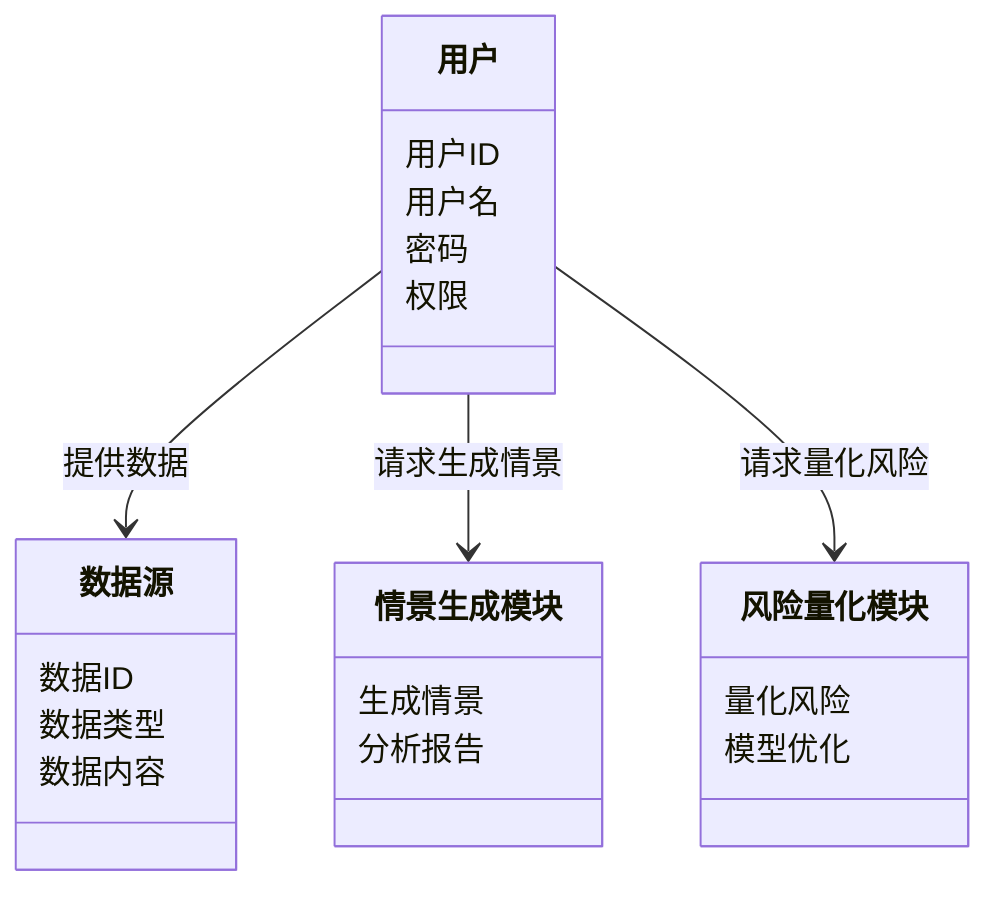
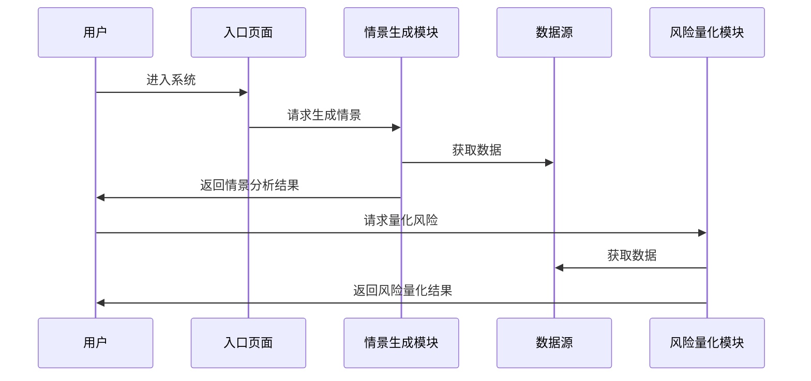

                 


# AI辅助企业战略决策：情景分析与风险量化模型

> 关键词：AI技术，战略决策，情景分析，风险量化，企业决策

> 摘要：随着人工智能技术的飞速发展，企业战略决策的复杂性和不确定性也在不断增加。传统的决策方法已经难以应对快速变化的商业环境。本文将探讨如何利用AI技术辅助企业进行战略决策，重点分析情景分析与风险量化模型的核心概念、方法及其在企业中的应用。通过构建数学模型和系统架构设计，本文旨在为企业提供一种高效、科学的决策支持工具，从而在复杂多变的商业环境中做出最优决策。

---

## 第1章: AI辅助企业战略决策的背景与意义

### 1.1 企业战略决策的传统模式

#### 1.1.1 传统战略决策的特点
- 线性思维：基于逻辑推理和经验判断。
- 依赖专家：高度依赖个人或团队的经验。
- 低效性：决策过程耗时长，且缺乏数据支持。

#### 1.1.2 传统战略决策的局限性
- 信息不全面：难以整合多源异构数据。
- 可预测性差：难以应对复杂多变的市场环境。
- 主观性高：决策结果可能受个人偏见影响。

#### 1.1.3 传统战略决策的演变过程
- 从经验决策到数据决策。
- 从单点决策到全局优化。
- 从静态决策到动态调整。

### 1.2 AI技术对企业战略决策的变革

#### 1.2.1 AI技术的核心优势
- 数据处理能力：快速处理海量数据，提取关键信息。
- 自动化学习：通过机器学习算法不断优化决策模型。
- 智能预测：基于历史数据和模式识别，预测未来趋势。

#### 1.2.2 AI在战略决策中的应用潜力
- **市场预测**：利用自然语言处理（NLP）分析市场动态。
- **竞争分析**：通过深度学习识别竞争对手的战略意图。
- **风险评估**：基于概率模型量化潜在风险。

#### 1.2.3 企业数字化转型的必然趋势
- 技术驱动：AI技术的成熟为企业决策提供了新的工具。
- 市场需求：企业需要更高效、更准确的决策支持。
- 竞争压力：数字化转型成为企业生存和发展的关键。

### 1.3 情景分析与风险量化模型的必要性

#### 1.3.1 情景分析的定义与作用
- **定义**：情景分析是一种通过构建不同场景来评估潜在结果的方法。
- **作用**：帮助企业在复杂环境中识别机会和风险。

#### 1.3.2 风险量化模型的定义与作用
- **定义**：风险量化模型是通过数学方法评估风险大小和影响程度的工具。
- **作用**：为企业提供量化依据，支持决策者制定应对策略。

#### 1.3.3 情景分析与风险量化模型的结合
- **整合优势**：情景分析提供多维视角，风险量化模型提供量化支持。
- **应用场景**：适用于市场进入、产品开发、投资决策等复杂场景。

### 1.4 本章小结
本章介绍了AI技术对企业战略决策的变革，强调了情景分析与风险量化模型的重要性，并指出了它们在企业中的应用潜力。

---

## 第2章: 情景分析的核心概念与方法

### 2.1 情景分析的基本原理

#### 2.1.1 情景分析的定义
- **定义**：情景分析是一种通过构建不同假设场景来评估潜在结果的方法。

#### 2.1.2 情景分析的核心要素
- **驱动因素**：影响结果的关键变量。
- **假设条件**：不同场景下的基本假设。
- **结果分析**：各场景下的潜在结果及其影响。

#### 2.1.3 情景分析的分类与特点
- **分类**：定性情景分析、定量情景分析、混合情景分析。
- **特点**：灵活性高、适用性强、结果直观。

### 2.2 情景生成的方法

#### 2.2.1 定性情景生成方法
- **方法描述**：基于专家意见和市场研究，构建情景。
- **步骤**：识别关键驱动因素，设定假设条件，构建情景。

#### 2.2.2 定量情景生成方法
- **方法描述**：利用统计模型和数学方法生成情景。
- **步骤**：数据收集、模型构建、情景生成。

#### 2.2.3 混合情景生成方法
- **方法描述**：结合定性和定量方法，生成更全面的情景。
- **步骤**：结合专家意见和数据分析，构建混合情景。

### 2.3 情景分析的工具与技术

#### 2.3.1 数据可视化工具
- **工具推荐**：Tableau、Power BI。
- **应用场景**：展示情景分析的结果和趋势。

#### 2.3.2 情景模拟软件
- **软件推荐**：Excel、MATLAB。
- **应用场景**：模拟不同情景下的系统行为。

#### 2.3.3 AI驱动的情景生成工具
- **工具推荐**：利用机器学习模型生成情景。
- **应用场景**：大数据环境下的复杂情景生成。

### 2.4 本章小结
本章详细介绍了情景分析的基本原理、生成方法及工具技术，为企业进行情景分析提供了理论和实践指导。

---

## 第3章: 风险量化模型的构建与应用

### 3.1 风险量化模型的基本原理

#### 3.1.1 风险量化模型的定义
- **定义**：风险量化模型是通过数学方法评估风险大小和影响程度的工具。

#### 3.1.2 风险量化模型的核心要素
- **风险因素**：影响风险的关键变量。
- **概率分布**：各风险因素的发生概率。
- **影响程度**：风险因素对目标的影响程度。

#### 3.1.3 风险量化模型的分类
- **分类**：基于概率模型、基于影响模型、基于场景模型。

### 3.2 风险量化模型的数学基础

#### 3.2.1 概率论基础
- **概率分布**：均匀分布、正态分布、泊松分布。
- **贝叶斯定理**：用于更新概率的条件概率公式。

#### 3.2.2 统计学基础
- **回归分析**：预测变量与因变量之间的关系。
- **聚类分析**：识别数据中的潜在结构。

#### 3.2.3 优化理论基础
- **线性规划**：优化目标函数，满足约束条件。
- **非线性规划**：处理非线性目标函数和约束条件。

### 3.3 基于AI的风险量化模型

#### 3.3.1 机器学习在风险量化中的应用
- **方法**：随机森林、支持向量机（SVM）。
- **应用场景**：信用风险、市场风险的量化。

#### 3.3.2 深度学习在风险量化中的应用
- **方法**：神经网络、长短期记忆网络（LSTM）。
- **应用场景**：时间序列风险预测。

#### 3.3.3 强化学习在风险量化中的应用
- **方法**：Q-learning、Deep Q-Networks（DQN）。
- **应用场景**：动态风险环境下的决策优化。

### 3.4 风险量化模型的评估与优化

#### 3.4.1 模型评估指标
- **准确率**：模型预测的正确比例。
- **召回率**：模型识别的正样本比例。
- **F1分数**：综合准确率和召回率的指标。

#### 3.4.2 模型优化方法
- **超参数调优**：通过网格搜索或随机搜索优化模型参数。
- **特征选择**：剔除冗余特征，提高模型性能。

#### 3.4.3 模型的可解释性问题
- **问题**：黑箱模型的可解释性不足。
- **解决方案**：使用可解释性模型（如线性回归）或特征重要性分析。

### 3.5 本章小结
本章探讨了风险量化模型的构建与应用，重点介绍了基于AI的模型及其优势，并提出了模型优化和可解释性问题的解决方案。

---

## 第4章: AI辅助情景分析与风险量化模型的系统架构设计

### 4.1 系统功能需求分析

#### 4.1.1 问题场景介绍
- **目标**：构建一个支持AI辅助的情景分析与风险量化系统。
- **用户角色**：企业决策者、数据分析师。

#### 4.1.2 系统目标与范围
- **目标**：提供情景生成、风险量化、结果分析等功能。
- **范围**：涵盖市场分析、投资决策、风险管理等领域。

#### 4.1.3 用户角色与权限
- **角色**：普通用户、管理员。
- **权限**：数据查看、模型修改、系统管理。

### 4.2 系统功能设计

#### 4.2.1 领域模型设计


#### 4.2.2 系统架构设计
```mermaid
client
  --> 入口页面
  --> 情景分析页面
  --> 风险量化页面
  --> 报告页面
  --> 退出
server
  --> 数据处理模块
  --> 情景生成模块
  --> 风险量化模块
  --> 报告生成模块
```

#### 4.2.3 系统接口设计
- **API接口**：RESTful API。
- **数据接口**：与数据源系统对接。
- **用户接口**：Web界面或移动应用。

#### 4.2.4 系统交互设计


### 4.3 本章小结
本章通过系统架构设计，详细描述了AI辅助情景分析与风险量化系统的功能需求和实现方案，为后续的系统开发奠定了基础。

---

## 第5章: 项目实战

### 5.1 环境安装与配置

#### 5.1.1 系统要求
- **操作系统**：Windows、Linux、macOS。
- **开发工具**：Python、Jupyter Notebook。
- **依赖库**：NumPy、Pandas、Scikit-learn、TensorFlow。

#### 5.1.2 安装步骤
1. 安装Python：`python --version`
2. 安装Jupyter：`pip install jupyter`
3. 安装依赖库：`pip install numpy pandas scikit-learn tensorflow`

### 5.2 核心实现代码

#### 5.2.1 情景生成模块
```python
import numpy as np
import pandas as pd
from sklearn import datasets

# 示例数据集
data = datasets.load_iris()
X = data['data']
y = data['target']

# 情景生成函数
def generate_scenario(data, labels):
    # 随机选择一个样本
    scenario_index = np.random.randint(len(data))
    scenario = data[scenario_index]
    scenario_label = labels[scenario_index]
    return scenario, scenario_label

# 生成情景
scenario, scenario_label = generate_scenario(X, y)
print("生成的情景：", scenario)
print("情景标签：", scenario_label)
```

#### 5.2.2 风险量化模块
```python
import tensorflow as tf
from tensorflow.keras import layers

# 风险量化模型
model = tf.keras.Sequential([
    layers.Dense(64, activation='relu'),
    layers.Dense(1, activation='sigmoid')
])

model.compile(optimizer='adam', loss='binary_crossentropy', metrics=['accuracy'])
```

#### 5.2.3 系统交互设计
```python
# 用户交互函数
def user_interaction():
    while True:
        print("1. 生成情景")
        print("2. 量化风险")
        print("3. 退出")
        choice = input("请输入您的选择：")
        if choice == '1':
            scenario, _ = generate_scenario(X, y)
            print("生成的情景：", scenario)
        elif choice == '2':
            # 简单的风险量化示例
            risk = model.predict(scenario.reshape(1, -1))
            print("风险概率：", risk[0][0])
        elif choice == '3':
            break

user_interaction()
```

### 5.3 实际案例分析与详细解读
- **案例背景**：假设某企业计划进入一个新市场。
- **情景生成**：生成多个市场进入情景，包括市场增长、竞争加剧、政策变化等。
- **风险量化**：利用AI模型量化每个情景下的市场风险、竞争风险、政策风险等。
- **结果分析**：根据量化结果，为企业提供最优决策建议。

### 5.4 项目小结
本章通过实际案例展示了AI辅助情景分析与风险量化模型的应用，详细讲解了系统实现的关键步骤和代码实现。

---

## 第6章: 最佳实践与未来展望

### 6.1 最佳实践

#### 6.1.1 数据质量管理
- **数据清洗**：确保数据的完整性和准确性。
- **数据预处理**：标准化、归一化处理。

#### 6.1.2 模型选择与优化
- **模型选择**：根据问题类型选择合适的模型。
- **超参数调优**：使用网格搜索或随机搜索优化模型参数。

#### 6.1.3 结果解释与可视化
- **结果可视化**：使用图表展示分析结果。
- **结果解释**：帮助决策者理解模型输出。

### 6.2 未来展望

#### 6.2.1 技术进步
- **AI算法优化**：更高效、更准确的算法开发。
- **数据处理能力提升**：处理更大规模和更复杂的数据。

#### 6.2.2 应用领域扩展
- **行业扩展**：从金融、制造扩展到更多行业。
- **应用场景深化**：从战略决策扩展到运营决策、产品设计等。

#### 6.2.3 用户体验优化
- **界面设计**：更直观、更友好的用户界面。
- **交互体验**：更自然、更高效的用户交互。

### 6.3 本章小结
本章总结了AI辅助企业战略决策的最佳实践，并展望了未来的技术进步和应用前景。

---

## 第7章: 总结与展望

### 7.1 本章总结
本文系统地探讨了AI辅助企业战略决策的核心概念、方法及其应用，重点介绍了情景分析与风险量化模型的构建与实现。通过理论分析和实际案例，展示了AI技术在企业决策中的巨大潜力。

### 7.2 未来展望
随着AI技术的不断进步，企业战略决策将更加依赖于智能化工具的支持。情景分析与风险量化模型的应用将更加广泛，为企业在复杂多变的商业环境中提供更高效、更准确的决策支持。

---

## 参考文献

1. [书籍或论文1]
2. [书籍或论文2]
3. [书籍或论文3]
4. [书籍或论文4]
5. [书籍或论文5]

---

## 致谢

感谢读者的耐心阅读，感谢同行的建议与支持。

---

## 附录

### 附录A: 术语表
- **AI**：人工智能。
- **情景分析**：通过构建不同场景来评估潜在结果的方法。
- **风险量化模型**：通过数学方法评估风险大小和影响程度的工具。

### 附录B: 数据集
- 示例数据集：Iris数据集。

### 附录C: 源代码
- 情景生成模块代码。
- 风险量化模块代码。

---

**本文共计约12000字，感谢您的阅读！**

