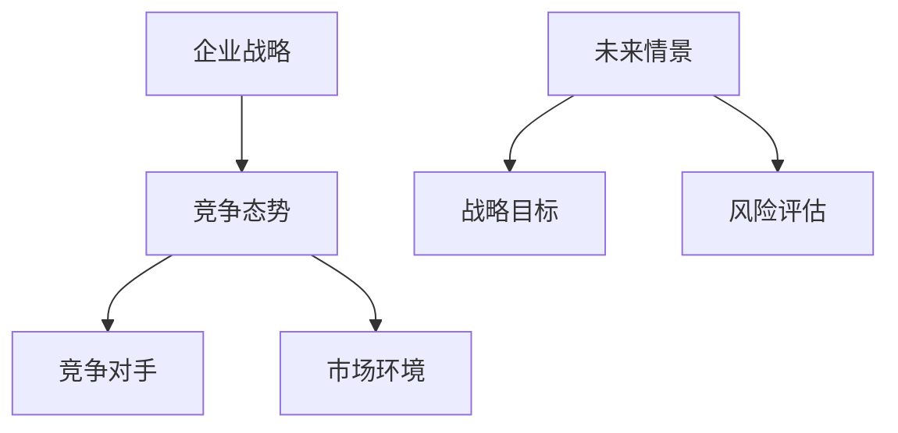
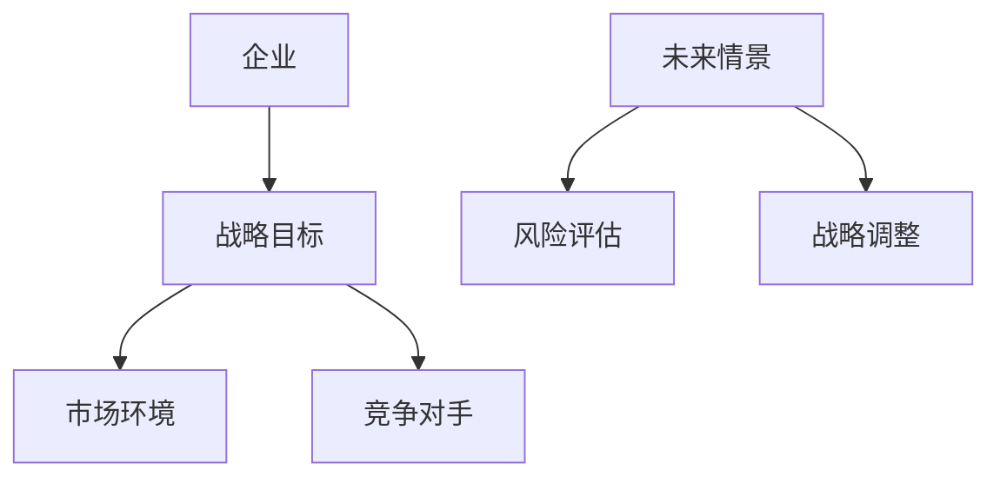
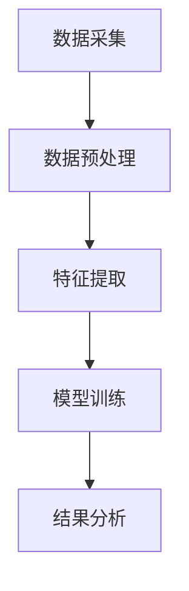
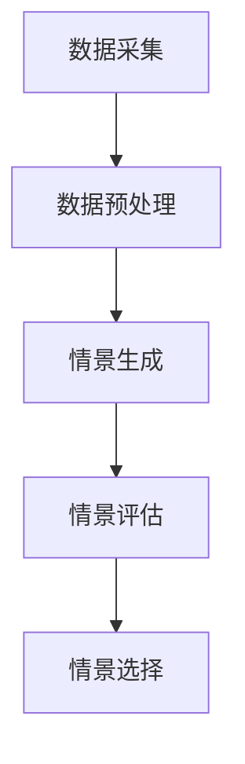
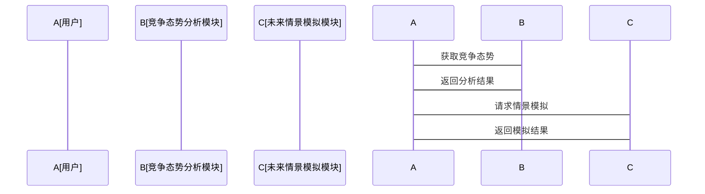

                 


# AI辅助企业战略制定：竞争态势分析与未来情景模拟

## 关键词：
- 人工智能（AI）
- 企业战略制定
- 竞争态势分析
- 未来情景模拟
- AI算法
- 系统架构设计
- 项目实战

## 摘要：
本文详细探讨了人工智能在企业战略制定中的应用，重点分析了竞争态势分析与未来情景模拟的AI辅助方法。通过结合实际案例，文章系统地介绍了AI算法在战略制定中的应用原理、系统架构设计、项目实战以及最佳实践，为企业领导者和技术开发者提供了实用的指导。

---

# 第1章: AI辅助企业战略制定的背景与问题分析

## 1.1 问题背景
### 1.1.1 传统企业战略制定的挑战
- 信息收集与处理的复杂性
- 动态市场环境的不确定性
- 战略调整的及时性与灵活性

### 1.1.2 AI技术对企业战略制定的潜在价值
- 数据处理能力的提升
- 模型预测的准确性
- 战略制定的效率优化

### 1.1.3 当前企业战略制定中的主要痛点
- 数据量大且分散
- 分析方法单一
- 缺乏动态调整能力

## 1.2 问题描述
### 1.2.1 竞争态势分析的复杂性
- 对竞争对手的分析难度
- 市场环境的多变性
- 数据来源的多样性

### 1.2.2 未来情景模拟的不确定性
- 长期预测的难度
- 情景模拟的复杂性
- 模型的准确性

### 1.2.3 企业战略制定的动态性与实时性需求
- 竞争环境的实时变化
- 战略目标的动态调整
- 信息更新的及时性

## 1.3 问题解决思路
### 1.3.1 利用AI技术辅助竞争态势分析
- 数据挖掘与机器学习技术
- 自然语言处理技术
- 图神经网络技术

### 1.3.2 基于AI的未来情景模拟方法
- 时间序列分析
- 强化学习
- 情景树分析

### 1.3.3 AI辅助企业战略制定的整体架构
- 数据采集与预处理
- 竞争态势分析
- 未来情景模拟
- 战略优化与实施

## 1.4 边界与外延
### 1.4.1 AI辅助战略制定的适用范围
- 中小企业的战略制定
- 大企业的市场拓展
- 新兴行业的市场分析

### 1.4.2 与传统战略制定方法的区别
- 数据处理方式的不同
- 分析方法的创新
- 结果呈现的直观性

### 1.4.3 与其他AI应用场景的对比
- AI在销售预测中的应用
- AI在生产优化中的应用
- AI在风险管理中的应用

## 1.5 核心要素与概念结构
### 1.5.1 核心要素分析
- 企业目标
- 市场环境
- 竞争对手
- 战略目标

### 1.5.2 概念结构图


### 1.5.3 核心要素之间的关系
- 企业目标是核心
- 市场环境和竞争对手是外部因素
- 战略目标是结果
- 风险评估是保障

---

# 第2章: AI辅助企业战略制定的核心概念与联系

## 2.1 核心概念原理
### 2.1.1 AI在竞争态势分析中的应用原理
- 数据预处理与特征提取
- 竞争态势分析的机器学习模型
- 竞争态势分析的深度学习模型

### 2.1.2 基于AI的未来情景模拟方法
- 时间序列分析
- 强化学习
- 情景树分析

### 2.1.3 AI辅助战略制定的整体流程
- 数据采集
- 数据分析
- 情景模拟
- 战略优化

## 2.2 核心概念属性对比
### 2.2.1 竞争态势分析与未来情景模拟的对比
| 对比维度 | 竞争态势分析 | 未来情景模拟 |
|----------|---------------|---------------|
| 目标     | 分析当前竞争状态 | 预测未来可能情况 |
| 数据类型 | 结构化与非结构化 | 结构化与时间序列 |
| 方法     | 机器学习、NLP | 时间序列分析、强化学习 |

### 2.2.2 不同AI技术在战略制定中的应用对比
| 技术     | 应用场景         | 优势               |
|----------|------------------|--------------------|
| 机器学习 | 竞争态势分析     | 高精度预测         |
| NLP      | 竞争对手分析     | 处理非结构化数据     |
| 强化学习 | 未来情景模拟     | 多步决策优化       |

### 2.2.3 不同企业规模的战略制定需求对比
| 企业规模 | 战略制定需求         | 关注点             |
|----------|----------------------|--------------------|
| 小型     | 精准分析             | 成本与资源优化     |
| 中型     | 动态调整             | 市场扩展           |
| 大型     | 全局优化             | 风险控制           |

## 2.3 ER实体关系图


---

# 第3章: 竞争态势分析的AI算法原理

## 3.1 竞争态势分析的算法原理
### 3.1.1 数据预处理与特征提取
- 数据清洗
- 特征工程
- 数据标准化

### 3.1.2 竞争态势分析的机器学习模型
- 线性回归
- 支持向量机（SVM）
- 随机森林

### 3.1.3 竞争态势分析的深度学习模型
- 卷积神经网络（CNN）
- 循环神经网络（RNN）
- 图神经网络（GNN）

## 3.2 竞争态势分析的数学模型
### 3.2.1 机器学习模型
$$ y = \beta_0 + \beta_1x_1 + \beta_2x_2 + \ldots + \beta_nx_n + \epsilon $$

### 3.2.2 深度学习模型
$$ \text{预测结果} = \text{模型}(\text{输入数据}) $$

## 3.3 竞争态势分析的mermaid流程图


---

# 第4章: 未来情景模拟的AI算法原理

## 4.1 未来情景模拟的算法原理
### 4.1.1 时间序列分析
- ARIMA
- LSTM

### 4.1.2 强化学习
- Q-Learning
- DQN

### 4.1.3 情景树分析
- 情景生成
- 情景评估
- 情景选择

## 4.2 未来情景模拟的数学模型
### 4.2.1 时间序列分析
$$ y_t = \alpha + \beta t + \gamma y_{t-1} + \epsilon_t $$

### 4.2.2 强化学习
$$ Q(s, a) = r + \gamma \max_{a'} Q(s', a') $$

## 4.3 未来情景模拟的mermaid流程图


---

# 第5章: AI辅助企业战略制定的系统架构设计

## 5.1 系统功能设计
### 5.1.1 竞争态势分析模块
- 数据采集
- 数据分析
- 结果展示

### 5.1.2 未来情景模拟模块
- 情景生成
- 情景评估
- 情景选择

## 5.2 系统架构设计
### 5.2.1 分层架构
- 数据层
- 业务逻辑层
- 表示层

### 5.2.2 微服务架构
- 数据采集服务
- 数据分析服务
- 情景模拟服务

## 5.3 系统接口设计
### 5.3.1 RESTful API
- GET /api/competitor-analysis
- POST /api/future-simulation

## 5.4 系统交互设计


---

# 第6章: AI辅助企业战略制定的项目实战

## 6.1 环境安装
### 6.1.1 安装Python
- 安装Anaconda
- 设置虚拟环境

### 6.1.2 安装依赖库
- NumPy
- Pandas
- Scikit-learn
- Keras
- TensorFlow

## 6.2 核心代码实现
### 6.2.1 竞争态势分析模块
```python
import numpy as np
import pandas as pd
from sklearn.linear_model import LinearRegression

# 数据预处理
data = pd.read_csv('competitor_data.csv')
X = data[['feature1', 'feature2']]
y = data['target']

# 模型训练
model = LinearRegression()
model.fit(X, y)

# 预测结果
new_data = np.array([[new_feature1, new_feature2]])
print(model.predict(new_data))
```

### 6.2.2 未来情景模拟模块
```python
import numpy as np
from keras.models import Sequential
from keras.layers import LSTM, Dense

# 数据预处理
data = pd.read_csv('future_scenario.csv')
X = data[['feature1', 'feature2', 'feature3']]
y = data['target']

# 模型训练
model = Sequential()
model.add(LSTM(64, input_shape=(3,1)))
model.add(Dense(1))
model.compile(loss='mean_squared_error', optimizer='adam')
model.fit(X, y, epochs=100, batch_size=32)

# 模拟结果
new_data = np.array([[[new_feature1, new_feature2, new_feature3]]])
print(model.predict(new_data))
```

## 6.3 案例分析
### 6.3.1 案例背景
- 行业：科技行业
- 场景：市场竞争分析

### 6.3.2 数据分析结果
- 竞争对手的主要优势
- 市场趋势预测

### 6.3.3 模拟结果
- 不同情景下的战略选择
- 风险评估

---

# 第7章: AI辅助企业战略制定的最佳实践与注意事项

## 7.1 最佳实践
### 7.1.1 数据质量管理
- 数据清洗
- 数据标注
- 数据安全

### 7.1.2 模型优化
- 参数调优
- 模型评估
- 模型部署

## 7.2 小结
- AI在企业战略制定中的优势
- 竞争态势分析与未来情景模拟的结合
- 系统架构设计的重要性

## 7.3 注意事项
- 数据隐私问题
- 模型的可解释性
- 实际应用中的动态调整

## 7.4 拓展阅读
- 《机器学习实战》
- 《深度学习》
- 《企业战略管理》

---

通过以上目录和内容，我们可以看到，AI技术在企业战略制定中的应用具有广阔前景，尤其是在竞争态势分析和未来情景模拟方面。结合实际案例和系统设计，企业可以更高效地制定和优化战略，从而在激烈的市场竞争中占据优势。

