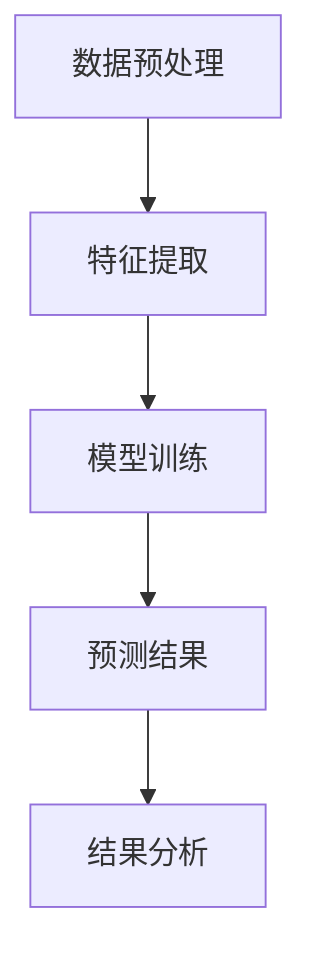
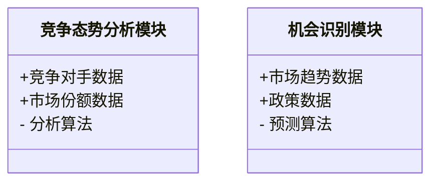
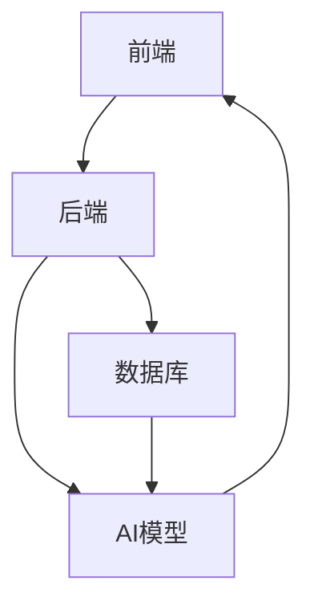
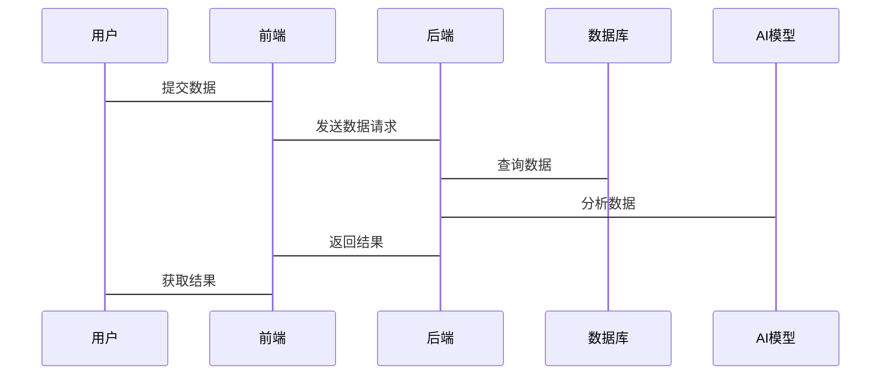

                 


# AI辅助企业战略制定：竞争态势分析与机会识别

## 关键词：
- AI辅助企业战略
- 竞争态势分析
- 机会识别
- 机器学习
- 数据分析

## 摘要：
随着人工智能技术的快速发展，企业战略制定的传统方法正面临前所未有的挑战。本文将深入探讨AI技术在企业战略制定中的应用，特别是竞争态势分析与机会识别方面。通过结合机器学习、自然语言处理和大数据分析等技术，AI能够帮助企业更高效地识别市场机会，优化资源配置，制定更具前瞻性的战略。本文将从核心概念、算法原理、系统架构到项目实战，全面解析AI辅助企业战略制定的方法与实践。

---

# 第1章: AI辅助企业战略制定的背景与意义

## 1.1 企业战略制定的传统方法与挑战

### 1.1.1 传统战略制定的流程与特点
传统企业战略制定通常依赖于经验丰富的管理团队和市场研究部门，流程繁琐且耗时较长。主要步骤包括：
1. **市场调研**：收集行业数据、竞争对手信息。
2. **数据分析**：通过人工分析得出市场趋势。
3. **战略制定**：基于分析结果制定战略计划。
4. **执行与调整**：根据市场反馈不断优化战略。

### 1.1.2 传统方法的局限性与不足
1. **数据量有限**：传统方法依赖少量市场报告，难以覆盖全行业数据。
2. **分析效率低**：人工分析耗时长，难以及时响应市场变化。
3. **主观性较强**：依赖个人经验，存在主观判断偏差。

### 1.1.3 企业战略制定的数字化转型需求
随着市场竞争加剧和数据爆炸式增长，企业需要更高效、精准的工具来制定战略。AI技术的引入为企业提供了新的可能性。

---

## 1.2 AI技术对企业战略制定的推动作用

### 1.2.1 AI技术的快速发展与应用潜力
AI技术在企业战略制定中的应用潜力主要体现在以下几点：
1. **数据处理能力**：AI能够快速处理海量数据，提取有价值的信息。
2. **模式识别**：通过机器学习算法发现市场趋势和竞争对手行为模式。
3. **预测能力**：基于历史数据预测未来市场走向。

### 1.2.2 AI在企业战略制定中的独特优势
1. **实时性**：AI可以实时分析市场动态，提供即时反馈。
2. **准确性**：通过大数据分析，减少人为判断误差。
3. **灵活性**：AI模型可以根据市场变化快速调整分析策略。

### 1.2.3 企业战略制定的智能化发展趋势
未来的战略制定将更加依赖AI技术，形成人机协作的模式。AI不仅辅助分析，还可以提供决策建议，甚至自动生成初步战略方案。

---

## 1.3 竞争态势分析与机会识别的核心价值

### 1.3.1 竞争态势分析的定义与作用
竞争态势分析是指通过分析竞争对手的市场行为、产品策略、市场份额等信息，评估企业在市场中的竞争地位。其作用包括：
- 识别主要竞争对手
- 分析竞争对手的优势和劣势
- 发现市场机会和威胁

### 1.3.2 机会识别的定义与意义
机会识别是指通过分析市场趋势、技术发展、政策变化等因素，发现潜在的商业机会。其意义在于：
- 提前布局新兴市场
- 捕捉行业增长点
- 优化资源配置

### 1.3.3 两者的结合对企业战略的重要性
竞争态势分析和机会识别是企业制定战略的两大核心模块。通过AI技术的整合，企业可以更高效地进行竞争分析和机会识别，从而制定更具前瞻性的战略。

---

## 1.4 本章小结
本章主要介绍了AI技术在企业战略制定中的背景与意义，重点分析了竞争态势分析和机会识别的核心价值。下一章将深入探讨AI辅助企业战略制定的核心概念与实现方法。

---

# 第2章: AI辅助企业战略制定的核心概念

## 2.1 竞争态势分析的AI实现方法

### 2.1.1 数据采集与处理
AI系统通过爬虫技术从公开数据源（如新闻、财报、行业报告）中获取数据，并进行清洗、归类和结构化处理。

### 2.1.2 竞争对手分析模型
基于机器学习的竞争对手分析模型可以预测竞争对手的市场行为，例如：
- **市场份额预测**：使用线性回归模型预测竞争对手的市场份额变化。
- **行为模式识别**：通过聚类分析识别竞争对手的产品策略。

### 2.1.3 市场趋势预测方法
利用时间序列分析（如ARIMA模型）预测市场趋势，帮助企业提前布局。

---

## 2.2 机会识别的AI实现方法

### 2.2.1 数据挖掘与模式识别
通过自然语言处理技术分析新闻、社交媒体等非结构化数据，识别潜在的市场机会。

### 2.2.2 商业机会预测模型
基于机器学习构建机会预测模型，评估潜在机会的可行性。例如，使用随机森林模型对市场机会进行分类。

### 2.2.3 机会评估与优先级排序
结合财务指标和市场潜力，对识别的机会进行评估和排序，优先选择高潜力机会。

---

## 2.3 竞争态势分析与机会识别的关联性

### 2.3.1 数据共享与模型整合
竞争态势分析和机会识别需要共享数据和模型，确保分析结果的准确性和一致性。

### 2.3.2 分析结果的相互验证
竞争态势分析的结果可以为机会识别提供参考，而机会识别的结果也可以反过来验证竞争态势分析的准确性。

### 2.3.3 结果对企业战略的指导作用
通过竞争态势分析和机会识别的结合，企业可以制定更加科学和精准的战略，例如：
- 调整产品策略以应对竞争
- 抢占新兴市场机会

---

## 2.4 核心概念属性对比表

| 概念       | 属性               | 描述                                                                 |
|------------|--------------------|----------------------------------------------------------------------|
| 竞争态势分析 | 数据来源           | 公开数据、行业报告、社交媒体等                                         |
|            | 分析目标           | 竞争对手行为、市场份额、市场趋势                                         |
|            | 主要方法           | 机器学习、时间序列分析、自然语言处理                                     |
| 机会识别   | 数据来源           | 市场趋势、政策变化、技术发展                                             |
|            | 分析目标           | 商业机会、市场潜力、投资机会                                             |
|            | 主要方法           | 数据挖掘、聚类分析、随机森林模型                                         |

---

## 2.5 ER实体关系图架构

```mermaid
er
actor CompetitorAnalysis, Competitor, MarketTrend, BusinessOpportunity
CompetitorAnalysis --> Competitor: 分析竞争对手行为
CompetitorAnalysis --> MarketTrend: 分析市场趋势
MarketTrend --> BusinessOpportunity: 识别商业机会
```

---

## 2.6 本章小结
本章详细介绍了AI辅助企业战略制定的核心概念，包括竞争态势分析和机会识别的实现方法及其关联性。下一章将从算法原理的角度，深入探讨AI技术的具体实现方法。

---

# 第3章: AI辅助企业战略制定的算法原理

## 3.1 机器学习算法在竞争态势分析中的应用

### 3.1.1 竞争对手市场份额预测
使用线性回归模型预测竞争对手的市场份额：
$$ \text{市场份额} = \beta_0 + \beta_1 \times \text{历史数据} $$

### 3.1.2 市场趋势预测
使用ARIMA模型预测市场趋势：
$$ \text{预测值} = \alpha \times \text{当前值} + (1-\alpha) \times \text{前一期预测值} $$

---

## 3.2 自然语言处理在机会识别中的应用

### 3.2.1 文本分类
使用BERT模型对新闻文本进行分类，识别潜在的商业机会：
$$ P(\text{机会类别}|x) = \frac{P(x|\text{机会类别})P(\text{机会类别})}{P(x)} $$

### 3.2.2 实体识别
通过命名实体识别（NER）技术提取文本中的公司名称、产品名称等信息。

---

## 3.3 算法流程图



---

## 3.4 本章小结
本章通过具体算法原理，展示了AI技术在竞争态势分析和机会识别中的应用。下一章将从系统架构的角度，详细探讨AI辅助企业战略制定的实现方案。

---

# 第4章: AI辅助企业战略制定的系统架构

## 4.1 系统需求分析

### 4.1.1 功能需求
- 数据采集与处理
- 竞争态势分析
- 机会识别
- 结果可视化

### 4.1.2 性能需求
- 高效的数据处理能力
- 准确的分析结果

---

## 4.2 系统功能设计

### 4.2.1 领域模型设计


### 4.2.2 系统架构设计


---

## 4.3 系统接口设计

### 4.3.1 API接口
- 数据接口：用于数据的导入和导出
- 分析接口：用于触发竞争态势分析和机会识别
- 结果接口：用于获取分析结果

### 4.3.2 交互流程


---

## 4.4 本章小结
本章从系统架构的角度，详细探讨了AI辅助企业战略制定的实现方案。下一章将通过项目实战，展示具体的技术实现和应用案例。

---

# 第5章: AI辅助企业战略制定的项目实战

## 5.1 项目背景

### 5.1.1 项目目标
通过AI技术帮助企业制定竞争态势分析和机会识别的战略。

### 5.1.2 项目范围
- 数据采集与处理
- 竞争态势分析
- 机会识别
- 结果可视化

---

## 5.2 环境安装

### 5.2.1 技术选型
- 数据采集：Python + requests库
- 数据分析：Python + pandas库
- 机器学习：Python + scikit-learn库
- 可视化：Python + matplotlib库

### 5.2.2 环境配置
- 安装Python 3.8+
- 安装依赖库：pip install requests pandas scikit-learn matplotlib

---

## 5.3 系统核心实现

### 5.3.1 数据采集与处理
```python
import requests
import pandas as pd

url = "https://example.com/data"
response = requests.get(url)
data = response.json()
df = pd.DataFrame(data)
```

### 5.3.2 竞争态势分析
```python
from sklearn.linear_model import LinearRegression

model = LinearRegression()
model.fit(X_train, y_train)
y_pred = model.predict(X_test)
```

### 5.3.3 机会识别
```python
from sklearn.ensemble import RandomForestClassifier

model = RandomForestClassifier()
model.fit(X_train, y_train)
y_pred = model.predict(X_test)
```

### 5.3.4 结果可视化
```python
import matplotlib.pyplot as plt

plt.plot(y_true, y_pred)
plt.xlabel('True Values')
plt.ylabel('Predicted Values')
plt.show()
```

---

## 5.4 项目小结
本章通过具体项目实战，展示了AI技术在企业战略制定中的应用。从环境配置到系统实现，详细讲解了技术细节。

---

# 第6章: AI辅助企业战略制定的最佳实践与注意事项

## 6.1 最佳实践

### 6.1.1 数据质量的重要性
确保数据的完整性和准确性，避免因数据问题导致分析误差。

### 6.1.2 模型可解释性
选择可解释性较强的模型，便于分析结果的验证和优化。

### 6.1.3 持续优化
定期更新模型和数据，确保分析结果的时效性。

---

## 6.2 小结

---

## 6.3 注意事项

### 6.3.1 数据隐私问题
在数据采集和处理过程中，注意保护企业数据隐私。

### 6.3.2 模型局限性
AI模型无法完全替代人类判断，需结合实际情况进行调整。

---

## 6.4 拓展阅读
- 《机器学习实战》
- 《数据驱动的商业决策》
- 《人工智能在商业中的应用》

---

# 附录: AI辅助企业战略制定的数学公式

### 3.1 机器学习模型的数学表达
- 线性回归：
$$ y = \beta_0 + \beta_1 x + \epsilon $$
- 随机森林：
$$ P(y|x) = \sum_{i=1}^{n} \frac{1}{n} I(f(x) = y) $$

### 3.2 数据分析公式
- 方差计算：
$$ \text{Var}(X) = E[(X - E[X])^2] $$

---

# 结语
通过本文的深入探讨，我们看到了AI技术在企业战略制定中的巨大潜力。从竞争态势分析到机会识别，AI技术正在改变企业制定战略的方式。未来，随着技术的不断发展，AI将在企业战略制定中发挥更加重要的作用。

---

感谢您的耐心阅读！希望本文对您有所帮助。如果需要进一步探讨或技术交流，请随时联系。

