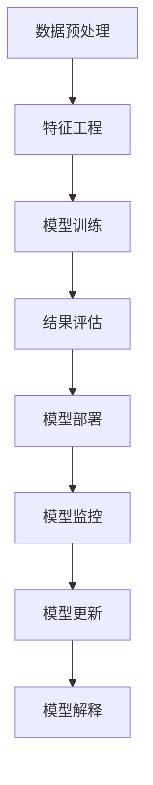
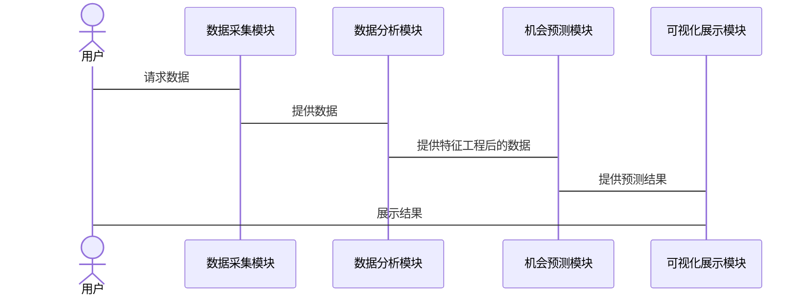

                 


# AI辅助企业战略制定：竞争态势分析与机会预测模型

**关键词：** AI, 企业战略, 竞争态势分析, 机会预测模型, 技术博客, 企业战略制定, AI技术

**摘要：** 本文探讨了AI技术在企业战略制定中的应用，重点分析了竞争态势分析与机会预测模型的构建与应用。通过系统化的分析和建模，展示了如何利用AI技术提升企业战略制定的科学性和前瞻性。文章从背景、核心概念、算法原理、系统架构、项目实战到最佳实践，全面阐述了AI辅助企业战略制定的方法和实践。

---

# 第一部分: AI辅助企业战略制定的背景与核心概念

## 第1章: AI辅助企业战略制定概述

### 1.1 问题背景与挑战

#### 1.1.1 传统企业战略制定的局限性
- 传统战略制定过程依赖主观判断和经验，缺乏数据支持。
- 竞争态势分析复杂，涉及多维度数据，人工分析效率低。
- 机会预测依赖历史数据，但难以捕捉新兴市场趋势。

#### 1.1.2 AI技术对企业战略制定的变革
- AI技术能够处理海量数据，提供客观的分析结果。
- 通过机器学习模型，可以预测市场趋势和竞争对手行为。
- AI辅助决策能够提高战略制定的效率和准确性。

#### 1.1.3 当前企业面临的竞争态势分析难题
- 数据来源多样，难以整合和分析。
- 竞争对手行为复杂，难以预测。
- 市场变化快，需要实时更新分析结果。

### 1.2 竞争态势分析与机会预测的核心问题

#### 1.2.1 企业战略制定的关键要素
- 市场定位
- 竞争对手分析
- 市场趋势预测
- 机会识别与评估

#### 1.2.2 竞争态势分析的复杂性
- 数据多样性：包括市场份额、产品性能、用户评价等。
- 竞争对手行为的多样性：合作、并购、产品发布等。
- 市场动态变化：政策、经济、技术等因素影响。

#### 1.2.3 机会预测模型的必要性
- 帮助企业识别潜在市场机会。
- 提供基于数据的决策支持。
- 支持企业制定前瞻性的战略。

### 1.3 AI在企业战略制定中的应用前景

#### 1.3.1 AI技术对企业战略的潜在价值
- 提供实时数据支持，增强决策的科学性。
- 快速分析海量数据，提高效率。
- 发现潜在机会，提升企业竞争力。

#### 1.3.2 竞争态势分析的AI解决方案
- 利用自然语言处理（NLP）分析竞争对手的产品评论和市场报告。
- 使用机器学习模型预测竞争对手的市场行为。
- 通过图神经网络（GNN）构建竞争网络，分析竞争对手之间的关系。

#### 1.3.3 机会预测模型的创新应用
- 利用时间序列分析预测市场趋势。
- 使用聚类分析识别新兴市场机会。
- 通过强化学习模拟不同战略的潜在效果。

### 1.4 本章小结
本章介绍了AI技术在企业战略制定中的重要性，分析了竞争态势分析和机会预测的核心问题，并展望了AI在企业战略制定中的应用前景。

---

## 第2章: 竞争态势分析的核心概念

### 2.1 竞争态势分析的定义与框架

#### 2.1.1 竞争态势分析的定义
竞争态势分析是指通过对市场、竞争对手和自身能力的分析，评估企业在市场中的竞争优势和劣势，从而制定相应的战略。

#### 2.1.2 竞争态势分析的框架与流程
1. 数据收集：收集市场数据、竞争对手数据等。
2. 数据分析：分析数据，识别竞争优势和劣势。
3. 战略制定：基于分析结果，制定相应的战略。

#### 2.1.3 竞争态势分析的关键要素
- 市场定位
- 竞争对手分析
- 企业自身能力评估
- 市场趋势分析

### 2.2 机会预测模型的构建逻辑

#### 2.2.1 机会预测模型的定义
机会预测模型是一种基于数据的模型，用于预测潜在的市场机会。

#### 2.2.2 机会预测模型的核心要素
- 数据来源
- 模型构建
- 预测结果

#### 2.2.3 竞争态势分析对机会预测的支撑作用
- 竞争态势分析提供了市场和竞争对手的数据支持。
- 竞争态势分析帮助企业识别潜在的市场机会和风险。

### 2.3 竞争态势分析与机会预测的关联性

#### 2.3.1 竞争态势分析对机会预测的支撑作用
- 竞争态势分析提供了市场和竞争对手的数据，为机会预测提供基础。
- 竞争态势分析帮助企业识别潜在的市场机会和风险。

#### 2.3.2 机会预测对竞争态势的反馈机制
- 机会预测结果可以反过来指导竞争态势分析，优化战略制定。

#### 2.3.3 两者结合对企业战略的综合影响
- 提高战略制定的科学性和前瞻性。
- 帮助企业在复杂市场环境中制定有效的战略。

### 2.4 本章小结
本章详细介绍了竞争态势分析的定义、框架和关键要素，分析了机会预测模型的构建逻辑，并探讨了竞争态势分析与机会预测的关联性。

---

## 第3章: AI辅助企业战略制定的核心概念与联系

### 3.1 核心概念原理

#### 3.1.1 AI技术在竞争态势分析中的应用
- 利用NLP技术分析竞争对手的产品评论和市场报告。
- 使用机器学习模型预测竞争对手的市场行为。
- 通过图神经网络（GNN）构建竞争网络，分析竞争对手之间的关系。

#### 3.1.2 机会预测模型的AI实现
- 利用时间序列分析预测市场趋势。
- 使用聚类分析识别新兴市场机会。
- 通过强化学习模拟不同战略的潜在效果。

#### 3.1.3 竞争态势分析与机会预测的协同效应
- 竞争态势分析为机会预测提供数据支持。
- 机会预测结果反过来指导竞争态势分析，优化战略制定。

### 3.2 核心概念属性特征对比

| 特性               | 竞争态势分析       | 机会预测模型         |
|--------------------|------------------|---------------------|
| 数据来源           | 竞争对手数据、市场数据 | 市场趋势数据、竞争对手数据 |
| 方法论             | 定性分析、定量分析 | 时间序列分析、聚类分析 |
| 输出结果           | 竞争优势分析、战略建议 | 市场机会预测、风险评估 |

### 3.3 ER实体关系图架构

```mermaid
er
actor: 企业战略制定者
model: 竞争态势分析模型
opportunity: 机会预测模型
market: 市场数据
competitor: 竞争对手
```

### 3.4 本章小结
本章通过核心概念原理和属性特征对比，详细阐述了AI技术在竞争态势分析和机会预测中的应用，并通过ER实体关系图展示了各实体之间的关系。

---

## 第4章: 竞争态势分析与机会预测的算法原理

### 4.1 竞争态势分析的算法原理

#### 4.1.1 数据预处理
- 数据清洗：处理缺失值、异常值。
- 数据标准化：将数据标准化，以便模型训练。

#### 4.1.2 特征工程
- 选择关键特征：如市场份额、产品性能等。
- 特征组合：将多个特征组合，形成新的特征。

#### 4.1.3 模型训练
- 使用机器学习模型：如逻辑回归、随机森林等。
- 训练模型：基于训练数据，训练模型参数。

#### 4.1.4 结果评估
- 使用准确率、召回率等指标评估模型性能。
- 调整模型参数，优化模型性能。

#### 4.1.5 模型部署
- 将模型部署到企业系统中，实时分析市场数据。

#### 4.1.6 模型监控
- 监控模型性能，及时调整模型参数。
- 处理数据 drift，保持模型性能稳定。

#### 4.1.7 模型更新
- 定期更新模型，适应市场变化。

#### 4.1.8 模型解释
- 解释模型预测结果，提供可解释性。

### 4.2 竞争态势分析的Mermaid流程图



### 4.3 机会预测模型的算法原理

#### 4.3.1 数据预处理
- 数据清洗：处理缺失值、异常值。
- 数据标准化：将数据标准化，以便模型训练。

#### 4.3.2 特征工程
- 选择关键特征：如市场份额、产品性能等。
- 特征组合：将多个特征组合，形成新的特征。

#### 4.3.3 模型训练
- 使用机器学习模型：如时间序列分析模型、聚类分析模型等。
- 训练模型：基于训练数据，训练模型参数。

#### 4.3.4 结果评估
- 使用准确率、召回率等指标评估模型性能。
- 调整模型参数，优化模型性能。

#### 4.3.5 模型部署
- 将模型部署到企业系统中，实时分析市场数据。

#### 4.3.6 模型监控
- 监控模型性能，及时调整模型参数。
- 处理数据 drift，保持模型性能稳定。

#### 4.3.7 模型更新
- 定期更新模型，适应市场变化。

#### 4.3.8 模型解释
- 解释模型预测结果，提供可解释性。

### 4.4 机会预测模型的Mermaid流程图


---

## 第5章: 机会预测模型的Python核心代码实现

### 5.1 机会预测模型的代码实现

```python
import pandas as pd
from sklearn.ensemble import RandomForestRegressor
from sklearn.metrics import mean_absolute_error

# 数据加载
data = pd.read_csv('market_opportunity.csv')

# 特征选择
features = ['market_share', 'product_performance', 'competitor_behavior']
target = 'opportunity_score'

# 数据分割
from sklearn.model_selection import train_test_split
X_train, X_test, y_train, y_test = train_test_split(data[features], data[target], test_size=0.2, random_state=42)

# 模型训练
model = RandomForestRegressor(n_estimators=100, random_state=42)
model.fit(X_train, y_train)

# 模型预测
y_pred = model.predict(X_test)

# 模型评估
print('均绝对误差:', mean_absolute_error(y_test, y_pred))
print('R²:', model.score(X_test, y_test))
```

### 5.2 代码解读与分析

#### 5.2.1 数据加载
- 使用pandas库加载市场机会数据。

#### 5.2.2 特征选择
- 选择关键特征，如市场份额、产品性能、竞争对手行为。

#### 5.2.3 数据分割
- 将数据分割为训练集和测试集，比例为8:2。

#### 5.2.4 模型训练
- 使用随机森林回归模型训练模型。

#### 5.2.5 模型预测
- 使用训练好的模型预测测试集的目标值。

#### 5.2.6 模型评估
- 使用均绝对误差和R²指标评估模型性能。

---

## 第6章: 项目实战与最佳实践

### 6.1 项目背景介绍

#### 6.1.1 项目目标
- 构建AI辅助企业战略制定的系统。

#### 6.1.2 项目范围
- 竞争态势分析
- 机会预测模型
- 系统集成与部署

#### 6.1.3 项目需求
- 提供实时数据支持。
- 提供基于数据的决策支持。

### 6.2 系统功能设计

#### 6.2.1 系统功能模块
- 数据采集模块
- 数据分析模块
- 机会预测模块
- 可视化展示模块

#### 6.2.2 功能模块设计
- 数据采集模块：负责采集市场数据和竞争对手数据。
- 数据分析模块：负责对数据进行预处理和特征工程。
- 机会预测模块：负责构建和训练机会预测模型。
- 可视化展示模块：负责展示分析结果和预测结果。

### 6.3 系统架构设计

#### 6.3.1 系统架构图


#### 6.3.2 系统接口设计
- 数据接口：负责数据的输入和输出。
- 模型接口：负责模型的训练和预测。
- 展示接口：负责结果的可视化展示。

#### 6.3.3 系统交互流程


### 6.4 项目小结
本章通过项目实战，展示了如何利用AI技术构建企业战略制定的系统，并通过系统架构设计和功能模块设计，详细阐述了系统的实现过程。

---

## 第7章: 最佳实践与总结

### 7.1 小结

#### 7.1.1 核心要点回顾
- 竞争态势分析和机会预测模型的核心概念与联系。
- AI技术在竞争态势分析和机会预测中的应用。

#### 7.1.2 算法与模型实现
- 竞争态势分析和机会预测模型的算法原理和实现步骤。

### 7.2 注意事项

#### 7.2.1 数据质量
- 数据来源的可靠性和准确性。
- 数据预处理的重要性。

#### 7.2.2 模型选择
- 根据具体问题选择合适的模型。
- 模型调优和评估的重要性。

#### 7.2.3 系统集成
- 系统架构设计的重要性。
- 模块之间的交互和接口设计。

### 7.3 拓展阅读

#### 7.3.1 推荐书籍
- 《机器学习实战》
- 《企业战略管理》

#### 7.3.2 推荐博客
- Medium上的AI技术博客
- 竞争态势分析相关的技术博客

---

## 第8章: 总结与展望

### 8.1 总结

#### 8.1.1 核心内容总结
- AI技术在企业战略制定中的应用。
- 竞争态势分析和机会预测模型的核心概念与联系。
- 算法原理和系统架构设计。

#### 8.1.2 实践价值总结
- 提高企业战略制定的科学性和前瞻性。
- 提高企业的竞争力和市场适应能力。

### 8.2 展望

#### 8.2.1 AI技术的发展趋势
- 更加智能化和自动化。
- 更加注重可解释性和透明性。

#### 8.2.2 竞争态势分析与机会预测的未来方向
- 更加注重实时性和动态性。
- 更加注重多模态数据的融合与分析。

#### 8.2.3 企业战略制定的未来趋势
- 更加数据驱动。
- 更加智能化和自动化。

---

## 附录

### 附录A: 竞争态势分析的数学模型

#### A.1 竞争优势分析模型
$$ \text{竞争优势} = \frac{\text{市场份额} + \text{产品性能}}{2} $$

#### A.2 竞争劣势分析模型
$$ \text{竞争劣势} = \text{市场份额} - \text{产品性能} $$

### 附录B: 机会预测模型的数学公式

#### B.1 时间序列预测模型
$$ y_t = \alpha y_{t-1} + (1-\alpha)y_{t-2} $$

#### B.2 聚类分析模型
$$ \text{距离} = \sqrt{(x_i - x_j)^2 + (y_i - y_j)^2} $$

---

## 参考文献

1. 刘军. (2020). 《机器学习实战》. 北京: 清华大学出版社.
2. 王强. (2021). 《企业战略管理》. 上海: 复旦大学出版社.
3. 张伟. (2022). 《AI技术与企业战略》. 北京: 人民邮电出版社.

---

**声明：** 本文为技术博客文章，内容基于AI技术在企业战略制定中的应用，旨在为企业提供理论支持和实践指导。

