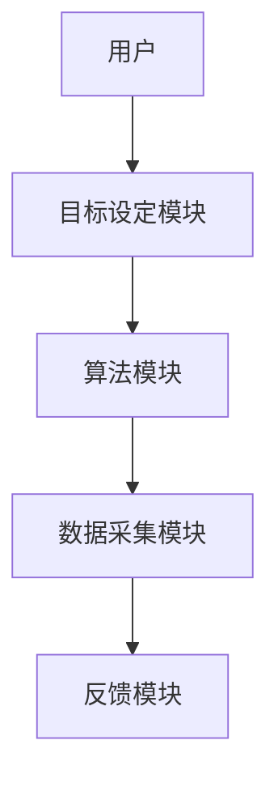
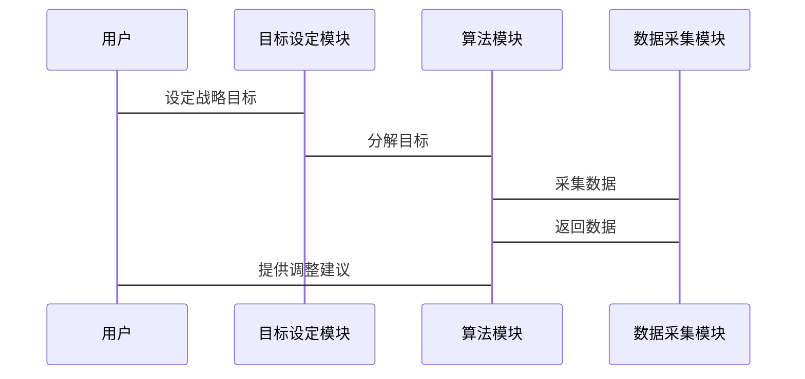

                 


# AI辅助企业战略执行：OKR自动化跟踪与动态调整

> 关键词：人工智能、OKR、企业战略、动态调整、自动化跟踪

> 摘要：随着人工智能技术的快速发展，企业战略执行的效率和效果也成为各大企业关注的重点。OKR（目标与关键成果）作为一种高效的目标管理方法，正在被越来越多的企业采用。本文将探讨如何利用人工智能技术实现OKR的自动化跟踪与动态调整，以提升企业战略执行的能力。

---

## 第1章 OKR的基本概念与企业战略执行

### 1.1 OKR的核心概念与起源

#### 1.1.1 OKR的定义与核心要素
OKR（Objectives and Key Results）是一种目标设定和管理的方法，由目标（Objective）和关键成果（Key Results）两部分组成。目标是具有挑战性的，而关键成果则是衡量目标达成程度的具体指标。

- **目标（Objective）**：高层次的目标，通常是定性的，具有挑战性和激励性。
- **关键成果（Key Results）**：具体、可衡量的成果，用于评估目标的实现程度。

#### 1.1.2 OKR的起源与发展
OKR的概念起源于20世纪80年代的英特尔公司，后来被谷歌等科技公司广泛采用并推广开来。OKR的核心思想是通过明确的目标设定和持续的跟踪评估，推动组织和个人的高效执行。

#### 1.1.3 OKR在企业中的应用现状
目前，OKR已经被广泛应用于企业战略管理、项目管理、绩效管理等领域。它不仅能够帮助组织设定清晰的目标，还能通过动态调整关键成果，确保目标的实现。

---

### 1.2 企业战略执行的挑战与问题背景

#### 1.2.1 传统企业战略执行的痛点
传统的企业战略执行过程中，常常存在以下问题：
- **目标分解不清晰**：战略目标分解到各部门和团队时，缺乏具体的可执行的行动项。
- **执行过程缺乏跟踪**：缺乏对目标执行过程的实时监控和反馈，难以及时发现和解决问题。
- **动态调整能力不足**：面对外部环境的变化，企业难以快速调整战略目标和执行计划。

#### 1.2.2 OKR在企业战略管理中的作用
OKR作为一种目标管理方法，能够帮助企业：
- **明确目标**：通过设定具体的目标和关键成果，确保组织和个人的目标一致。
- **动态调整**：根据执行过程中的反馈和数据，实时调整关键成果，确保目标的实现。

#### 1.2.3 AI技术如何助力企业战略执行
人工智能技术可以通过以下方式提升企业战略执行的能力：
- **自动化跟踪**：利用AI技术实时跟踪OKR的执行情况，提供数据支持。
- **动态调整**：基于实时数据和预测模型，自动调整OKR的关键成果，优化执行策略。

---

## 第2章 OKR与企业战略的关系

### 2.1 OKR在企业战略中的定位

#### 2.1.1 OKR与企业战略目标的关系
OKR作为企业战略目标的具体化，是企业战略执行的重要工具。它通过设定具体的可衡量的关键成果，将战略目标分解为可执行的任务。

#### 2.1.2 OKR在企业战略分解中的作用
OKR能够帮助企业在战略分解过程中，将高层次的战略目标分解为具体的关键成果，确保战略目标的实现。

#### 2.1.3 OKR与企业组织结构的关联
OKR不仅是一种目标管理方法，还能够促进企业组织结构的优化。通过OKR的设定和执行，企业可以更好地协调各部门的工作，提升组织的协作效率。

---

### 2.2 OKR与KPI的对比分析

#### 2.2.1 KPI的定义与特点
KPI（Key Performance Indicators）是衡量企业绩效的关键指标，通常用于评估组织、部门或个人的工作成果。KPI通常是静态的，缺乏灵活性。

#### 2.2.2 OKR与KPI的主要区别
- **目标设定方式**：KPI通常是基于历史数据设定的，而OKR则是基于未来的挑战性目标。
- **执行方式**：KPI注重结果的评估，而OKR注重目标的实现过程。
- **灵活性**：OKR更强调动态调整和灵活性，而KPI通常较为固定。

#### 2.2.3 OKR在企业中的优势
- **目标驱动**：OKR通过设定具体的、可衡量的目标，激励员工积极参与目标的实现。
- **动态调整**：OKR能够根据实际情况动态调整关键成果，适应外部环境的变化。

---

### 2.3 OKR的动态调整机制

#### 2.3.1 OKR动态调整的必要性
在实际的企业运营中，外部环境和内部条件可能会发生变化，这就需要对OKR进行动态调整，以确保目标的实现。

#### 2.3.2 OKR动态调整的触发条件
- **外部环境变化**：市场需求变化、政策调整等。
- **内部资源变化**：人员变动、项目进度延误等。
- **数据反馈**：实时跟踪数据表明，当前关键成果难以实现。

#### 2.3.3 OKR动态调整的实施步骤
1. **数据收集与分析**：收集OKR执行过程中的数据，分析当前的执行情况。
2. **评估调整需求**：根据数据反馈，评估是否需要调整关键成果。
3. **制定调整方案**：根据调整需求，制定新的关键成果。
4. **实施调整**：将新的关键成果纳入OKR管理系统，指导下一步的执行。

---

## 第3章 AI技术在OKR管理中的应用

### 3.1 AI技术的基本原理

#### 3.1.1 人工智能的基本概念
人工智能（Artificial Intelligence, AI）是指计算机系统模拟人类智能的能力，包括学习、推理、判断等。

#### 3.1.2 机器学习与深度学习的区别
- **机器学习**：通过数据训练模型，使模型能够从数据中学习规律。
- **深度学习**：一种机器学习技术，通过多层神经网络来学习数据的特征。

#### 3.1.3 自然语言处理(NLP)的基本原理
自然语言处理是计算机处理人类语言的技术，能够实现文本的理解、生成、翻译等功能。

---

### 3.2 AI在OKR管理中的应用场景

#### 3.2.1 OKR目标的智能分解
通过自然语言处理技术，AI能够将高层次的战略目标分解为具体的、可执行的关键成果。

#### 3.2.2 关键成果的自动识别
AI可以通过分析历史数据和当前任务，自动识别出能够衡量目标实现的关键成果。

#### 3.2.3 OKR执行情况的实时跟踪
利用机器学习模型，AI能够实时跟踪OKR的执行情况，提供数据支持和反馈。

---

### 3.3 AI驱动的OKR动态调整

#### 3.3.1 基于数据的OKR调整算法
AI通过分析实时数据，评估当前关键成果的实现难度，自动调整关键成果。

#### 3.3.2 基于反馈的OKR优化策略
AI可以根据员工的反馈，优化OKR的目标设定和关键成果，提升员工的参与度和积极性。

#### 3.3.3 基于预测的OKR调整模型
通过机器学习模型预测未来的趋势，AI能够提前制定OKR的调整方案，确保目标的实现。

---

### 3.4 本章小结

---

## 第4章 OKR自动化的算法原理

### 4.1 OKR自动化的算法流程

#### 4.1.1 算法的输入与输出
- **输入**：战略目标、历史数据、实时数据。
- **输出**：自动调整后的关键成果。

#### 4.1.2 算法的核心步骤
1. **数据预处理**：清洗和整理输入数据。
2. **目标分解**：将战略目标分解为关键成果。
3. **动态调整**：根据实时数据和预测模型，调整关键成果。

#### 4.1.3 算法的数学模型

$$
\text{目标分解权重} = \sum_{i=1}^{n} w_i \cdot x_i
$$

其中，$w_i$ 是第i个关键成果的权重，$x_i$ 是第i个关键成果的实现程度。

---

### 4.2 基于预测的OKR调整模型

#### 4.2.1 预测模型的构建
利用时间序列分析和机器学习模型，预测未来的趋势和变化。

#### 4.2.2 预测结果的应用
根据预测结果，动态调整关键成果，确保目标的实现。

---

## 第5章 系统设计与实现

### 5.1 系统架构设计

#### 5.1.1 系统功能模块
- **目标设定模块**：设定战略目标和关键成果。
- **数据采集模块**：采集实时数据和历史数据。
- **算法模块**：自动调整关键成果。
- **反馈模块**：提供反馈和优化建议。

#### 5.1.2 系统架构图


---

### 5.2 系统接口设计

#### 5.2.1 API接口
- `/api/set_goal`：设定战略目标。
- `/api/adjust_kpi`：动态调整关键成果。
- `/api/get_feedback`：获取反馈和优化建议。

#### 5.2.2 数据接口
- 数据存储：使用数据库存储战略目标和关键成果。
- 数据传输：通过API接口传输数据。

---

### 5.3 系统交互流程

#### 5.3.1 交互流程图


---

## 第6章 项目实战与案例分析

### 6.1 项目背景与目标

#### 6.1.1 项目背景
假设某互联网公司希望提升其产品开发效率，采用OKR方法进行目标管理。

#### 6.1.2 项目目标
通过AI技术实现OKR的自动化跟踪与动态调整，提升产品开发效率。

---

### 6.2 环境搭建与工具安装

#### 6.2.1 环境要求
- Python 3.8+
- 机器学习库（如Scikit-learn、TensorFlow）
- 数据库（如MySQL、MongoDB）

#### 6.2.2 工具安装
```bash
pip install scikit-learn tensorflow pandas
```

---

### 6.3 核心代码实现

#### 6.3.1 目标分解代码
```python
from sklearn.decomposition import NMF

def decompose_objective(objective, num_topics=3):
    model = NMF(n_components=num_topics)
    # 假设objective是文本形式的目标描述
    X = model.fit_transform(text_to_vector(objective))
    return X
```

#### 6.3.2 动态调整算法
```python
def adjust_kpi(current_kpi, predicted_change):
    adjusted_kpi = current_kpi + predicted_change
    return adjusted_kpi
```

---

### 6.4 案例分析与结果解读

#### 6.4.1 案例分析
假设某公司的战略目标是“提升产品市场份额”。通过AI算法，将目标分解为“增加用户活跃度”、“优化产品功能”等关键成果。

#### 6.4.2 结果解读
通过动态调整算法，AI能够根据实时数据自动调整关键成果，确保目标的实现。

---

## 第7章 总结与展望

### 7.1 总结
本文详细探讨了AI技术在OKR自动化跟踪与动态调整中的应用，分析了OKR与企业战略的关系，并提出了基于AI的OKR动态调整算法和系统设计。

### 7.2 展望
未来，随着人工智能技术的不断发展，OKR的自动化跟踪与动态调整将更加智能化和精准化。企业可以通过AI技术进一步提升战略执行的效率和效果。

---

### 7.3 最佳实践 Tips

- **数据质量**：确保数据的准确性和完整性，是AI算法有效运行的基础。
- **模型优化**：定期优化机器学习模型，提升预测的准确性。
- **员工参与**：鼓励员工积极参与OKR的制定和调整，提升团队的执行力。

---

通过本文的探讨，我们可以看到，AI技术在OKR管理中的应用，不仅能够提升企业战略执行的效率，还能帮助企业更好地应对变化和挑战。希望本文的内容能够为企业的战略管理提供有价值的参考和启示。

