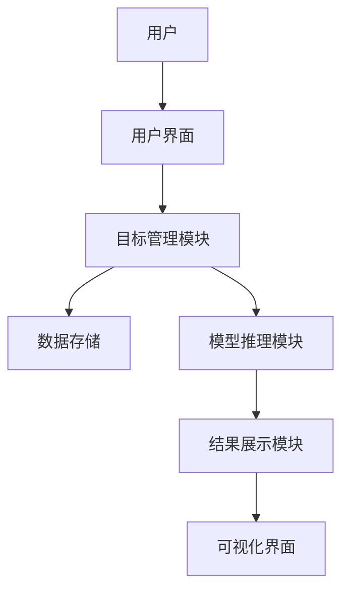

                 


# AI辅助企业战略执行：OKR自动化跟踪与动态调整系统

## 关键词：AI, OKR, 战略执行, 动态调整, 自动化跟踪, 企业目标管理, 人工智能

## 摘要：  
本文深入探讨了人工智能技术在企业战略管理中的应用，特别是在OKR（目标与关键成果）的自动化跟踪与动态调整方面。通过结合自然语言处理、机器学习和系统架构设计等技术手段，本文详细分析了如何利用AI优化企业目标管理流程，提升战略执行效率。文章从OKR的基本概念、AI在OKR管理中的应用、技术实现原理、系统架构设计、项目实战案例等方面展开，为企业管理者和技术开发人员提供了一套完整的解决方案和实践指南。

---

# 第1章：OKR的基本概念与作用

## 1.1 OKR的起源与发展

### 1.1.1 OKR的起源
OKR（目标与关键成果）起源于20世纪末的美国硅谷，最初由英特尔公司提出，后被谷歌等科技公司推广并改进。OKR的核心思想是通过设定具体的目标和可衡量的关键成果，帮助组织和个人聚焦于最重要的任务，从而提高执行效率。

### 1.1.2 OKR的发展历程
随着企业对高效目标管理的需求增加，OKR逐渐从一家公司的内部管理工具发展成为全球范围内广泛采用的目标设定方法论。特别是在互联网行业，OKR被广泛用于敏捷开发和持续交付中。

---

## 1.2 OKR的核心要素

### 1.2.1 目标（Objective）
目标是OKR的核心，通常是一个高层次的、需要长期努力才能实现的成果。目标应该是可衡量的、具体的，并且具有明确的时间范围。例如：在三个月内将产品用户活跃度提高10%。

### 1.2.2 关键成果（Key Results）
关键成果是衡量目标实现程度的具体指标。它们通常是可量化的，并且与目标密切相关。例如：实现目标的指标可以是“用户活跃度达到20%”。

### 1.2.3 OKR的特点与优势
- **聚焦核心目标**：OKR帮助组织集中精力于最重要的目标。
- **可衡量性**：通过关键成果的设定，目标的实现程度可以被量化。
- **动态调整**：OKR允许根据实际情况进行动态调整，适应变化的环境。

---

## 1.3 OKR在企业战略执行中的作用

### 1.3.1 OKR对企业战略管理的影响
OKR能够帮助企业将战略目标分解为具体可执行的任务，并通过关键成果的设定，确保每个团队和个人都清楚自己的职责和目标。

### 1.3.2 OKR在团队协作中的价值
通过OKR，团队成员能够清晰地了解彼此的目标和任务，从而更好地协同工作，减少目标冲突和资源浪费。

### 1.3.3 OKR与企业绩效的关系
OKR不仅是目标设定工具，也是绩效评估的重要依据。通过跟踪关键成果的实现情况，企业可以及时发现问题并进行调整。

---

# 第2章：AI在企业战略执行中的应用

## 2.1 AI技术的基本概念

### 2.1.1 人工智能的定义与分类
人工智能（Artificial Intelligence, AI）是指通过模拟人类智能的某些方面（如学习、推理、问题解决等），使计算机能够执行特定任务的技术。AI可以分为弱人工智能（专注于特定任务）和强人工智能（具备广泛智能）。

### 2.1.2 机器学习与深度学习的区别
- **机器学习**：通过数据训练模型，使其能够从数据中学习规律并进行预测或分类。
- **深度学习**：属于机器学习的子领域，主要依赖于多层神经网络来提取数据特征。

### 2.1.3 自然语言处理（NLP）的基本原理
NLP的目标是让计算机能够理解、解析和生成人类语言。常见的NLP技术包括文本分类、实体识别、情感分析等。

---

## 2.2 AI在OKR管理中的应用

### 2.2.1 自动化目标跟踪
通过自然语言处理技术，AI可以自动从企业的文档、会议记录等文本中提取目标和关键成果，并实时跟踪其进展。

### 2.2.2 数据驱动的OKR调整
基于机器学习模型，AI可以根据历史数据和当前业务情况，自动提出OKR的调整建议，例如优化目标优先级或调整关键成果的权重。

### 2.2.3 AI辅助的战略决策
通过分析大量的历史数据和实时数据，AI可以帮助企业在制定战略目标时更加科学和高效，减少人为误差。

---

## 2.3 AI辅助OKR的优势与挑战

### 2.3.1 AI辅助OKR的优势
- **提高效率**：自动化跟踪和调整OKR，减少人工干预。
- **数据驱动**：基于数据的决策更加精准和科学。
- **实时反馈**：AI可以实时监控OKR的执行情况，并提供及时反馈。

### 2.3.2 AI辅助OKR的挑战
- **数据质量问题**：AI模型的准确性依赖于数据的质量和完整性。
- **模型泛化能力**：机器学习模型在不同业务场景下的泛化能力有限。
- **技术与业务的结合**：AI技术需要与企业的具体业务场景紧密结合，才能发挥其价值。

### 2.3.3 未来的发展趋势
随着AI技术的不断进步，OKR的自动化跟踪与动态调整将更加智能化和个性化。未来的系统将能够更好地适应企业的动态变化，并提供更加精准的目标管理服务。

---

# 第3章：自然语言处理在OKR中的应用

## 3.1 自然语言处理的基本原理

### 3.1.1 NLP的核心任务
- **文本分类**：将文本划分为不同的类别（如积极、消极、中性）。
- **实体识别**：识别文本中的关键实体（如人名、地名、组织名）。
- **情感分析**：分析文本中表达的情感倾向。

### 3.1.2 常见的NLP技术与工具
- **分词工具**：如jieba（中文分词）、nltk（英文分词）。
- **词嵌入模型**：如Word2Vec、GloVe。
- **预训练语言模型**：如BERT、GPT。

---

## 3.2 NLP在OKR中的具体应用

### 3.2.1 文本分析与目标识别
通过NLP技术，系统可以自动从企业文档中提取目标和关键成果。例如，从年度报告中提取战略目标。

### 3.2.2 关键成果的自动提取
系统可以利用NLP技术识别文本中的关键成果，并将其与目标关联起来。

### 3.2.3 NLP在OKR动态调整中的作用
当企业的外部环境发生变化时，AI可以通过NLP技术分析相关信息，并自动调整OKR。

---

# 第4章：机器学习模型在OKR管理中的应用

## 4.1 机器学习的基本原理

### 4.1.1 机器学习的核心任务
- **监督学习**：基于标记的数据训练模型，如分类和回归。
- **无监督学习**：基于未标记的数据进行聚类或降维。
- **强化学习**：通过与环境交互，学习最优策略。

### 4.1.2 机器学习模型的训练流程
1. 数据预处理：清洗、归一化、特征提取。
2. 模型训练：选择算法、调整超参数。
3. 模型评估：验证集上的表现。
4. 模型部署：将模型应用于实际场景。

---

## 4.2 机器学习在OKR中的具体应用

### 4.2.1 OKR优先级预测
通过机器学习模型，系统可以预测不同目标的优先级，并帮助企业在资源有限的情况下做出最优选择。

### 4.2.2 关键成果预测
基于历史数据，机器学习模型可以预测关键成果的实现概率，并提供建议。

### 4.2.3 OKR执行效果评估
系统可以通过机器学习模型分析OKR的执行效果，并提出改进建议。

---

# 第5章：AI辅助OKR系统的架构设计

## 5.1 系统功能设计

### 5.1.1 系统模块划分
- **用户界面模块**：供用户查看和编辑OKR。
- **数据采集模块**：从企业系统中采集相关数据。
- **模型推理模块**：利用机器学习模型进行预测和分析。
- **结果展示模块**：将分析结果以可视化的方式呈现。

### 5.1.2 系统功能流程
1. 用户在界面上输入或选择目标。
2. 数据采集模块获取相关数据。
3. 模型推理模块进行预测和分析。
4. 结果展示模块将分析结果呈现给用户。

---

## 5.2 系统架构设计

### 5.2.1 系统架构图


### 5.2.2 数据流设计
- 用户通过界面输入目标。
- 数据采集模块从企业系统中获取相关数据。
- 模型推理模块利用数据进行预测。
- 结果展示模块将预测结果以可视化方式呈现给用户。

---

# 第6章：AI辅助OKR系统的项目实战

## 6.1 环境搭建

### 6.1.1 开发环境
- 操作系统：Linux/Windows/MacOS
- 编程语言：Python
- 开发工具：Jupyter Notebook、PyCharm
- 依赖库：numpy、pandas、scikit-learn、transformers

### 6.1.2 数据集准备
需要准备企业的历史目标数据、关键成果数据以及相关业务数据。

---

## 6.2 系统核心实现

### 6.2.1 NLP文本分析
```python
import transformers
from transformers import pipeline

# 初始化NLP pipeline
nlp = pipeline("text-classification", model="snunlp/korean-klue-bert-base")
```

### 6.2.2 机器学习模型训练
```python
from sklearn import svm
from sklearn.model_selection import train_test_split

# 数据预处理
X = data.drop(columns='label')
y = data['label']
X_train, X_test, y_train, y_test = train_test_split(X, y, test_size=0.2)

# 训练模型
model = svm.SVC()
model.fit(X_train, y_train)
```

---

## 6.3 实际案例分析

### 6.3.1 案例背景
某互联网公司希望利用AI优化其OKR管理流程，提升战略执行效率。

### 6.3.2 系统实现
1. 数据采集：从企业系统中获取历史目标数据。
2. NLP分析：提取关键成果。
3. 机器学习预测：预测目标优先级。
4. 结果展示：将预测结果以可视化方式呈现。

---

## 6.4 项目小结

通过本项目，我们成功实现了AI辅助OKR系统的开发和应用，验证了AI技术在企业目标管理中的巨大潜力。系统能够自动跟踪OKR的执行情况，并根据数据驱动的分析结果进行动态调整，显著提高了企业的战略执行效率。

---

# 第7章：AI辅助OKR系统的最佳实践与总结

## 7.1 最佳实践

### 7.1.1 数据质量管理
确保数据的准确性和完整性，是AI模型发挥价值的基础。

### 7.1.2 模型调优
通过不断优化机器学习模型，提升预测的准确性和实用性。

### 7.1.3 人机结合
AI系统应该与人类专家结合使用，避免过度依赖AI。

---

## 7.2 小结

本文详细探讨了AI技术在OKR管理中的应用，从理论到实践，为企业提供了一套完整的解决方案。通过结合自然语言处理、机器学习和系统架构设计，AI辅助OKR系统能够显著提升企业的战略执行效率。

---

## 7.3 注意事项

- **数据隐私**：在处理企业数据时，必须遵守相关隐私保护法规。
- **模型解释性**：确保模型的预测结果具有可解释性，便于用户理解和调整。
- **持续优化**：定期更新模型和数据，以适应业务的变化。

---

## 7.4 拓展阅读

- 《机器学习实战》——周志华
- 《深度学习》——Ian Goodfellow
- 《OKR：不仅仅是管理方法》——John Doerr

---

通过本文的系统讲解和实战案例，读者可以全面了解AI辅助OKR系统的实现原理和应用场景。希望本文能够为企业的战略执行管理提供新的思路和实践指导。

