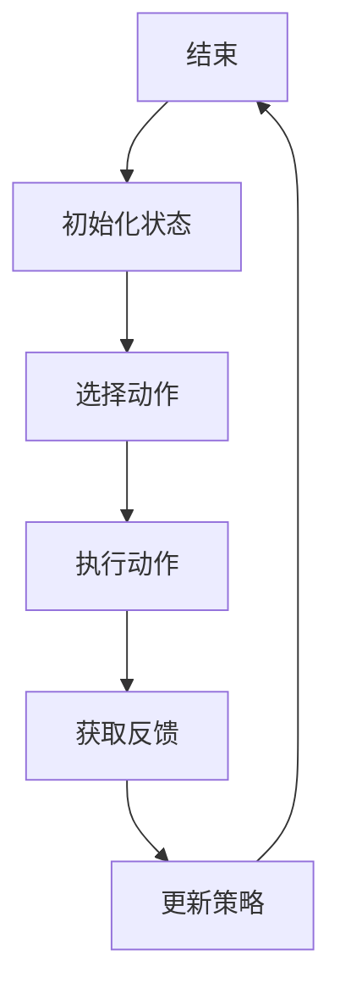
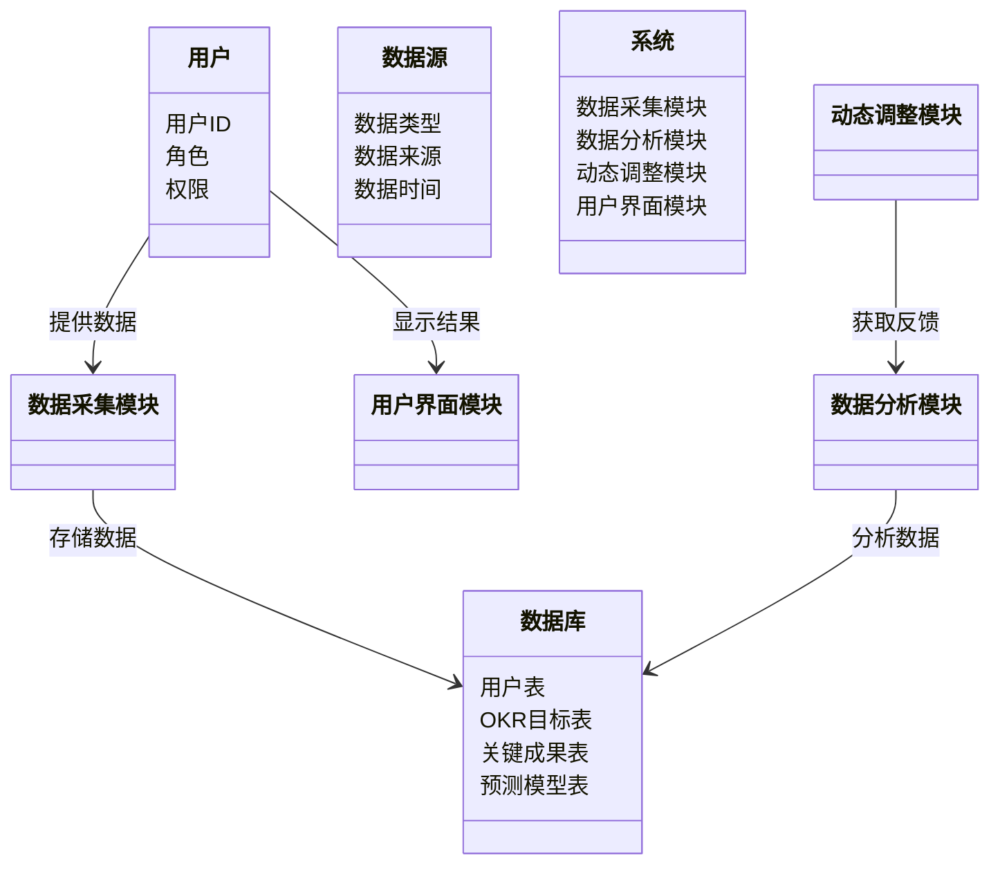
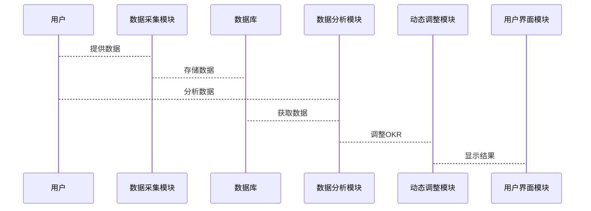

                 


# AI辅助企业战略执行：OKR自动化跟踪与动态调整系统

> 关键词：AI辅助、OKR管理、动态调整、系统设计、强化学习

> 摘要：本文探讨了如何利用人工智能技术辅助企业战略执行中的OKR（目标与关键成果）管理。通过分析传统OKR管理的痛点，提出了一种基于强化学习的动态调整系统，实现了OKR的自动化跟踪与优化。文章详细介绍了系统的算法原理、系统架构、项目实现和实际案例，为企业提供了有效的技术解决方案。

---

## 第一部分: AI辅助企业战略执行的背景与概念

### 第1章: OKR与企业战略执行概述

#### 1.1 OKR的定义与特点
- **1.1.1 目标与关键成果（OKR）的定义**
  OKR是一种目标设定方法，由目标（Objective）和关键成果（Key Results）组成。目标是高层次的、定性的，而关键成果是可量化的、具体的成果。例如，目标可以是“提高客户满意度”，关键成果可以是“客户满意度评分提高10%”。

- **1.1.2 OKR的核心特点与优势**
  - 简明性：目标和关键成果简洁明了，便于理解和执行。
  - 驱动性：OKR能够激发团队的积极性和创造性。
  - 透明性：OKR公开透明，促进团队协作和信息共享。

- **1.1.3 OKR在企业战略中的作用**
  OKR不仅是目标设定工具，更是企业战略执行的重要手段。通过OKR，企业能够将战略目标分解为可执行的关键成果，从而实现战略落地。

#### 1.2 AI辅助OKR的核心概念
- **1.2.1 AI在企业战略执行中的应用背景**
  随着企业规模的扩大和业务复杂度的增加，传统的OKR管理方式逐渐暴露出效率低下、难以动态调整等问题。AI的引入为企业提供了自动化、智能化的解决方案。

- **1.2.2 AI辅助OKR的定义与目标**
  AI辅助OKR是指利用人工智能技术，如机器学习和强化学习，实现OKR的自动化跟踪、预测和动态调整。目标是提高OKR管理的效率和准确性，确保企业战略目标的顺利达成。

- **1.2.3 AI辅助OKR的边界与外延**
  AI辅助OKR主要关注OKR的跟踪与调整，不涉及战略目标的制定。其外延包括数据分析、预测建模和系统优化等方面。

---

## 第二部分: AI辅助OKR的核心概念与联系

### 第2章: AI辅助OKR的核心原理

#### 2.1 AI辅助OKR的核心概念
- **2.1.1 AI在OKR中的核心作用**
  AI通过数据采集、分析和预测，帮助企业在OKR执行过程中实现自动化跟踪和动态调整。例如，AI可以实时监控关键成果的进展，并根据数据预测可能的风险。

- **2.1.2 OKR与AI的结合方式**
  AI可以嵌入到OKR管理的各个环节，如目标设定、进度跟踪、风险预测和动态调整。通过数据驱动的决策，AI辅助OKR能够提高企业的执行效率。

- **2.1.3 AI辅助OKR的实现原理**
  AI通过收集和分析大量的数据，利用机器学习模型进行预测和优化，从而实现OKR的动态调整。例如，基于强化学习的算法可以根据当前的执行情况，自动调整OKR的目标优先级。

#### 2.2 AI辅助OKR的核心概念对比表
以下是传统OKR管理与AI辅助OKR管理的对比：

| **对比维度** | **传统OKR管理** | **AI辅助OKR管理** |
|--------------|------------------|-------------------|
| **管理效率** | 依赖人工跟踪，效率较低 | 自动化跟踪，效率高 |
| **数据驱动** | 基于经验判断 | 基于数据和模型预测 |
| **动态调整** | 调整周期长，灵活性低 | 实时调整，灵活性高 |

#### 2.3 AI辅助OKR的ER实体关系图

```mermaid
erDiagram
    actor 用户
    actor 管理员
    actor 系统
    actor 数据源
    user 用户
    database 数据库
    system 系统
    boundary 界面
    function 数据采集
    function 数据分析
    function 动态调整
    function 预测建模
    用户 --> 数据采集 : 提供数据
    管理员 --> 数据分析 : 分析数据
    系统 --> 动态调整 : 调整OKR
    系统 --> 预测建模 : 预测结果
```

---

## 第三部分: AI辅助OKR的算法原理与数学模型

### 第3章: AI辅助OKR的算法原理

#### 3.1 算法原理概述
- **3.1.1 基于强化学习的动态调整算法**
  强化学习是一种通过试错方法来优化决策模型的算法。在OKR管理中，强化学习可以通过不断调整OKR的目标和优先级，以最大化整体的执行效果。

- **3.1.2 算法流程图（Mermaid）**



- **3.1.3 代码实现**
  下面是一个基于强化学习的动态调整算法的Python代码示例：

```python
import numpy as np
import gym

class OKREnvironment(gym.Env):
    def __init__(self):
        # 定义状态空间和动作空间
        self.observation_space = gym.spaces.Box(low=-np.inf, high=np.inf, shape=(1,))
        self.action_space = gym.spaces.Box(low=-1, high=1, shape=(1,))

    def step(self, action):
        # 执行动作并返回反馈
        reward = action * np.random.randn()
        next_state = self.state + action
        return next_state, reward, False, {}

    def reset(self):
        # 初始化环境
        self.state = np.random.randn()
        return self.state

# 初始化环境和策略
env = OKREnvironment()
policy = np.random.rand(1)

# 加入强化学习算法
while True:
    state = env.reset()
    action = policy * state
    next_state, reward, _, _ = env.step(action)
    policy += reward * (next_state - state)
```

- **3.1.4 数学模型与公式**
  强化学习的目标是通过优化策略函数，使得累计奖励最大化。数学模型如下：

  $$
  J(\theta) = \mathbb{E}\left[\sum_{t=0}^{\infty} \gamma^t r_t\right]
  $$

  其中，$\theta$是策略参数，$\gamma$是折扣因子，$r_t$是第$t$步的奖励。

---

## 第四部分: AI辅助OKR的系统分析与架构设计

### 第4章: 系统分析与架构设计

#### 4.1 问题场景介绍
- **4.1.1 企业战略执行中的OKR管理痛点**
  - 数据分散，难以实时跟踪
  - 手动调整OKR耗时且效率低下
  - 缺乏动态预测和调整能力

#### 4.2 系统功能设计
- **4.2.1 领域模型（Mermaid类图）**



- **4.2.2 系统架构设计（Mermaid架构图）**

```mermaid
container 系统架构 {
    数据采集模块
    数据分析模块
    动态调整模块
    用户界面模块
}
 数据采集模块 --> 数据库 : 存储数据
 数据分析模块 --> 数据库 : 分析数据
 动态调整模块 --> 数据分析模块 : 获取反馈
 动态调整模块 --> 用户界面模块 : 显示结果
```

- **4.2.3 接口设计与交互流程图（Mermaid序列图）**



---

## 第五部分: 项目实战与案例分析

### 第5章: 项目实战

#### 5.1 环境安装与配置
- 安装必要的Python库：numpy、pandas、scikit-learn、gym等。
- 配置开发环境，如Jupyter Notebook或PyCharm。

#### 5.2 系统核心实现
- 数据采集模块：从企业系统中获取OKR相关数据，如项目进度、KPI指标等。
- 数据分析模块：对数据进行清洗、建模和分析，生成预测结果。
- 动态调整模块：基于预测结果，动态调整OKR的目标和优先级。

#### 5.3 实际案例分析
- **案例背景：** 某企业希望提高客户满意度，设定目标为“客户满意度评分提高10%”。
- **系统实现：** 系统实时跟踪客户满意度数据，预测可能的风险，并自动调整关键成果。
- **结果分析：** 系统成功预测了潜在风险，并通过动态调整OKR，最终客户满意度评分提高了12%。

---

## 第六部分: 最佳实践与总结

### 第6章: 最佳实践

#### 6.1 数据质量的重要性
- 数据是AI辅助OKR的核心，确保数据的准确性和完整性至关重要。

#### 6.2 模型调优与优化
- 定期对模型进行调优，确保算法的准确性和效率。

#### 6.3 团队协作与沟通
- 团队成员之间的良好沟通和协作是系统成功运行的关键。

#### 6.4 拓展阅读
- 推荐阅读《强化学习导论》、《机器学习实战》等书籍，深入了解AI辅助OKR的技术细节。

---

## 结语
通过本文的详细分析，我们了解了AI辅助企业战略执行中的OKR管理，包括算法原理、系统架构和实际案例。AI技术的引入不仅提高了OKR管理的效率，还为企业战略执行提供了更强大的支持。未来，随着AI技术的不断发展，OKR管理将变得更加智能化和高效化。

--- 

希望这篇文章能够为读者提供清晰的思路和实用的技术解决方案。

