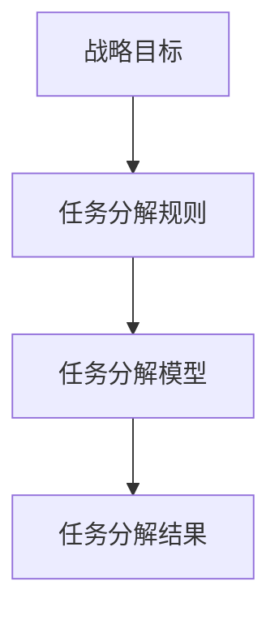
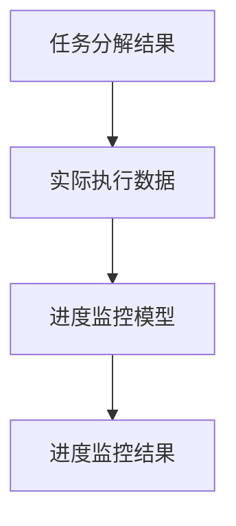
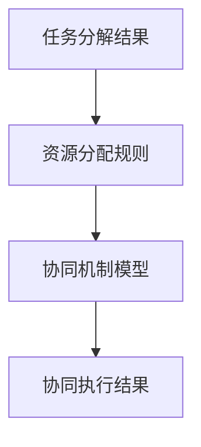
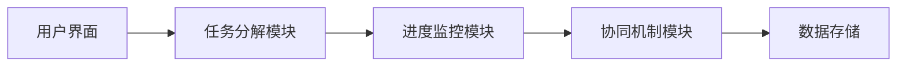

                 


# AI辅助企业战略执行：任务分解与进度监控

## 关键词：
- AI（人工智能）、企业战略执行、任务分解、进度监控、系统架构设计、项目实战

## 摘要：
随着人工智能技术的飞速发展，AI在企业战略执行中的应用越来越广泛。本文将重点探讨AI如何辅助企业进行任务分解与进度监控，通过系统化的分析和实践案例，深入解析AI在企业战略执行中的核心作用。文章将从任务分解的基本原理、AI辅助的任务分解模型、进度监控的实现方法、企业协同机制、系统架构设计以及项目实战等多个方面展开，为企业提供一套完整的AI辅助战略执行解决方案。

---

## 第一部分: AI与企业战略执行的结合

### 第1章: AI与企业战略执行的背景与意义

#### 1.1 企业战略执行的基本概念
- **企业战略的定义**：企业战略是指企业在竞争环境中为实现长期目标而制定的全局性计划和行动方案。
- **战略执行的核心要素**：
  1. **目标设定**：明确的战略目标是战略执行的基础。
  2. **任务分解**：将战略目标分解为可执行的任务。
  3. **资源分配**：合理分配人力、物力、财力等资源。
  4. **进度监控**：实时跟踪任务执行情况，确保按计划推进。
  5. **反馈优化**：根据执行结果调整战略。

#### 1.2 AI在企业战略执行中的作用
- **AI的优势**：
  1. **数据处理能力**：AI能够快速处理大量数据，提供精准的决策支持。
  2. **自动化与智能化**：AI可以自动分解任务、监控进度，并根据数据反馈优化执行方案。
  3. **预测能力**：通过机器学习算法，AI能够预测任务执行中的潜在风险和机会。

#### 1.3 AI辅助战略执行的核心场景
- **任务分解**：AI能够将复杂的战略目标分解为具体的任务项，并生成执行计划。
- **进度监控**：AI实时跟踪任务执行情况，提供动态反馈和调整建议。
- **协同与沟通**：AI辅助团队协作，确保信息同步，减少沟通成本。

---

## 第二部分: 任务分解的AI方法论

### 第2章: 任务分解的基本原理

#### 2.1 任务分解的核心概念
- **任务分解的目标**：将战略目标分解为可执行的任务项，明确每个任务的责任人、时间节点和关键里程碑。
- **任务分解的原则**：
  1. **可执行性**：任务必须是具体、可衡量的。
  2. **优先级排序**：根据任务的重要性和紧急性进行排序。
  3. **资源匹配**：任务分解应考虑资源的可用性。

#### 2.2 AI辅助任务分解的实现步骤
1. **数据输入**：输入战略目标、团队能力、资源分配等信息。
2. **任务分解模型**：基于输入数据，AI生成任务分解方案。
3. **优化调整**：根据实际执行情况，AI动态调整任务分解方案。

#### 2.3 任务分解的AI算法实现
- **算法原理**：
  1. **目标分解**：将战略目标分解为多个子目标。
  2. **任务优先级排序**：基于任务的重要性和紧急性进行排序。
  3. **资源分配**：根据团队能力和资源情况，分配任务优先级。

- **算法流程图（Mermaid）**：


- **代码实现示例**：
```python
def task_decomposition(strategic_goal):
    # 分解战略目标为子目标
    subgoals = strategic_goal.split('、')
    # 优先级排序
    subgoals_sorted = sorted(subgoals, key=lambda x: (len(x), x))
    return subgoals_sorted

# 示例输入
strategic_goal = "实现客户满意度提升30%，优化产品交付周期，降低运营成本10%"
# 示例输出
print(task_decomposition(strategic_goal))
```

---

## 第三部分: 进度监控的AI方法论

### 第3章: 进度监控的基本原理

#### 3.1 进度监控的核心概念
- **进度监控的目标**：实时跟踪任务执行情况，确保任务按计划推进。
- **进度监控的关键指标**：
  1. **任务完成率**：任务的实际完成量与计划完成量的比值。
  2. **关键路径分析**：识别任务执行中的瓶颈和关键节点。
  3. **风险预测**：预测任务执行中的潜在风险。

#### 3.2 AI辅助进度监控的实现步骤
1. **数据输入**：输入任务分解结果、实际执行数据。
2. **进度分析模型**：基于输入数据，AI生成进度报告。
3. **风险预警**：根据分析结果，AI提供风险预警和调整建议。

#### 3.3 进度监控的AI算法实现
- **算法原理**：
  1. **数据清洗**：对输入数据进行预处理，去除异常值。
  2. **进度预测**：基于历史数据，预测任务完成时间。
  3. **风险评估**：通过机器学习模型，识别潜在风险。

- **算法流程图（Mermaid）**：


- **代码实现示例**：
```python
def progress_monitoring(task_progress):
    # 计算任务完成率
    completion_rate = task_progress['completed'] / task_progress['total']
    # 识别关键路径
    critical_path = []
    for task in task_progress['tasks']:
        if task['delay'] > 0:
            critical_path.append(task['name'])
    return completion_rate, critical_path

# 示例输入
task_progress = {
    'completed': 70,
    'total': 100,
    'tasks': [
        {'name': '任务1', 'delay': 0},
        {'name': '任务2', 'delay': 5},
        {'name': '任务3', 'delay': 0}
    ]
}
# 示例输出
print(progress_monitoring(task_progress))
```

---

## 第四部分: 企业战略执行中的协同机制

### 第4章: 协同机制与AI辅助

#### 4.1 协同机制的核心概念
- **协同机制的目标**：确保团队成员之间高效协作，减少信息孤岛。
- **协同机制的关键要素**：
  1. **信息同步**：确保所有团队成员对任务执行情况有相同的认知。
  2. **沟通效率**：通过AI辅助减少沟通成本，提高协作效率。
  3. **资源协调**：合理分配资源，避免资源冲突。

#### 4.2 AI辅助协同机制的实现
- **信息同步**：通过AI实时更新任务执行情况，确保团队成员信息同步。
- **沟通优化**：AI自动生成沟通建议，减少无效沟通。
- **资源协调**：AI根据任务优先级和资源情况，动态分配资源。

#### 4.3 协同机制的AI算法实现
- **算法原理**：
  1. **信息同步**：通过事件驱动的方式，实时更新任务状态。
  2. **沟通优化**：基于自然语言处理技术，生成沟通建议。
  3. **资源协调**：基于任务优先级和资源可用性，动态分配资源。

- **算法流程图（Mermaid）**：


---

## 第五部分: 系统架构设计

### 第5章: 系统架构设计与实现

#### 5.1 系统功能设计
- **功能模块**：
  1. **任务分解模块**：实现战略目标的分解和优先级排序。
  2. **进度监控模块**：实时跟踪任务执行情况，提供进度报告。
  3. **协同机制模块**：实现团队协作、信息同步和资源分配。

- **系统架构设计（Mermaid）**：


#### 5.2 系统实现细节
- **数据存储**：使用数据库存储任务分解结果、进度数据和协同信息。
- **接口设计**：通过RESTful API实现模块之间的通信。
- **算法实现**：在任务分解和进度监控模块中，分别实现AI算法。

---

## 第六部分: 项目实战

### 第6章: 项目实战与经验总结

#### 6.1 环境搭建
- **工具选择**：使用Python、TensorFlow、Flask等技术实现系统。
- **数据准备**：收集企业战略目标、任务分解数据和进度数据。

#### 6.2 核心代码实现
- **任务分解模块代码**：
```python
from flask import Flask
import tensorflow as tf

app = Flask(__name__)
model = tf.keras.Sequential([tf.keras.layers.Dense(1, input_shape=(1,))])
model.compile(optimizer='adam', loss='binary_crossentropy')

@app.route('/task_decomposition', methods=['POST'])
def task_decomposition():
    data = request.json
    # 实现任务分解逻辑
    return jsonify({'result': 'success'})

if __name__ == '__main__':
    app.run(debug=True)
```

- **进度监控模块代码**：
```python
import pandas as pd
from sklearn import linear_model

def predict_progress(days_remaining):
    model = linear_model.LinearRegression()
    # 训练模型（假设已有训练好的模型）
    return model.predict([[days_remaining]])[0][0]

# 示例输入
days_remaining = 5
# 示例输出
print(predict_progress(days_remaining))
```

#### 6.3 案例分析与经验总结
- **案例分析**：通过实际案例展示AI辅助任务分解和进度监控的效果。
- **经验总结**：总结项目实施中的经验和教训，提出改进建议。

---

## 第七部分: 总结与展望

### 第7章: 总结与展望

#### 7.1 本章总结
- **核心总结**：AI在企业战略执行中的应用前景广阔，任务分解与进度监控是其中的重要组成部分。
- **实践经验**：通过项目实战，验证了AI辅助战略执行的可行性和有效性。

#### 7.2 未来展望
- **技术发展**：随着AI技术的不断进步，AI在企业战略执行中的应用将更加智能化和自动化。
- **应用场景**：未来，AI将不仅仅局限于任务分解和进度监控，还将扩展到更多领域，如战略制定、风险控制等。

---

## 附录: 最佳实践Tips

- **Tips 1**：在任务分解时，确保任务的可执行性和优先级的合理性。
- **Tips 2**：在进度监控中，结合历史数据和实时数据，提高预测的准确性。
- **Tips 3**：在协同机制中，确保信息同步和资源协调，减少沟通成本。

---

## 作者介绍
（可选部分，根据需要添加）

---

通过本文的系统化分析和实践案例，我们深入探讨了AI在企业战略执行中的应用，特别是任务分解与进度监控方面。希望本文能够为企业在AI辅助战略执行的实践中提供有价值的参考和指导。

