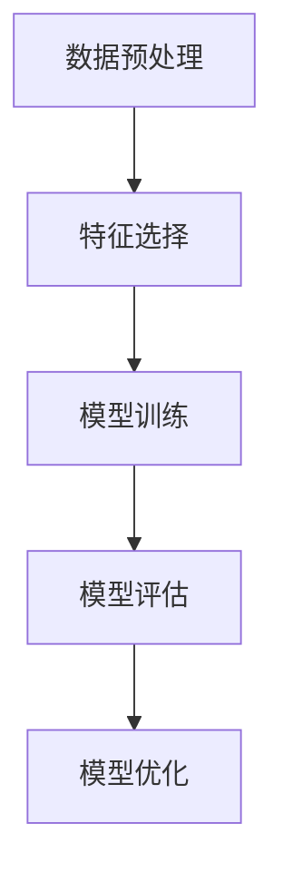

                 


# AI辅助企业战略规划：大数据分析与预测模型

> 关键词：人工智能、大数据分析、预测模型、企业战略规划、算法原理、系统架构设计

> 摘要：本文深入探讨了AI技术在企业战略规划中的应用，特别是通过大数据分析与预测模型的构建，为企业提供科学决策支持。文章从背景介绍、核心概念、算法原理、系统架构设计、项目实战等多个维度进行详细分析，旨在为企业管理者和技术人员提供实用的技术指导和解决方案。

---

## 第一部分：AI辅助企业战略规划的背景与核心概念

### 第1章：问题背景与描述

#### 1.1 问题背景

在当今快速变化的商业环境中，企业面临着复杂的市场挑战，包括不确定性增加、竞争加剧、客户需求多样化等问题。传统的战略规划方法依赖于经验和直觉，但在数据量巨大、信息更新迅速的情况下，这种方法往往难以捕捉关键趋势，导致决策失误。此外，企业内部数据的分散化和异构化使得传统的数据分析方法效率低下，难以支持实时、精准的战略决策。

AI技术的兴起为企业提供了一个新的解决方案。通过大数据分析和预测模型，企业可以更高效地处理海量数据，发现潜在的市场机会和风险，从而制定更具前瞻性的战略规划。

#### 1.2 问题描述

企业战略规划的核心目标是制定出能够在复杂环境中实现企业目标的行动计划。然而，以下问题限制了传统战略规划的效果：

- **数据复杂性**：企业内部和外部数据来源广泛，格式多样，难以整合和分析。
- **决策延迟**：传统方法依赖于定期的数据分析和报告，难以实现实时决策。
- **预测准确性**：缺乏有效的预测模型，导致战略决策缺乏数据支持。

AI辅助企业战略规划的核心问题在于如何构建高效、准确的大数据分析和预测模型，以支持实时、动态的决策过程。

#### 1.3 问题解决与边界

AI技术的应用解决了企业战略规划中的多个关键问题：

- **数据整合与处理**：利用AI技术整合异构数据，降低数据处理成本。
- **实时分析与预测**：通过实时数据分析，提供动态的市场洞察。
- **精准预测**：基于机器学习算法，构建高精度的预测模型。

### 第2章：核心概念与联系

#### 2.1 核心概念原理

- **大数据分析**：通过对海量数据的采集、处理、分析和可视化，为企业提供全面的市场洞察。
- **预测模型**：基于历史数据和机器学习算法，预测未来趋势和潜在风险。
- **AI技术**：通过深度学习、自然语言处理等技术，增强数据分析的能力和效率。

#### 2.2 核心概念属性对比

以下表格展示了大数据分析、预测模型和AI技术在企业战略规划中的关键属性对比：

| **属性**       | **大数据分析**                  | **预测模型**                  | **AI技术**                  |
|-----------------|---------------------------------|-------------------------------|-----------------------------|
| **核心目标**    | 发现数据中的模式和趋势          | 预测未来趋势和结果            | 提供智能支持和自动化决策    |
| **数据处理**    | 数据清洗、转换、存储           | 数据预处理、特征提取          | 数据预处理、特征工程        |
| **应用场景**    | 市场分析、客户画像              | 销售预测、风险评估            | 自动化决策、智能推荐        |
| **技术复杂度**  | 中等                             | 高                            | 高                         |

#### 2.3 ER实体关系图

以下是一个简单的ER实体关系图，展示了企业战略规划中的主要实体及其关系：

```mermaid
erd
    企业战略规划 [n+1]
    数据源 [1]
    大数据分析 [n+1]
    预测模型 [1]
    战略决策 [n+1]
    企业目标 [1]
    市场趋势 [n+1]
```

---

## 第二部分：算法原理讲解

### 第3章：算法原理概述

#### 3.1 线性回归算法

线性回归是一种简单而强大的预测模型，适用于线性关系的场景。其基本公式为：

$$ y = \beta_0 + \beta_1x + \epsilon $$

其中，$y$ 是目标变量，$x$ 是自变量，$\beta_0$ 是截距，$\beta_1$ 是回归系数，$\epsilon$ 是误差项。

#### 3.2 决策树算法

决策树是一种基于树状结构的分类和回归方法。以下是决策树的构建流程：



#### 3.3 支持向量机（SVM）算法

SVM适用于分类和回归问题，其核心思想是通过寻找最优超平面，将数据分成不同的类别。以下是SVM的实现步骤：

1. 数据预处理。
2. 核心化：将数据映射到高维空间。
3. 确定支持向量和决策边界。
4. 模型训练和优化。

---

## 第三部分：数学模型与公式

### 第4章：数学模型与公式

#### 4.1 线性回归模型

线性回归是最常用的预测模型之一，其公式为：

$$ y = \beta_0 + \beta_1x + \epsilon $$

其中，$\beta_0$ 和 $\beta_1$ 是模型的参数，需要通过训练数据进行估计。

#### 4.2 预测模型评估

在评估预测模型的性能时，常用的指标包括均方误差（MSE）和R平方值（R²）。以下是它们的公式：

- 均方误差（MSE）：
$$ MSE = \frac{1}{n}\sum_{i=1}^{n}(y_i - \hat{y}_i)^2 $$

- R平方值（R²）：
$$ R^2 = 1 - \frac{SSE}{SST} $$

其中，SSE是残差平方和，SST是总平方和。

---

## 第四部分：系统分析与架构设计

### 第5章：系统分析与架构设计

#### 5.1 系统功能设计

企业战略规划系统的主要功能模块包括：

- **数据采集模块**：从企业内部和外部数据源采集数据。
- **数据处理模块**：清洗、转换和存储数据。
- **模型训练模块**：基于机器学习算法，训练预测模型。
- **模型评估模块**：评估模型的性能并进行优化。
- **决策支持模块**：基于模型输出提供战略决策建议。

#### 5.2 系统架构设计

以下是系统架构的简单示意图：


---

## 第五部分：项目实战

### 第6章：项目实战

#### 6.1 环境安装

为了进行AI辅助企业战略规划的项目，需要安装以下环境：

- **Python**：建议使用Python 3.8或更高版本。
- **库**：Pandas、NumPy、Scikit-learn、XGBoost等。

#### 6.2 系统核心实现源代码

以下是一个简单的预测模型代码示例：

```python
import pandas as pd
from sklearn.linear_model import LinearRegression
from sklearn.metrics import mean_squared_error

# 数据加载
data = pd.read_csv('data.csv')

# 特征与目标变量分离
X = data[['feature1', 'feature2']]
y = data['target']

# 模型训练
model = LinearRegression()
model.fit(X, y)

# 预测
y_pred = model.predict(X)

# 评估
mse = mean_squared_error(y, y_pred)
r2 = model.score(X, y)

print(f"均方误差：{mse}")
print(f"R²：{r2}")
```

#### 6.3 案例分析

以某零售企业为例，假设我们希望预测未来三个月的销售量。以下是具体步骤：

1. **数据收集**：收集过去三年的销售数据，包括销售额、季节性因素、促销活动等。
2. **数据预处理**：清洗数据，处理缺失值和异常值。
3. **特征选择**：选择与销售量相关的特征，如季节、促销活动等。
4. **模型训练**：使用线性回归或随机森林模型进行训练。
5. **模型评估**：评估模型的性能，调整参数优化模型。
6. **预测与决策**：基于模型输出的预测结果，制定销售策略和库存计划。

---

## 第六部分：最佳实践、小结、注意事项和拓展阅读

### 6.1 最佳实践

- **数据质量**：确保数据的准确性和完整性，数据预处理是关键。
- **模型选择**：根据具体问题选择合适的算法，避免盲目使用复杂模型。
- **持续优化**：定期更新模型，确保其预测能力不受数据变化的影响。

### 6.2 小结

本文详细探讨了AI技术在企业战略规划中的应用，特别是通过大数据分析与预测模型的构建，为企业提供科学的决策支持。通过理论分析和实践案例，展示了如何利用AI技术解决企业战略规划中的关键问题。

### 6.3 注意事项

- **数据隐私**：在处理企业数据时，需注意数据隐私和安全问题。
- **模型解释性**：复杂的模型可能缺乏解释性，需权衡模型的准确性和可解释性。
- **团队协作**：AI项目通常需要数据工程师、数据科学家和业务分析师的协作，需加强跨团队合作。

### 6.4 拓展阅读

- **书籍推荐**：《机器学习实战》、《数据分析与数据挖掘实用技术》。
- **在线课程**：Coursera上的《机器学习专项课程》。
- **技术博客**：Towards Data Science、Medium上的AI相关文章。

---

通过以上分析和实践，我们可以看到，AI辅助企业战略规划不仅能够提高决策的效率和准确性，还能为企业创造更多的价值。未来，随着AI技术的不断发展，其在企业战略规划中的应用将更加广泛和深入。

