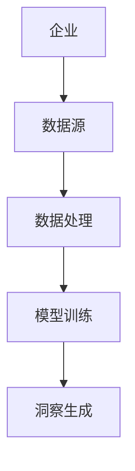
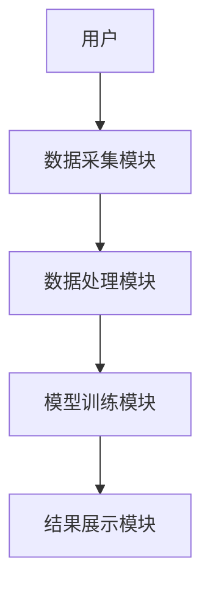

                 


# AI辅助企业竞争情报分析：自动化数据收集与洞察生成系统

> 关键词：AI，竞争情报分析，数据收集，洞察生成，系统架构，算法原理，项目实战

> 摘要：本文详细探讨了AI在企业竞争情报分析中的应用，重点介绍了自动化数据收集与洞察生成系统的构建过程。从系统背景到核心概念，从算法原理到系统架构，再到项目实战和最佳实践，系统地分析了如何利用AI技术提升企业竞争情报分析的效率和准确性。

---

## 第一部分: 竞争情报分析的背景与现状

### 第1章: 竞争情报分析的背景与重要性

#### 1.1 什么是竞争情报分析
竞争情报分析是指通过收集、处理和分析竞争对手及其市场的相关信息，为企业制定战略决策提供支持的过程。其核心在于从海量数据中提取有价值的信息，帮助企业了解市场动态、竞争对手策略以及行业趋势。

#### 1.2 竞争情报分析的重要性
在现代商业环境中，竞争情报分析是企业制定战略的重要依据。通过竞争情报分析，企业可以：
1. **识别市场机会**：发现新兴市场或未被满足的需求。
2. **预测竞争对手动向**：提前预判竞争对手的策略调整。
3. **优化自身战略**：根据竞争态势调整产品、营销和客户服务策略。

#### 1.3 传统竞争情报分析的局限性
传统竞争情报分析依赖人工收集和整理数据，效率低下且容易遗漏重要信息。此外，人工分析主观性强，难以保证结果的客观性和准确性。

### 第2章: AI技术在竞争情报分析中的作用

#### 2.1 AI技术如何提升竞争情报分析效率
AI技术通过自动化数据收集、处理和分析，显著提升了竞争情报分析的效率。具体表现在：
1. **自动化数据收集**：利用爬虫、API等技术自动获取竞争对手的产品、价格、市场活动等信息。
2. **智能化数据处理**：使用自然语言处理（NLP）技术自动提取文本信息，识别关键词和主题。
3. **预测与洞察生成**：通过机器学习模型预测市场趋势和竞争对手策略。

#### 2.2 基于AI的竞争情报分析的优势
AI技术的应用使得竞争情报分析更加精准和高效：
1. **数据处理能力**：AI能够处理海量数据，包括文本、图像和结构化数据。
2. **实时监控**：AI系统可以实时跟踪竞争对手的动态，提供即时的市场洞察。
3. **客观性与准确性**：通过算法模型，减少人为主观因素的影响，提高分析结果的准确性。

#### 2.3 企业竞争情报分析的未来趋势
随着AI技术的不断发展，竞争情报分析将更加智能化和自动化。未来的发展趋势包括：
1. **多模态数据融合**：结合文本、图像、视频等多种数据源，提供更全面的市场洞察。
2. **实时分析能力**：实现对市场动态的实时监控和响应。
3. **模型可解释性**：提高AI模型的透明度，使企业能够更好地理解和信任AI的分析结果。

---

## 第二部分: 自动化数据收集与洞察生成系统

### 第3章: 系统的核心目标与组成部分

#### 3.1 系统的核心目标
1. **自动化数据收集**：实时从多种数据源获取竞争对手的相关信息。
2. **智能化数据处理**：对收集的数据进行清洗、标注和特征提取。
3. **精准洞察生成**：基于处理后的数据，利用AI模型生成有价值的市场洞察。

#### 3.2 系统的关键组成部分
1. **数据源模块**：包括竞争对手的官方网站、社交媒体、新闻平台等。
2. **数据处理模块**：负责数据清洗、标注和特征提取。
3. **模型训练模块**：利用机器学习算法训练分类、聚类和生成模型。
4. **洞察生成模块**：基于模型结果生成竞争情报报告。

### 第4章: 核心概念与联系

#### 4.1 核心概念原理
1. **数据源**：系统从多种数据源获取信息，包括文本、结构化数据和图像。
2. **数据预处理**：清洗数据，提取关键词和主题，增强数据的可用性。
3. **模型训练**：利用预处理后的数据训练AI模型，生成竞争情报洞察。

#### 4.2 核心概念对比表
| 概念 | 描述 | 示例 |
|------|------|------|
| 数据源 | 竞争对手的官方网站、社交媒体等 | 竞争对手的产品页面 |
| 数据预处理 | 数据清洗、标注和特征提取 | 提取产品关键词 |
| 模型训练 | 使用机器学习算法训练模型 | 分类竞争对手的产品类型 |

#### 4.3 ER实体关系图


---

## 第三部分: 算法原理与数学模型

### 第5章: 竞争情报分析的算法原理

#### 5.1 数据预处理算法
1. **文本清洗**：去除无关信息，如停用词和标点符号。
2. **数据增强**：通过同义词替换等技术增加数据多样性。
3. **数据标注**：对数据进行分类标注，如竞争对手的产品类型。

#### 5.2 特征提取算法
1. **TF-IDF**：计算文本中关键词的重要性。
2. **Word2Vec**：将单词转换为向量表示。
3. **BERT**：预训练语言模型，用于更复杂的语义分析。

#### 5.3 模型训练算法
1. **分类模型**：如随机森林和神经网络，用于分类竞争对手的产品类型。
2. **聚类模型**：如K-means，用于将竞争对手的产品进行聚类分析。
3. **生成模型**：如GPT，用于生成竞争情报报告。

### 第6章: 数学模型与公式

#### 6.1 TF-IDF计算公式
$$\text{TF-IDF}(t, d) = \text{TF}(t, d) \times \text{IDF}(t)$$

其中：
- TF(t, d) 表示在文档d中关键词t的出现频率。
- IDF(t) 表示关键词t的逆向文件频率。

#### 6.2 Word2Vec训练公式
$$\log P(w_i|w_{i-1}) = \text{score}(w_i, w_{i-1}) - \text{score}(w_i, o)$$

其中：
- score(w_i, w_{i-1}) 表示词w_i在上下文中出现的概率。
- score(w_i, o) 表示词w_i在其他上下文中的概率。

---

## 第四部分: 系统架构与交互设计

### 第7章: 系统架构设计

#### 7.1 系统功能设计
1. **数据采集模块**：从多种数据源获取信息。
2. **数据处理模块**：清洗、标注和特征提取。
3. **模型训练模块**：训练AI模型并生成洞察。
4. **结果展示模块**：以可视化方式展示竞争情报报告。

#### 7.2 系统架构图


---

## 第五部分: 项目实战与应用

### 第8章: 项目实战

#### 8.1 项目背景
某企业希望通过AI系统实时监控竞争对手的产品发布和市场活动，生成竞争情报报告。

#### 8.2 环境配置
1. Python 3.8+
2. 安装必要的库：requests、beautifulsoup4、spacy、scikit-learn、transformers。

#### 8.3 核心代码实现
```python
import requests
from bs4 import BeautifulSoup
import spacy

# 数据采集模块
def collect_data(url):
    response = requests.get(url)
    soup = BeautifulSoup(response.text, 'html.parser')
    content = soup.find_all('div', class_='product-info')
    return content

# 数据处理模块
def preprocess_data(content):
    nlp = spacy.load('en_core_web_sm')
    processed_data = []
    for item in content:
        text = item.text
        doc = nlp(text)
        keywords = [token.text for token in doc if not token.is_stop]
        processed_data.append({'text': text, 'keywords': keywords})
    return processed_data

# 模型训练模块
from sklearn.feature_extraction.text import TfidfVectorizer
from sklearn.naive_bayes import MultinomialNB

vectorizer = TfidfVectorizer()
model = MultinomialNB()

# 洞察生成模块
def generate_insight(processed_data):
    X = vectorizer.fit_transform([item['text'] for item in processed_data])
    y = [item['keywords'][0] for item in processed_data]
    model.fit(X, y)
    return model

# 应用示例
data = collect_data('https://example.com/competitor-products')
processed_data = preprocess_data(data)
model = generate_insight(processed_data)
```

---

## 第六部分: 最佳实践与总结

### 第9章: 最佳实践

#### 9.1 小结
本文详细介绍了AI辅助企业竞争情报分析的自动化数据收集与洞察生成系统，从背景、系统架构到算法原理和项目实战，全面阐述了如何利用AI技术提升竞争情报分析的效率和准确性。

#### 9.2 注意事项
1. 数据隐私和合规性：确保数据收集和处理符合相关法律法规。
2. 模型可解释性：选择适当的模型，确保分析结果的透明性和可解释性。
3. 持续优化：根据实际应用反馈，不断优化系统和模型。

#### 9.3 拓展阅读
1. 《自然语言处理入门》
2. 《机器学习实战》
3. 《深度学习与AI应用》

---

## 总结

通过本文的介绍，读者可以深入了解AI在企业竞争情报分析中的应用，掌握自动化数据收集与洞察生成系统的构建方法。未来，随着AI技术的不断发展，竞争情报分析将更加智能化和自动化，为企业提供更强大的决策支持。

