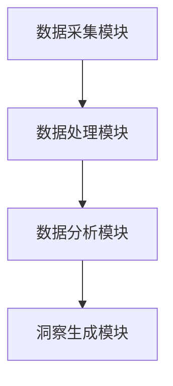
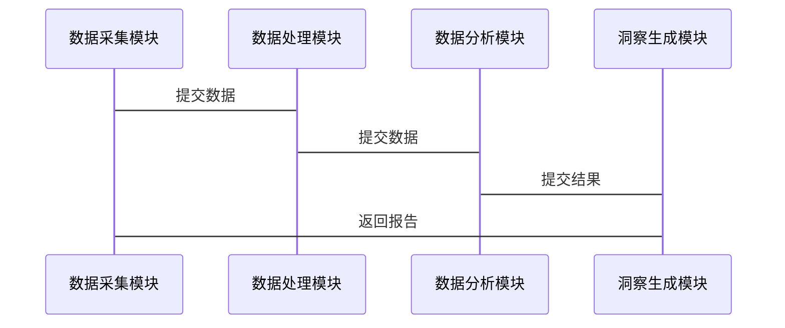

                 


# AI辅助企业竞争情报分析：自动化数据采集与洞察生成

---

## 关键词

- AI（人工智能）
- 竞争情报分析
- 自动化数据采集
- 洞察生成
- 数据分析
- 系统架构

---

## 摘要

在企业竞争日益激烈的今天，竞争情报分析已成为企业制定战略决策的重要工具。然而，传统的情报分析方法依赖于人工采集和处理数据，效率低下且容易出错。AI的出现，为竞争情报分析带来了革命性的变化。通过自动化数据采集和智能化洞察生成，企业能够更高效、更准确地获取竞争对手的动态信息，从而在市场竞争中占据优势。本文将详细探讨AI如何辅助企业竞争情报分析，从数据采集到洞察生成的完整流程，结合实际案例和系统设计，为企业提供一套高效的情报分析解决方案。

---

## 第1章: 竞争情报分析与AI的结合

### 1.1 竞争情报分析的定义与核心要素

#### 1.1.1 竞争情报分析的定义

竞争情报分析（Competitive Intelligence Analysis）是指通过收集、整理、分析竞争对手及相关市场信息，为企业制定战略决策提供支持的过程。它不仅包括对竞争对手的产品、市场策略、财务状况等信息的收集，还包括对行业趋势、客户需求等外部因素的分析。

#### 1.1.2 竞争情报分析的核心要素

| 核心要素 | 描述 |
|----------|------|
| 数据来源 | 竞争对手的产品、市场动态、行业报告等 |
| 数据类型 | 文本、图像、视频、表格等 |
| 数据采集方式 | 网络爬虫、API调用、人工采集等 |
| 分析方法 | 统计分析、数据挖掘、机器学习等 |
| 洞察类型 | 竞争对手的市场策略、产品趋势、客户行为等 |

#### 1.1.3 竞争情报分析的流程与方法

- **数据采集**：从多种来源获取竞争对手的信息。
- **数据处理**：清洗、转换和整合数据，确保数据质量。
- **数据分析**：使用统计分析和机器学习方法，发现数据中的模式和趋势。
- **洞察生成**：基于分析结果，生成竞争情报报告，为企业提供决策支持。

### 1.2 AI在竞争情报分析中的作用

#### 1.2.1 AI如何提升竞争情报分析效率

AI通过自动化数据采集、智能化分析和实时监控，显著提高了竞争情报分析的效率。例如，AI可以通过自然语言处理技术快速解析竞争对手的产品评论，提取关键信息。

#### 1.2.2 AI在数据采集与处理中的应用

- **网络爬虫**：AI驱动的爬虫可以自动从竞争对手的网站、社交媒体等来源获取数据。
- **自然语言处理**：AI能够从非结构化文本中提取关键词和情感倾向，帮助分析竞争对手的市场策略。
- **数据清洗**：AI可以自动识别和处理数据中的噪声，确保数据的准确性。

#### 1.2.3 AI在竞争情报洞察生成中的优势

- **实时监控**：AI可以实时跟踪竞争对手的市场动态，帮助企业及时调整策略。
- **预测分析**：基于历史数据和机器学习模型，AI可以预测竞争对手的未来行为。
- **自动化报告**：AI可以自动生成竞争情报报告，简化了人工整理的过程。

---

## 第2章: 自动化数据采集技术

### 2.1 数据采集的挑战与解决方案

#### 2.1.1 数据来源的多样性

竞争情报数据来源广泛，包括竞争对手的官方网站、社交媒体、行业报告、新闻媒体等。这些数据来源具有多样性，且数据格式和结构各不相同，增加了数据采集的复杂性。

#### 2.1.2 数据采集的难点与痛点

- **数据量大**：竞争对手可能有海量数据，手动采集效率低下。
- **数据分散**：数据分布在多个平台，需要整合和处理。
- **数据隐私**：采集过程中需要遵守数据隐私法规，避免侵犯竞争对手的隐私。

#### 2.1.3 自动化数据采集的必要性

自动化数据采集可以显著提高数据采集的效率和准确性，减少人工干预，降低成本。

### 2.2 竞争情报数据采集的关键技术

#### 2.2.1 网络爬虫技术

网络爬虫是一种通过模拟浏览器行为，从网页中提取数据的技术。常用的爬虫框架包括Scrapy、BeautifulSoup、Selenium等。

##### 使用Python实现简单的网络爬虫

```python
import requests
from bs4 import BeautifulSoup

url = 'https://example.com'  # 竞争对手的官方网站
response = requests.get(url)
soup = BeautifulSoup(response.text, 'html.parser')

# 提取产品名称
products = soup.find_all('div', class_='product-name')
for product in products:
    print(product.text)
```

#### 2.2.2 自然语言处理技术

自然语言处理（NLP）技术可以帮助从文本数据中提取有用的信息。常用的NLP技术包括分词、实体识别、情感分析等。

##### 使用Python实现文本情感分析

```python
from textblob import TextBlob

text = "The new product from the competitor is excellent."
blob = TextBlob(text)
print(blob.sentiment.polarity)  # 情感倾向值，范围在-1到1之间
```

#### 2.2.3 数据清洗与预处理方法

数据清洗是数据处理的重要步骤，主要包括去重、填充缺失值、标准化等。

##### 数据清洗示例

```python
import pandas as pd

data = pd.DataFrame({
    'product_name': ['Product A', 'Product B', 'Product A', 'Product C'],
    'price': [100, 200, None, 300]
})

# 去重
data.drop_duplicates(subset=['product_name'], inplace=True)

# 填充缺失值
data['price'].fillna(data['price'].mean(), inplace=True)

print(data)
```

---

## 第3章: 数据分析与洞察生成

### 3.1 数据分析的核心方法

#### 3.1.1 统计分析方法

统计分析方法包括描述性统计、推断统计等。描述性统计用于总结数据的基本特征，推断统计用于基于样本数据推断总体特征。

##### 描述性统计示例

```python
import numpy as np

data = np.array([100, 200, 300, 400, 500])
print(np.mean(data))    # 平均值
print(np.median(data))  # 中位数
print(np.std(data))     # 标准差
```

#### 3.1.2 数据挖掘技术

数据挖掘技术包括聚类分析、关联规则挖掘、分类分析等。这些技术可以帮助发现数据中的模式和趋势。

##### 聚类分析示例

```python
from sklearn.cluster import KMeans

data = np.array([[100, 200], [200, 300], [300, 400], [400, 500], [500, 600]])

model = KMeans(n_clusters=2)
model.fit(data)

print(model.labels_)
```

#### 3.1.3 机器学习算法

机器学习算法包括监督学习、无监督学习、半监督学习等。这些算法可以帮助预测竞争对手的行为和市场趋势。

##### 监督学习示例

```python
from sklearn.linear_model import LinearRegression

data = np.array([[100, 200], [200, 300], [300, 400], [400, 500], [500, 600]])
model = LinearRegression()
model.fit(data[:, 0].reshape(-1, 1), data[:, 1])

print(model.predict([[600]]))  # 预测结果
```

### 3.2 基于AI的洞察生成流程

#### 3.2.1 数据特征提取

数据特征提取是将原始数据转换为能够反映数据特征的表示。常用的特征提取方法包括文本向量化、图像特征提取等。

##### 文本向量化示例

```python
from sklearn.feature_extraction.text import TfidfVectorizer

text = ["The new product is excellent.", "The quality is poor."]
vectorizer = TfidfVectorizer()
X = vectorizer.fit_transform(text)
print(X.toarray())
```

#### 3.2.2 模型训练与优化

模型训练是基于训练数据训练机器学习模型，优化模型参数以提高预测准确率。

##### 模型优化示例

```python
from sklearn.model_selection import GridSearchCV
from sklearn.svm import SVC

param_grid = {'C': [1, 10], 'gamma': [0.1, 0.01]}
grid_search = GridSearchCV(SVC(), param_grid, cv=5)
grid_search.fit(X_train, y_train)

print(grid_search.best_params_)
```

#### 3.2.3 洞察结果可视化

洞察结果可视化是将分析结果以图表形式展示，便于理解和决策。

##### 可视化示例

```python
import matplotlib.pyplot as plt

x = [100, 200, 300, 400, 500]
y = [200, 300, 400, 500, 600]

plt.plot(x, y)
plt.xlabel('X轴')
plt.ylabel('Y轴')
plt.title('趋势图')
plt.show()
```

---

## 第4章: 竞争情报分析的系统架构

### 4.1 系统架构设计

#### 4.1.1 模块化设计原则

系统架构设计应遵循模块化原则，将系统划分为功能独立的模块，便于开发和维护。

##### 系统功能模块划分

- **数据采集模块**：负责从多种数据源采集数据。
- **数据处理模块**：负责清洗、转换和存储数据。
- **数据分析模块**：负责对数据进行统计分析和机器学习建模。
- **洞察生成模块**：负责生成竞争情报报告和可视化结果。

#### 4.1.2 系统架构的可扩展性

系统架构应具有良好的可扩展性，能够适应未来业务需求的变化。

##### 系统架构图



### 4.2 系统接口与数据流设计

#### 4.2.1 数据采集接口

数据采集模块通过API接口与数据源进行交互，获取竞争对手的信息。

##### 数据采集接口示例

```python
import requests

url = 'https://api.example.com/competitor-info'
response = requests.get(url)
data = response.json()
print(data)
```

#### 4.2.2 数据处理接口

数据处理模块通过接口接收数据，并进行清洗和转换。

##### 数据处理接口示例

```python
import pandas as pd

data = pd.DataFrame({
    'name': ['A', 'B', 'C'],
    'price': [100, 200, 300]
})

processed_data = data.drop_duplicates('name')
print(processed_data)
```

#### 4.2.3 洞察生成接口

洞察生成模块通过接口接收分析结果，并生成竞争情报报告。

##### 洞察生成接口示例

```python
from reportlab.pdfgen import canvas

def generate_report(data):
    c = canvas.Canvas('report.pdf')
    c.drawString(100, 750, '竞争情报报告')
    c.save()

generate_report(data)
```

### 4.3 系统交互流程

系统交互流程包括数据采集、数据处理、数据分析和洞察生成四个阶段。

##### 系统交互流程图



---

## 第5章: 项目实战与案例分析

### 5.1 项目背景与目标

#### 5.1.1 项目需求分析

某企业需要收集竞争对手的产品信息，包括产品名称、价格、客户评价等。

#### 5.1.2 项目目标设定

- 收集竞争对手的产品信息。
- 分析竞争对手的产品策略。
- 生成竞争情报报告。

#### 5.1.3 项目实施计划

1. 确定数据来源和采集方式。
2. 设计数据处理流程。
3. 实现数据分析模块。
4. 生成竞争情报报告。

### 5.2 数据采集与处理实现

#### 5.2.1 数据采集代码实现

```python
import requests
from bs4 import BeautifulSoup

url = 'https://example.com/products'
response = requests.get(url)
soup = BeautifulSoup(response.text, 'html.parser')

products = soup.find_all('div', class_='product')
for product in products:
    name = product.find('h3').text
    price = product.find('p').text
    print(f'Product Name: {name}, Price: {price}')
```

#### 5.2.2 数据清洗与预处理

```python
import pandas as pd

data = {
    'product_name': ['Product A', 'Product B', 'Product A', 'Product C'],
    'price': [100, 200, None, 300]
}

df = pd.DataFrame(data)
df = df.drop_duplicates('product_name')
df['price'].fillna(df['price'].mean(), inplace=True)
print(df)
```

#### 5.2.3 数据存储与管理

```python
import sqlite3

conn = sqlite3.connect('competitor.db')
cursor = conn.cursor()

cursor.execute('''CREATE TABLE products
                  (id INTEGER PRIMARY KEY,
                   product_name TEXT,
                   price REAL)''')

cursor.execute('INSERT INTO products VALUES(1, "Product A", 100)')
cursor.execute('INSERT INTO products VALUES(2, "Product B", 200)')
cursor.execute('INSERT INTO products VALUES(3, "Product C", 300)')

conn.commit()
conn.close()
```

### 5.3 洞察生成与可视化

#### 5.3.1 模型训练与优化

```python
from sklearn.linear_model import LinearRegression
from sklearn.metrics import mean_squared_error

X_train = data[['price']]
y_train = data['rating']

model = LinearRegression()
model.fit(X_train, y_train)

y_pred = model.predict(X_train)
print(mean_squared_error(y_train, y_pred))
```

#### 5.3.2 洞察结果可视化

```python
import matplotlib.pyplot as plt

plt.figure(figsize=(10, 6))
plt.scatter(X_train, y_train, color='blue')
plt.plot(X_train, y_pred, color='red')
plt.xlabel('Price')
plt.ylabel('Rating')
plt.title('Product Price vs Rating')
plt.show()
```

#### 5.3.3 案例分析与总结

通过上述分析，我们可以看到竞争对手的产品价格与其客户 ratings 之间存在一定的线性关系。企业可以根据这一关系调整自己的产品定价策略，以更好地适应市场需求。

---

## 第6章: 最佳实践与注意事项

### 6.1 数据采集与处理的

#### 6.1.1 数据隐私与合规性

在数据采集过程中，必须遵守相关法律法规，确保数据的合法性和合规性。特别是在处理竞争对手的敏感信息时，需要特别注意数据隐私问题。

#### 6.1.2 数据清洗与预处理

数据清洗和预处理是数据分析的关键步骤。在实际操作中，需要根据具体业务需求，选择合适的清洗方法和预处理策略，以确保数据的准确性和一致性。

#### 6.1.3 数据存储与管理

数据存储和管理是竞争情报分析的重要环节。建议采用分布式存储和高效查询技术，确保数据的可扩展性和可维护性。

### 6.2 系统架构与设计

#### 6.2.1 模块化设计

系统架构设计应遵循模块化原则，确保系统的可扩展性和可维护性。每个模块应具有清晰的功能定义和接口规范。

#### 6.2.2 系统性能优化

在实际应用中，需要注意系统的性能优化，特别是在数据量较大的情况下，需要采用高效的算法和优化的代码实现，确保系统的运行效率。

#### 6.2.3 系统安全性

系统安全性是竞争情报分析的重要保障。需要采取多层次的安全防护措施，确保系统的数据安全和运行安全。

### 6.3 项目实施与管理

#### 6.3.1 项目计划与进度控制

在项目实施过程中，需要制定详细的项目计划，合理安排项目进度，确保项目的按时完成。

#### 6.3.2 团队协作与沟通

团队协作与沟通是项目成功的关键。需要建立高效的沟通机制，确保团队成员之间的信息畅通，避免项目执行中的偏差。

#### 6.3.3 项目监控与评估

在项目实施过程中，需要定期进行项目监控和评估，及时发现和解决问题，确保项目的顺利进行。

### 6.4 最佳实践总结

- **数据隐私与合规性**：严格遵守数据隐私法规，确保数据的合法性和合规性。
- **数据清洗与预处理**：根据业务需求，选择合适的清洗方法和预处理策略。
- **系统架构设计**：遵循模块化设计原则，确保系统的可扩展性和可维护性。
- **系统性能优化**：采用高效的算法和优化的代码实现，确保系统的运行效率。
- **团队协作与沟通**：建立高效的沟通机制，确保团队成员之间的信息畅通。

### 6.5 小结与展望

通过本文的探讨，我们可以看到AI在竞争情报分析中的巨大潜力。随着技术的不断进步，AI将为企业竞争情报分析提供更强大的工具和更高效的解决方案。未来，我们需要进一步研究和探索AI在竞争情报分析中的更多应用场景，为企业创造更大的价值。

---

## 结语

AI辅助企业竞争情报分析：自动化数据采集与洞察生成，是一项具有广阔前景的技术。通过本文的详细探讨，我们不仅了解了AI在竞争情报分析中的重要作用，还掌握了从数据采集到洞察生成的完整流程。希望本文能为企业在竞争情报分析中提供有价值的参考和指导。

