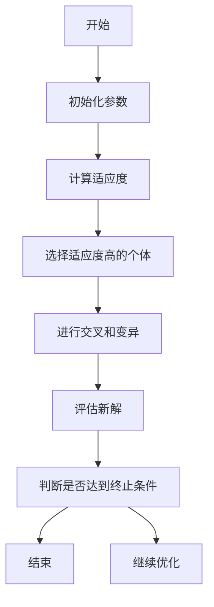
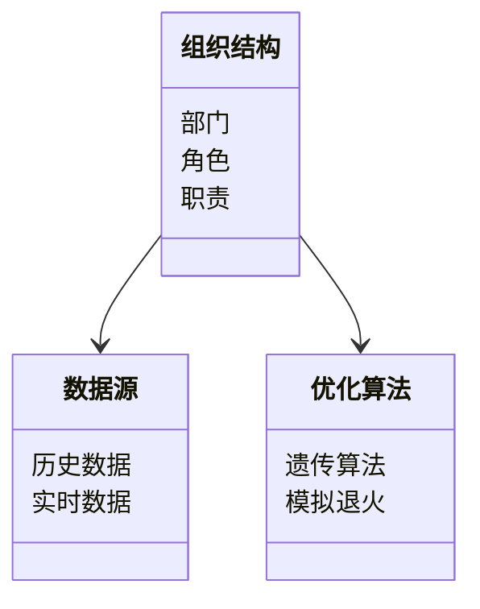
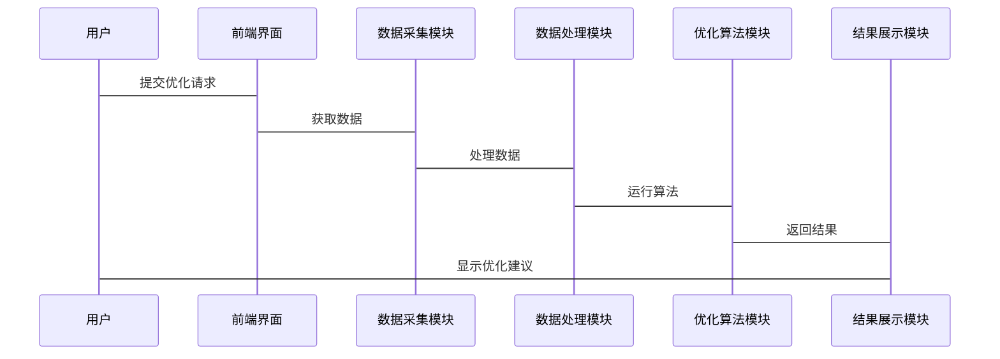

                 


# AI辅助企业组织结构优化：效率提升与协作增强

> 关键词：企业组织结构优化，人工智能，效率提升，协作增强，算法优化，系统架构设计，项目实战

> 摘要：本文将详细探讨AI技术在企业组织结构优化中的应用，通过分析优化算法、系统架构设计和项目实战，展示如何利用AI提升企业效率和协作能力。我们将从背景介绍、核心概念、算法原理、系统设计到项目实战，逐步深入，帮助读者全面理解AI辅助企业组织结构优化的潜力和实现方法。

---

# 第一部分: AI辅助企业组织结构优化的背景与概念

# 第1章: 企业组织结构优化的背景与问题

## 1.1 企业组织结构优化的背景
### 1.1.1 企业组织结构的演变
企业的组织结构随着时代的发展不断演变。从传统的层级制到现代的扁平化结构，组织结构的变化反映了企业对效率和灵活性的追求。然而，随着业务的复杂化，组织结构的优化变得越来越重要。

### 1.1.2 数字化转型对企业组织结构的影响
数字化转型不仅改变了企业的运营方式，也对组织结构提出了新的要求。AI技术的应用使得企业能够更灵活地调整组织结构，以适应快速变化的市场环境。

### 1.1.3 AI技术在企业管理中的应用趋势
AI技术的快速发展为企业组织结构优化提供了新的工具和方法。通过AI辅助优化，企业能够更高效地配置资源、优化流程，并提升整体效率。

## 1.2 企业组织结构优化的核心问题
### 1.2.1 组织结构的复杂性与效率低下
复杂的组织结构可能导致信息传递不畅，责任不清，进而影响整体效率。优化组织结构可以解决这些问题。

### 1.2.2 信息孤岛与协作障碍
部门之间的信息孤岛和协作障碍是企业效率低下的重要原因。通过AI技术，企业可以打破信息孤岛，实现更高效的协作。

### 1.2.3 传统管理方法的局限性
传统管理方法在面对复杂问题时往往力不从心。AI技术的应用可以弥补传统方法的不足，提供更高效的解决方案。

## 1.3 AI辅助企业组织结构优化的价值
### 1.3.1 提升管理效率的潜力
AI技术可以通过数据分析和预测，帮助企业做出更明智的决策，从而提升管理效率。

### 1.3.2 降低运营成本的可能性
通过优化组织结构和流程，AI技术可以帮助企业降低运营成本，提升整体盈利能力。

### 1.3.3 增强部门协作的可行性
AI技术可以促进部门之间的协作，打破信息孤岛，实现更高效的资源分配和流程管理。

## 1.4 本章小结
本章介绍了企业组织结构优化的背景、核心问题以及AI辅助优化的价值。通过分析这些问题，我们可以更好地理解AI在组织结构优化中的重要性。

---

# 第2章: AI辅助企业组织结构优化的核心概念

## 2.1 AI在企业组织结构优化中的作用
### 2.1.1 AI技术的基本原理
AI技术通过机器学习、自然语言处理等方法，帮助企业分析数据、识别模式，并提供优化建议。

### 2.1.2 AI在组织优化中的应用场景
AI可以应用于组织架构设计、流程优化、团队协作等多个方面，帮助企业实现更高效的管理。

### 2.1.3 AI优化算法的基本流程
AI优化算法通常包括数据收集、模型训练、优化建议生成等步骤，帮助企业找到最优的组织结构。

## 2.2 组织结构优化的关键要素
### 2.2.1 组织目标的定义
明确的组织目标是优化的基础。通过定义目标，企业可以更好地指导优化过程。

### 2.2.2 组织角色与职责分配
合理的角色和职责分配是优化组织结构的关键。通过AI技术，企业可以更科学地分配资源和任务。

### 2.2.3 组织流程的优化
优化流程可以减少浪费，提高效率。AI技术可以帮助企业识别瓶颈，提出改进建议。

## 2.3 AI优化算法的核心原理
### 2.3.1 数据驱动的决策方法
AI优化算法依赖于大量数据，通过分析数据找到最优解。

### 2.3.2 机器学习在组织优化中的应用
机器学习算法可以预测组织结构的潜在问题，并提出优化建议。

### 2.3.3 智能算法的优化策略
智能算法如遗传算法、模拟退火等，可以帮助企业在复杂的环境中找到最优解。

## 2.4 本章小结
本章详细介绍了AI在企业组织结构优化中的作用、关键要素和核心原理，为后续的算法分析和系统设计打下基础。

---

# 第3章: AI辅助企业组织结构优化的算法原理

## 3.1 组织结构优化的数学模型
### 3.1.1 优化目标的数学表达
通过数学模型，我们可以将组织优化问题转化为可计算的形式。例如，目标函数可能包括成本、效率、协作等多个因素。

$$ \text{目标函数} = \text{成本} + \text{效率} + \text{协作} $$

### 3.1.2 约束条件的数学描述
约束条件通常包括资源限制、时间限制等。例如：

$$ \text{资源限制} = \sum_{i=1}^{n} x_i \leq C $$

### 3.1.3 优化问题的分类
优化问题可以分为线性规划、整数规划、动态规划等类型，每种类型都有其适用的场景。

## 3.2 常用优化算法及其特点
### 3.2.1 遗传算法
遗传算法是一种模拟生物进化的过程，通过选择、交叉和变异生成新的解。

### 3.2.2 模拟退火算法
模拟退火算法通过逐步降温，减少局部最优，找到全局最优解。

### 3.2.3 蚁群算法
蚁群算法模拟蚂蚁寻找食物的过程，通过信息素的传递找到最优路径。

## 3.3 基于AI的优化算法实现
### 3.3.1 算法流程图（使用mermaid）


### 3.3.2 算法实现的数学模型
以遗传算法为例，目标函数可以表示为：

$$ f(x) = \sum_{i=1}^{n} w_i x_i $$

其中，$w_i$ 是权重，$x_i$ 是变量。

## 3.4 本章小结
本章详细介绍了组织结构优化的数学模型和常用算法，为后续的系统设计和项目实战奠定了基础。

---

# 第4章: 系统分析与架构设计方案

## 4.1 问题场景介绍
### 4.1.1 企业组织结构优化的常见问题
企业可能面临的问题包括部门协作不畅、资源浪费、效率低下等。

### 4.1.2 项目背景与目标
通过AI技术，帮助企业优化组织结构，提升效率和协作能力。

## 4.2 系统功能设计
### 4.2.1 领域模型设计（使用mermaid类图）


### 4.2.2 系统架构设计（使用mermaid架构图）


## 4.3 系统交互设计
### 4.3.1 系统交互流程（使用mermaid序列图）


## 4.4 本章小结
本章通过系统分析和架构设计，展示了如何利用AI技术实现企业组织结构优化的系统化解决方案。

---

# 第5章: 项目实战

## 5.1 环境安装与配置
### 5.1.1 开发环境的选择
推荐使用Python、TensorFlow、Scikit-learn等工具。

### 5.1.2 依赖库的安装
安装必要的库，如numpy、pandas、matplotlib等。

## 5.2 核心代码实现
### 5.2.1 数据处理模块
```python
import pandas as pd
import numpy as np

def preprocess(data):
    # 数据清洗和预处理
    data = data.dropna()
    return data
```

### 5.2.2 优化算法实现
```python
def genetic_algorithm(population, fitness_func):
    # 初始化种群
    current_population = population
    while not stop_condition():
        # 计算适应度
        fitness = fitness_func(current_population)
        # 选择适应度高的个体
        selected = selection(current_population, fitness)
        # 交叉和变异
        new_population = crossover(selected)
        current_population = mutate(new_population)
    return current_population
```

### 5.2.3 系统接口设计
```python
class OptimizationSystem:
    def __init__(self, data):
        self.data = data

    def run_algorithm(self, algorithm):
        # 运行优化算法
        result = algorithm.run(self.data)
        return result
```

## 5.3 案例分析与结果解读
### 5.3.1 实际案例分析
通过具体案例，展示优化算法的应用效果。

### 5.3.2 结果展示与解读
展示优化后的组织结构，并分析其对效率和协作的具体提升。

## 5.4 项目总结
### 5.4.1 项目成果
总结项目的主要成果和意义。

### 5.4.2 经验与教训
分享项目实施过程中的经验教训，为后续优化提供参考。

## 5.5 本章小结
本章通过项目实战，展示了AI技术在企业组织结构优化中的具体应用，帮助读者更好地理解和掌握相关技术。

---

# 第6章: 最佳实践与总结

## 6.1 小结
### 6.1.1 AI辅助企业组织结构优化的核心要点
AI技术可以帮助企业优化组织结构，提升效率和协作能力。

### 6.1.2 优化算法的选择与应用
根据具体问题选择合适的优化算法，确保算法的有效性和高效性。

## 6.2 注意事项
### 6.2.1 数据质量的重要性
数据质量直接影响优化结果，确保数据的准确性和完整性。

### 6.2.2 算法的可解释性
优化算法的可解释性对于企业的实际应用非常重要，确保决策的透明性和可操作性。

## 6.3 拓展阅读
### 6.3.1 相关书籍与论文
推荐一些相关的书籍和论文，供读者深入学习。

### 6.3.2 技术社区与资源
推荐一些技术社区和资源，帮助读者进一步学习和交流。

## 6.4 本章小结
本章总结了AI辅助企业组织结构优化的关键点，并提出了实际应用中的注意事项和拓展资源。

---

# 附录: 参考文献与工具

## 附录A: 参考文献
列出本文中引用的主要文献和资料。

## 附录B: 工具与资源
推荐一些常用的AI工具和资源，帮助读者进一步学习和实践。

---

通过以上目录大纲，我们可以系统地学习和理解AI辅助企业组织结构优化的各个方面，从理论到实践，从背景到应用，全面掌握这一领域的核心内容。

