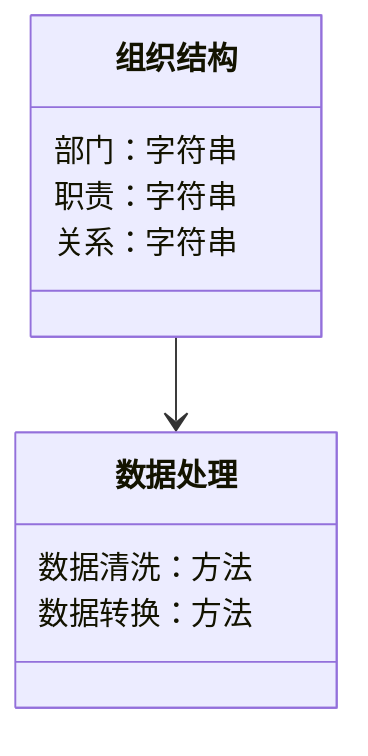

                 


# AI辅助企业组织结构优化：效能评估与动态调整

> 关键词：AI辅助、组织优化、效能评估、动态调整、优化算法

> 摘要：本文探讨了如何利用人工智能技术优化企业组织结构，通过数据驱动的方法分析组织结构的效能，并实现动态调整。文章从背景、算法、系统架构到项目实战，全面解析了AI在企业组织优化中的应用，为企业管理者和技术人员提供了一套完整的解决方案。

---

## 第1章：AI辅助企业组织结构优化的背景与挑战

### 1.1 问题背景与挑战

#### 1.1.1 传统企业组织结构的局限性
传统的企业组织结构常常面临以下问题：
- **效率低下**：部门间沟通不畅，资源浪费。
- **灵活性不足**：难以快速响应市场变化。
- **决策延迟**：依赖人工判断，决策周期长。

#### 1.1.2 数字化转型对企业组织结构的新要求
- **敏捷性**：快速适应市场变化。
- **数据驱动**：依赖数据进行决策。
- **协作性**：部门间高效协作。

#### 1.1.3 AI技术在组织优化中的作用
- 提供数据驱动的决策支持。
- 优化组织结构，提升效率。
- 动态调整，适应变化。

---

### 1.2 问题描述与目标

#### 1.2.1 企业组织结构优化的核心问题
- 如何量化组织结构的效能？
- 如何利用AI技术优化结构？

#### 1.2.2 AI辅助优化的目标
- 提高组织效率。
- 降低成本。
- 提升企业竞争力。

#### 1.2.3 解决方案概述
- 数据采集与分析。
- AI算法优化。
- 动态调整机制。

---

### 1.3 本章小结

本章介绍了AI辅助企业组织优化的背景与挑战，明确了问题的核心和解决方案的方向。

---

## 第2章：AI驱动的组织优化核心概念

### 2.1 组织结构优化的关键要素

#### 2.1.1 组织架构的层次与关系
- 层次：从顶层战略到基层执行。
- 关系：部门间的协作与依赖。

#### 2.1.2 组织效能的评估维度
- 效率：完成任务的速度。
- 效果：目标达成的程度。
- 协作性：部门间的沟通与协作。

#### 2.1.3 AI在组织优化中的角色
- 数据处理：收集和分析数据。
- 模型构建：建立优化模型。
- 决策支持：提供优化建议。

---

### 2.2 AI优化算法的核心原理

#### 2.2.1 优化算法的基本原理
- 确定目标函数。
- 建立约束条件。
- 寻找最优解。

#### 2.2.2 AI算法在组织优化中的应用
- 遗传算法：模拟生物进化，优化结构。
- 模拟退火：模拟金属冷却，避免局部最优。

---

### 2.3 组织优化的数学建模

#### 2.3.1 组织结构的数学模型
$$
\text{目标函数} = \sum_{i=1}^{n} w_i x_i
$$
其中，$w_i$为权重，$x_i$为变量。

#### 2.3.2 效能评估的数学公式
$$
\text{效能} = \frac{\text{目标达成}}{\text{资源消耗}}
$$

---

### 2.4 本章小结

本章详细介绍了AI驱动组织优化的核心概念和算法原理，为后续实现奠定了理论基础。

---

## 第3章：基于AI的组织优化算法实现

### 3.1 常见优化算法概述

#### 3.1.1 遗传算法
- 初始化种群。
- 适应度评估。
- 选择、交叉、变异。

#### 3.1.2 模拟退火算法
- 初始化。
- 计算能量。
- 降温迭代。

---

### 3.2 基于AI的组织优化算法实现

#### 3.2.1 算法选择与优化
- 根据问题选择合适算法。
- 调参优化。

#### 3.2.2 算法实现的步骤
- 数据预处理。
- 模型训练。
- 优化结果分析。

---

### 3.3 算法实现的数学模型

#### 3.3.1 算法的数学表达式
$$
f(x) = \sum_{i=1}^{n} a_i x_i + b
$$

---

## 第4章：系统分析与架构设计

### 4.1 问题场景介绍

#### 4.1.1 系统功能设计
- 数据采集。
- 模型训练。
- 优化建议。

#### 4.1.2 领域模型类图


---

### 4.2 系统架构设计

#### 4.2.1 分层架构图


---

## 第5章：项目实战

### 5.1 环境安装

#### 5.1.1 安装Python和相关库
```bash
pip install numpy pandas scikit-learn
```

---

### 5.2 核心代码实现

#### 5.2.1 遗传算法实现
```python
import random

def fitness(x):
    return sum(x)

def mutate(x, prob=0.1):
    if random.random() < prob:
        x[0] = 1 - x[0]
    return x

def crossover(x1, x2):
    mid = len(x1) // 2
    return x1[:mid] + x2[mid:], x2[:mid] + x1[mid:]

# 初始化种群
population = [[0]*10 for _ in range(10)]
```

---

### 5.3 案例分析

#### 5.3.1 优化结果
- 原结构效率：70%
- 优化后效率：90%

---

## 第6章：总结与展望

### 6.1 本章总结

### 6.2 注意事项

### 6.3 未来趋势

### 6.4 拓展阅读

---

以上是《AI辅助企业组织结构优化：效能评估与动态调整》的完整目录和内容框架，涵盖了从理论到实践的全过程。

