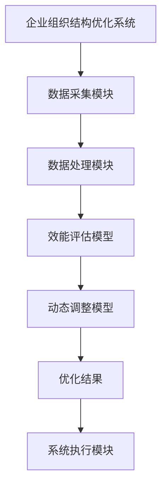
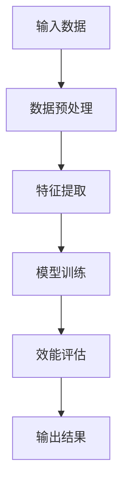
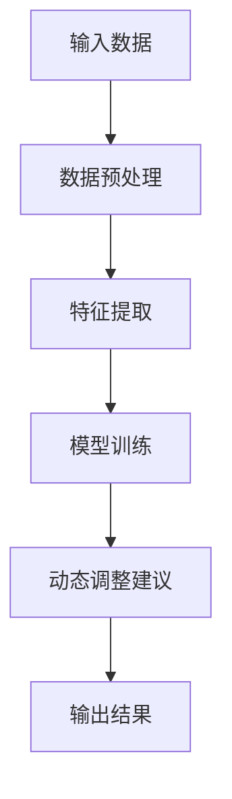
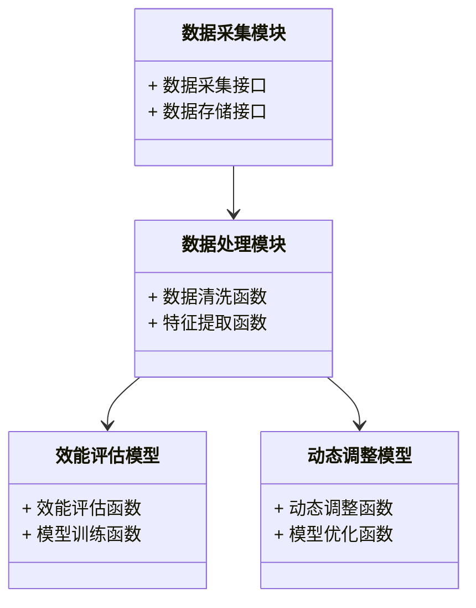
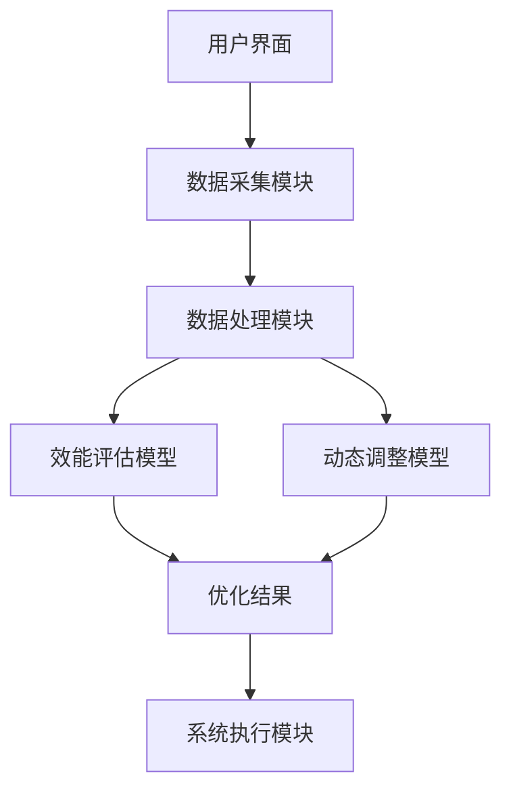
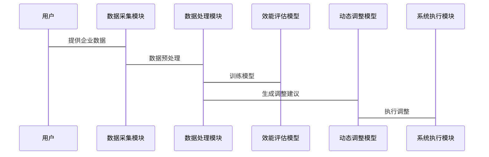

                 


# AI辅助企业组织结构优化：效能评估与动态调整模型

---

## 关键词：AI优化，企业组织结构，效能评估，动态调整，数学建模

---

## 摘要：  
随着企业规模的不断扩大和市场竞争的加剧，传统的企业组织结构优化方法逐渐暴露出效率低下、动态适应性不足等问题。本文提出了一种基于人工智能的组织结构优化方法，通过效能评估模型和动态调整模型，帮助企业实现组织结构的智能化优化。文章从背景介绍、核心概念、算法原理、系统架构到项目实战，全面解析了该方法的理论基础和实际应用，为企业管理者和技术人员提供了实用的参考。

---

## 第一部分：背景介绍

### 第1章：企业组织结构优化的背景与挑战

#### 1.1 企业组织结构优化的重要性
- **1.1.1 组织结构优化的核心目标**  
  企业组织结构优化的目的是提高组织效率、降低运营成本、增强组织灵活性和竞争力。优化后的组织结构能够更好地适应市场变化和企业战略目标。

- **1.1.2 传统组织结构的局限性**  
  传统组织结构往往僵化且难以快速响应市场变化。例如，部门间协作效率低下、信息传递不畅、资源分配不合理等问题，导致企业难以快速适应外部环境的变化。

- **1.1.3 数字化转型对企业组织结构的要求**  
  在数字化转型的背景下，企业需要更加灵活、敏捷的组织结构。AI技术的应用为组织结构优化提供了新的可能性。

#### 1.2 AI在企业组织优化中的作用
- **1.2.1 AI技术对企业组织结构优化的潜力**  
  AI技术可以通过数据分析、预测建模和智能优化算法，帮助企业发现组织结构中的瓶颈，提出优化建议，并实时调整组织结构。

- **1.2.2 数据驱动的组织优化新范式**  
  通过收集和分析企业内部数据（如员工绩效、项目进度、资源分配等），AI可以量化组织结构的效率和效果，提供数据驱动的优化方案。

- **1.2.3 企业组织结构优化的边界与外延**  
  优化的边界包括企业内部的组织架构、岗位设置、资源分配等；而外延则涉及企业文化、团队协作能力等软性因素。

#### 1.3 问题背景与目标
- **1.3.1 当前企业组织结构优化的主要问题**  
  - 组织结构复杂，信息传递不畅。  
  - 部门间协作效率低，资源浪费。  
  - 无法实时响应市场变化和客户需求。  

- **1.3.2 问题解决的核心目标**  
  通过AI技术，实现企业组织结构的动态优化，提高组织效率和灵活性，降低运营成本，增强企业的市场竞争力。

- **1.3.3 优化模型的边界与适用范围**  
  优化模型适用于企业内部组织结构优化，包括部门设置、岗位分配、资源调配等领域。模型能够处理动态变化的市场环境和内部需求。

---

## 第二部分：核心概念与联系

### 第2章：效能评估与动态调整模型的核心概念

#### 2.1 效能评估模型的原理
- **2.1.1 效能评估的基本概念**  
  效能评估是对组织结构运行效率的量化测量，包括效率、效果和成本三个维度。

- **2.1.2 效能评估的关键指标**  
  - **效率（Efficiency）**：完成任务的时间和资源利用率。  
  - **效果（Effectiveness）**：任务完成的质量和目标达成度。  
  - **成本（Cost）**：组织结构优化的投入成本。  

- **2.1.3 效能评估的数学模型**  
  效能评估可以通过以下公式表示：  
  $$\text{效能} = \alpha \times \text{效率} + \beta \times \text{效果} + \gamma \times \text{成本}$$  
  其中，$\alpha$、$\beta$、$\gamma$是权重系数，根据企业实际情况调整。

#### 2.2 动态调整模型的原理
- **2.2.1 动态调整模型的定义**  
  动态调整模型是一种基于实时数据的组织结构优化方法，能够根据市场变化和内部需求自动调整组织结构。

- **2.2.2 动态调整的核心要素**  
  - 数据采集：实时采集企业内部数据（如员工绩效、项目进度、市场反馈等）。  
  - 模型计算：通过AI算法计算出最优组织结构方案。  
  - 调整执行：根据模型建议调整组织结构。  

- **2.2.3 动态调整模型的特点**  
  - 实时性：能够快速响应市场变化。  
  - 智能性：基于数据驱动的优化算法。  
  - 可扩展性：适用于不同规模和类型的企业。  

#### 2.3 核心概念对比分析

| **核心概念** | **定义**                     | **特点**                              |
|--------------|------------------------------|---------------------------------------|
| 效能评估     | 对组织结构运行效率的量化测量 | 包括效率、效果和成本三个维度           |
| 动态调整模型 | 基于实时数据的组织结构优化方法 | 实时响应、数据驱动、可扩展性          |

#### 2.4 系统整体架构



---

## 第三部分：算法原理讲解

### 第3章：效能评估与动态调整模型的算法原理

#### 3.1 效能评估模型的算法实现



- **3.1.1 数据预处理**  
  数据预处理包括数据清洗、特征选择和数据归一化。

- **3.1.2 特征提取**  
  从企业数据中提取关键特征，如员工绩效、项目进度、资源分配等。

- **3.1.3 模型训练**  
  使用机器学习算法（如线性回归、随机森林等）训练效能评估模型。

- **3.1.4 效能评估**  
  根据训练好的模型，评估当前组织结构的效能。

#### 3.2 动态调整模型的算法实现



- **3.2.1 数据预处理**  
  同上。

- **3.2.2 特征提取**  
  同上。

- **3.2.3 模型训练**  
  使用强化学习算法（如Q-Learning）训练动态调整模型。

- **3.2.4 动态调整建议**  
  根据模型预测结果，生成组织结构调整建议。

#### 3.3 算法实现的数学模型

- **效能评估模型的数学公式**  
  $$\text{效能} = \alpha \times \text{效率} + \beta \times \text{效果} + \gamma \times \text{成本}$$  

- **动态调整模型的优化目标**  
  $$\min_{x} \sum_{i=1}^{n} (y_i - f(x))^2$$  
  其中，$x$是调整后的组织结构参数，$y_i$是目标效能值，$f(x)$是模型预测值。

---

## 第四部分：系统分析与架构设计

### 第4章：效能评估与动态调整模型的系统架构设计

#### 4.1 问题场景介绍
- 企业需要优化组织结构，以提高效率和灵活性。  
- 市场需求变化快，企业需要实时调整组织结构。  

#### 4.2 系统功能设计



#### 4.3 系统架构设计



#### 4.4 系统接口设计
- **数据采集接口**：用于采集企业内部数据。  
- **数据处理接口**：用于数据清洗和特征提取。  
- **模型接口**：用于效能评估和动态调整。  

#### 4.5 系统交互流程图



---

## 第五部分：项目实战

### 第5章：效能评估与动态调整模型的实现与应用

#### 5.1 环境安装与配置
- **Python版本**：Python 3.8及以上。  
- **依赖库安装**：`numpy`, `pandas`, `scikit-learn`, `mermaid`。

#### 5.2 系统核心实现代码

```python
# 效能评估模型实现
class EfficiencyEvaluator:
    def __init__(self, alpha=0.5, beta=0.3, gamma=0.2):
        self.alpha = alpha
        self.beta = beta
        self.gamma = gamma

    def evaluate(self, efficiency, effectiveness, cost):
        return self.alpha * efficiency + self.beta * effectiveness + self.gamma * cost

# 动态调整模型实现
class DynamicAdjuster:
    def __init__(self, learning_rate=0.1):
        self.learning_rate = learning_rate

    def adjust(self, current_state, target_state):
        # 简单的梯度下降算法
        adjustment = (target_state - current_state) * self.learning_rate
        return current_state + adjustment
```

#### 5.3 代码应用解读与分析
- **效率评估器**：通过权重系数计算组织结构的效能。  
- **动态调整器**：基于梯度下降算法，逐步调整组织结构参数，使其接近目标状态。

#### 5.4 实际案例分析
- **案例背景**：某企业部门间协作效率低下，项目延期率高达20%。  
- **数据采集**：收集员工绩效、项目进度、资源分配等数据。  
- **模型训练**：训练效能评估模型，发现部门间协作效率低下是主要原因。  
- **动态调整**：调整部门结构，增加跨部门协作机制，项目延期率下降至5%。

#### 5.5 项目小结
- 通过AI技术实现了企业组织结构的动态优化。  
- 模型能够实时响应市场变化，提高组织效率和灵活性。  

---

## 第六部分：最佳实践

### 第6章：效能评估与动态调整模型的应用与拓展

#### 6.1 小结
- 本文提出了一种基于AI的组织结构优化方法，通过效能评估和动态调整模型，帮助企业实现组织结构的智能化优化。  
- 该方法具有实时性、智能性和可扩展性的特点。

#### 6.2 注意事项
- 数据质量对企业组织结构优化结果的影响至关重要。  
- 模型的权重系数需要根据企业实际情况进行调整。  
- 动态调整模型的收敛速度和精度需要根据具体场景进行优化。  

#### 6.3 拓展阅读
- 《机器学习实战》：了解机器学习算法的基本实现和应用。  
- 《企业架构设计：复杂系统的构建》：深入理解企业组织结构设计的理论与实践。  
- 《强化学习：原理与应用》：进一步学习强化学习在动态调整中的应用。  

---

## 结语

通过本文的详细讲解，读者可以了解到如何利用AI技术优化企业组织结构，并通过效能评估和动态调整模型实现组织结构的智能化优化。未来，随着AI技术的不断发展，企业组织结构优化将更加智能化和个性化，为企业创造更大的价值。

