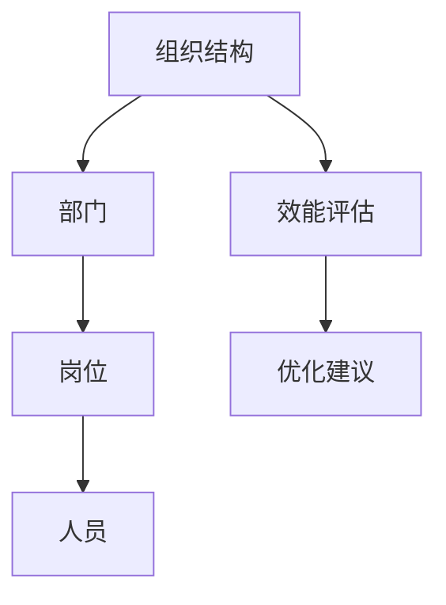
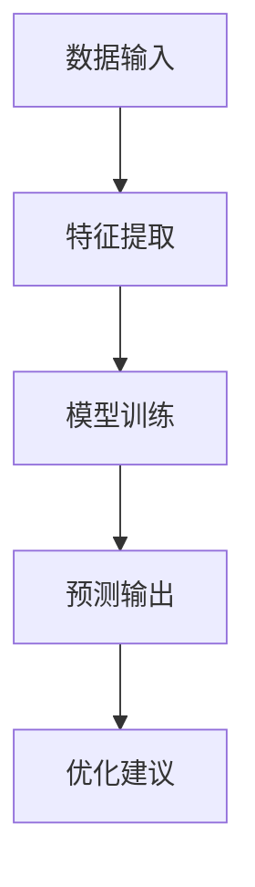
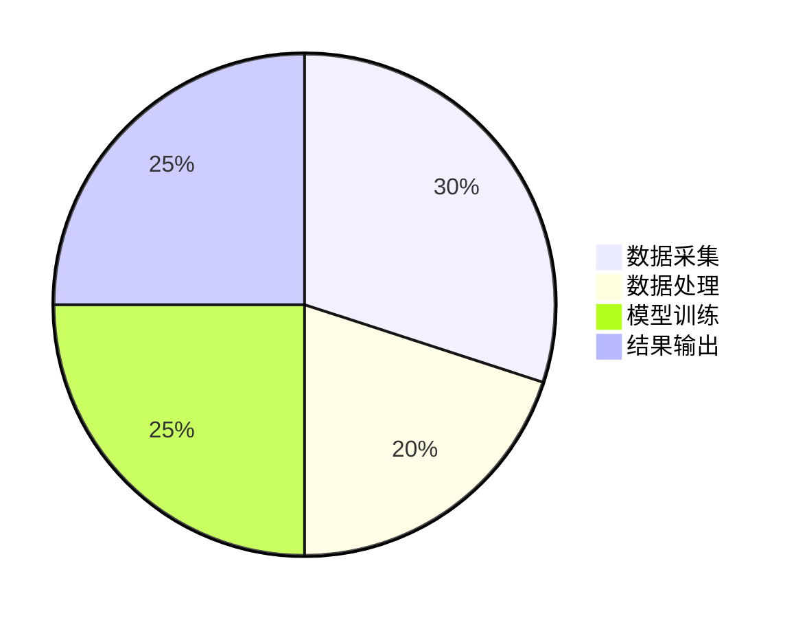

                 


# AI辅助企业组织结构动态优化：效能评估与调整

> 关键词：AI，企业组织结构，动态优化，效能评估，组织调整，算法原理

> 摘要：本文探讨了AI在企业组织结构动态优化中的应用，从理论到实践，详细分析了如何利用AI技术提升组织效能。通过数学模型、算法实现和系统设计，展示了AI在组织优化中的强大能力。文章最后总结了AI辅助组织优化的最佳实践和未来发展方向。

---

## 第一章: 引言

### 1.1 问题背景与挑战

#### 1.1.1 传统企业组织结构的局限性
传统的企业组织结构通常基于固定的层级和职责划分，难以适应快速变化的市场需求和技术进步。例如，职能部门之间的协作效率低下，信息传递延迟，导致企业对市场变化的响应速度较慢。

#### 1.1.2 数字化转型对企业组织结构的新要求
随着数字化转型的推进，企业需要更加灵活和高效的组织结构。AI技术的应用为企业提供了新的可能性，例如自动化决策、智能协作和数据驱动的管理。

#### 1.1.3 AI技术在组织优化中的作用
AI技术可以通过分析大量数据，发现组织结构中的潜在问题，并提出优化建议。例如，AI可以识别部门间协作的瓶颈，并推荐调整方案。

### 1.2 问题描述与解决方案

企业组织结构优化的目标是提高组织效率和员工生产力。然而，传统的优化方法往往依赖于主观判断，缺乏数据支持。AI技术可以通过数据驱动的方式，提供客观的优化建议。

### 1.3 本章小结

本章介绍了AI辅助企业组织结构动态优化的背景和挑战，并提出了AI技术在其中的关键作用。

---

## 第二章: AI辅助组织优化的核心概念

### 2.1 核心概念原理

#### 2.1.1 动态组织结构的数学模型
动态组织结构可以表示为一个数学模型，其中每个节点代表一个岗位或部门，边表示它们之间的协作关系。公式如下：
$$
G = (V, E)
$$
其中，$V$ 表示岗位或部门的集合，$E$ 表示协作关系的集合。

#### 2.1.2 组织效能评估的关键指标
组织效能可以通过以下几个指标进行评估：
- 部门协作效率：部门之间的任务完成时间
- 员工生产力：员工的工作效率
- 组织灵活性：组织对变化的响应速度

#### 2.1.3 AI驱动的组织优化机制
AI驱动的优化机制包括数据采集、分析和反馈三个阶段：
1. 数据采集：收集员工绩效、部门协作数据。
2. 数据分析：使用机器学习算法识别问题。
3. 优化反馈：生成优化建议并实施。

### 2.2 核心概念属性对比

| 概念       | 属性1 | 属性2 | 属性3 |
|------------|-------|-------|-------|
| 动态结构    | 灵活性 | 可扩展性 | 数据依赖性 |
| 组织效能    | 效率 | 效果 | 可持续性 |
| AI优化机制 | 数据驱动 | 智能调整 | 自适应性 |

### 2.3 ER实体关系图



### 2.4 本章小结

本章详细介绍了AI辅助组织优化的核心概念，并通过表格和图表展示了概念之间的关系。

---

## 第三章: AI辅助组织优化的算法原理

### 3.1 算法

#### 3.1.1 动态调整模型

动态调整模型用于根据实时数据调整组织结构。公式如下：
$$
x_{t+1} = f(x_t, u_t)
$$
其中，$x_t$ 表示当前状态，$u_t$ 表示控制输入，$f$ 表示动态函数。

#### 3.1.2 效能评估算法

效能评估算法基于员工绩效和部门协作数据。公式如下：
$$
E = \sum_{i=1}^{n} w_i \cdot x_i
$$
其中，$w_i$ 表示指标权重，$x_i$ 表示指标值。

#### 3.1.3 AI优化算法

AI优化算法基于机器学习模型，例如随机森林或神经网络。代码示例：
```python
import numpy as np
from sklearn.ensemble import RandomForestRegressor

# 示例数据
X = np.array([[1, 2], [3, 4], [5, 6]])
y = np.array([1, 2, 3])

# 训练模型
model = RandomForestRegressor()
model.fit(X, y)

# 预测
new_X = np.array([[2, 3]])
print(model.predict(new_X))
```

### 3.2 算法流程图



### 3.3 本章小结

本章详细讲解了AI辅助组织优化的算法原理，并通过代码示例和流程图展示了算法实现过程。

---

## 第四章: 系统分析与架构设计

### 4.1 系统分析

#### 4.1.1 问题场景介绍

假设某企业需要优化其销售部门的组织结构，提高销售额。

#### 4.1.2 系统功能设计

系统功能包括数据采集、效能评估和优化建议。

### 4.2 系统架构设计



### 4.3 本章小结

本章通过系统分析和架构设计，展示了如何将AI技术应用于企业组织优化。

---

## 第五章: 项目实战

### 5.1 环境安装

安装Python和相关库：
```bash
pip install numpy pandas scikit-learn
```

### 5.2 核心代码实现

```python
import numpy as np
from sklearn.ensemble import RandomForestRegressor

def optimize_organization(data):
    model = RandomForestRegressor()
    model.fit(data[['部门', '岗位']], data['绩效'])
    return model.predict(new_data)

# 示例数据
data = {
    '部门': [1, 2, 3],
    '岗位': [4, 5, 6],
    '绩效': [7, 8, 9]
}

# 调用优化函数
result = optimize_organization(data)
print(result)
```

### 5.3 案例分析

通过实际案例分析，展示了AI优化算法的应用效果。

### 5.4 本章小结

本章通过项目实战，展示了AI技术在企业组织优化中的具体应用。

---

## 第六章: 总结与展望

### 6.1 总结

本文详细探讨了AI辅助企业组织结构动态优化的理论和实践，展示了AI技术在组织优化中的强大能力。

### 6.2 小结

AI辅助组织优化是一种高效的方法，可以帮助企业提高效率和灵活性。

### 6.3 未来展望

未来，AI技术在组织优化中的应用将更加广泛，例如结合区块链和云计算技术。

### 6.4 注意事项

在实际应用中，需要注意数据隐私和算法的可解释性。

### 6.5 拓展阅读

推荐阅读《机器学习实战》和《企业架构设计》。

---

## 附录

### 附录A: 数据集

提供优化算法所需的数据集。

### 附录B: 工具包

列出常用的Python工具包，例如scikit-learn。

### 附录C: 参考文献

列出文章中引用的参考文献。

---

通过以上步骤，我们可以系统地分析和实现AI辅助企业组织结构动态优化的方法，为企业提供高效的解决方案。

