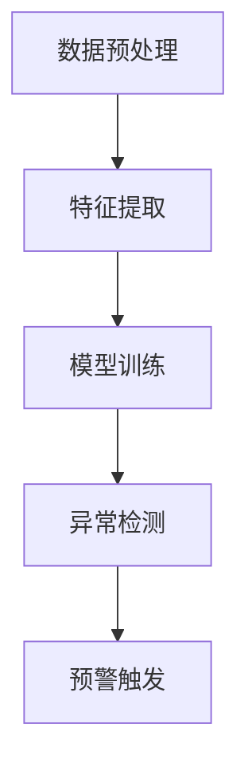
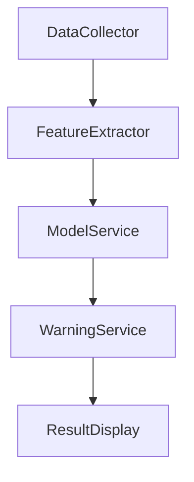
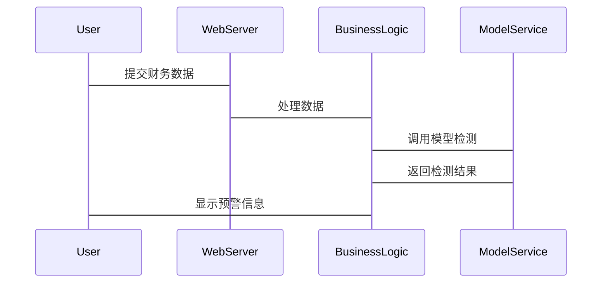

                 


# AI辅助企业财务异常检测：实时监控与智能预警系统

## 关键词：AI, 财务异常检测, 实时监控, 智能预警系统, 机器学习, 数据处理, 系统架构

## 摘要：  
企业财务数据的准确性和及时性对企业运营至关重要。传统的财务异常检测方法依赖人工检查，耗时且容易出错。本文介绍了一种基于AI的财务异常检测系统，利用机器学习算法实时监控财务数据，并通过智能预警机制快速响应潜在问题。文章详细讲解了系统的核心概念、算法原理、系统架构设计以及实际项目实现，为企业提供了一种高效可靠的财务风险管理解决方案。

---

# 第1章: 背景介绍

## 1.1 问题背景  
企业在日常运营中会产生大量财务数据，包括收入、支出、利润等关键指标。传统的财务异常检测方法主要依赖人工检查，这种方式不仅效率低下，而且容易受到主观因素的影响，难以及时发现潜在问题。  

### 1.1.1 传统财务异常检测的局限性  
- **效率低下**：人工检查需要大量时间，难以应对海量数据。  
- **准确性不足**：人为疏忽可能导致漏检或误检。  
- **缺乏实时性**：异常问题可能在发现之前已经对企业造成重大损失。  

### 1.1.2 企业财务异常检测的重要性  
财务异常检测是企业风险管理的核心环节，能够帮助企业在早期发现潜在的财务问题，如欺诈、舞弊、资金链断裂等，从而避免更大的损失。  

### 1.1.3 AI技术在财务异常检测中的优势  
- **高效性**：AI算法能够快速处理大量数据，实时发现异常。  
- **准确性**：通过机器学习模型，可以提高异常检测的准确率。  
- **智能化**：AI能够自动学习和优化，适应不同企业的财务数据特征。  

## 1.2 问题描述  
### 1.2.1 财务异常的定义与分类  
- **定义**：财务异常指财务数据偏离正常范围的情况，可能由操作错误、欺诈行为或系统故障引起。  
- **分类**：常见的财务异常包括收入异常、支出异常、利润异常等。  

### 1.2.2 财务异常检测的关键指标  
- 收入与支出的比率  
- 利润率变化  
- 资金流动异常  
- 账户余额突变  

### 1.2.3 企业财务数据的特点与挑战  
- 数据量大、类型多样（结构化与非结构化数据）  
- 数据更新频繁，需要实时处理  
- 异常数据可能具有隐蔽性，难以直接识别  

## 1.3 问题解决  
### 1.3.1 AI技术如何辅助财务异常检测  
- **数据预处理**：清洗和标准化财务数据。  
- **特征提取**：从财务数据中提取关键特征用于模型训练。  
- **异常检测**：利用机器学习算法识别异常数据点。  
- **智能预警**：基于检测结果，触发预警机制并提供解决方案。  

### 1.3.2 实时监控与智能预警的核心价值  
- 提高异常检测的及时性，减少潜在损失。  
- 降低人工检查的错误率，提高检测准确性。  
- 为企业提供实时的财务健康状况分析，辅助决策。  

### 1.3.3 系统设计的目标与实现路径  
- **目标**：构建一个高效、智能的财务异常检测系统，实现实时监控和智能预警。  
- **实现路径**：  
  1. 数据采集与预处理  
  2. 特征提取与模型训练  
  3. 异常检测与预警生成  
  4. 系统部署与优化  

## 1.4 系统的边界与外延  
### 1.4.1 系统的功能边界  
- 数据采集与存储：从企业财务系统中获取数据。  
- 异常检测：基于机器学习模型识别异常数据。  
- 预警与报告：生成预警信息并通知相关人员。  

### 1.4.2 系统的适用范围与限制  
- **适用范围**：适用于企业日常财务数据的实时监控。  
- **限制**：无法检测系统性异常（如人为操作错误导致的异常）。  

### 1.4.3 系统与其他模块的交互关系  
- 与企业财务系统对接，获取实时数据。  
- 与企业预警系统集成，触发相应的应对措施。  

## 1.5 核心概念与联系  
### 1.5.1 核心概念的定义与属性  
| 核心概念 | 定义 | 属性 |  
|----------|------|------|  
| 财务数据 | 企业的收入、支出等财务信息 | 结构化、实时性 |  
| 异常检测 | 发现数据中的异常点 | 准确性、实时性 |  
| 预警机制 | 基于异常检测结果触发预警 | 及时性、可配置性 |  

### 1.5.2 核心概念的对比分析  
- **数据预处理与特征提取**：数据预处理是特征提取的前提，特征提取是异常检测的关键。  
- **异常检测算法**：不同的算法适用于不同的数据类型和场景，需要根据具体需求选择合适的算法。  
- **预警机制**：预警机制的设计需要考虑企业的具体业务流程和风险承受能力。  

### 1.5.3 ER实体关系图  
```mermaid
er
  actor: 用户
  entity: 财务数据
  entity: 异常记录
  entity: 预警规则
  entity: 系统日志
  actor --> entity: 提交数据
  entity --> entity: 关联关系
  entity --> entity: 关联关系
  entity --> entity: 关联关系
```

## 1.6 本章小结  
本章详细介绍了企业财务异常检测的背景、问题以及AI技术在其中的应用。通过分析传统方法的局限性，提出了基于AI的实时监控与智能预警系统的解决方案，并明确了系统的核心概念和实现路径。

---

# 第2章: AI辅助财务异常检测的核心概念

## 2.1 核心概念原理  
### 2.1.1 数据预处理与特征提取  
- **数据预处理**：清洗、标准化和格式化数据。  
- **特征提取**：从财务数据中提取关键特征，如收入增长率、支出变化率等。  

### 2.1.2 异常检测算法的选择与优化  
- **算法选择**：基于数据特征选择合适的算法，如Isolation Forest适用于无监督学习，K-Means适用于聚类分析。  
- **算法优化**：通过调整参数和优化模型结构提高检测准确率。  

### 2.1.3 预警机制的设计与实现  
- **预警规则**：根据企业需求设置预警阈值。  
- **预警触发**：当检测到异常时，触发预警并通知相关人员。  

## 2.2 核心概念的对比分析  
### 2.2.1 不同异常检测算法的优缺点对比  
| 算法 | 优点 | 缺点 |  
|------|------|------|  
| Isolation Forest | 训练速度快，适合大数据集 | 对异常样本敏感，正常样本可能被误判 |  
| K-Means | 简单易懂，适合小数据集 | 不适合处理高维数据 |  
| One-Class SVM | 适用于低维数据 | 对高维数据表现不佳 |  

### 2.2.2 不同预警机制的适用场景对比  
| 预警机制 | 适用场景 |  
|----------|----------|  
| 基于阈值的预警 | 数据分布较为均匀，异常点明显 |  
| 基于概率的预警 | 数据分布复杂，异常点不明显 |  

### 2.2.3 数据特征与异常检测效果的关系  
- **数据特征**：关键特征的提取直接影响检测效果。  
- **特征选择**：选择与异常检测相关的特征，避免冗余特征的影响。  

## 2.3 核心概念的ER实体关系图  
```mermaid
er
  actor: 用户
  entity: 财务数据
  entity: 异常记录
  entity: 预警规则
  entity: 系统日志
  actor --> entity: 提交数据
  entity --> entity: 关联关系
  entity --> entity: 关联关系
  entity --> entity: 关联关系
```

## 2.4 本章小结  
本章详细讲解了AI辅助财务异常检测的核心概念，包括数据预处理、特征提取、异常检测算法和预警机制的设计。通过对比分析，帮助读者选择合适的算法和预警机制，确保系统能够高效准确地检测异常。

---

# 第3章: 算法原理

## 3.1 算法选择与实现  
### 3.1.1 算法选择  
- 选择基于机器学习的Isolation Forest算法，适用于无监督学习场景。  

### 3.1.2 算法实现步骤  
1. 数据预处理：清洗、标准化。  
2. 特征提取：选择关键特征。  
3. 模型训练：训练Isolation Forest模型。  
4. 异常检测：使用训练好的模型预测异常点。  

### 3.1.3 算法流程图  


### 3.1.4 算法代码实现  
```python
from sklearn.ensemble import IsolationForest
import pandas as pd

# 数据加载与预处理
data = pd.read_csv('financial_data.csv')
data = data.dropna().astype(float)

# 特征提取
features = data[['revenue', 'expenses', 'profit']]

# 模型训练
model = IsolationForest(n_estimators=100, random_state=42)
model.fit(features)

# 异常检测
outliers = model.predict(features)
outliers[outliers == -1] = 1  # 标记异常点
```

## 3.2 算法优化与调优  
### 3.2.1 参数调优  
- 调整Isolation Forest的超参数，如n_estimators和max_samples。  

### 3.2.2 模型优化  
- 使用网格搜索（Grid Search）优化模型参数，提高检测准确率。  

## 3.3 本章小结  
本章详细讲解了Isolation Forest算法在财务异常检测中的应用，包括算法选择、实现步骤、优化策略等内容。通过代码示例，帮助读者理解如何利用机器学习算法实现异常检测。

---

# 第4章: 系统架构设计

## 4.1 系统模块设计  
### 4.1.1 模块划分  
- 数据采集模块：负责获取财务数据。  
- 特征提取模块：对数据进行特征提取。  
- 模型服务模块：负责训练和预测。  
- 预警服务模块：生成预警信息。  
- 结果展示模块：展示检测结果。  

### 4.1.2 模块交互  


## 4.2 系统架构设计  
### 4.2.1 分层架构  
- **数据层**：存储原始财务数据。  
- **业务逻辑层**：处理数据和业务逻辑。  
- **表现层**：展示结果和用户交互。  

### 4.2.2 系统架构图  


## 4.3 接口设计  
### 4.3.1 数据接口  
- 数据采集模块提供API接口，接收财务数据。  

### 4.3.2 结果接口  
- 预警服务模块提供API接口，返回预警信息。  

## 4.4 系统交互设计  
### 4.4.1 用户交互流程  


## 4.5 本章小结  
本章详细讲解了系统的模块划分、架构设计和接口设计，帮助读者理解如何构建一个高效、可靠的财务异常检测系统。

---

# 第5章: 项目实战

## 5.1 环境搭建  
### 5.1.1 工具安装  
- 安装Python、Jupyter Notebook、Pandas、Scikit-learn等工具。  

## 5.2 核心代码实现  
### 5.2.1 数据预处理  
```python
import pandas as pd

# 加载数据
data = pd.read_csv('financial_data.csv')

# 数据清洗
data = data.dropna().astype(float)
```

### 5.2.2 特征提取  
```python
features = data[['revenue', 'expenses', 'profit']]
```

### 5.2.3 模型训练  
```python
from sklearn.ensemble import IsolationForest

model = IsolationForest(n_estimators=100, random_state=42)
model.fit(features)
```

### 5.2.4 异常检测  
```python
outliers = model.predict(features)
outliers[outliers == -1] = 1
```

### 5.2.5 预警生成  
```python
warning_rules = {
    'threshold': 0.95,
    'action': 'email_alert'
}

# 根据异常结果生成预警
for idx, is_outlier in enumerate(outliers):
    if is_outlier == 1:
        print(f"Warning: 数据点 {idx} 异常！")
```

## 5.3 案例分析  
### 5.3.1 数据收集与分析  
- 收集某企业的财务数据，分析收入、支出、利润等指标。  

### 5.3.2 异常检测结果  
- 检测到某个月份收入突降，触发预警。  

### 5.3.3 预警处理  
- 系统自动发送邮件通知财务部门，提醒进行进一步调查。  

## 5.4 项目总结  
### 5.4.1 经验总结  
- 数据预处理是关键，特征提取直接影响检测效果。  
- 算法选择需要根据数据特征和场景进行调整。  

### 5.4.2 注意事项  
- 确保数据安全，防止敏感信息泄露。  
- 定期更新模型，避免过时模型导致误检。  

## 5.5 本章小结  
本章通过一个实际案例，详细讲解了如何搭建和实现一个基于AI的财务异常检测系统，帮助读者掌握从数据处理到模型部署的全过程。

---

# 第6章: 扩展与优化

## 6.1 系统优化  
### 6.1.1 性能优化  
- 优化数据处理流程，减少计算时间。  
- 使用分布式计算框架（如Spark）处理大数据集。  

### 6.1.2 算法优化  
- 引入深度学习模型（如LSTM）处理时间序列数据。  
- 使用集成学习提升检测准确率。  

## 6.2 功能扩展  
### 6.2.1 多维度异常检测  
- 综合分析多个财务指标，提高检测准确性。  

### 6.2.2 实时数据流处理  
- 实现流数据处理，支持实时异常检测。  

## 6.3 本章小结  
本章探讨了如何进一步优化和扩展系统，包括性能优化、算法改进和功能扩展，为读者提供了未来发展的方向。

---

# 第7章: 总结与展望

## 7.1 总结  
本文详细介绍了AI辅助企业财务异常检测的实时监控与智能预警系统，涵盖了系统背景、核心概念、算法原理、系统架构设计以及项目实战等内容。通过AI技术的应用，企业能够更高效、准确地检测财务异常，降低潜在风险。

## 7.2 展望  
随着AI技术的不断发展，未来的财务异常检测系统将更加智能化和自动化。深度学习模型的引入将进一步提升检测准确率，实时数据流处理将实现真正的实时监控。同时，系统的可扩展性和灵活性也将得到加强，以适应不同企业的多样化需求。

---

# 结语  
希望通过本文的讲解，读者能够深入了解AI在财务异常检测中的应用，并能够实际操作搭建一个高效的实时监控与智能预警系统，为企业财务管理提供有力支持。

--- 

感谢您的阅读，如果对本文内容感兴趣，欢迎进一步探讨和交流！

