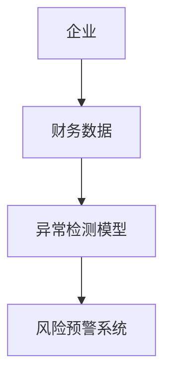
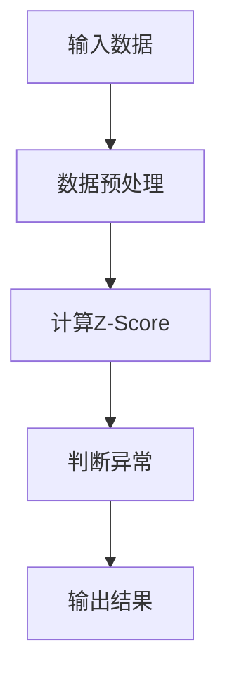
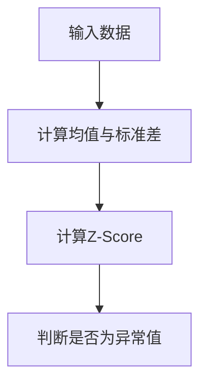
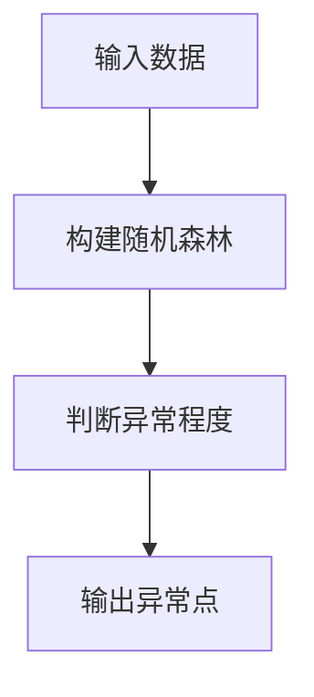
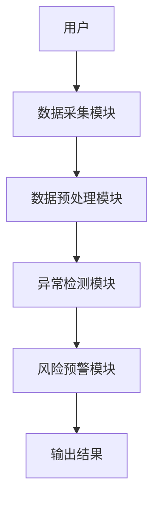
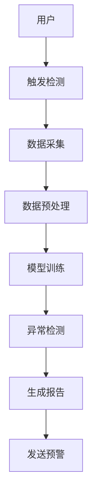

                 


# AI辅助企业财务异常检测：实时监控与风险预警

## 关键词：AI，财务异常检测，实时监控，风险预警，机器学习，深度学习

## 摘要：  
随着企业规模的不断扩大和财务数据的复杂化，传统的财务异常检测方法已难以应对日益复杂的财务风险。本文将探讨如何利用人工智能技术，通过实时监控和风险预警，提升企业财务异常检测的效率和准确性。文章将从核心概念、算法原理、系统架构到项目实战，全面解析AI在财务异常检测中的应用，并结合实际案例，提供可操作的解决方案。

---

# 第一部分: 财务异常检测的背景与意义

## 第1章: 企业财务异常检测的重要性

### 1.1 财务异常检测的核心概念  
企业财务异常检测是指通过对财务数据的分析，识别出可能存在的异常情况，如财务造假、舞弊行为、资金链断裂等。这些异常情况可能对企业的经营和财务健康造成严重威胁，因此及时发现和预警至关重要。  

### 1.2 传统财务异常检测的局限性  
传统的财务异常检测方法主要依赖人工审核和简单的财务指标分析，例如单一指标分析（如流动比率、速动比率等）。然而，这种方法存在以下问题：  
1. **效率低下**：人工审核需要大量时间和资源，难以实现实时监控。  
2. **准确性不足**：传统方法难以捕捉复杂的财务模式和异常行为，容易遗漏潜在风险。  
3. **缺乏实时性**：传统方法通常基于历史数据，无法实时反映企业的财务状况变化。  

### 1.3 AI技术在财务异常检测中的优势  
人工智能技术，尤其是机器学习和深度学习，能够通过以下方式提升财务异常检测的效率和准确性：  
1. **自动化数据处理**：AI能够自动从大量财务数据中提取特征，并进行复杂的模式识别。  
2. **实时监控**：基于流数据处理技术，AI可以实时分析财务数据，快速发现异常情况。  
3. **高精度**：通过训练模型，AI能够识别复杂的财务异常模式，显著提高检测的准确性。  

### 1.4 财务异常检测的边界与外延  
财务异常检测不仅包括对企业财务数据的分析，还包括对相关外部数据（如市场趋势、行业动态）的综合考量。此外，异常检测的结果还需要结合企业内部业务逻辑进行验证，以避免误报或漏报。

---

# 第二部分: AI辅助财务异常检测的核心概念与联系

## 第2章: 核心概念与原理

### 2.1 财务数据预处理  
在进行财务异常检测之前，需要对数据进行预处理，以确保数据的完整性和一致性。  

#### 2.1.1 数据清洗与标准化  
数据清洗包括去除重复数据、处理缺失值和异常值。标准化则是将数据转换为统一的格式，以便后续分析。  

#### 2.1.2 数据特征提取  
财务数据通常包括收入、支出、利润等指标。通过特征工程，可以提取出更具代表性的特征，例如：  
- 财务比率（如流动比率、速动比率）  
- 财务趋势（如收入增长趋势、成本变化趋势）  

#### 2.1.3 时间序列数据的处理  
财务数据往往具有时间序列特性，可以通过时间序列分析方法（如ARIMA）提取周期性特征。  

### 2.2 异常检测模型  
异常检测模型是财务异常检测的核心部分，主要分为以下几类：  

#### 2.2.1 基于统计的异常检测方法  
统计方法通过计算数据的分布特征来识别异常值，例如Z-Score方法：  
$$ Z = \frac{X - \mu}{\sigma} $$  
其中，$\mu$是均值，$\sigma$是标准差，$X$是待检测的值。  

#### 2.2.2 基于机器学习的异常检测方法  
机器学习方法通过训练模型来识别正常和异常数据，常用的算法包括：  
- Isolation Forest：通过构建随机森林来隔离异常点。  
- One-Class SVM：用于单类数据的分类，能够有效识别异常点。  

#### 2.2.3 基于深度学习的异常检测方法  
深度学习方法通过神经网络模型（如LSTM、Transformer）捕捉复杂的财务模式，适用于时间序列数据的异常检测。  

### 2.3 实体关系图与流程图  
以下是财务异常检测系统的实体关系图：  


以下是以Z-Score方法为核心的异常检测流程图：  


---

# 第三部分: AI辅助财务异常检测的算法原理

## 第3章: 常见算法原理与实现

### 3.1 基于统计的异常检测  
#### 3.1.1 Z-Score方法  
Z-Score方法通过计算数据点与均值的距离来判断是否为异常值。例如，假设某企业的收入数据如下：  
- 均值：100  
- 标准差：10  
- 某企业的收入为130，则Z-Score为：  
$$ Z = \frac{130 - 100}{10} = 3 $$  
通常，Z-Score大于3或小于-3的数据点被认为是异常值。  

#### 3.1.2 算法流程图  


### 3.2 基于机器学习的异常检测  
#### 3.2.1 Isolation Forest算法  
Isolation Forest是一种无监督学习算法，通过构建随机森林来隔离异常点。以下是其实现流程：  
1. 从数据集中随机选择特征和样本，构建决策树。  
2. 将数据点分配到不同的节点中，直到数据点被隔离。  
3. 异常点更容易被快速隔离，因此可以通过树的高度来判断异常程度。  

#### 3.2.2 算法流程图  


---

# 第四部分: 系统分析与架构设计

## 第4章: 系统架构与实现

### 4.1 系统功能设计  
以下是财务异常检测系统的功能模块：  
- 数据采集模块：负责收集企业的财务数据。  
- 数据预处理模块：对数据进行清洗和标准化处理。  
- 异常检测模块：基于机器学习模型进行异常检测。  
- 风险预警模块：根据检测结果生成预警信息。  

### 4.2 系统架构设计  
以下是系统的总体架构图：  


### 4.3 系统接口设计  
系统主要接口包括：  
- 数据接口：与企业财务系统对接，获取实时数据。  
- 用户接口：供企业财务人员查看异常报告和预警信息。  

### 4.4 系统交互流程  
以下是系统交互流程图：  


---

# 第五部分: 项目实战

## 第5章: 项目实现与案例分析

### 5.1 项目环境安装  
以下是项目所需的环境配置：  
```bash
# 安装Python依赖
pip install numpy pandas scikit-learn
```

### 5.2 核心代码实现  
以下是基于Isolation Forest算法的异常检测代码：  
```python
import numpy as np
from sklearn.ensemble import IsolationForest

# 生成模拟数据
data = np.random.randn(100, 1)
data[50:] = data[50:] * 10  # 添加异常值

# 训练模型
model = IsolationForest(n_estimators=100, random_state=42)
model.fit(data)

# 预测异常值
y_pred = model.predict(data)
print(y_pred)
```

### 5.3 代码解读与分析  
- **数据生成**：使用numpy生成模拟数据，并在后半部分添加异常值。  
- **模型训练**：使用Isolation Forest模型进行训练。  
- **异常检测**：通过模型预测结果判断哪些数据点为异常值。  

### 5.4 实际案例分析  
以某企业的收入数据为例，通过上述代码可以识别出异常的收入数据，从而帮助企业及时发现潜在的财务风险。

---

# 第六部分: 总结与展望

## 第6章: 总结与展望

### 6.1 最佳实践  
- 定期更新模型，以适应数据分布的变化。  
- 结合业务背景，对异常结果进行人工验证。  

### 6.2 小结  
本文详细介绍了AI在企业财务异常检测中的应用，从核心概念到算法原理，再到系统架构和项目实战，为读者提供了全面的指导。  

### 6.3 注意事项  
- 数据隐私保护是财务异常检测系统设计中的重要考虑因素。  
- 异常检测模型的性能依赖于数据质量和特征选择。  

### 6.4 拓展阅读  
- 《机器学习实战》  
- 《深度学习入门：基于Python的理论与实现》  

---

通过本文的讲解，读者可以深入了解AI在财务异常检测中的应用，并能够基于实际需求，设计和实现一个高效的财务异常检测系统。

