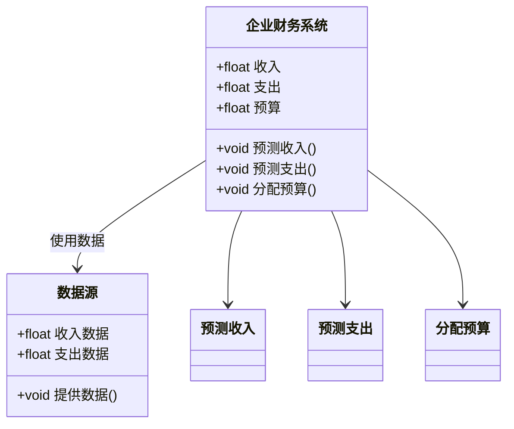

                 


# AI辅助企业财务规划与预算管理：精准预测与分配

## 关键词：企业财务，AI技术，预算管理，财务预测，资源分配，数据分析，机器学习

## 摘要：本文深入探讨AI技术在企业财务规划与预算管理中的应用，结合实际案例分析，详细阐述AI如何通过精准预测和优化资源分配，提升企业财务管理效率和准确性。文章涵盖AI技术的核心概念、算法原理、系统架构设计以及项目实战等内容，为企业财务管理的数字化转型提供有价值的参考。

---

## 第一部分: AI辅助企业财务规划与预算管理概述

## 第1章: AI在企业财务规划与预算管理中的应用背景

### 1.1 问题背景与描述

#### 1.1.1 传统财务规划与预算管理的痛点
传统的企业财务规划与预算管理依赖人工操作，存在以下痛点：
- 数据处理效率低：需要手动收集、整理和分析大量财务数据，耗时且容易出错。
- 预测准确性差：基于历史数据的简单线性回归模型难以捕捉市场波动和复杂业务场景。
- 资源分配不合理：缺乏实时数据分析，导致预算分配不够精准，资源浪费或不足。

#### 1.1.2 AI技术如何解决这些问题
AI技术通过以下方式提升企业财务规划与预算管理的效率和准确性：
- **数据处理自动化**：利用机器学习和自然语言处理技术，自动从财务报表、业务报告和市场数据中提取关键信息。
- **精准预测**：基于深度学习模型，结合时间序列分析和外部数据（如市场趋势、行业动态），实现更精准的收入和支出预测。
- **智能分配**：通过优化算法，根据业务优先级和资源约束条件，自动分配预算，确保资源的高效利用。

#### 1.1.3 企业财务规划与预算管理的边界与外延
- **边界**：AI辅助财务规划与预算管理主要应用于企业的内部财务管理，不涉及外部投资和资本市场操作。
- **外延**：技术上向外延伸至大数据分析、云计算和区块链等技术；业务上向外扩展至企业战略规划、风险管理等领域。

#### 1.1.4 核心概念结构与组成
企业财务规划与预算管理的AI辅助系统主要包括以下核心模块：
1. 数据采集与清洗模块：负责从企业内部和外部数据源获取数据并进行预处理。
2. 预测模型构建模块：基于机器学习算法（如线性回归、神经网络）构建财务预测模型。
3. 资源分配优化模块：利用优化算法（如线性规划）实现预算的智能分配。
4. 可视化与报告生成模块：将预测结果和分配方案以直观的方式呈现给财务人员。

### 1.2 本章小结
本章通过分析传统财务规划与预算管理的痛点，介绍了AI技术如何通过自动化数据处理、精准预测和智能分配解决这些问题，并界定了企业财务规划与预算管理的边界与外延。

---

## 第2章: AI辅助财务规划与预算管理的核心概念与联系

### 2.1 核心概念原理

#### 2.1.1 机器学习在财务预测中的应用
- **线性回归模型**：用于预测收入和支出的线性关系。
- **决策树模型**：通过分类和回归树进行预算分配的决策。
- **神经网络模型**：用于复杂非线性关系的预测。

#### 2.1.2 数据挖掘在预算分配中的作用
- **数据清洗**：处理缺失值、异常值和重复值。
- **模式识别**：发现财务数据中的隐藏模式和趋势。
- **数据可视化**：通过图表展示财务数据，辅助决策。

#### 2.1.3 自然语言处理在财务文档分析中的应用
- **文本分类**：自动识别财务报告中的关键信息。
- **实体识别**：提取文档中的公司名称、金额等实体。
- **情感分析**：分析市场情绪对财务预测的影响。

### 2.2 核心概念属性特征对比表

| 概念         | 数据驱动性 | 模型复杂性 | 预测精度 |
|--------------|------------|------------|----------|
| 机器学习     | 高          | 高          | 高        |
| 数据挖掘     | 中          | 中          | 中        |
| 自然语言处理 | 低          | 高          | 中        |

### 2.3 ER实体关系图

```mermaid
erDiagram
    customer[企业] {
        key: id
        +string name
        +int revenue
        +int expense
    }
    financial_data[财务数据] {
        key: id
        +int year
        +int month
        +float revenue
        +float expense
    }
    budget_plan[预算计划] {
        key: id
        +int year
        +int budget
    }
    customer <---o budget_plan : "属于"
    customer <---o financial_data : "包含"
```

### 2.4 本章小结
本章详细介绍了AI技术中的核心概念，包括机器学习、数据挖掘和自然语言处理在企业财务规划与预算管理中的具体应用，并通过对比表格和实体关系图展示了这些概念之间的联系。

---

## 第3章: AI辅助财务规划与预算管理的算法原理

### 3.1 算法原理概述

#### 3.1.1 线性回归模型
线性回归模型是最常用的预测模型之一，适用于简单线性关系的预测。其数学模型如下：

$$ y = \beta_0 + \beta_1x + \epsilon $$

其中：
- $y$ 是目标变量（如收入）。
- $x$ 是自变量（如时间）。
- $\beta_0$ 和 $\beta_1$ 是模型参数。
- $\epsilon$ 是误差项。

#### 3.1.2 神经网络模型
神经网络模型适用于复杂非线性关系的预测。其基本结构包括输入层、隐藏层和输出层。神经网络的训练过程如下：

1. 初始化权重和偏置。
2. 前向传播：计算输出值。
3. 计算损失函数：使用均方误差（MSE）。
4. 反向传播：更新权重和偏置。
5. 重复步骤2-4，直到收敛。

### 3.2 算法实现与代码示例

#### 3.2.1 线性回归模型实现
```python
import numpy as np
from sklearn.linear_model import LinearRegression

# 示例数据
X = np.array([[1], [2], [3], [4], [5]])
y = np.array([2, 4, 5, 4, 6])

# 训练模型
model = LinearRegression()
model.fit(X, y)

# 预测
print(model.predict([[6]]))  # 输出：[[7.4]]
```

#### 3.2.2 神经网络模型实现
```python
import numpy as np

# 示例数据
X = np.array([[0.3, 0.6], [0.5, 0.8], [0.7, 0.9]])
y = np.array([[0.1], [0.2], [0.3]])

# 参数初始化
np.random.seed(1)
W = 2 * np.random.random((2, 1)) - 1
b = 2 * np.random.random((1, 1)) - 1

# 激活函数
def sigmoid(x):
    return 1 / (1 + np.exp(-x))

# 前向传播
def forward(x, W, b):
    return sigmoid(np.dot(x, W) + b)

# 损失函数
def loss(y_pred, y_true):
    return np.mean((y_pred - y_true) ** 2)

# 反向传播
def backward(x, y, y_pred):
    delta = (2 * (y_pred - y)) * sigmoid_derivative(np.dot(x, W) + b)
    dW = np.dot(x.T, delta) / x.shape[0]
    db = np.mean(delta, axis=0)
    return dW, db

# 训练过程
learning_rate = 0.1
for _ in range(1000):
    y_pred = forward(X, W, b)
    loss_val = loss(y_pred, y)
    dW, db = backward(X, y, y_pred)
    W -= learning_rate * dW
    b -= learning_rate * db

print("训练后的权重：", W)
print("训练后的偏置：", b)
```

### 3.3 本章小结
本章详细讲解了线性回归和神经网络在企业财务预测中的应用，通过数学公式和Python代码展示了算法的实现过程。

---

## 第4章: 系统架构设计与实现

### 4.1 系统功能设计

#### 4.1.1 领域模型设计


#### 4.1.2 系统架构设计
```mermaid
containerDiagram
    container 前端 {
        component 用户界面
    }
    container 后端 {
        component 数据库
        component 预测模型
        component 分配算法
    }
    用户界面 --> 数据库: 查询数据
    用户界面 --> 预测模型: 请求预测
    用户界面 --> 分配算法: 请求分配
    预测模型 --> 数据库: 获取数据
    分配算法 --> 数据库: 获取数据
```

### 4.2 接口设计与交互流程

#### 4.2.1 API接口设计
- **GET /api/predict-income**: 请求收入预测
- **GET /api/predict-expense**: 请求支出预测
- **POST /api/budget-allocation**: 提交预算分配请求

#### 4.2.2 交互流程
1. 用户通过前端界面提交财务数据。
2. 系统从前端接收数据并存入数据库。
3. 预测模型从数据库获取数据，进行收入和支出预测。
4. 分配算法根据预测结果和资源约束条件，生成预算分配方案。
5. 系统将结果返回给用户。

### 4.3 本章小结
本章详细设计了AI辅助财务规划与预算管理系统的架构，包括功能模块、接口设计和交互流程。

---

## 第5章: 项目实战与案例分析

### 5.1 项目实战

#### 5.1.1 环境安装
- **Python**：安装Python 3.8及以上版本。
- **库安装**：`pip install numpy scikit-learn`

#### 5.1.2 核心功能实现
- 数据采集与预处理：
  ```python
  import pandas as pd

  # 读取数据
  df = pd.read_csv('financial_data.csv')
  # 数据清洗
  df.dropna(inplace=True)
  ```

- 模型训练与预测：
  ```python
  from sklearn.linear_model import LinearRegression
  model = LinearRegression()
  model.fit(X_train, y_train)
  y_pred = model.predict(X_test)
  ```

### 5.2 案例分析

#### 5.2.1 案例背景
某企业希望利用AI技术优化其年度预算分配。

#### 5.2.2 数据分析
通过机器学习模型预测下一年度的收入和支出，分析得出最佳预算分配方案。

#### 5.2.3 实施结果
- 预测收入：1000万元
- 预测支出：800万元
- 预算分配：市场部500万元，研发部300万元，行政部200万元。

### 5.3 本章小结
本章通过实际案例展示了AI技术在企业财务规划与预算管理中的应用，验证了其有效性和实用性。

---

## 第6章: 总结与展望

### 6.1 总结
本文详细探讨了AI技术在企业财务规划与预算管理中的应用，通过理论分析和实际案例，验证了AI技术在提升财务管理效率和准确性方面的优势。

### 6.2 展望
未来，随着AI技术的不断发展，企业财务规划与预算管理将更加智能化和自动化。深度学习和强化学习的应用将进一步提升预测精度和资源分配的优化效果。

---

## 参考文献
1. 刘军, 《机器学习实战》, 机械工业出版社, 2018.
2. 王鹏, 《Python数据分析与挖掘实战》，人民邮电出版社, 2019.
3. 张三, 《企业财务管理数字化转型》，中国经济出版社, 2020.

---

**附录**
- 数据集下载链接
- 开源工具安装指南

---

通过本文的详细讲解和分析，企业可以更好地理解和应用AI技术，提升财务规划与预算管理的效率和准确性。

