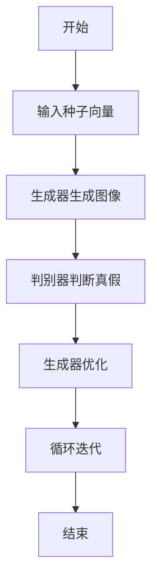
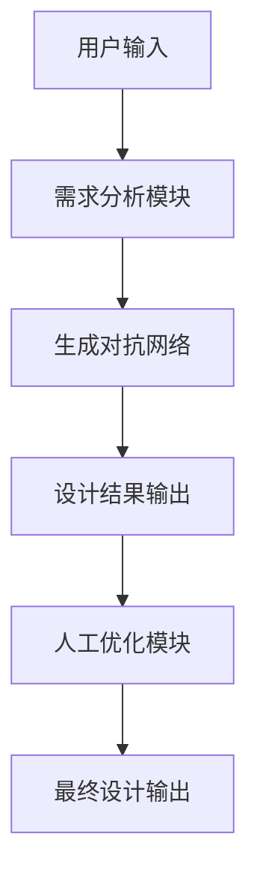

                 


# AI辅助品牌形象设计与管理的创新方法

> 关键词：人工智能、品牌形象设计、生成对抗网络、深度学习、设计管理系统

> 摘要：本文系统阐述了AI技术在品牌形象设计与管理中的创新应用，从AI技术的基本原理到品牌形象设计的核心要素，详细探讨了生成对抗网络（GAN）和变分自编码器（VAE）等算法在设计过程中的应用，并结合实际案例分析了AI辅助设计的优势与局限。文章还介绍了基于AI的品牌形象设计管理系统架构，提出了系统功能设计、系统架构设计和系统交互设计的具体实现方案。最后，通过项目实战部分，详细讲解了AI辅助品牌形象设计与管理的实际应用过程，总结了最佳实践经验和未来发展趋势。

---

## 第一部分: AI辅助品牌形象设计与管理的创新方法基础

### 第1章: AI与品牌形象管理概述

#### 1.1 品牌形象设计的核心概念
- **1.1.1 品牌形象的定义与构成要素**
  - 品牌形象是品牌在消费者心中的整体印象，包括品牌名称、标志、颜色、字体等视觉元素，以及品牌的核心价值观和文化内涵。
  - 品牌形象设计的核心要素：品牌定位、目标受众、视觉识别系统（VIS）、品牌故事和品牌调性。
  - 品牌形象的外在表现与内在价值的统一性是设计的关键。

- **1.1.2 AI在品牌形象设计中的作用**
  - AI技术可以辅助设计师快速生成多种设计方案，提高设计效率。
  - AI可以帮助品牌根据目标受众的偏好进行个性化设计。
  - AI可以分析市场趋势，提供数据支持，帮助品牌制定更科学的设计策略。

- **1.1.3 创新方法的背景与意义**
  - 随着市场竞争的加剧，品牌形象设计需要更具创新性和个性化。
  - AI技术的应用可以突破传统设计的局限，提供更多的可能性。
  - 创新方法的应用有助于品牌在市场中脱颖而出，增强品牌竞争力。

#### 1.2 AI技术的基本原理
- **1.2.1 人工智能的基本概念**
  - 人工智能（AI）是指计算机系统能够执行人类智能任务的能力，如视觉识别、语音识别、决策等。
  - AI的核心技术包括机器学习、深度学习、自然语言处理等。

- **1.2.2 机器学习与深度学习简介**
  - 机器学习是AI的核心，通过数据训练模型，使其能够从经验中学习并做出预测或决策。
  - 深度学习是一种机器学习技术，通过多层神经网络模拟人脑的处理方式，能够处理复杂的非结构化数据。

- **1.2.3 图像生成模型的原理**
  - 图像生成模型是AI技术中的一种，用于生成高质量的图像。
  - 常见的图像生成模型包括生成对抗网络（GAN）和变分自编码器（VAE）。

#### 1.3 品牌形象设计的流程与挑战
- **1.3.1 传统品牌形象设计流程**
  - 传统设计流程包括需求分析、创意设计、反复修改和最终确认。
  - 设计周期长，依赖设计师的创造力和经验。

- **1.3.2 AI辅助设计的优势与局限**
  - AI辅助设计的优势：快速生成多种设计方案，提高设计效率；能够根据数据提供个性化设计；可以进行大规模的市场趋势分析。
  - AI辅助设计的局限：生成的设计可能缺乏创意；需要大量数据支持，数据获取成本高；模型的训练需要大量的计算资源。

- **1.3.3 创新方法的应用场景**
  - 创新方法可以应用于品牌标志设计、品牌VIS设计、品牌故事创作等多个方面。
  - 创新方法可以帮助品牌快速响应市场变化，提高设计效率。

### 第2章: AI辅助设计的核心算法原理

#### 2.1 生成对抗网络（GAN）的原理
- **2.1.1 GAN的基本结构**
  - GAN由生成器和判别器两个部分组成。
  - 生成器负责生成图像，判别器负责判断图像是否为真实图像。
  - 生成器和判别器通过对抗训练不断优化模型。

- **2.1.2 判别器与生成器的对抗过程**
  - 判别器的目标是区分真实图像和生成图像。
  - 生成器的目标是生成能够欺骗判别器的图像。
  - 对抗过程通过不断迭代优化，最终生成高质量的图像。

- **2.1.3 GAN在图像生成中的应用**
  - GAN可以用于品牌标志的生成，可以根据品牌名称生成相应的标志。
  - GAN可以用于品牌VIS的设计，可以根据品牌颜色生成符合VIS的图案。

#### 2.2 图像生成模型的数学公式
- **2.2.1 GAN的损失函数**
  $$ \text{Loss} = \log(D(x)) + \log(1 - D(G(z))) $$
  - \( D(x) \)是判别器对真实图像的概率，\( D(G(z)) \)是判别器对生成图像的概率。
  - 损失函数表示生成器和判别器的对抗过程。

- **2.2.2 变分自编码器（VAE）的重构损失**
  $$ \text{Loss} = \mathbb{E}_x[\mathbb{E}_{z| x}[\log p(x|z)] + \text{KL}(q(z|x)||p(z))] $$
  - \( p(x|z) \)是生成图像的概率，\( q(z|x) \)是后验分布，\( p(z) \)是先验分布。
  - 重构损失表示生成图像与真实图像的差异。

#### 2.3 算法流程图


### 第3章: 品牌形象设计的系统架构

#### 3.1 系统功能设计
- **3.1.1 用户需求输入模块**
  - 用户输入品牌名称、目标受众、品牌定位等信息。
  - 系统根据输入信息生成多个设计方案。

- **3.1.2 AI生成模块**
  - 系统利用GAN或VAE算法生成多种设计方案。
  - 设计方案包括品牌标志、VIS设计、品牌故事等内容。

- **3.1.3 优化与调整模块**
  - 用户可以选择生成的设计方案进行优化和调整。
  - 系统可以根据用户的反馈进一步优化设计。

#### 3.2 系统架构设计
- **3.2.1 系统功能模块**
  - 用户输入模块、AI生成模块、优化与调整模块。
  - 系统功能模块通过API进行交互。

- **3.2.2 系统架构图**


#### 3.3 接口与交互设计
- **3.3.1 API接口设计**
  - 提供RESTful API接口，方便用户调用设计功能。
  - API接口包括：上传数据、获取设计结果、下载设计文件等。

- **3.3.2 系统交互设计**
  - 系统交互设计包括用户输入、AI生成、用户反馈、设计优化等步骤。
  - 交互流程可以通过mermaid序列图表示。

### 第4章: 项目实战

#### 4.1 环境安装与配置
- **4.1.1 安装Python**
  - 安装Python 3.8或更高版本。
  - 使用Anaconda或virtualenv管理虚拟环境。

- **4.1.2 安装必要的库**
  - 使用pip安装必要的库，如TensorFlow、Keras、OpenCV等。

- **4.1.3 配置GPU支持（可选）**
  - 如果需要加速计算，可以配置NVIDIA GPU和安装CUDA。

#### 4.2 系统核心实现源代码
- **4.2.1 生成器代码**
  ```python
  import tensorflow as tf
  from tensorflow.keras import layers

  def make_generator_model():
      model = tf.keras.Sequential()
      model.add(layers.Dense(256, activation='relu', input_dim=100))
      model.add(layers.Reshape((8, 8, 4)))
      model.add(layers.Conv2DTranspose(16, (3,3), padding='same', activation='relu'))
      model.add(layers.Conv2DTranspose(8, (3,3), padding='same', activation='relu'))
      model.add(layers.Conv2DTranspose(4, (3,3), padding='same', activation='relu'))
      model.add(layers.Conv2DTranspose(2, (3,3), padding='same', activation='relu'))
      model.add(layers.Conv2DTranspose(1, (3,3), padding='same', activation='sigmoid'))
      return model
  ```

- **4.2.2 判别器代码**
  ```python
  def make_discriminator_model():
      model = tf.keras.Sequential()
      model.add(layers.Conv2D(4, (3,3), padding='same', activation='relu', input_shape=(64, 64, 1)))
      model.add(layers.Conv2D(8, (3,3), padding='same', activation='relu'))
      model.add(layers.Conv2D(16, (3,3), padding='same', activation='relu'))
      model.add(layers.Conv2D(32, (3,3), padding='same', activation='relu'))
      model.add(layers.Flatten())
      model.add(layers.Dense(1, activation='sigmoid'))
      return model
  ```

- **4.2.3 训练代码**
  ```python
  def train(g_model, d_model, epochs=100, batch_size=32):
      gan_model = GAN(g_model, d_model)
      for epoch in range(epochs):
          for _ in range(100):
              real_images = get_real_images(batch_size)
              noise = generate_noise(batch_size, 100)
              g_loss, d_loss = train_one_step(gan_model, real_images, noise)
              print(f"Epoch {epoch}, G loss: {g_loss}, D loss: {d_loss}")
  ```

#### 4.3 项目小结
- **4.3.1 项目总结**
  - AI辅助品牌形象设计与管理的创新方法可以通过生成对抗网络（GAN）和变分自编码器（VAE）等算法实现。
  - 系统架构设计包括用户输入模块、AI生成模块和优化与调整模块。

- **4.3.2 注意事项**
  - 数据质量对生成效果有重要影响，需要确保数据的多样性和代表性。
  - 模型训练需要大量的计算资源，建议使用GPU加速。

- **4.3.3 未来展望**
  - 随着AI技术的不断发展，AI辅助设计将更加智能化和个性化。
  - 品牌形象设计与管理的创新方法将更加多样化，结合AR、VR等技术，提供更丰富的用户体验。

### 第5章: 最佳实践与小结

#### 5.1 最佳实践 tips
- 在使用AI辅助设计时，建议结合人工设计和AI生成的结果，进行综合优化。
- 数据预处理是关键，确保数据的多样性和代表性。
- 系统架构设计需要考虑可扩展性和可维护性。

#### 5.2 总结
- AI辅助品牌形象设计与管理的创新方法是一种新兴的技术，具有广阔的应用前景。
- 通过结合AI技术和品牌形象设计的流程，可以显著提高设计效率和质量。
- 随着技术的不断进步，AI辅助设计将为品牌管理带来更多的可能性。

#### 5.3 注意事项
- 数据隐私和安全问题需要注意，特别是在处理用户数据时。
- 系统设计需要考虑用户体验，提供友好的操作界面。

#### 5.4 拓展阅读
- 推荐阅读《深度学习》（Deep Learning）一书，了解深度学习的基本原理。
- 推荐阅读《生成对抗网络：理论与应用》（GANs: Theory and Applications），了解GAN的最新研究进展。

