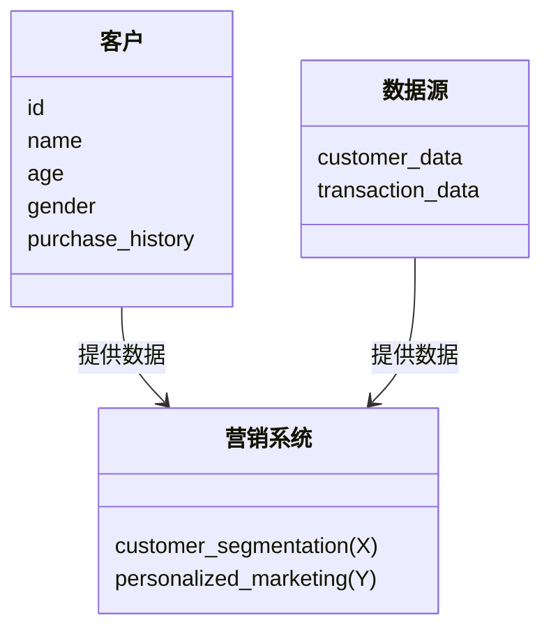
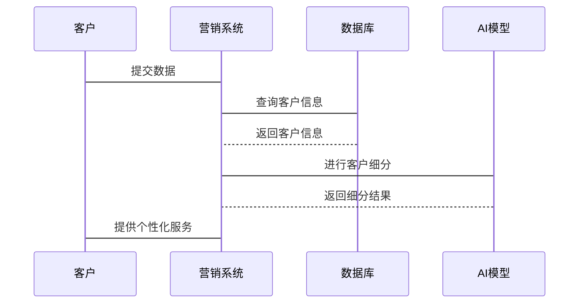

                 


# AI辅助客户细分与精准营销的最佳实践

## 关键词：人工智能、客户细分、精准营销、聚类算法、推荐系统、数据挖掘

## 摘要：本文探讨了人工智能在客户细分与精准营销中的应用，从背景介绍、核心概念、算法原理到系统架构和项目实战，详细讲解了如何利用AI技术提升客户细分的效率和精准营销的效果。通过实际案例分析和代码实现，展示了AI在客户细分中的实际应用，并总结了最佳实践和未来发展趋势。

---

# 第1章: AI辅助客户细分与精准营销的背景与概念

## 1.1 客户细分的定义与重要性

### 1.1.1 客户细分的定义
客户细分是指根据客户的特征、行为和需求，将客户群体划分为若干个子群体的过程。通过客户细分，企业可以更好地理解客户的需求，制定个性化的营销策略。

### 1.1.2 客户细分的重要性
客户细分帮助企业实现精准营销，提高客户满意度和忠诚度，从而提升企业的竞争力和市场份额。通过客户细分，企业可以将资源集中在高价值客户上，降低成本，提高效率。

### 1.1.3 客户细分的常见方法
传统的客户细分方法包括基于人口统计学的细分（如年龄、性别、收入等）和基于行为分析的细分（如购买频率、购买金额等）。然而，这些方法往往不够精准，难以应对复杂的市场环境。

---

## 1.2 精准营销的定义与特点

### 1.2.1 精准营销的定义
精准营销是指通过分析客户的特征和行为，制定个性化的营销策略，以提高营销活动的效果和客户满意度。

### 1.2.2 精准营销的核心特点
精准营销的核心特点包括个性化、实时性、数据驱动和客户互动。通过精准营销，企业可以向客户推送符合其需求的产品和服务，提高客户的购买意愿和忠诚度。

### 1.2.3 精准营销与传统营销的区别
传统营销通常是基于大规模的广告投放，而精准营销则是基于客户数据分析，实现个性化的营销策略。传统营销往往忽视客户个体差异，而精准营销则注重客户的个性化需求。

---

## 1.3 AI在客户细分与精准营销中的作用

### 1.3.1 AI技术如何提升客户细分的效率
人工智能技术可以通过机器学习算法自动分析客户的特征和行为，快速将客户划分为不同的群体，从而提高客户细分的效率。

### 1.3.2 AI在精准营销中的应用场景
AI技术可以应用于客户画像构建、目标客户筛选、个性化推荐和实时营销等领域。通过AI技术，企业可以实现精准的客户定位和个性化的营销策略。

### 1.3.3 AI辅助客户细分与精准营销的优势
AI技术的优势在于其高效性、准确性和可扩展性。通过AI技术，企业可以快速处理海量数据，发现潜在的客户群体，并制定个性化的营销策略。

---

## 1.4 本章小结
本章介绍了客户细分和精准营销的定义、重要性以及AI技术在其中的作用。通过AI技术，企业可以实现客户细分的高效性和精准营销的个性化，从而提升企业的竞争力和客户满意度。

---

# 第2章: AI辅助客户细分的核心概念与联系

## 2.1 数据采集与特征提取

### 2.1.1 数据采集的定义与方法
数据采集是指从各种渠道获取客户数据的过程，包括线上数据（如网站访问数据）和线下数据（如销售数据）。数据采集的方法包括数据库查询、API接口调用和日志文件解析等。

### 2.1.2 客户特征提取的关键步骤
客户特征提取的关键步骤包括数据清洗、特征选择和特征工程。通过特征工程，可以将原始数据转化为更有意义的特征，为后续的客户细分提供支持。

### 2.1.3 数据清洗与预处理的重要性
数据清洗和预处理是确保数据质量的重要步骤，包括去除重复数据、处理缺失值和异常值等。干净的数据是客户细分的基础，能够提高模型的准确性和稳定性。

---

## 2.2 AI算法在客户细分中的应用

### 2.2.1 聚类算法在客户细分中的应用
聚类算法是一种无监督学习算法，常用于客户细分。通过聚类算法，可以将客户自动划分为不同的群体，每个群体具有相似的特征和行为。

### 2.2.2 分类算法在客户细分中的应用
分类算法是一种监督学习算法，常用于根据客户的特征和行为，预测客户属于哪个群体。通过分类算法，可以实现客户群体的精准划分。

### 2.2.3 特征工程在客户细分中的作用
特征工程是指通过选择和构建特征，提高模型的准确性和可解释性。特征工程在客户细分中起着至关重要的作用，能够帮助模型更好地捕捉客户的特征和行为。

---

## 2.3 客户细分与精准营销的实体关系图

```mermaid
er
actor: 客户
actor: 营销系统
actor: 数据源
```

---

## 2.4 本章小结
本章详细介绍了AI辅助客户细分的核心概念和联系，包括数据采集与特征提取、AI算法的应用以及客户细分与精准营销的实体关系图。通过这些内容，读者可以更好地理解AI技术在客户细分中的应用和价值。

---

# 第3章: AI辅助客户细分的算法原理与实现

## 3.1 聚类算法原理与实现

### 3.1.1 聚类算法的定义与分类
聚类算法是一种无监督学习算法，用于将数据划分为不同的簇。常见的聚类算法包括K-means、DBSCAN和层次聚类等。

### 3.1.2 K-means聚类算法的原理
K-means聚类算法是一种基于距离的聚类算法，通过最小化簇内平方误差之和，将数据划分为K个簇。K-means算法的步骤包括初始化质心、计算每个数据点的簇归属、更新质心，直到质心不再变化。

### 3.1.3 K-means聚类算法的Python实现
以下是K-means聚类算法的Python代码示例：

```python
from sklearn.cluster import KMeans
from sklearn.preprocessing import StandardScaler
import numpy as np

# 假设我们有一个客户数据集X
X = np.array([[2, 3], [5, 8], [1, 2], [6, 7], [3, 5]])

# 标准化数据
scaler = StandardScaler()
X_scaled = scaler.fit_transform(X)

# 使用K-means算法进行聚类，K=2
kmeans = KMeans(n_clusters=2, random_state=0)
kmeans.fit(X_scaled)

# 获取聚类结果
labels = kmeans.labels_
print(labels)
```

### 3.1.4 K-means聚类算法的优缺点
K-means算法的优点包括简单高效、易于实现和可解释性强。缺点包括对初始质心的敏感性、无法处理噪声数据以及对非球形簇的不适应性。

---

## 3.2 分类算法原理与实现

### 3.2.1 分类算法的定义与分类
分类算法是一种监督学习算法，用于根据数据的特征，预测数据属于哪个类别。常见的分类算法包括决策树、随机森林和朴素贝叶斯等。

### 3.2.2 决策树分类算法的原理
决策树是一种基于树状结构的分类算法，通过特征选择和分割，将数据划分为不同的子集，最终形成决策树。决策树的构建过程包括特征选择、数据分割和树的剪枝。

### 3.2.3 决策树分类算法的Python实现
以下是决策树分类算法的Python代码示例：

```python
from sklearn.tree import DecisionTreeClassifier
from sklearn.model_selection import train_test_split
import numpy as np

# 假设我们有一个客户数据集X和对应的标签y
X = np.array([[2, 3], [5, 8], [1, 2], [6, 7], [3, 5]])
y = np.array([0, 1, 0, 1, 1])

# 划分训练集和测试集
X_train, X_test, y_train, y_test = train_test_split(X, y, test_size=0.3, random_state=0)

# 使用决策树算法进行分类
dt = DecisionTreeClassifier(random_state=0)
dt.fit(X_train, y_train)

# 预测测试集的标签
y_pred = dt.predict(X_test)
print(y_pred)
```

### 3.2.4 决策树分类算法的优缺点
决策树算法的优点包括易于理解和可视化、能够处理非线性关系以及对缺失数据的鲁棒性。缺点包括对噪声数据的敏感性和过拟合的风险。

---

## 3.3 推荐系统算法原理与实现

### 3.3.1 推荐系统算法的定义与分类
推荐系统是一种基于用户的行为和偏好，向用户推荐相关产品或服务的技术。常见的推荐系统算法包括协同过滤和基于内容的推荐。

### 3.3.2 协同过滤算法的原理
协同过滤是一种基于用户行为的推荐算法，通过分析用户的相似性，推荐相似用户的商品。协同过滤分为基于用户的协同过滤和基于物品的协同过滤。

### 3.3.3 协同过滤算法的Python实现
以下是协同过滤算法的Python代码示例：

```python
from sklearn.metrics.pairwise import cosine_similarity
import numpy as np

# 假设我们有一个用户-商品评分矩阵X
X = np.array([[1, 2, 3], [4, 5, 6], [7, 8, 9]])

# 计算余弦相似度
similarity = cosine_similarity(X)
print(similarity)
```

### 3.3.4 协同过滤算法的优缺点
协同过滤算法的优点包括简单易实现和能够捕捉用户偏好。缺点包括冷启动问题和数据稀疏性问题。

---

## 3.4 本章小结
本章详细讲解了AI辅助客户细分的算法原理与实现，包括聚类算法、分类算法和推荐系统算法。通过Python代码示例和数学公式，读者可以更好地理解这些算法的实现和应用。

---

# 第4章: AI辅助客户细分的系统分析与架构设计

## 4.1 系统功能设计

### 4.1.1 领域模型设计
以下是客户细分与精准营销的领域模型：



### 4.1.2 系统架构设计
以下是客户细分与精准营销的系统架构图：


### 4.1.3 系统接口设计
系统接口设计包括数据接口和API接口。数据接口用于从数据库中获取客户数据，API接口用于与前端系统进行交互。

### 4.1.4 系统交互流程设计
以下是系统交互流程的Mermaid序列图：



---

## 4.2 本章小结
本章详细介绍了AI辅助客户细分的系统分析与架构设计，包括领域模型、系统架构、接口设计和交互流程。通过这些设计，读者可以更好地理解AI技术在客户细分中的实际应用。

---

# 第5章: AI辅助客户细分的项目实战

## 5.1 项目背景与目标

### 5.1.1 项目背景
本项目旨在通过AI技术，帮助一家零售企业实现客户细分和精准营销。通过客户细分，企业可以更好地理解客户的需求，制定个性化的营销策略。

### 5.1.2 项目目标
项目的最终目标是通过AI技术，将客户划分为不同的群体，并为每个群体制定个性化的营销策略，从而提高企业的销售额和客户满意度。

---

## 5.2 项目核心实现

### 5.2.1 数据预处理
数据预处理包括数据清洗、特征选择和数据标准化。通过数据预处理，可以确保数据质量，为后续的客户细分提供支持。

### 5.2.2 模型训练
模型训练包括选择合适的算法（如K-means聚类算法）和参数调优。通过模型训练，可以得到客户细分的结果。

### 5.2.3 结果分析
结果分析包括对客户细分结果的可视化和评估。通过结果分析，可以验证模型的准确性和稳定性。

---

## 5.3 项目案例分析

### 5.3.1 案例背景
假设我们有一个零售企业的客户数据集，包括客户的年龄、性别、收入和购买历史等特征。

### 5.3.2 数据清洗与特征选择
通过数据清洗，我们去除了重复数据和异常值。通过特征选择，我们选择了年龄、性别、收入和购买历史作为客户的特征。

### 5.3.3 客户细分与结果分析
通过K-means聚类算法，我们将客户划分为三个群体：高收入中年男性、低收入年轻女性和中收入老年男性。通过分析每个群体的特征，我们可以制定个性化的营销策略。

---

## 5.4 项目总结与经验分享

### 5.4.1 项目总结
通过本项目，我们成功地将客户划分为不同的群体，并为每个群体制定了个性化的营销策略。通过AI技术，企业可以实现客户细分的高效性和精准性。

### 5.4.2 经验分享
在实际应用中，数据预处理和特征选择是关键步骤，能够显著提高模型的准确性和稳定性。此外，模型的选择和参数调优也是影响模型性能的重要因素。

---

## 5.5 本章小结
本章通过一个具体的项目案例，展示了AI辅助客户细分的实际应用。通过数据预处理、模型训练和结果分析，读者可以更好地理解AI技术在客户细分中的实际应用。

---

# 第6章: AI辅助客户细分的最佳实践与未来展望

## 6.1 最佳实践

### 6.1.1 数据质量管理
数据质量管理是确保数据准确性和完整性的关键。通过数据清洗和预处理，可以提高模型的准确性和稳定性。

### 6.1.2 特征工程设计
特征工程设计是影响模型性能的重要因素。通过选择合适的特征和构建有意义的特征，可以提高模型的准确性和可解释性。

### 6.1.3 模型选择与调优
模型选择与调优是影响模型性能的重要因素。通过选择合适的算法和参数调优，可以提高模型的准确性和稳定性。

---

## 6.2 未来展望

### 6.2.1 AI技术的未来发展
随着AI技术的不断发展，客户细分和精准营销将更加智能化和个性化。未来的AI技术将更加注重数据的实时性和动态性，能够更好地适应市场的变化。

### 6.2.2 客户细分与精准营销的未来趋势
未来的客户细分和精准营销将更加注重客户体验和个性化需求。通过AI技术，企业可以实现客户细分的高效性和精准性，从而提高客户的满意度和忠诚度。

---

## 6.3 本章小结
本章总结了AI辅助客户细分的最佳实践，并展望了未来的趋势。通过最佳实践，读者可以更好地理解和应用AI技术；通过未来展望，读者可以更好地把握AI技术的发展方向。

---

# 结语

通过本文的详细介绍，读者可以全面了解AI辅助客户细分与精准营销的最佳实践。从背景介绍到项目实战，本文详细讲解了AI技术在客户细分中的应用和实现。未来，随着AI技术的不断发展，客户细分和精准营销将更加智能化和个性化，为企业带来更大的竞争优势。

--- 

如果需要进一步的扩展或具体代码实现，请随时告知！

