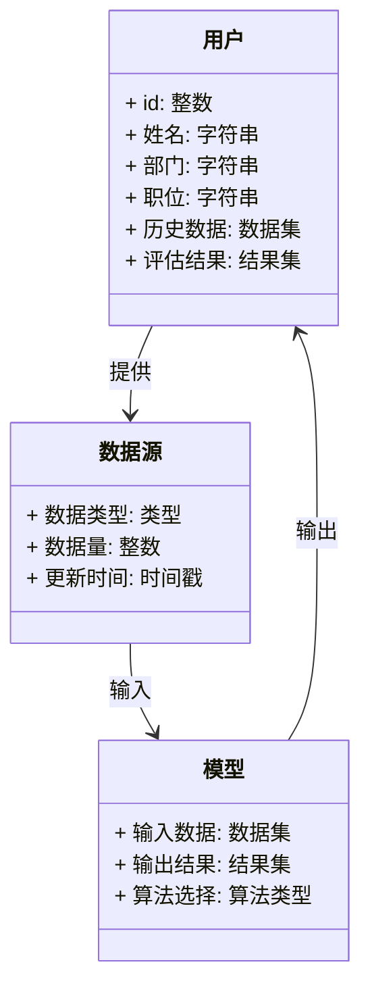
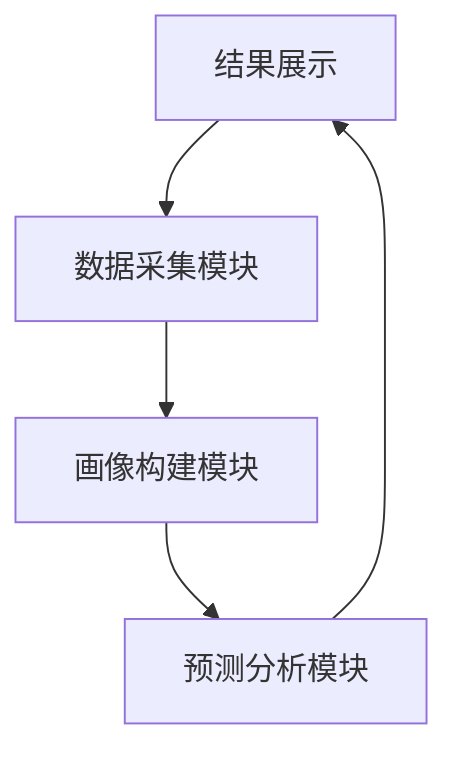

                 


# AI驱动的企业人才画像系统：多维度能力评估与发展预测

**关键词：** AI技术、人才画像、能力评估、发展预测、企业人才管理、多维度分析

**摘要：**  
本文探讨了AI技术在企业人才管理中的应用，重点介绍了AI驱动的人才画像系统如何通过多维度能力评估和预测模型，帮助企业优化人才策略。文章详细分析了系统的背景、核心概念、算法原理、数学模型、系统架构及项目实战，为读者提供全面的技术解读和实践指导。

---

## 第1章: AI驱动的人才画像系统背景

### 1.1 问题背景与问题描述

#### 1.1.1 传统企业人才管理的局限性
传统的企业人才管理主要依赖主观判断和经验评估，存在以下问题：
- **主观性**：评估结果容易受到评估者主观因素的影响。
- **数据不足**：缺乏系统化的数据支持，难以全面评估员工的能力。
- **预测性差**：难以准确预测员工未来的发展潜力。

#### 1.1.2 数据驱动人才管理的必要性
随着企业对高效人才管理的需求增加，数据驱动的方法成为必然选择：
- 数据驱动的人才管理能够提供客观、量化的评估结果。
- 利用大数据技术，可以提取更多的员工信息，帮助发现潜在的能力和发展潜力。

#### 1.1.3 AI技术在人才管理中的应用潜力
AI技术的引入，为人才管理带来了新的可能性：
- **自动化数据处理**：AI能够快速处理大量数据，提取关键信息。
- **精准预测**：通过机器学习算法，AI可以预测员工的发展潜力。
- **个性化评估**：AI可以根据员工的个性化数据，提供定制化的评估和建议。

### 1.2 人才画像系统的核心概念

#### 1.2.1 人才画像的定义与目标
人才画像是一种通过多维度数据构建的员工能力模型，旨在：
- 提供全面的员工能力评估。
- 预测员工未来的发展潜力。
- 支持企业做出更科学的人才决策。

#### 1.2.2 多维度能力评估的必要性
传统的单维度评估无法全面反映员工的能力，而多维度评估则可以：
- 全面了解员工的技能、经验和绩效。
- 帮助企业识别员工的优势和潜力。
- 支持员工的职业发展和培训计划。

#### 1.2.3 发展预测的数学模型与算法
发展预测是人才画像的重要组成部分，其核心是建立一个数学模型，通过员工的历史数据和当前表现，预测其未来的发展潜力。

---

## 第2章: 核心概念与联系

### 2.1 核心概念原理

#### 2.1.1 AI技术在人才画像中的作用
AI技术在人才画像中的作用主要体现在以下几个方面：
- 数据处理：AI能够快速处理大量数据，提取关键信息。
- 模型构建：AI可以帮助构建多维度的评估模型。
- 预测分析：AI可以预测员工的发展潜力。

#### 2.1.2 大数据技术在人才画像中的应用
大数据技术在人才画像中的应用主要体现在：
- 数据采集：通过多种渠道收集员工数据。
- 数据分析：利用大数据技术进行深度分析。
- 数据可视化：将分析结果以直观的方式展示。

#### 2.1.3 多维度评估的数学模型
多维度评估的数学模型通常包括以下几个部分：
- 数据预处理：清洗和标准化数据。
- 模型构建：选择合适的算法构建评估模型。
- 模型验证：通过交叉验证等方式验证模型的准确性。

---

### 2.2 实体关系图与领域模型

#### 2.2.1 ER实体关系图
以下是人才画像系统的ER实体关系图：

```mermaid
er
    actor: 用户
    model: 人才画像模型
    data: 人才数据
    actor --> data: 提供
    data --> model: 输入
    model --> actor: 输出
```

#### 2.2.2 领域模型类图
以下是人才画像系统的领域模型类图：



---

## 第3章: 算法原理

### 3.1 算法原理概述

#### 3.1.1 聚类算法
聚类算法可以将员工分为不同的群体，帮助识别具有相似能力的员工。

##### 3.1.1.1 K-means聚类算法
K-means算法是一种常用的聚类算法，其步骤如下：
1. 随机选择K个初始质心。
2. 将每个数据点分配到最近的质心所在的集群。
3. 重新计算每个集群的质心。
4. 重复步骤2和3，直到质心不再变化。

以下是K-means算法的Python代码示例：

```python
from sklearn.cluster import KMeans
import numpy as np

# 示例数据
X = np.array([[1, 2], [3, 4], [5, 6], [7, 8]])

# 创建KMeans模型
kmeans = KMeans(n_clusters=2, random_state=0)
# 训练模型
kmeans.fit(X)
# 预测结果
labels = kmeans.predict(X)
print(labels)
```

#### 3.1.2 分类算法
分类算法可以将员工分为不同的类别，例如优秀员工和普通员工。

##### 3.1.2.1 logistic回归算法
logistic回归是一种常用的分类算法，其数学模型如下：

$$ P(y=1|x) = \frac{e^{(\beta_0 + \beta_1 x)}}{1 + e^{(\beta_0 + \beta_1 x)}} $$

以下是logistic回归的Python代码示例：

```python
from sklearn.linear_model import LogisticRegression
import numpy as np

# 示例数据
X = np.array([[1, 2], [3, 4], [5, 6], [7, 8]])
y = np.array([0, 0, 1, 1])

# 创建logistic回归模型
logreg = LogisticRegression()
# 训练模型
logreg.fit(X, y)
# 预测结果
y_pred = logreg.predict(X)
print(y_pred)
```

#### 3.1.3 回归算法
回归算法可以预测员工的未来发展潜力。

##### 3.1.3.1 线性回归算法
线性回归是一种常用的回归算法，其数学模型如下：

$$ y = \beta_0 + \beta_1 x + \epsilon $$

以下是线性回归的Python代码示例：

```python
from sklearn.linear_model import LinearRegression
import numpy as np

# 示例数据
X = np.array([[1], [2], [3], [4]])
y = np.array([2, 3, 4, 5])

# 创建线性回归模型
lr = LinearRegression()
# 训练模型
lr.fit(X, y)
# 预测结果
y_pred = lr.predict(X)
print(y_pred)
```

---

## 第4章: 数学模型与公式

### 4.1 多维度能力评估模型

#### 4.1.1 模型构建
多维度能力评估模型通常包括以下几个维度：
- 技能：员工的专业技能。
- 经验：员工的工作经验。
- 绩效：员工的工作表现。

模型的数学表达式如下：

$$ \text{综合能力} = w_1 \cdot \text{技能} + w_2 \cdot \text{经验} + w_3 \cdot \text{绩效} $$

其中，$w_1$、$w_2$、$w_3$是各个维度的权重，通常通过主成分分析（PCA）或因子分析（FA）确定。

#### 4.1.2 模型验证
模型的验证可以通过交叉验证（Cross-Validation）来进行，确保模型的准确性和稳定性。

---

## 第5章: 系统分析与架构设计

### 5.1 系统功能设计

#### 5.1.1 数据采集模块
数据采集模块负责收集员工的相关数据，包括：
- 基本信息：员工的姓名、部门、职位等。
- 历史数据：员工的历史绩效、考勤记录等。
- 在线测试：员工的在线测试结果。

#### 5.1.2 画像构建模块
画像构建模块负责根据收集到的数据，构建员工的能力画像，包括：
- 技能评估：评估员工的专业技能。
- 经验评估：评估员工的工作经验。
- 发展预测：预测员工的未来发展潜力。

#### 5.1.3 预测分析模块
预测分析模块负责根据构建的能力画像，进行未来发展潜力的预测，包括：
- 员工的晋升潜力。
- 员工的岗位匹配度。
- 员工的职业发展方向。

---

### 5.2 系统架构设计

#### 5.2.1 系统架构图
以下是人才画像系统的系统架构图：



#### 5.2.2 系统接口设计
系统接口设计包括以下几个部分：
- 数据接口：负责与企业现有的数据系统对接。
- 用户接口：负责与用户的交互，展示评估结果。
- API接口：负责与其他系统（如HR系统）对接。

---

## 第6章: 项目实战

### 6.1 环境安装

#### 6.1.1 安装Python
安装Python 3.8及以上版本，可以从官方网站下载安装。

#### 6.1.2 安装依赖库
安装以下依赖库：

```bash
pip install numpy scikit-learn matplotlib
```

---

### 6.2 核心代码实现

#### 6.2.1 数据预处理

```python
import pandas as pd
import numpy as np

# 示例数据
data = {
    '姓名': ['张三', '李四', '王五', '赵六'],
    '部门': ['技术部', '市场部', '技术部', '市场部'],
    '职位': ['开发工程师', '市场经理', '开发工程师', '市场经理'],
    '绩效': [85, 90, 88, 92],
    '技能': [0.8, 0.7, 0.85, 0.75]
}

df = pd.DataFrame(data)
print(df)
```

#### 6.2.2 模型构建

```python
from sklearn.cluster import KMeans
import numpy as np

# 示例数据
X = np.array([[0.8, 85], [0.7, 90], [0.85, 88], [0.75, 92]])

# 创建KMeans模型
kmeans = KMeans(n_clusters=2, random_state=0)
# 训练模型
kmeans.fit(X)
# 预测结果
labels = kmeans.predict(X)
print(labels)
```

#### 6.2.3 结果分析

```python
import matplotlib.pyplot as plt

plt.scatter(X[:, 0], X[:, 1], c=labels, cmap='viridis')
plt.xlabel('技能')
plt.ylabel('绩效')
plt.title('人才画像聚类结果')
plt.show()
```

---

## 第7章: 总结与展望

### 7.1 总结

本文详细介绍了AI驱动的企业人才画像系统，从背景、核心概念、算法原理、数学模型、系统架构到项目实战，为读者提供了全面的技术解读和实践指导。通过多维度能力评估和预测模型，企业可以更科学地进行人才管理，优化员工的职业发展路径。

### 7.2 展望

随着AI技术的不断发展，人才画像系统将变得更加智能化和个性化。未来的研究方向包括：
- 更加复杂的数学模型，如深度学习模型。
- 更加智能化的系统架构，如自适应系统。
- 更加个性化的员工发展计划，如基于画像的个性化培训。

---

**结语：** AI驱动的人才画像系统不仅是企业人才管理的工具，更是企业提升竞争力的重要手段。通过科学的评估和精准的预测，企业可以更好地识别和培养优秀人才，推动企业的持续发展。

---

