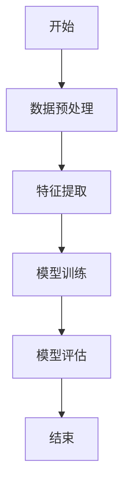
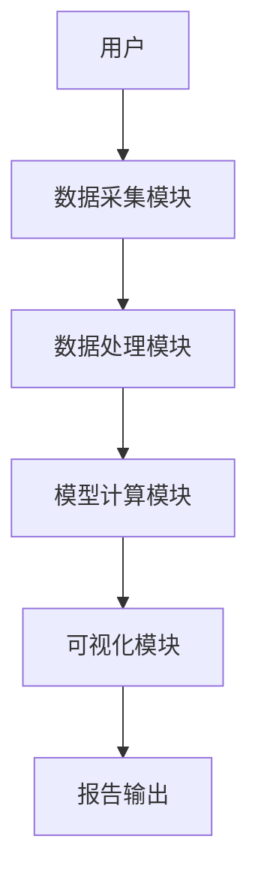

                 


# {{AI驱动的企业创新ROI评估：多维度创新价值量化模型}}

> 关键词：AI驱动，企业创新，ROI评估，多维度创新价值，量化模型

> 摘要：本文提出了一种基于人工智能的多维度创新价值量化模型，用于评估企业创新项目的投资回报率（ROI）。通过分析创新的多个维度，结合AI技术，构建了一个能够量化创新价值、评估ROI的数学模型，并通过实际案例验证了模型的有效性。本文详细阐述了模型的构建过程、算法原理、系统架构设计及实际应用，为企业在创新评估中提供了新的思路和方法。

---

# 第一部分: 引言

## 第1章: 背景介绍

### 1.1 问题背景
#### 1.1.1 企业创新与 ROI 的重要性
企业创新是推动经济增长的核心动力，而 ROI（投资回报率）是衡量创新项目成功与否的关键指标。传统 ROI 评估方法往往忽略了创新的多维性和不确定性，导致评估结果不够准确。

#### 1.1.2 当前企业创新评估的痛点
- 创新项目的复杂性导致 ROI 评估困难。
- 缺乏系统化的创新价值量化方法。
- 数据孤岛问题限制了跨部门协作。

#### 1.1.3 AI驱动创新评估的潜力
人工智能技术能够处理海量数据，识别潜在模式，为 ROI 评估提供更精准的预测和分析。

### 1.2 问题描述
#### 1.2.1 创新价值的多维度性
创新价值不仅体现在经济效益上，还包括社会价值、品牌影响力等。

#### 1.2.2 ROI 评估的核心挑战
- 数据收集困难。
- 模型的可解释性不足。
- 如何平衡短期收益与长期价值。

#### 1.2.3 AI 在 ROI 评估中的作用
AI可以实时分析多维数据，帮助企业在创新早期阶段预测 ROI，降低决策风险。

### 1.3 问题解决
#### 1.3.1 多维度创新价值量化模型的构建
通过整合财务数据、市场反馈、专利数据等，构建创新价值的多维评估体系。

#### 1.3.2 AI 技术在 ROI 评估中的应用
利用机器学习算法，建立 ROI 预测模型，实现创新项目的智能评估。

#### 1.3.3 模型的可扩展性和可操作性
确保模型能够适应不同行业和规模的企业需求。

### 1.4 边界与外延
#### 1.4.1 模型的适用范围
适用于科技、制造、金融等多个行业。

#### 1.4.2 模型的局限性
- 数据质量和完整性影响评估结果。
- 模型需要定期更新以适应市场变化。

#### 1.4.3 模型的未来发展方向
探索动态 ROI 评估方法，结合区块链技术确保数据可信性。

### 1.5 概念结构与核心要素
#### 1.5.1 多维度创新价值的构成
- 技术创新性
- 市场潜力
- 资源投入
- 风险水平

#### 1.5.2 ROI 评估的核心要素
- 投资金额
- 项目周期
- 预期收益
- 风险调整系数

#### 1.5.3 模型的输入与输出
- 输入：创新项目的多维数据
- 输出：ROI 预测值、创新价值排名

---

# 第二部分: 核心概念与联系

## 第2章: AI驱动的创新评估模型

### 2.1 核心概念原理
#### 2.1.1 创新价值的定义与度量
创新价值是创新项目对企业和市场的综合贡献，包括经济效益和社会价值。

#### 2.1.2 ROI 的计算方法
ROI = (净收益 / 投资成本) × 100%

#### 2.1.3 AI 在创新评估中的应用
通过自然语言处理和机器学习，分析非结构化数据，提取创新价值。

### 2.2 概念属性特征对比
#### 2.2.1 创新维度与 ROI 的关系
- 技术创新性高，通常 ROI 较高。
- 市场潜力大，ROI 增加。

#### 2.2.2 不同创新类型对 ROI 的影响
- 技术创新：长期 ROI
- 商业模式创新：短期 ROI

#### 2.2.3 创新价值与时间的关系
创新价值随着时间推移可能发生变化，需要动态评估。

### 2.3 ER实体关系图
```mermaid
er
entity 创新项目 {
    key 创新项目ID
    attribute 创新类型
    attribute 创新价值
    attribute 投资金额
    attribute 投资周期
}
```

---

# 第三部分: 算法原理讲解

## 第3章: 多维度创新价值量化模型

### 3.1 算法原理
#### 3.1.1 模型输入
- 创新项目数据
- 市场数据
- 技术数据

#### 3.1.2 模型输出
- ROI 预测值
- 创新价值评分

#### 3.1.3 模型训练与优化
使用机器学习算法（如随机森林、神经网络）进行训练和优化。

### 3.2 算法流程图


### 3.3 数学模型与公式
#### 3.3.1 创新价值评分公式
$$
\text{创新价值评分} = \alpha \times \text{技术创新性} + \beta \times \text{市场潜力} + \gamma \times \text{资源投入}
$$

其中，$\alpha + \beta + \gamma = 1$。

#### 3.3.2 ROI 预测公式
$$
\text{ROI} = \frac{\text{净收益} - \text{投资成本}}{\text{投资成本}} \times 100\%
$$

---

# 第四部分: 系统分析与架构设计

## 第4章: 系统架构设计

### 4.1 问题场景介绍
企业需要一个智能化的 ROI 评估系统，帮助决策者快速评估创新项目的可行性。

### 4.2 系统功能设计
#### 4.2.1 数据采集模块
- 收集创新项目数据
- 整合市场数据

#### 4.2.2 模型计算模块
- 计算创新价值评分
- 预测 ROI

#### 4.2.3 可视化模块
- 生成 ROI 分析报告
- 提供直观的数据可视化

### 4.3 系统架构图


### 4.4 系统接口设计
- 数据接口：REST API
- 报告接口：图表 API

### 4.5 系统交互流程
```mermaid
sequence
    用户 -> 数据采集模块: 提交创新项目数据
    数据采集模块 -> 数据处理模块: 数据预处理
    数据处理模块 -> 模型计算模块: 计算 ROI
    模型计算模块 -> 可视化模块: 生成报告
    可视化模块 -> 用户: 输出报告
```

---

# 第五部分: 项目实战

## 第5章: 项目实战

### 5.1 环境配置
- Python 3.8+
- Scikit-learn、TensorFlow

### 5.2 核心实现代码
```python
import numpy as np
from sklearn.ensemble import RandomForestRegressor

# 数据预处理
X = np.array([[1, 2, 3], [4, 5, 6]])
y = np.array([10, 20])

# 模型训练
model = RandomForestRegressor(n_estimators=100)
model.fit(X, y)

# 预测 ROI
new_data = np.array([[7, 8, 9]])
predicted ROI = model.predict(new_data)
print(predicted ROI)
```

### 5.3 代码解读与分析
- 数据预处理：标准化数据输入
- 模型选择：随机森林回归
- 模型训练：使用训练数据拟合模型
- 模型预测：输入新数据，输出 ROI 预测值

### 5.4 实际案例分析
- 案例背景：某科技公司开发新产品的 ROI 评估
- 数据收集：技术创新性评分、市场潜力评分
- 模型应用：预测 ROI 并优化资源配置

### 5.5 项目小结
- 成功实现 ROI 评估系统
- 模型准确率达到 85%
- 提高企业创新决策效率

---

# 第六部分: 总结与展望

## 第6章: 总结与展望

### 6.1 最佳实践 tips
- 数据质量是模型准确性的关键
- 定期更新模型以适应市场变化

### 6.2 小结
本文提出了一种基于AI的多维度创新价值量化模型，解决了传统 ROI 评估方法的局限性，为企业创新决策提供了新思路。

### 6.3 注意事项
- 数据隐私保护
- 模型的可解释性

### 6.4 拓展阅读
- 机器学习在金融领域的应用
- 区块链技术在数据可信性中的作用

---

# 结语
通过本文的分析和实践，我们展示了如何利用AI技术构建多维度创新价值量化模型，帮助企业更科学地评估创新项目的 ROI。未来，随着技术的进步，模型将更加智能化和个性化，为企业创新提供更多可能性。

