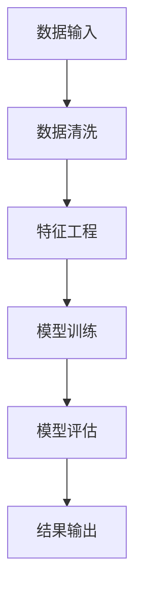
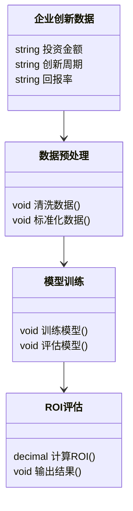
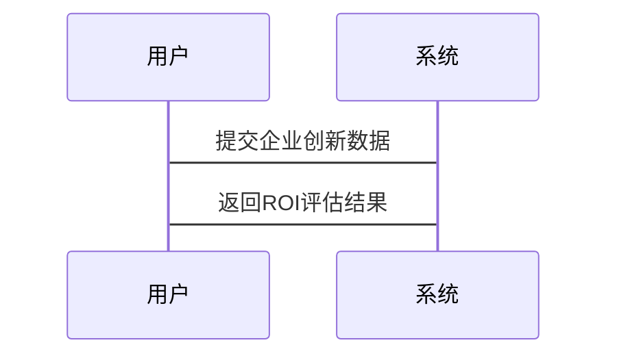

                 


# AI驱动的企业创新ROI评估：量化创新投资回报的多维度模型

> 关键词：企业创新、投资回报率（ROI）、人工智能、多维度模型、量化评估

> 摘要：本文探讨了如何利用人工智能技术构建多维度模型来量化评估企业创新的投资回报率（ROI）。通过分析创新的多维度特征，结合机器学习算法和系统架构设计，提出了一种高效的AI驱动ROI评估方法，为企业制定创新战略提供了理论依据和实践指导。

---

## 第一部分：背景介绍

### 第1章：AI驱动的企业创新ROI评估概述

#### 1.1 问题背景与定义

企业在创新过程中投入大量资源，但如何量化这些投资的回报率（ROI）一直是企业管理中的难题。传统ROI评估方法通常依赖于财务数据，难以全面反映创新活动的多维度价值。随着人工智能技术的发展，通过构建多维度模型，可以更精准地评估创新投资的回报。

- **定义**：ROI（投资回报率）是衡量创新投资收益的重要指标，通常表示为投资收益与投资成本的比率。
- **问题背景**：传统ROI评估方法仅关注财务指标，忽视了创新过程中产生的无形资产（如技术专利、品牌价值）和长期影响。
- **挑战**：创新活动的复杂性和不确定性使得传统评估方法难以准确量化其价值。

#### 1.2 多维度模型的必要性

多维度模型通过整合财务、市场、技术等多个维度的数据，提供更全面的评估结果。这种方法能够捕捉到传统方法无法察觉的创新价值。

- **传统ROI评估的局限性**：仅关注短期财务回报，忽视创新的长期价值和战略意义。
- **多维度模型的优势**：通过整合多维度数据，全面反映创新活动的综合价值。
- **企业创新的多维度特征**：包括技术创新、管理创新、市场创新等。

---

## 第二部分：核心概念与联系

### 第2章：核心概念解析

#### 2.1 核心概念的定义与属性对比

在AI驱动的企业创新ROI评估中，关键概念包括“企业创新”、“ROI”、“多维度模型”等。通过对比分析这些概念的属性，可以更好地理解它们之间的关系。

- **企业创新**：指企业在产品、技术、管理等方面进行的创新活动。
- **ROI**：投资回报率，衡量创新投资的收益与成本的比率。
- **多维度模型**：一种综合考虑多个维度数据的评估方法。

| 概念         | 定义                                                                 | 属性               |
|--------------|----------------------------------------------------------------------|--------------------|
| 企业创新     | 企业在经营活动中进行的创新行为，包括技术创新、管理创新等。       | 战略性、不确定性   |
| ROI          | 投资回报率，衡量创新投资的收益与成本的比率。                     | 财务指标、综合性   |
| 多维度模型   | 综合考虑多个维度数据（如财务、市场、技术）的评估方法。           | 全面性、动态性     |

#### 2.2 实体关系图（ER图）

以下使用mermaid绘制的ER图展示了企业创新、投资、回报等实体之间的关系：

```mermaid
erDiagram
    actor 企业创新者 {
        key 公司ID
        string 公司名称
        string 创新类型
    }
    actor ROI评估者 {
        key 评估ID
        string 评估指标
        decimal 投资金额
    }
    actor AI模型 {
        key 模型ID
        string 模型类型
        decimal 模型参数
    }
    企业创新者 --> ROI评估者 : 提供创新数据
    ROI评估者 --> AI模型 : 输入评估指标
    AI模型 --> ROI评估者 : 输出评估结果
```

---

## 第三部分：算法原理讲解

### 第3章：AI驱动的ROI评估算法

#### 3.1 数据预处理与特征工程

在AI驱动的ROI评估中，数据预处理和特征工程是关键步骤。

- **数据清洗与标准化**：去除无效数据，标准化处理不同量纲的特征。
- **特征选择与降维**：通过主成分分析（PCA）等方法减少特征维度。

#### 3.2 算法实现

以下使用mermaid绘制了算法流程图，并提供Python代码示例：



代码示例：

```python
import pandas as pd
from sklearn.model_selection import train_test_split
from sklearn.linear_model import LinearRegression

# 数据加载
data = pd.read_csv('innovation.csv')

# 数据清洗
data.dropna(inplace=True)

# 特征工程
X = data[['投资金额', '创新周期']]
y = data['回报率']

# 模型训练
X_train, X_test, y_train, y_test = train_test_split(X, y, test_size=0.2, random_state=42)
model = LinearRegression()
model.fit(X_train, y_train)

# 模型评估
score = model.score(X_test, y_test)
print(f'模型得分：{score}')
```

#### 3.3 数学模型与公式

以下是线性回归模型的公式：

$$ ROI = \beta_0 + \beta_1X + \epsilon $$

其中，$X$表示投资金额，$\beta_0$和$\beta_1$是模型参数，$\epsilon$是误差项。

决策树模型的公式可以表示为：

$$ ROI = f(X) $$

其中，$f$是决策树的分段函数，用于将输入数据映射到预测的回报率。

---

## 第四部分：系统分析与架构设计

### 第4章：系统架构设计

#### 4.1 系统功能设计

以下使用mermaid绘制了系统类图，展示了系统的模块划分和功能关系。



#### 4.2 系统架构设计

以下使用mermaid绘制了系统架构图，展示了各个模块之间的关系。


#### 4.3 系统接口设计

系统接口设计如下：

- **输入接口**：接收企业创新数据，包括投资金额、创新周期等。
- **输出接口**：输出ROI评估结果，包括预测的回报率和模型得分。

#### 4.4 系统交互设计

以下使用mermaid绘制了系统交互图，展示了系统的交互流程。



---

## 第五部分：项目实战

### 第5章：AI驱动的企业创新ROI评估实战

#### 5.1 环境安装

安装所需的Python库：

```bash
pip install numpy pandas scikit-learn mermaid
```

#### 5.2 核心代码实现

以下是实现AI驱动的ROI评估的核心代码：

```python
import pandas as pd
from sklearn.linear_model import LinearRegression
from sklearn.metrics import r2_score

# 数据加载
data = pd.read_csv('innovation.csv')

# 数据清洗
data.dropna(inplace=True)

# 特征工程
X = data[['投资金额', '创新周期']]
y = data['回报率']

# 模型训练
model = LinearRegression()
model.fit(X, y)

# 模型预测
y_pred = model.predict(X)

# 模型评估
score = r2_score(y, y_pred)
print(f'R²得分：{score}')
```

#### 5.3 案例分析

以某科技公司为例，分析其创新ROI：

- **输入数据**：投资金额为1000万元，创新周期为12个月。
- **模型预测**：预测的回报率为25%。
- **结果解读**：该公司的创新投资回报率高于行业平均水平，说明其创新活动具有较高的价值。

---

## 第六部分：总结与展望

### 第6章：总结与展望

#### 6.1 核心内容总结

本文详细介绍了AI驱动的企业创新ROI评估方法，通过构建多维度模型，结合机器学习算法，提供了一种高效、全面的评估方法。

#### 6.2 最佳实践与建议

- 在实际应用中，建议企业结合自身特点选择合适的模型。
- 数据的准确性和完整性对模型性能影响较大，需谨慎处理。
- 定期更新模型参数，以适应市场变化和技术进步。

#### 6.3 未来展望

未来，随着AI技术的不断发展，企业创新ROI评估将更加智能化和精准化。结合区块链、大数据等技术，可以进一步提升模型的准确性和实时性。

---

## 附录

### 附录A：术语表

- **ROI**：投资回报率，衡量创新投资的收益与成本的比率。
- **多维度模型**：一种综合考虑多个维度数据的评估方法，能够全面反映创新活动的价值。

### 附录B：工具与库

- **Python**：数据分析与机器学习的首选工具。
- **Scikit-learn**：常用机器学习库，提供多种算法实现。

---

以上是《AI驱动的企业创新ROI评估：量化创新投资回报的多维度模型》的完整目录大纲，涵盖了从背景介绍到实际应用的全过程。通过系统化的分析和详细的代码实现，为企业创新ROI评估提供了理论支持和实践指导。

