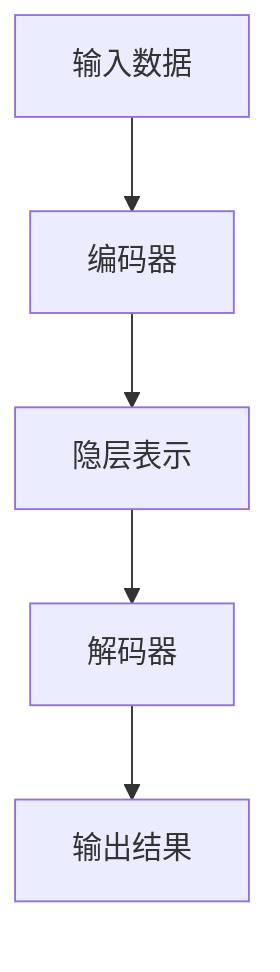
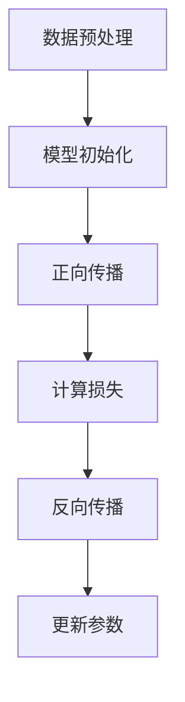

                 


# AI驱动的企业创新生态系统分析：内外部创新网络

## 关键词：AI，创新生态系统，内外部创新网络，生成式AI，大模型，知识图谱

## 摘要：  
本文将探讨AI技术如何驱动企业创新生态系统的发展，特别是通过分析内外部创新网络的结构与交互。通过结合生成式AI、大模型训练和知识图谱构建等技术，本文将为企业构建创新生态系统提供理论和实践指导，帮助企业在数字化转型中实现高效创新。

---

# 第一部分: AI驱动的企业创新生态系统背景

# 第1章: AI驱动的企业创新生态系统概述

## 1.1 问题背景与问题描述

### 1.1.1 企业创新的挑战与机遇  
企业在数字化转型中面临越来越复杂的创新挑战，包括技术更新速度加快、市场竞争加剧以及客户需求多样化。AI技术的出现为企业提供了新的创新工具和方法，能够帮助企业在内部和外部构建高效的创新网络。

### 1.1.2 AI技术对企业创新的驱动作用  
AI技术通过数据驱动的方式，能够快速分析海量数据，识别潜在的创新机会，并支持创新网络的动态优化。生成式AI和大模型技术的应用，使得企业能够更高效地生成创新想法、优化创新流程，并实现跨组织的协作创新。

### 1.1.3 内外部创新网络的定义与边界  
- **内部创新网络**：指企业内部的研发团队、职能部门以及员工之间的创新协作网络。  
- **外部创新网络**：指企业与外部合作伙伴（如供应商、客户、学术机构、 startups等）之间的创新协作网络。  
- **边界与外延**：内外部创新网络的边界在于企业的组织结构和合作模式，而外延则扩展到整个创新生态系统中。

## 1.2 问题解决与核心要素

### 1.2.1 AI驱动创新的核心问题  
AI如何赋能企业内部和外部的创新网络，构建高效的创新生态系统。  
- 数据驱动的创新机会识别  
- 智能化的创新流程优化  
- 跨组织的协作创新支持  

### 1.2.2 内外部创新网络的构成要素  
- **内部创新网络**：内部团队、创新项目、创新资源（如数据、资金、技术）  
- **外部创新网络**：外部合作伙伴、创新平台、行业知识库  
- **核心要素**：数据、算法、算力、协作机制  

### 1.2.3 创新生态系统的核心属性  
- **动态性**：创新网络能够实时响应变化，调整创新方向。  
- **协作性**：内部与外部创新网络的高效协作。  
- **智能性**：AI技术驱动创新过程的智能化。  

## 1.3 概念结构与核心要素

### 1.3.1 创新生态系统的层次结构  
创新生态系统由三层构成：  
1. **底层**：数据层，包括企业内外部数据的采集、存储与处理。  
2. **中层**：算法层，包括生成式AI、大模型等技术的应用。  
3. **上层**：应用层，包括创新机会识别、创新项目管理、创新成果输出。  

### 1.3.2 内部创新网络与外部创新网络的关系  
内部创新网络与外部创新网络通过数据和知识的共享实现互动。  
- 内部网络提供创新资源和能力，外部网络提供外部视角和资源。  
- 通过知识图谱构建，内部与外部网络可以实现知识共享与协作。  

### 1.3.3 核心要素的相互作用  
| 核心要素 | 描述 | 作用 |
|----------|------|------|
| 数据     | 企业内外部数据 | 驱动AI模型的训练与应用 |
| 算法     | 生成式AI、大模型 | 支持创新机会识别与项目优化 |
| 算力     | 高性能计算资源 | 支持大规模数据处理与模型训练 |
| 协作机制 | 内外部协作流程 | 实现创新网络的高效协同 |

## 1.4 本章小结  
本章从问题背景、核心要素和概念结构三个方面，详细介绍了AI驱动的企业创新生态系统。企业通过构建内外部创新网络，能够更高效地进行创新活动，同时AI技术的应用使得创新过程更加智能化和协作化。

---

# 第二部分: AI驱动的创新生态系统核心概念与联系

# 第2章: AI驱动的创新生态系统原理

## 2.1 AI驱动创新的核心原理

### 2.1.1 生成式AI的原理与机制  
生成式AI（如GPT、BERT）通过生成文本、图像或其他形式的内容，为企业提供创新想法和解决方案。  
- 输入数据：企业内外部数据（如市场趋势、客户需求、技术动态）  
- 输出结果：生成创新想法、产品设计、营销策略等  

### 2.1.2 大模型在创新中的应用  
大模型（如GPT-4、PaLM）能够处理复杂任务，支持创新网络的动态优化。  
- 数据预处理：清洗和标注数据  
- 模型训练：基于大规模数据的微调  
- 应用场景：创新机会识别、创新项目管理、创新成果输出  

### 2.1.3 创新网络的动态演化  
创新网络通过数据驱动的方式不断优化，实时响应市场变化和企业需求。  
- 数据驱动：实时采集内外部数据，动态调整创新方向。  
- 知识图谱：构建企业内外部知识图谱，支持创新网络的协作与共享。  

## 2.2 内外部创新网络的实体关系

### 2.2.1 内部创新网络的ER实体关系图  
```mermaid
er
  actor: 企业内部团队
  action: 创新行为
  outcome: 创新成果
  relation: 参与
```

### 2.2.2 外部创新网络的ER实体关系图  
```mermaid
er
  actor: 企业外部合作伙伴
  action: 创新行为
  outcome: 创新成果
  relation: 合作
```

## 2.3 算法原理与流程

### 2.3.1 生成式AI算法流程  


### 2.3.2 大模型训练流程  


## 2.4 本章小结  
本章通过生成式AI和大模型的原理，详细介绍了AI驱动创新的核心机制。内外部创新网络通过数据和知识的共享，实现动态协作和优化。

---

# 第三部分: AI驱动的创新生态系统算法原理

# 第3章: 生成式AI的数学模型与公式

## 3.1 生成式AI的数学基础

### 3.1.1 概率分布与生成模型  
生成式AI基于概率分布生成数据，核心公式如下：  
$$ P(x) = \text{生成模型的概率分布} $$  
其中，$x$ 表示生成的数据，$P(x)$ 是数据的概率分布。

### 3.1.2 变分下界与损失  
生成模型的损失函数通常基于变分下界（ELBO）：  
$$ \mathcal{L} = \mathbb{E}_{x}[ \log p_\theta(x) ] - \mathbb{E}_{z}[ \log q_\phi(z|x) ] $$  
其中，$p_\theta(x)$ 是生成模型的分布，$q_\phi(z|x)$ 是后验分布。

---

通过以上结构，文章将详细分析AI驱动的企业创新生态系统，结合生成式AI、大模型和知识图谱构建等技术，为企业构建高效的内外部创新网络提供理论和实践指导。

