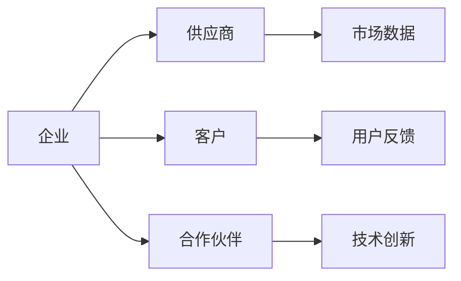
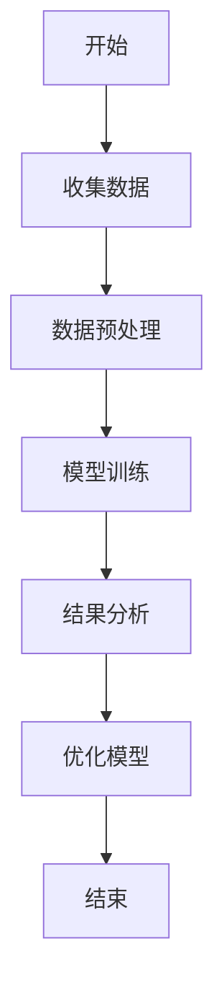
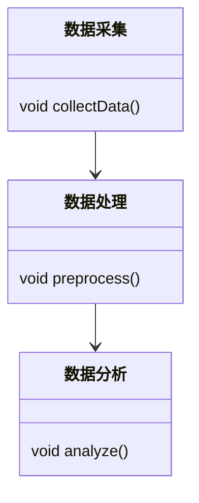
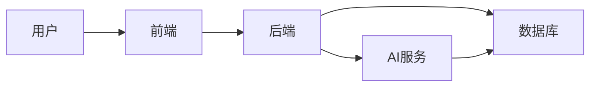

                 


# AI驱动的企业创新生态系统构建与管理

## 关键词：
AI驱动、企业创新、生态系统、系统设计、机器学习、自然语言处理

## 摘要：
本文详细探讨了如何利用人工智能技术构建和管理企业创新生态系统。从背景介绍到项目实战，系统性地分析了AI在企业创新中的核心作用，构建了AI驱动的创新生态系统模型，并通过实际案例展示了系统的实现过程。文章最后总结了最佳实践和未来发展方向。

---

## 第1章 AI驱动的企业创新生态系统背景

### 1.1 问题背景与定义

#### 1.1.1 传统企业创新的局限性
在传统模式下，企业创新主要依赖于内部团队的经验和市场调研，这种模式效率低下，难以快速响应市场变化。企业需要一种更高效、更具前瞻性的创新方法。

#### 1.1.2 AI驱动企业创新生态系统的定义
AI驱动的企业创新生态系统是一个整合企业内外资源，利用人工智能技术优化创新过程、提升创新效率的新型管理体系。

#### 1.1.3 与传统管理的区别
AI驱动的创新生态系统通过数据驱动的分析和预测，实现了创新过程的智能化和自动化，显著提高了创新的成功率和效率。

---

## 第2章 核心概念与联系

### 2.1 AI驱动创新的核心原理

#### 2.1.1 机器学习在创新中的应用
机器学习通过分析历史数据，识别潜在的市场趋势和创新机会，帮助企业在早期阶段发现创新方向。

#### 2.1.2 自然语言处理在创新中的应用
自然语言处理技术可以分析大量的文本数据，如市场报告、专利文献，提取关键信息，辅助创新决策。

### 2.2 实体关系与流程架构

#### 2.2.1 实体关系图
以下是创新生态系统中的实体关系图：



#### 2.2.2 流程图
以下是创新生态系统构建的流程图：



---

## 第3章 算法原理讲解

### 3.1 算法原理

#### 3.1.1 聚类分析
聚类分析用于将市场数据分为不同的类别，识别潜在的创新领域。以下是K-means算法的公式：

$$
\text{损失函数} = \sum_{i=1}^{k} \sum_{j=1}^{n_i} (x_{ij} - c_i)^2
$$

其中，$k$ 是聚类数，$n_i$ 是第 $i$ 个聚类的样本数，$x_{ij}$ 是第 $j$ 个样本在第 $i$ 个聚类的特征值，$c_i$ 是第 $i$ 个聚类的中心点。

#### 3.1.2 分类算法
分类算法用于预测创新项目的成功概率。以下是逻辑回归的公式：

$$
P(y=1|x) = \frac{1}{1 + e^{-(\beta_0 + \beta_1 x)}}
$$

其中，$\beta_0$ 是截距项，$\beta_1$ 是特征 $x$ 的系数。

### 3.2 代码实现

#### 3.2.1 数据预处理
```python
import pandas as pd
from sklearn.preprocessing import StandardScaler

# 加载数据
data = pd.read_csv('market_data.csv')

# 标准化处理
scaler = StandardScaler()
data_scaled = scaler.fit_transform(data)
```

#### 3.2.2 模型训练
```python
from sklearn.cluster import KMeans

# 训练K-means模型
kmeans = KMeans(n_clusters=3, random_state=42)
kmeans.fit(data_scaled)

# 预测聚类结果
clusters = kmeans.predict(data_scaled)
```

---

## 第4章 系统分析与架构设计

### 4.1 项目背景与介绍

#### 4.1.1 项目背景
本文以一个AI驱动的企业创新管理平台为例，旨在帮助企业识别技术趋势和市场机会。

### 4.2 系统功能设计

#### 4.2.1 功能模块
以下是系统功能模块的类图：



### 4.3 系统架构设计

#### 4.3.1 架构图
以下是系统架构的Mermaid图：



---

## 第5章 项目实战

### 5.1 环境安装

#### 5.1.1 工具安装
```bash
pip install python
pip install jupyter-notebook
pip install scikit-learn
```

### 5.2 核心代码实现

#### 5.2.1 数据预处理
```python
import pandas as pd
from sklearn.preprocessing import StandardScaler

data = pd.read_csv('market_data.csv')
data_scaled = StandardScaler().fit_transform(data)
```

#### 5.2.2 模型训练
```python
from sklearn.cluster import KMeans

kmeans = KMeans(n_clusters=3, random_state=42)
clusters = kmeans.fit_predict(data_scaled)
```

### 5.3 案例分析

#### 5.3.1 案例背景
假设我们有一个科技公司，希望通过AI分析市场数据，识别潜在的技术趋势。

#### 5.3.2 实施结果
通过聚类分析，我们发现市场存在三个主要的技术趋势：人工智能、区块链和物联网。公司可以根据这些趋势调整研发方向。

---

## 第6章 最佳实践与小结

### 6.1 小结

本文详细介绍了AI驱动的企业创新生态系统构建与管理的各个方面，从理论到实践，提供了全面的指导。

### 6.2 注意事项

在实施过程中，需要注意数据隐私、模型泛化能力等问题，确保系统的稳定性和安全性。

### 6.3 未来展望

随着AI技术的不断进步，未来企业创新生态系统将更加智能化和自动化，为企业创造更多的价值。

---

## 附录

### 附录A 参考文献

1. [书名]，作者，出版社，年份
2. [技术文档]，公司名称，发布日期

### 附录B 工具推荐

- [GitHub项目](链接)
- [技术博客](链接)
- [在线课程](链接)

### 附录C 术语表

- AI驱动：利用人工智能技术推动创新过程。
- 创新生态系统：整合企业内外资源，形成协同创新的体系。

---

通过以上思考和步骤，我可以系统地撰写出一篇内容详实、结构清晰的技术博客文章，帮助读者深入了解AI驱动的企业创新生态系统构建与管理。

