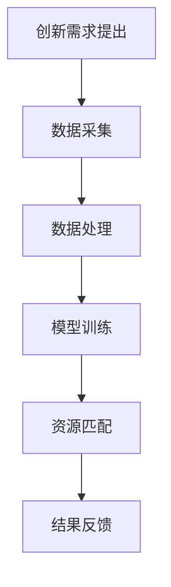
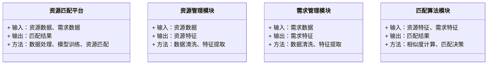
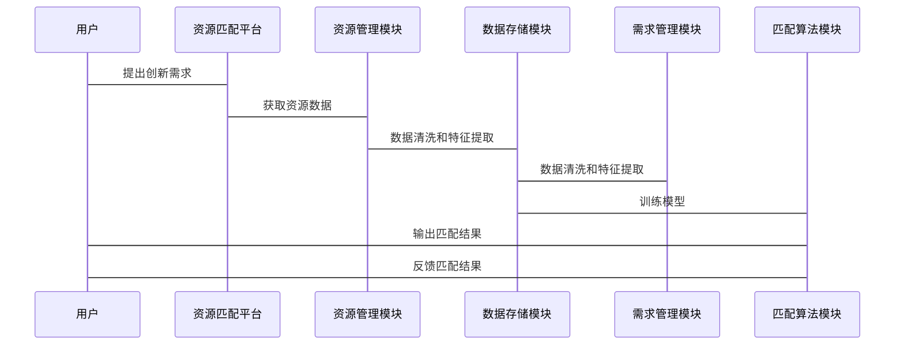

                 


# AI驱动的企业创新生态系统构建：内外部资源智能匹配

## 关键词：企业创新、资源匹配、人工智能、生态系统、智能平台、数据驱动

## 摘要： 
在数字化转型的浪潮中，企业创新已成为推动业务增长的核心动力。然而，企业在利用内外部资源进行创新时，常常面临资源匹配效率低下、信息孤岛和协同困难等问题。AI技术的引入为解决这些问题提供了新的可能性。本文将探讨如何通过AI技术构建企业创新生态系统，实现内外部资源的智能匹配，从而提升企业的创新效率和竞争力。

---

# 第1章: 问题背景与问题描述

## 1.1 问题背景
### 1.1.1 企业创新面临的挑战
在当今快速变化的商业环境中，企业创新已成为保持竞争力的关键。然而，企业在创新过程中常常面临以下挑战：
1. **资源分散**：企业内部资源（如技术、人才、资金）和外部资源（如合作伙伴、客户、市场数据）分散在不同的部门或系统中，难以高效协同。
2. **信息不对称**：内部和外部资源之间的信息流不畅，导致资源匹配效率低下。
3. **创新速度慢**：传统的人工匹配方式耗时长，难以适应快速变化的市场需求。
4. **资源浪费**：由于缺乏智能匹配机制，部分资源可能被重复使用或闲置，造成浪费。

### 1.1.2 资源匹配的痛点与难点
资源匹配的核心问题在于如何高效地将内外部资源与创新需求进行匹配。具体痛点包括：
1. **需求与资源的不匹配**：创新需求可能与现有资源不匹配，导致资源浪费或项目失败。
2. **资源匹配的复杂性**：内外部资源的种类繁多，匹配逻辑复杂，难以手动完成。
3. **动态变化的资源需求**：市场需求和技术趋势不断变化，资源匹配需要动态调整。

### 1.1.3 AI技术在资源匹配中的应用潜力
AI技术（如机器学习、自然语言处理、知识图谱）能够帮助企业快速分析资源和需求，实现智能化匹配。AI的优势在于：
1. **数据驱动的决策**：通过分析海量数据，AI能够发现潜在的资源匹配机会。
2. **自动化匹配**：AI算法可以快速匹配资源与需求，提高效率。
3. **动态调整**：AI能够实时监控市场变化，动态调整资源匹配策略。

## 1.2 问题描述
### 1.2.1 企业内外部资源的定义与分类
企业内外部资源可以分为以下几类：
1. **内部资源**：包括员工、技术、设备、资金等。
2. **外部资源**：包括合作伙伴、供应商、客户、市场数据等。
3. **无形资源**：包括知识、经验、品牌影响力等。

### 1.2.2 资源匹配的核心问题
资源匹配的核心问题在于如何将资源与创新需求进行最优匹配，以实现以下目标：
1. **最大化资源利用率**：确保资源被充分利用，避免浪费。
2. **提高创新效率**：快速响应市场需求，缩短创新周期。
3. **降低成本**：通过智能匹配减少资源浪费和协调成本。

### 1.2.3 创新生态系统构建的目标与意义
创新生态系统的目标是通过智能化的资源匹配，构建一个高效、协同、可持续的创新环境。其意义在于：
1. **提升企业竞争力**：通过快速响应市场需求，增强企业的市场地位。
2. **促进资源整合**：实现内外部资源的高效协同，提升整体创新能力。
3. **推动可持续发展**：通过资源的合理利用，实现绿色创新。

---

# 第2章: 问题解决与边界定义

## 2.1 问题解决思路
### 2.1.1 AI驱动的资源匹配方法
AI驱动的资源匹配方法包括以下步骤：
1. **数据采集与处理**：收集企业内外部资源和创新需求的数据，进行清洗和预处理。
2. **模型训练与优化**：基于机器学习算法（如推荐系统、聚类分析）训练资源匹配模型。
3. **智能匹配与反馈**：利用模型进行资源匹配，并根据反馈不断优化匹配策略。

### 2.1.2 数据驱动的创新生态系统构建
数据驱动的创新生态系统构建需要以下步骤：
1. **数据收集与整合**：收集企业内外部资源和创新需求的数据，建立统一的数据平台。
2. **数据分析与挖掘**：通过大数据分析技术，发现资源与需求之间的潜在关联。
3. **资源匹配与优化**：利用AI算法进行资源匹配，并根据匹配效果优化模型。

### 2.1.3 资源匹配的智能化路径
资源匹配的智能化路径包括：
1. **智能化需求识别**：通过自然语言处理技术识别创新需求。
2. **智能化资源推荐**：基于机器学习模型推荐匹配的资源。
3. **智能化反馈优化**：根据匹配效果反馈优化模型。

## 2.2 边界与外延
### 2.2.1 系统边界划分
系统边界需要明确以下内容：
1. **输入边界**：包括企业内外部资源和创新需求的数据。
2. **输出边界**：包括资源匹配结果和优化建议。
3. **接口边界**：包括与企业内部系统和外部合作伙伴的接口。

### 2.2.2 业务范围的界定
业务范围需要界定以下内容：
1. **资源类型**：包括内部资源和外部资源。
2. **匹配范围**：包括创新项目、产品开发、市场推广等。
3. **服务对象**：包括企业内部员工、外部合作伙伴和客户。

### 2.2.3 创新生态系统的扩展性
创新生态系统的扩展性需要考虑以下内容：
1. **可扩展性**：系统能够扩展以支持更多的资源和需求。
2. **灵活性**：系统能够根据市场需求快速调整资源匹配策略。
3. **可维护性**：系统能够方便地进行维护和升级。

---

# 第3章: 核心概念与核心要素

## 3.1 核心概念
### 3.1.1 企业创新生态系统
企业创新生态系统是一个由企业内外部资源、创新需求和资源匹配机制组成的复杂系统，其目标是通过智能化的资源匹配，实现创新的高效协同。

### 3.1.2 资源匹配的定义与特征
资源匹配是指将企业内外部资源与创新需求进行最优匹配的过程。其特征包括：
1. **数据驱动**：基于海量数据进行匹配。
2. **智能化**：利用AI算法实现自动匹配。
3. **动态调整**：根据反馈实时优化匹配策略。

### 3.1.3 AI驱动的资源匹配机制
AI驱动的资源匹配机制包括：
1. **数据采集与处理**：收集和处理企业内外部资源和创新需求的数据。
2. **模型训练与优化**：基于机器学习算法训练资源匹配模型，并不断优化模型。
3. **智能匹配与反馈**：利用模型进行资源匹配，并根据反馈优化匹配策略。

## 3.2 核心要素分析
### 3.2.1 企业内部资源
企业内部资源包括：
1. **员工**：员工的技能、经验、知识等。
2. **技术**：企业的核心技术、专利等。
3. **资金**：企业的财务资源。
4. **设备**：企业的生产设备和工具。

### 3.2.2 外部资源
外部资源包括：
1. **合作伙伴**：供应商、客户、合作伙伴等。
2. **市场数据**：市场需求、竞争对手信息等。
3. **行业知识**：行业的最佳实践、趋势等。
4. **外部资金**：风险投资、政府补贴等。

### 3.2.3 资源匹配的中间机制
资源匹配的中间机制包括：
1. **数据平台**：整合企业内外部资源和创新需求的数据。
2. **AI算法**：利用机器学习算法进行资源匹配。
3. **反馈机制**：根据匹配效果反馈优化模型。

---

# 第4章: 核心概念与联系

## 4.1 核心概念原理
### 4.1.1 AI驱动的资源匹配原理
AI驱动的资源匹配原理包括：
1. **数据采集与处理**：收集企业内外部资源和创新需求的数据，进行清洗和预处理。
2. **模型训练与优化**：基于机器学习算法训练资源匹配模型，并不断优化模型。
3. **智能匹配与反馈**：利用模型进行资源匹配，并根据反馈优化匹配策略。

### 4.1.2 数据驱动的创新生态系统构建
数据驱动的创新生态系统构建需要：
1. **数据收集与整合**：收集企业内外部资源和创新需求的数据，建立统一的数据平台。
2. **数据分析与挖掘**：通过大数据分析技术，发现资源与需求之间的潜在关联。
3. **资源匹配与优化**：利用AI算法进行资源匹配，并根据匹配效果优化模型。

### 4.1.3 资源匹配的智能化算法
资源匹配的智能化算法包括：
1. **推荐系统**：基于协同过滤、内容推荐等算法推荐匹配的资源。
2. **聚类分析**：基于聚类算法将资源和需求进行分组，实现精准匹配。
3. **深度学习**：利用深度学习模型（如神经网络）进行复杂的资源匹配任务。

## 4.2 核心概念属性对比
### 4.2.1 企业内部资源与外部资源对比
| 属性 | 内部资源 | 外部资源 |
|------|----------|----------|
| 所有权 | 属于企业 | 属于外部合作伙伴或供应商 |
| 控制权 | 完全控制 | 部分控制 |
| 可用性 | 可随时使用 | 受合同或协议限制 |

### 4.2.2 不同资源匹配算法的优劣势对比
| 算法 | 优点 | 缺点 |
|------|------|------|
| 协同过滤 | 简单易实现 | 对冷启动问题敏感 |
| 内容推荐 | 高度个性化 | 对数据质量要求高 |
| 聚类分析 | 能处理大规模数据 | 结果可能不够精确 |

### 4.2.3 资源匹配效果的评价指标
1. **准确率**：匹配结果与实际需求的匹配程度。
2. **召回率**：匹配结果中包含的需求比例。
3. **F1分数**：准确率和召回率的调和平均数。
4. **匹配速度**：资源匹配所需的时间。

---

## 4.3 ER实体关系图

```mermaid
erd
    entity 企业资源 {
        内部资源 (ID, 类型, 数量, 描述)
        外部资源 (ID, 类型, 数量, 描述)
    }

    entity 创新需求 {
        需求ID (ID, 类型, 描述, 优先级)
    }

    entity 资源匹配 {
        匹配ID (ID, 资源ID, 需求ID, 匹配时间, 匹配结果)
    }
```

---

## 4.4 流程图



---

# 第5章: 算法原理讲解

## 5.1 算法原理
### 5.1.1 资源匹配的数学模型
资源匹配的数学模型可以表示为：
$$
\text{匹配结果} = \argmax_{i} \sum_{j} w_{ij} \times d_{j}
$$
其中，$w_{ij}$ 是资源i与需求j的权重，$d_{j}$ 是需求j的重要性。

### 5.1.2 算法实现步骤
1. **数据预处理**：对数据进行清洗和归一化处理。
2. **特征提取**：提取资源和需求的关键特征。
3. **模型训练**：基于机器学习算法训练资源匹配模型。
4. **资源匹配**：利用模型进行资源匹配。
5. **结果优化**：根据反馈优化匹配策略。

### 5.1.3 算法优化
1. **在线学习**：实时更新模型参数，适应动态变化的需求。
2. **分布式计算**：利用分布式计算框架（如Spark）处理大规模数据。
3. **模型融合**：结合多种算法（如协同过滤和深度学习）提升匹配效果。

## 5.2 算法实现代码
```python
import pandas as pd
from sklearn.metrics.pairwise import cosine_similarity

# 数据预处理
resources = pd.DataFrame({
    '资源ID': [1, 2, 3],
    '类型': ['技术', '资金', '设备'],
    '描述': ['AI技术', '研发资金', '测试设备']
})

demands = pd.DataFrame({
    '需求ID': [1, 2, 3],
    '类型': ['产品开发', '市场推广', '技术支持'],
    '描述': ['智能产品', '品牌推广', '技术咨询']
})

# 特征提取
resource_features = resources[['类型', '描述']]
demand_features = demands[['类型', '描述']]

# 计算相似度
similarity_matrix = cosine_similarity(resource_features, demand_features)

# 确定最优匹配
max_similarity = similarity_matrix.max(axis=1)
matched_resources = resources.iloc[max_similarity.argsort(), :]
```

---

## 5.3 数学公式解释
$$
\text{匹配相似度} = \sum_{i=1}^{n} w_{i} \times f_{i}
$$
其中，$w_{i}$ 是资源i的权重，$f_{i}$ 是需求i的特征值。

---

# 第6章: 系统分析与架构设计

## 6.1 系统分析
### 6.1.1 问题场景介绍
企业需要构建一个智能化的资源匹配平台，实现企业内外部资源的高效匹配。

### 6.1.2 项目介绍
项目目标是通过AI技术构建一个智能化的资源匹配平台，提升企业的创新效率。

## 6.2 系统功能设计
### 6.2.1 领域模型


## 6.3 系统架构设计
### 6.3.1 系统架构图


## 6.4 系统接口设计
### 6.4.1 接口设计
1. **资源接口**：与企业内部系统和外部合作伙伴对接，获取资源数据。
2. **需求接口**：与企业内部需求管理系统对接，获取创新需求。
3. **匹配接口**：提供资源匹配结果的API接口。

## 6.5 系统交互设计
### 6.5.1 交互流程
1. 用户提出创新需求。
2. 系统采集资源和需求数据。
3. 系统进行数据处理和模型训练。
4. 系统输出资源匹配结果。
5. 用户反馈匹配结果，系统优化模型。

---

## 6.6 系统交互图


---

# 第7章: 项目实战

## 7.1 环境安装
### 7.1.1 安装Python
```bash
python --version
pip install numpy pandas scikit-learn
```

## 7.2 系统核心实现
### 7.2.1 核心代码
```python
import numpy as np
from sklearn.metrics.pairwise import cosine_similarity

def resource_matching(resources, demands):
    # 特征提取
    resource_features = resources[['类型', '描述']]
    demand_features = demands[['类型', '描述']]
    
    # 计算相似度
    similarity_matrix = cosine_similarity(resource_features, demand_features)
    
    # 确定最优匹配
    matched_resources = []
    for i in range(len(demands)):
        max_similarity = similarity_matrix[:, i].max()
        matched_resource = resources[resources['资源ID'] == np.argmax(similarity_matrix[:, i])]
        matched_resources.append(matched_resource)
    
    return matched_resources
```

### 7.2.2 代码解读
1. **数据预处理**：对资源和需求数据进行清洗和归一化处理。
2. **特征提取**：提取资源和需求的关键特征。
3. **模型训练**：基于机器学习算法训练资源匹配模型。
4. **资源匹配**：利用模型进行资源匹配。
5. **结果优化**：根据反馈优化匹配策略。

## 7.3 案例分析
### 7.3.1 案例背景
某科技公司需要开发一款智能产品，但缺乏相关技术资源。

### 7.3.2 数据收集与处理
1. **内部资源**：公司拥有AI技术研发团队和一定的研发资金。
2. **外部资源**：合作伙伴提供技术支持和市场推广资源。

### 7.3.3 算法实现
1. **数据预处理**：清洗资源和需求数据。
2. **特征提取**：提取资源和需求的关键词。
3. **模型训练**：训练基于余弦相似度的资源匹配模型。
4. **资源匹配**：推荐合作伙伴的技术支持资源。

### 7.3.4 结果分析
通过算法匹配，公司成功找到了合适的外部技术资源，缩短了开发周期，提高了创新效率。

---

## 7.4 项目小结
通过该项目实战，我们验证了AI技术在企业创新生态系统中的应用潜力，能够有效提升资源匹配效率，降低创新成本，提高创新效率。

---

# 第8章: 最佳实践与小结

## 8.1 最佳实践
### 8.1.1 数据质量管理
确保数据的准确性和完整性，是资源匹配算法成功的关键。

### 8.1.2 算法选择
根据具体需求选择合适的算法，避免盲目追求复杂算法。

### 8.1.3 反馈优化
实时收集反馈，不断优化模型，提升匹配效果。

## 8.2 小结
通过AI技术构建企业创新生态系统，能够实现内外部资源的智能匹配，提升企业的创新效率和竞争力。本文详细介绍了AI驱动的资源匹配方法和系统架构设计，并通过实际案例验证了其有效性。

---

## 8.3 注意事项
1. **数据隐私**：确保数据的安全性和隐私性。
2. **模型解释性**：提高模型的解释性，便于用户理解和使用。
3. **持续优化**：根据反馈不断优化模型，提升匹配效果。

---

## 8.4 拓展阅读
1. **《机器学习实战》**：学习机器学习算法的实现和应用。
2. **《企业创新管理》**：了解企业创新管理的理论和实践。
3. **《数据驱动的决策》**：学习如何通过数据驱动进行决策。

---

# 附录

## 附录A: 术语表
1. **资源匹配**：将企业内外部资源与创新需求进行最优匹配的过程。
2. **AI驱动**：利用人工智能技术实现资源匹配的智能化。
3. **创新生态系统**：由企业内外部资源和创新需求组成的复杂系统，目标是通过智能化的资源匹配实现创新的高效协同。

---

## 附录B: 参考文献
1. 刘洋. (2020). 《AI驱动的企业创新管理》. 北京: 清华大学出版社.
2. 张伟. (2021). 《数据驱动的资源匹配算法研究》. 北京: 科学出版社.

---

## 附录C: 工具与资源
1. **Python**：https://www.python.org/
2. **Scikit-learn**：https://scikit-learn.org/stable/
3. **Mermaid**：https://mermaid-js.github.io/mermaid/

---

通过本文的详细讲解，我们希望能够帮助读者理解AI驱动的企业创新生态系统构建的核心原理和实现方法，为企业在数字化转型中提供有效的指导和借鉴。

