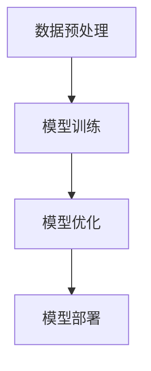
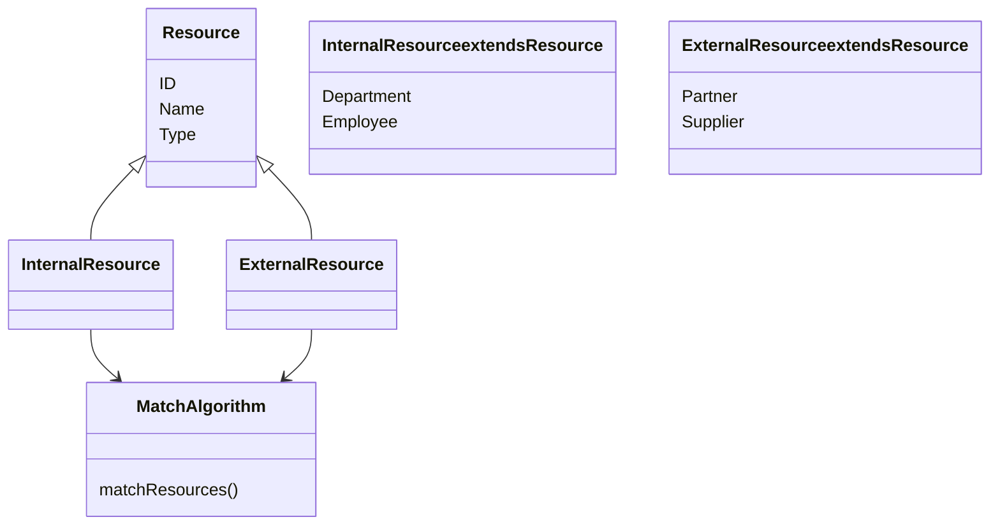
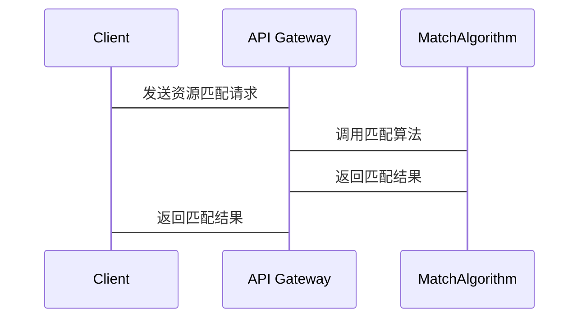

                 


# AI驱动的企业创新生态系统构建：内外部资源智能匹配与协作

## 关键词：AI驱动，企业创新生态系统，内外部资源，智能匹配，协作机制

## 摘要：本文探讨如何利用人工智能技术构建企业创新生态系统，实现企业内部资源与外部资源的智能匹配与协作。通过分析核心概念、算法原理、系统架构及实际案例，揭示AI在企业创新中的应用价值和实现路径。

---

# 第1章 AI驱动的企业创新生态系统概述

## 1.1 企业创新生态系统的核心概念

### 1.1.1 企业创新生态系统的定义

企业创新生态系统是指由企业内部资源（如员工、技术、数据）和外部资源（如合作伙伴、供应商、客户）共同构成的动态协作网络，通过AI技术实现资源的智能匹配与优化，推动企业的持续创新。

### 1.1.2 创新生态系统的特点

- **开放性**：整合内外部资源，构建开放的协作平台。
- **协同性**：促进资源之间的协同创新，提升整体效率。
- **智能性**：利用AI技术实现资源的智能匹配与优化。

### 1.1.3 AI在企业创新中的作用

- 提供数据驱动的决策支持。
- 实现资源的智能匹配与优化。
- 促进跨部门和跨组织的协作。

## 1.2 内部资源与外部资源的定义与特点

### 1.2.1 内部资源的定义与特征

- **定义**：企业内部拥有的资源，包括员工、技术、数据等。
- **特征**：可控性高、响应速度快、成本较低。

### 1.2.2 外部资源的定义与特征

- **定义**：企业外部的资源，包括合作伙伴、供应商、客户等。
- **特征**：资源丰富、专业性强、但协作成本较高。

### 1.2.3 内外部资源的协作机制

- **内部协作**：跨部门协作，优化内部资源配置。
- **外部协作**：与合作伙伴共同创新，共享资源。
- **内外协同**：通过平台整合内外资源，实现协同创新。

## 1.3 企业创新生态系统构建的意义

### 1.3.1 提升企业创新能力

通过AI技术实现资源的智能匹配，激发创新潜力。

### 1.3.2 优化资源配置效率

减少资源浪费，提高资源配置效率。

### 1.3.3 促进企业可持续发展

通过协作创新，实现资源的高效利用和可持续发展。

## 1.4 本章小结

本章介绍了企业创新生态系统的核心概念，分析了内部资源和外部资源的特点及协作机制，强调了AI在构建创新生态系统中的重要性。

---

# 第2章 企业创新生态系统的核心要素

## 2.1 企业创新生态系统的核心要素

### 2.1.1 企业内部资源

- **员工**：企业的核心人力资源，通过AI技术优化员工的工作效率。
- **技术**：企业的核心技术能力，通过AI实现技术的智能化应用。
- **数据**：企业的数据资源，通过AI进行数据分析和挖掘。

### 2.1.2 企业外部资源

- **合作伙伴**：企业的外部合作伙伴，通过AI实现与合作伙伴的协同创新。
- **供应商**：企业的供应商资源，通过AI优化供应链管理。
- **客户**：企业的客户资源，通过AI实现客户洞察和需求预测。

### 2.1.3 企业创新文化

- **创新文化**：企业的文化氛围，通过AI技术推动创新文化的形成。

## 2.2 内外部资源的协作机制

### 2.2.1 内部资源的协作模式

- **部门间协作**：通过AI技术实现跨部门协作，优化资源配置。
- **流程优化**：通过AI技术优化企业内部流程，提升效率。

### 2.2.2 外部资源的协作模式

- **合作伙伴协作**：通过AI技术实现与合作伙伴的协同创新。
- **供应链协作**：通过AI技术优化供应链管理，提升协作效率。

### 2.2.3 内外部资源的协同创新

- **资源整合**：通过AI技术整合内外资源，实现协同创新。
- **知识共享**：通过AI技术促进知识共享，提升创新能力。

## 2.3 企业创新生态系统的核心属性

### 2.3.1 开放性

企业创新生态系统具有开放性，能够整合内外资源，构建开放的协作平台。

### 2.3.2 协同性

企业创新生态系统具有协同性，通过AI技术实现资源的协同协作，提升创新能力。

### 2.3.3 智能性

企业创新生态系统具有智能性，通过AI技术实现资源的智能匹配与优化。

## 2.4 本章小结

本章分析了企业创新生态系统的核心要素，探讨了内部资源和外部资源的协作机制，强调了企业创新生态系统的核心属性。

---

# 第3章 AI驱动的企业创新生态系统构建的算法原理

## 3.1 内外部资源智能匹配算法

### 3.1.1 资源匹配的核心算法

- **基于AI的资源匹配算法**：通过机器学习模型实现资源的智能匹配。
- **资源匹配的数学模型**：建立资源匹配的数学模型，优化资源分配。

### 3.1.2 算法实现步骤

1. **数据收集**：收集企业内外部资源的数据。
2. **数据预处理**：清洗数据，提取特征。
3. **模型训练**：训练机器学习模型，实现资源匹配。
4. **模型优化**：优化模型，提升匹配效率。
5. **模型部署**：将模型部署到企业系统中，实现资源智能匹配。

### 3.1.3 算法实现代码

```python
import numpy as np
from sklearn.metrics.pairwise import cosine_similarity

def resource_matching_algorithm(internal_resources, external_resources):
    # 数据预处理
    internal_embeddings = internal_resources.get_embeddings()
    external_embeddings = external_resources.get_embeddings()
    
    # 计算相似度
    similarity_matrix = cosine_similarity(internal_embeddings, external_embeddings)
    
    # 确定最优匹配
    max_similarity = np.max(similarity_matrix)
    optimal_match = np.argmax(similarity_matrix)
    
    return optimal_match
```

## 3.2 资源匹配的数学模型

- **目标函数**：最大化资源匹配的相似度。

$$
\max \sum_{i=1}^{n} \sum_{j=1}^{m} w_{ij}x_{ij}
$$

- **约束条件**：确保每个资源只匹配一次。

$$
\sum_{j=1}^{m} x_{ij} \leq 1 \quad \forall i
$$

$$
\sum_{i=1}^{n} x_{ij} \leq 1 \quad \forall j
$$

### 3.2.1 算法流程图



---

# 第4章 系统分析与架构设计

## 4.1 系统功能设计

### 4.1.1 系统功能模块

- **资源管理模块**：管理企业内外部资源。
- **资源匹配模块**：实现资源的智能匹配。
- **协作管理模块**：管理资源协作过程。
- **数据分析模块**：分析资源匹配结果。

### 4.1.2 系统功能设计的Mermaid类图



## 4.2 系统架构设计

### 4.2.1 系统架构的Mermaid架构图


### 4.2.2 系统接口设计

- **API接口**：提供RESTful API，实现资源匹配功能。
- **数据接口**：实现与企业内部系统的数据对接。

### 4.2.3 系统交互的Mermaid序列图



---

# 第5章 项目实战

## 5.1 环境安装

### 5.1.1 安装Python和相关库

```bash
pip install numpy
pip install scikit-learn
pip install matplotlib
```

## 5.2 系统核心实现

### 5.2.1 资源匹配算法实现

```python
import numpy as np
from sklearn.metrics.pairwise import cosine_similarity

class ResourceMatcher:
    def __init__(self, internal_resources, external_resources):
        self.internal_resources = internal_resources
        self.external_resources = external_resources
        
    def get_embeddings(self):
        # 假设我们有一个方法来获取资源的嵌入表示
        return np.random.rand(len(self.internal_resources), 100), np.random.rand(len(self.external_resources), 100)
    
    def match_resources(self):
        internal_embeddings, external_embeddings = self.get_embeddings()
        similarity_matrix = cosine_similarity(internal_embeddings, external_embeddings)
        max_similarity = np.max(similarity_matrix)
        optimal_match = np.argmax(similarity_matrix)
        return optimal_match
```

### 5.2.2 系统功能实现

```python
class ResourceMatcher:
    def __init__(self, internal_resources, external_resources):
        self.internal_resources = internal_resources
        self.external_resources = external_resources
        
    def get_embeddings(self):
        return np.random.rand(len(self.internal_resources), 100), np.random.rand(len(self.external_resources), 100)
    
    def match_resources(self):
        internal_embeddings, external_embeddings = self.get_embeddings()
        similarity_matrix = cosine_similarity(internal_embeddings, external_embeddings)
        max_similarity = np.max(similarity_matrix)
        optimal_match = np.argmax(similarity_matrix)
        return optimal_match
```

## 5.3 实际案例分析

### 5.3.1 案例背景

某企业希望通过AI技术实现内部资源与外部资源的智能匹配，提升创新能力。

### 5.3.2 案例分析

- **数据准备**：收集企业内部资源和外部资源的数据。
- **模型训练**：训练资源匹配模型，实现资源的智能匹配。
- **结果分析**：分析匹配结果，优化资源配置。

### 5.3.3 实施效果

- **提升效率**：通过AI技术实现资源的智能匹配，提升资源配置效率。
- **增强创新**：通过内外部资源的协同创新，提升企业的创新能力。

## 5.4 项目总结

通过项目实战，我们验证了AI技术在企业创新生态系统构建中的有效性，实现了资源的智能匹配与协作，提升了企业的创新能力和资源配置效率。

---

# 第6章 最佳实践与总结

## 6.1 最佳实践

### 6.1.1 数据质量

- 确保数据的准确性和完整性。

### 6.1.2 模型优化

- 不断优化模型，提升匹配效率。

### 6.1.3 协作机制

- 建立高效的协作机制，促进资源的协同创新。

## 6.2 小结

本文详细探讨了AI驱动的企业创新生态系统构建，分析了内部资源和外部资源的协作机制，提出了资源匹配的算法原理和系统架构设计，并通过项目实战验证了理论的可行性。

## 6.3 注意事项

- **数据隐私**：确保数据的安全性和隐私性。
- **模型可解释性**：提升模型的可解释性，便于理解和优化。
- **系统稳定性**：确保系统的稳定性和可靠性。

## 6.4 拓展阅读

- **AI与企业创新**：深入探讨AI在企业创新中的应用。
- **资源匹配算法**：研究更多的资源匹配算法，优化匹配效率。

---

# 结语

AI驱动的企业创新生态系统构建是一个复杂而重要的任务，通过AI技术实现资源的智能匹配与协作，能够显著提升企业的创新能力和资源配置效率。未来，随着AI技术的不断发展，企业创新生态系统将更加智能化和高效化。

---

# 参考文献

（此处可以列出相关的参考文献）

---

通过本文的详细分析和实际案例，我们能够清晰地看到AI技术在企业创新生态系统构建中的巨大潜力和应用价值。希望本文能够为企业的创新实践提供有益的指导和启示。

---

