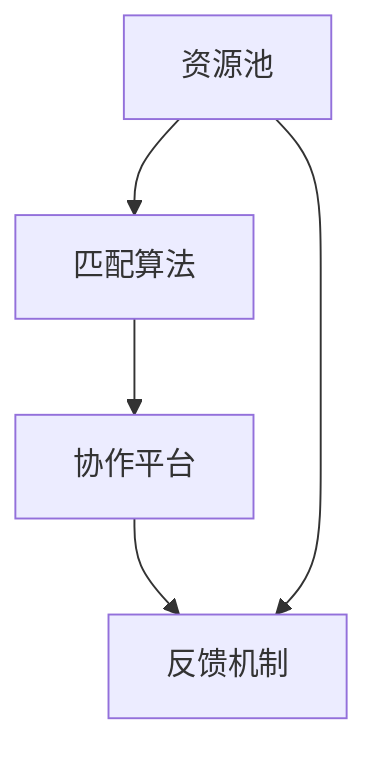
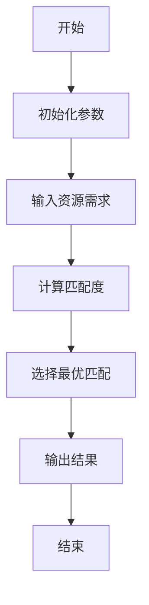
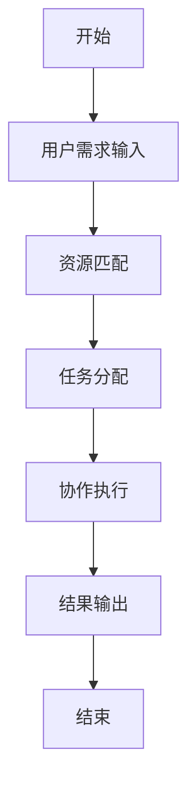
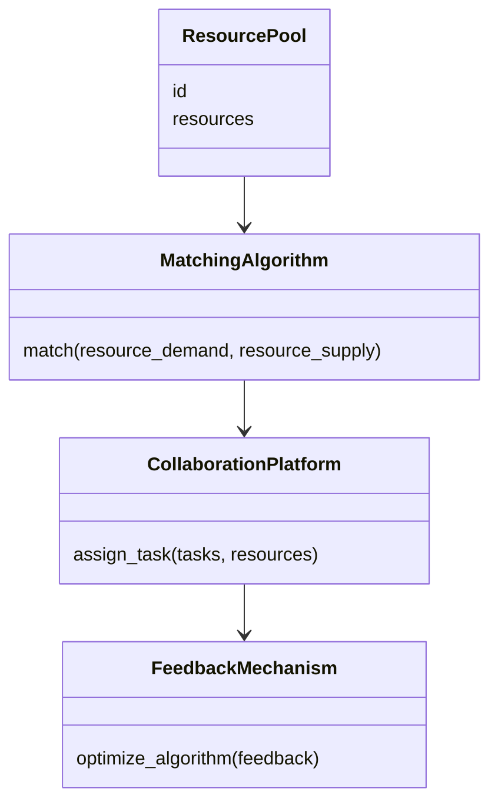
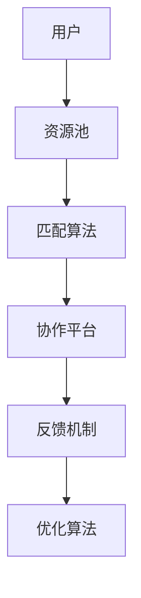
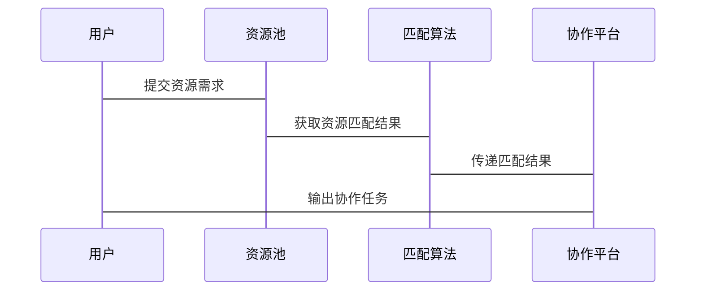

                 


# AI驱动的企业创新生态系统构建：内外部资源智能匹配与协作平台

## 关键词：人工智能，企业创新，资源匹配，协作平台，系统架构

## 摘要：本文探讨了如何利用人工智能技术构建企业创新生态系统，重点分析了内外部资源的智能匹配与协作平台的构建过程。通过算法原理、系统架构设计、项目实战等多维度的深入分析，展示了AI如何赋能企业创新，实现资源的高效利用与协作。

---

# 第1章：AI驱动的企业创新生态系统概述

## 1.1 问题背景与问题描述

### 1.1.1 问题背景

在当今快速变化的商业环境中，企业创新生态系统的重要性日益凸显。企业需要通过内部资源与外部资源的高效匹配与协作，构建一个灵活、高效、可持续的创新体系。然而，传统的企业资源管理方式往往存在效率低下、资源浪费、协作不畅等问题，难以满足现代企业对创新的需求。

### 1.1.2 问题描述

- **资源匹配问题**：企业内部资源与外部资源之间的匹配效率低下，难以快速响应市场需求。
- **协作效率问题**：内部团队与外部合作伙伴之间的协作流程复杂，存在信息孤岛和沟通不畅的问题。
- **创新能力不足**：缺乏智能化的工具和平台支持，难以充分发挥企业内外部资源的潜力。

### 1.1.3 问题解决

通过引入人工智能技术，构建一个智能化的内外部资源匹配与协作平台，能够实现资源的高效匹配、流程的自动化优化和创新的快速落地。

### 1.1.4 边界与外延

- **边界**：平台仅关注企业内外部资源的匹配与协作，不涉及企业的核心业务流程。
- **外延**：通过资源匹配与协作，为企业创新提供支持，提升企业的整体创新能力。

### 1.1.5 核心要素

| 核心要素 | 描述 |
|----------|------|
| **资源池** | 包含企业内部资源和外部资源，如技术、人才、资金等。 |
| **匹配算法** | 基于AI的资源匹配算法，实现资源的最优匹配。 |
| **协作平台** | 提供资源协作的平台，支持团队协作、任务分配等功能。 |
| **反馈机制** | 通过反馈优化匹配算法和协作流程。 |

## 1.2 本章小结

本章从问题背景、问题描述、问题解决等方面，详细阐述了AI驱动的企业创新生态系统构建的必要性，并明确了平台的核心要素和边界。

---

# 第2章：内外部资源智能匹配的核心原理

## 2.1 核心概念与联系

### 2.1.1 核心概念

- **资源池**：企业内外部资源的集合，包括技术资源、人力资源、资金资源等。
- **匹配算法**：基于AI的算法，用于资源的最优匹配。
- **协作平台**：支持资源协作的平台，提供任务分配、进度跟踪等功能。

### 2.1.2 概念属性对比

| 概念     | 描述                                   |
|----------|--------------------------------------|
| 资源池   | 包含企业内外部资源的集合               |
| 匹配算法 | 基于AI的算法，实现资源的最优匹配       |
| 协作平台 | 支持资源协作的平台，提供协作功能       |

### 2.1.3 实体关系图（ER图）



## 2.2 算法原理

### 2.2.1 资源匹配算法

#### 2.2.1.1 算法流程图



#### 2.2.1.2 算法实现代码

```python
import numpy as np

def resource_matching_algorithm(resource_demand, available_resources):
    # 计算匹配度
    match_scores = np.dot(resource_demand, available_resources.T)
    # 选择最优匹配
    selected = np.argmax(match_scores, axis=1)
    return selected
```

#### 2.2.1.3 数学模型

优化目标：

$$
\min_{x} \sum_{i=1}^{n} c_i x_i
$$

约束条件：

$$
\sum_{i=1}^{n} a_{ij} x_i \leq b_j \quad \forall j
$$

### 2.2.2 协作平台算法

#### 2.2.2.1 算法流程图



#### 2.2.2.2 算法实现代码

```python
def collaboration_algorithm(match_result, task_list):
    # 任务分配
    assigned_tasks = []
    for task in task_list:
        assigned_tasks.append(match_result + task)
    return assigned_tasks
```

## 2.3 本章小结

本章详细介绍了内外部资源智能匹配的核心原理，包括资源池、匹配算法和协作平台的实现，以及相关的数学模型和算法代码。

---

# 第3章：协作平台的系统架构设计

## 3.1 系统功能设计

### 3.1.1 功能模块

- **资源池管理**：管理企业内外部资源。
- **匹配算法模块**：实现资源匹配。
- **协作平台模块**：支持团队协作。
- **反馈机制模块**：优化匹配算法。

### 3.1.2 领域模型（Mermaid类图）



### 3.1.3 系统架构设计



### 3.1.4 接口设计

- **输入接口**：用户输入资源需求。
- **输出接口**：输出匹配结果和协作任务。

### 3.1.5 交互流程（Mermaid序列图）



## 3.2 本章小结

本章详细设计了协作平台的系统架构，包括功能模块、领域模型、系统架构图和接口设计。

---

# 第4章：项目实战

## 4.1 环境安装

### 4.1.1 环境配置

- **Python版本**：Python 3.8+
- **依赖库安装**：numpy, pandas, scikit-learn

```bash
pip install numpy pandas scikit-learn
```

## 4.2 核心代码实现

### 4.2.1 资源匹配算法实现

```python
import numpy as np
from sklearn.metrics.pairwise import cosine_similarity

def resource_matching_algorithm(resource_demand, available_resources):
    # 计算匹配度
    match_scores = cosine_similarity(resource_demand, available_resources)
    # 选择最优匹配
    selected = np.argmax(match_scores, axis=1)
    return selected
```

### 4.2.2 协作平台实现

```python
def collaboration_platform(resource_pool, task_list):
    # 资源分配
    assigned_resources = []
    for task in task_list:
        assigned_resources.append(resource_pool + task)
    return assigned_resources
```

## 4.3 代码解读与分析

- **资源匹配算法**：使用余弦相似度计算资源匹配度，选择匹配度最高的资源。
- **协作平台实现**：将任务分配给匹配的资源，实现协作。

## 4.4 案例分析

### 4.4.1 案例背景

某科技公司需要开发一个新的AI项目，内部资源有限，需要外部合作伙伴的支持。

### 4.4.2 案例实施

- **资源池**：内部资源包括开发团队，外部资源包括AI专家、云服务提供商。
- **资源匹配**：算法匹配到最适合的外部资源。
- **协作平台**：分配任务，实现协作。

### 4.4.3 案例结果

项目顺利完成，创新成果显著。

## 4.5 项目小结

本章通过实际案例展示了AI驱动的企业创新生态系统构建的过程，验证了平台的有效性。

---

# 第5章：最佳实践与注意事项

## 5.1 小结

- AI技术能够有效提升企业创新生态系统的效率。
- 资源匹配与协作平台是实现创新的关键。

## 5.2 注意事项

- 数据隐私问题：确保数据安全。
- 算法优化：持续优化匹配算法。
- 人员培训：提升相关人员的技能。

## 5.3 拓展阅读

- 《人工智能：一种现代的方法》
- 《企业创新管理》

---

# 附录

## 附录A：相关术语解释

- **资源池**：企业内外部资源的集合。
- **匹配算法**：基于AI的资源匹配算法。

## 附录B：工具与库

- **Python**：编程语言。
- **scikit-learn**：机器学习库。

---

# 结语

通过本文的详细阐述，读者可以全面了解AI驱动的企业创新生态系统构建的过程，包括内外部资源的智能匹配与协作平台的设计与实现。希望本文能够为企业创新提供有价值的参考与启发。

--- 

# END

