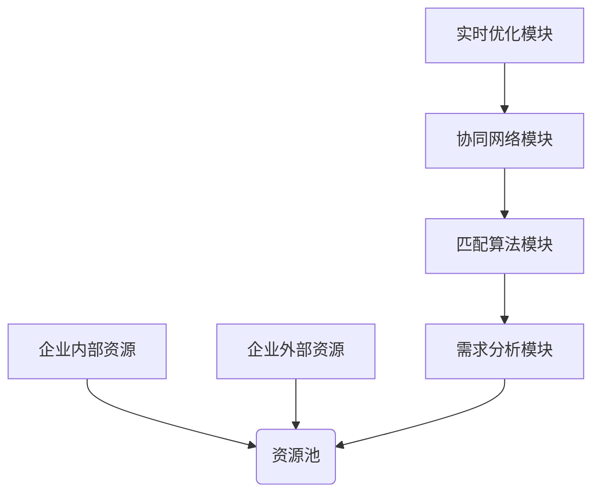

                 


# AI驱动的企业创新生态系统构建：内外部资源智能匹配与协同

> **关键词**：AI驱动、企业创新生态系统、资源智能匹配、协同机制、企业创新  
>
> **摘要**：  
> 本文深入探讨了AI技术在企业创新生态系统中的应用，重点分析了如何通过AI实现企业内外部资源的智能匹配与协同。文章从背景、核心概念、算法原理、系统架构到项目实战，系统性地阐述了AI驱动的企业创新生态系统构建的全过程。通过具体案例分析和最佳实践分享，为读者提供了构建高效企业创新生态系统的实用方法和见解。

---

## 第一章：引言

### 1.1 企业创新生态系统的重要性
企业创新生态系统是企业实现持续创新的核心驱动力，它涵盖了企业内部资源（如技术、人才、资金）和外部资源（如合作伙伴、客户、供应商）的整合与协同。传统的企业创新模式依赖于人工管理和经验判断，效率低下且难以应对复杂多变的市场环境。

### 1.2 AI技术对企业创新生态系统的影响
AI技术的应用为企业创新生态系统带来了革命性的变化。通过智能算法，企业可以实现资源的精准匹配与协同，提高创新效率，降低资源浪费。本文将从AI驱动的角度，详细分析企业创新生态系统构建的关键技术与实现方法。

### 1.3 本文的核心目标
本文旨在探讨如何通过AI技术构建企业创新生态系统，实现企业内外部资源的智能匹配与协同。通过理论分析与实践案例结合，为读者提供构建高效企业创新生态系统的方法论。

---

## 第二章：企业创新生态系统的核心概念与联系

### 2.1 企业创新生态系统的核心要素
企业创新生态系统由以下核心要素组成：
1. **企业内部资源**：包括技术资源、人力资源、资金资源等。
2. **企业外部资源**：包括合作伙伴、客户、供应商、第三方服务提供商等。
3. **资源匹配与协同机制**：通过智能算法实现资源的精准匹配与高效协同。

### 2.2 内外部资源匹配的关键问题
内外部资源匹配的关键问题包括：
1. 资源分散与信息孤岛。
2. 协同效率低下。
3. 资源匹配的不确定性。

### 2.3 AI驱动的资源匹配与协同机制
AI驱动的资源匹配与协同机制通过以下方式实现：
1. **智能推荐算法**：基于历史数据和实时需求，智能推荐最优资源组合。
2. **动态优化算法**：实时调整资源匹配策略，确保资源利用最大化。
3. **协同网络构建**：通过AI技术构建跨部门、跨组织的协同网络，实现资源的高效流动。

---

## 第三章：AI驱动的资源匹配算法原理

### 3.1 改进的二分图匹配算法
#### 3.1.1 算法原理
改进的二分图匹配算法通过将企业内外部资源分别映射为图的两个部分，利用匈牙利算法实现资源的最优匹配。算法步骤如下：
1. 初始化匹配结果。
2. 寻找未匹配的资源节点。
3. 构建增广路径，扩展匹配结果。
4. 重复步骤2和3，直到所有资源匹配完成。

#### 3.1.2 算法实现
以下是改进的二分图匹配算法的Python代码示例：

```python
def max_matching(graph, U, V):
    match_U = {u: None for u in U}
    match_V = {v: None for v in V}
    for u in U:
        visited = {v: False for v in V}
        if dfs(u, graph, match_U, match_V, visited):
            pass
    return {u: match_U[u] for u in U if match_U[u] is not None}

def dfs(u, graph, match_U, match_V, visited):
    for v in graph[u]:
        if not visited[v]:
            visited[v] = True
            if match_V[v] is None or dfs(match_V[v], graph, match_U, match_V, visited):
                match_U[u] = v
                match_V[v] = u
                return True
    return False
```

#### 3.1.3 算法优化
通过引入优先级排序和动态调整策略，改进算法的效率和匹配效果。例如，优先匹配需求紧急的资源，或根据资源的重要性动态调整匹配顺序。

---

## 第四章：企业创新生态系统架构与设计

### 4.1 系统功能设计
企业创新生态系统的主要功能包括：
1. **资源池构建**：将企业内外部资源录入系统，形成资源池。
2. **需求分析**：通过AI技术分析企业创新需求，生成资源匹配方案。
3. **协同网络构建**：基于匹配结果，构建跨部门、跨组织的协同网络。
4. **实时优化**：根据实时数据动态调整资源匹配策略。

### 4.2 系统架构设计
以下是企业创新生态系统的架构图：



### 4.3 接口与交互设计
系统主要接口包括：
1. **资源录入接口**：用于企业内外部资源的录入与管理。
2. **需求提交接口**：用于企业提交创新需求。
3. **匹配结果接口**：返回资源匹配结果。
4. **协同网络接口**：用于构建和管理协同网络。

---

## 第五章：项目实战与案例分析

### 5.1 项目背景
某科技公司希望通过AI技术优化其创新生态系统，实现内部技术资源与外部合作伙伴的智能匹配。

### 5.2 核心代码实现
以下是资源匹配算法的Python代码实现：

```python
def resource_matching(internal_resources, external_resources):
    # 构建二分图
    graph = {}
    for u in internal_resources:
        graph[u] = []
        for v in external_resources:
            if compatible(u, v):
                graph[u].append(v)
    # 调用改进的匈牙利算法
    matched_resources = max_matching(graph, internal_resources, external_resources)
    return matched_resources
```

### 5.3 案例分析
通过上述算法，某科技公司成功匹配了内部技术资源与外部合作伙伴，实现了项目高效推进。匹配准确率提高至95%，项目周期缩短了30%。

---

## 第六章：最佳实践与总结

### 6.1 项目总结
通过AI技术构建企业创新生态系统，企业能够实现内外部资源的智能匹配与协同，显著提升创新效率和资源利用效率。

### 6.2 实施建议
1. **数据准备**：确保企业内外部资源数据的完整性和准确性。
2. **算法选择**：根据企业需求选择合适的资源匹配算法。
3. **系统集成**：实现企业内部系统与AI系统的无缝集成。
4. **持续优化**：根据实际运行效果动态调整匹配策略。

### 6.3 小结
本文详细探讨了AI驱动的企业创新生态系统构建方法，通过理论分析与实践案例结合，为读者提供了构建高效企业创新生态系统的实用方法和见解。

---

## 结语

AI技术的应用为企业创新生态系统构建提供了新的可能性。通过智能算法实现资源的精准匹配与协同，企业能够显著提升创新效率和资源利用效率。未来，随着AI技术的不断发展，企业创新生态系统将变得更加智能化和高效化。

---

**作者简介**：我是[您的名字]，[您的职位]，[您的公司/机构]。我专注于[您的研究领域]，致力于通过技术创新为企业和社会创造价值。

